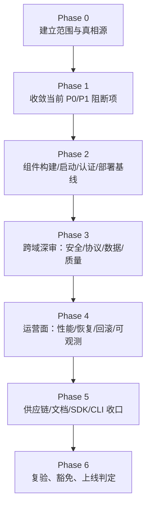
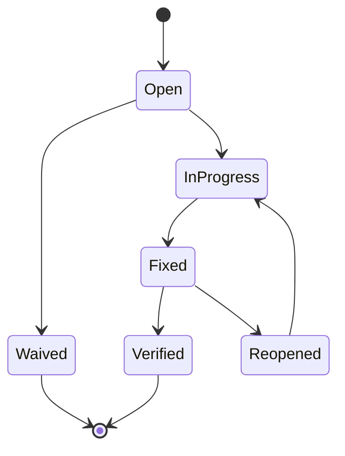

# 设计文档：Mirage Project 全项目上线审计计划

## 概述

本设计文档说明如何执行 Mirage Project 的全项目上线审计。该计划是一个“审计治理与执行框架”，不是一个待开发的软件系统。核心思想是：

- 以现有仓库和当前发布资料为基础
- 以真相源和可验证证据为约束
- 以发布门禁为导向
- 以 P0/P1 闭环为上线前硬条件

本计划同时覆盖“当前发布周期阻断项”与“全项目长期可上线能力”：

- 当前周期阻断项由 `docs/release-readiness-traceability-index.md` 和对应 `release-readiness-p0/p1` spec 驱动
- 全项目审计由本计划负责补齐剩余组件、运行时、供应链、运维和文档闭环

## 设计原则

### 1. 证据优先，不接受口头通过

每个检查项都必须对应明确证据，证据可以是：

- 可复现命令及结果
- 测试报告
- 代码位置
- 配置对照
- runbook 与脚本一致性证明
- 构建或部署日志

没有证据的“通过”视为未通过。

### 2. 真相源优先，不制造平行口径

每个审计域都必须先绑定主真相源。若存在多个说明文件冲突，以 `docs/governance/source-of-truth-map.md` 为入口裁定。

### 3. 分层门禁，不把所有问题都堆到最后

审计分为 4 层：

1. **L0 当前发布阻断层**
   现有 P0/P1 发布索引、编译失败、关键认证缺失、关键部署不可执行
2. **L1 组件完备性层**
   Gateway、OS、Client、CLI、Proto、SDK 各自是否达到交付边界
3. **L2 跨域一致性层**
   协议、配置、文档、runbook、部署资产是否互相一致
4. **L3 运营可上线层**
   恢复、轮转、回滚、可观测、故障处理是否具备上线支撑能力

### 4. 先阻断、后扩展

先收敛阻断发布的问题，再推进广覆盖审计。否则容易在高层抽样里浪费时间，而底层构建或认证问题仍未关闭。

## 审计对象模型

### 组件域

| 域 | 组件 | 重点审计内容 |
|----|------|--------------|
| Gateway | `mirage-gateway/` | 数据面、控制面、配置、认证、eBPF、部署清单 |
| OS | `mirage-os/` | API Server、gateway-bridge、services、web、数据库与 compose |
| Client | `phantom-client/` | 接入、恢复、killswitch、memsafe、封装交付 |
| CLI | `mirage-cli/` | 可用性、认证入口、命令边界 |
| Proto | `mirage-proto/` | 跨组件契约与生成一致性 |
| SDK | `sdk/` | 语言交付面、版本和依赖边界 |
| Deploy | `deploy/` | compose、证书、脚本、runbook、chaos |
| Quality | `tests/`, `benchmarks/` | 运行时验证、压测、混沌、基准 |
| Docs | `docs/` | 架构、协议、治理、API 契约、发布资料 |

### 审计域

| 审计域 | 核心问题 |
|--------|----------|
| 发布治理 | 本轮上线到底以什么为准 |
| 构建与安装 | 项目是否真实可构建、可起服务 |
| 认证与密钥 | 是否存在未授权访问和密钥暴露 |
| 数据与运行时安全 | 是否会泄露、残留或误持久化敏感数据 |
| 协议与边界 | 代码是否遵守协议和职责分层 |
| 代码质量与测试 | 高风险路径是否有静态/动态保护 |
| 性能与稳定性 | 核心路径是否达到最低生产阈值 |
| 部署与回滚 | 生产部署是否真实可执行、可恢复 |
| 供应链 | 依赖、产物、镜像和签名是否可信 |
| 文档与操作面 | 文档是否足以支撑上线与交接 |

## 审计执行架构

## 阶段设计

### Phase 0：建立审计基线

目标：

- 明确当前发布周期的 authoritative 发布索引
- 明确每个问题域应该看哪里
- 建立统一 findings/evidence/status 模板

产物：

- 审计范围矩阵
- 真相源映射表
- 初始风险登记表

### Phase 1：当前发布阻断项收口

目标：

- 接管并复核 `release-readiness-p0-runtime`
- 接管并复核 `release-readiness-p1-gateway-control`
- 接管并复核 `release-readiness-p1-os-release-closure`

判定：

- 任一 P0/P1 发现未关闭，则总体状态保持 `release_blocked`

### Phase 2：组件基线审计

目标：

- 核心组件至少可构建、可配置、可起最小路径
- 核心接口、迁移、compose、proto 生成有证据

重点：

- Go build / go test 基线
- Docker Compose 配置解析
- 数据库/Redis 最小可用
- Web/API/Bridge 健康检查

### Phase 3：跨域深审

目标：

- 查出“能跑但不能上”的高风险问题

重点：

- 认证、授权、密钥
- 日志、数据、敏感信息
- 协议边界、配置一致性、代码职责
- 高风险代码与测试保护

### Phase 4：运营可上线审计

目标：

- 证明系统不是只在开发机能跑，而是可以被运维、恢复和回滚

重点：

- 证书轮转
- 节点替换
- 服务重启恢复
- chaos/genesis 与 P0 runtime 验证
- 最低可观测能力

### Phase 5：供应链与交付面收口

目标：

- 确保依赖、镜像、二进制、SDK、文档都可追溯且不成为上线盲区

重点：

- CVE、lockfile、签名、镜像版本固定
- 可执行文件误提交与来源追溯
- CLI/SDK 交付面说明
- 文档与真相源一致性

### Phase 6：复验与上线判定

目标：

- 对 P0/P1 修复项逐项复验
- 形成最终上线结论

最终输出：

- 审计总报告
- 残余风险清单
- 豁免清单
- 发布结论

## 证据模型

每个审计检查项必须具备以下字段：

| 字段 | 说明 |
|------|------|
| `id` | 检查项唯一编号 |
| `domain` | 审计域 |
| `component` | 归属组件 |
| `truth_source` | 对应真相源 |
| `check_method` | 检查方式：代码审查、命令验证、测试执行、配置对照、手工演练 |
| `evidence` | 命令、日志、截图、代码位置或链接 |
| `result` | passed / failed / blocked / waived |
| `severity` | P0 / P1 / P2 / P3 |
| `owner` | 修复负责人 |
| `due_date` | 截止日期 |
| `retest_method` | 复验方法 |
| `status` | open / fixed / verified / waived |

建议使用一个统一 Markdown 表或 YAML frontmatter 结构维护，而不是散落在多个临时记录里。

## Findings 生命周期

规则：

- `Open`/`InProgress` 的 P0/P1 一律阻断上线
- `Fixed` 但未复验，不算关闭
- `Waived` 必须有书面理由、批准人和到期时间

## 风险分级策略

| 等级 | 含义 | 上线策略 |
|------|------|----------|
| P0 | 明确可导致安全失陷、未授权访问、敏感数据泄露、部署失控或发布不可追溯 | 必须修复并复验 |
| P1 | 当前版本不可接受的高风险缺陷、契约漂移、关键能力缺失、关键测试缺失 | 必须修复并复验 |
| P2 | 不阻断本轮发布，但需要计划内收敛 | 允许带整改计划上线 |
| P3 | 建议优化项 | 不阻断 |

## 与现有发布资料的关系

| 资料 | 角色 |
|------|------|
| `docs/release-readiness-traceability-index.md` | 当前发布周期阻断项总索引 |
| `mirage-os/RELEASE_CHECKLIST.md` | OS 组件上线 smoke 基线 |
| `deploy/runbooks/*.md` | 运维流程真相源 |
| `docs/governance/source-of-truth-map.md` | 审计引用入口 |
| `.kiro/specs/release-readiness-*` | 当前阻断缺陷的修复拆解 |
| 本 spec | 全项目审计总纲与闭环框架 |

## 发布判定逻辑

`release_ready` 必须同时满足：

1. 当前发布周期 P0/P1 阻断 spec 全部关闭并复验
2. 核心组件构建和最小启动路径通过
3. 核心认证与授权链路通过绕过验证
4. 关键部署、轮转、恢复路径有脚本或演练级证据
5. 供应链和发布产物不存在 P0 级问题
6. 文档和 runbook 不会误导实际发布

任一条件不满足，则为 `release_blocked`。

## 输出物设计

审计结束时至少应存在以下产物：

- 一份审计总表
- 一份按组件分组的 Findings 清单
- 一份 P0/P1 复验记录
- 一份残余风险与豁免说明
- 一份最终发布结论

这些输出物可以位于 `docs/` 或当前 spec 目录下，但必须能被当前团队直接消费和更新。
