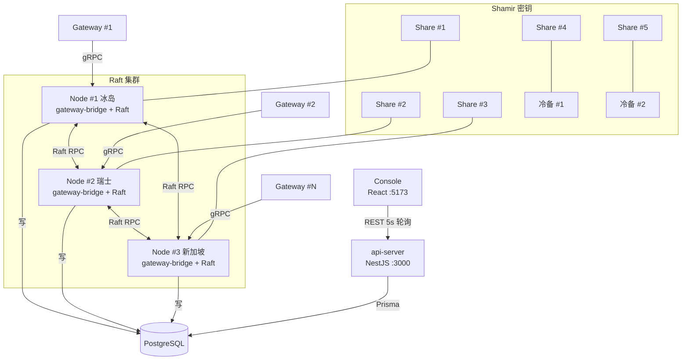
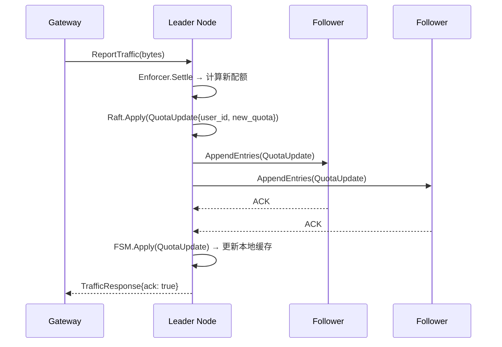
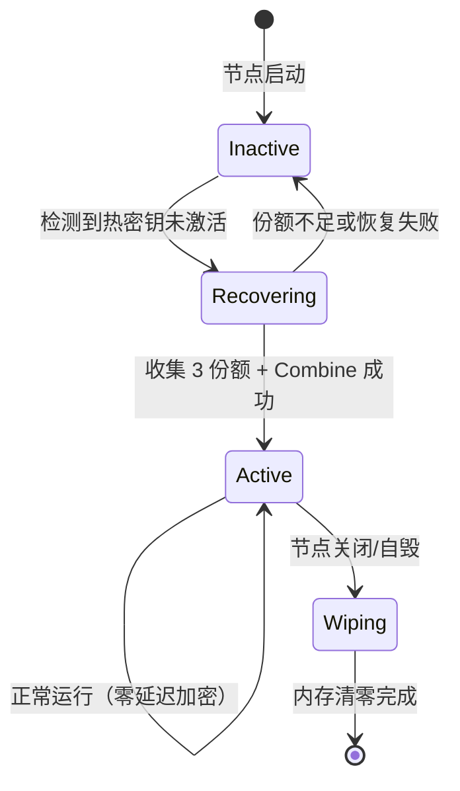

# 设计文档：Phase 3 — 核心链路加固 + 极简控制台

## 概述

本设计覆盖 Phase 3 的四个子系统：
- **Raft 集群**（Go，扩展 gateway-bridge）：hashicorp/raft 集群管理 + FSM 状态机
- **Shamir 密钥**（Go，扩展 gateway-bridge）：GF(256) 秘密分享 + 热密钥内存管理
- **极简控制台**（React + TailwindCSS）：纯表格管理界面，5 秒轮询
- **集成测试**（Go）：五条核心链路端到端验证

设计约束：
- Raft 和 Shamir 模块在 gateway-bridge 进程内运行，不引入新服务
- 控制台调用 Phase 2 的 NestJS REST API，不直接访问数据库
- 无 WebSocket，5 秒 HTTP 轮询足够 MVP
- 集成测试使用 Go test + testcontainers 模拟多节点环境

## 架构

### 系统架构



### Raft 状态复制流



### 热密钥生命周期



## 组件与接口

### 1. pkg/raft/cluster.go — Raft 集群管理

```go
// ClusterConfig Raft 集群配置
type ClusterConfig struct {
    NodeID       string       `yaml:"node_id"`
    BindAddr     string       `yaml:"bind_addr"`      // Raft RPC 监听地址
    DataDir      string       `yaml:"data_dir"`       // Raft 日志/快照存储目录
    Bootstrap    bool         `yaml:"bootstrap"`       // 是否引导新集群
    Peers        []PeerConfig `yaml:"peers"`           // 集群节点列表
}

type PeerConfig struct {
    ID      string `yaml:"id"`
    Address string `yaml:"address"`
    Voter   bool   `yaml:"voter"`   // 是否为投票节点
}

// Cluster Raft 集群管理器
type Cluster struct {
    raft     *raft.Raft
    fsm      *FSM
    config   ClusterConfig
    transport raft.Transport
    logStore  raft.LogStore
    stable    raft.StableStore
    snapStore raft.SnapshotStore
}

// NewCluster 创建 Raft 集群
// - 初始化 BoltDB LogStore/StableStore
// - 初始化 FileSnapshotStore（保留 3 个快照）
// - 初始化 TCP Transport
// - 创建 FSM
// - 调用 raft.NewRaft
func NewCluster(cfg ClusterConfig) (*Cluster, error)

// Start 启动集群
// - 如果 Bootstrap=true 且集群未初始化，执行 BootstrapCluster
// - 否则等待 Leader 选举
func (c *Cluster) Start() error

// IsLeader 返回当前节点是否为 Leader
func (c *Cluster) IsLeader() bool

// Apply 提交状态变更到 Raft 日志
// - 序列化命令为 JSON
// - 调用 raft.Apply，超时 10 秒
// - 返回 FSM.Apply 的结果
func (c *Cluster) Apply(cmd FSMCommand) error

// GetLeaderAddr 返回当前 Leader 地址
func (c *Cluster) GetLeaderAddr() string

// Shutdown 优雅关闭
func (c *Cluster) Shutdown() error
```

### 2. pkg/raft/fsm.go — Raft 状态机

```go
// CommandType FSM 命令类型
type CommandType int
const (
    CmdQuotaUpdate    CommandType = iota + 1
    CmdBlacklistUpdate
    CmdStrategyUpdate
)

// FSMCommand FSM 命令
type FSMCommand struct {
    Type CommandType `json:"type"`
    Data json.RawMessage `json:"data"`
}

// QuotaUpdateData 配额变更数据
type QuotaUpdateData struct {
    UserID          string  `json:"user_id"`
    RemainingQuota  float64 `json:"remaining_quota"`
}

// BlacklistUpdateData 黑名单变更数据
type BlacklistUpdateData struct {
    SourceIP string `json:"source_ip"`
    IsBanned bool   `json:"is_banned"`
    ExpireAt int64  `json:"expire_at"`
}

// StrategyUpdateData 策略变更数据
type StrategyUpdateData struct {
    CellID        string `json:"cell_id"`
    DefenseLevel  int    `json:"defense_level"`
    JitterMeanUs  uint32 `json:"jitter_mean_us"`
    NoiseIntensity uint32 `json:"noise_intensity"`
    PaddingRate   uint32 `json:"padding_rate"`
    TemplateID    uint32 `json:"template_id"`
}

// FSM Raft 有限状态机
type FSM struct {
    mu         sync.RWMutex
    quotas     map[string]float64              // user_id → remaining_quota
    blacklist  map[string]*BlacklistUpdateData  // source_ip → entry
    strategies map[string]*StrategyUpdateData   // cell_id → strategy
}

// NewFSM 创建状态机
func NewFSM() *FSM

// Apply 应用 Raft 日志条目
// - 反序列化 FSMCommand
// - 根据 Type 分发到对应处理函数
// - 返回 nil 或 error
func (f *FSM) Apply(log *raft.Log) interface{}

// Snapshot 创建快照
// - 深拷贝 quotas/blacklist/strategies
// - 返回 FSMSnapshot
func (f *FSM) Snapshot() (raft.FSMSnapshot, error)

// Restore 从快照恢复
// - 反序列化 JSON
// - 替换 quotas/blacklist/strategies
func (f *FSM) Restore(rc io.ReadCloser) error

// GetQuota 查询用户配额（读操作，不经过 Raft）
func (f *FSM) GetQuota(userID string) (float64, bool)

// GetBlacklist 获取全部黑名单
func (f *FSM) GetBlacklist() map[string]*BlacklistUpdateData

// GetStrategy 查询蜂窝策略
func (f *FSM) GetStrategy(cellID string) (*StrategyUpdateData, bool)
```


### 3. pkg/crypto/shamir.go — Shamir 秘密分享

```go
// Share Shamir 份额
type Share struct {
    X     byte   // x 坐标（1-255，不为 0）
    Y     []byte // y 值数组（与密钥等长）
}

// ShamirEngine Shamir 秘密分享引擎
type ShamirEngine struct {
    threshold int // 恢复阈值（默认 3）
    total     int // 总份额数（默认 5）
}

// NewShamirEngine 创建引擎
func NewShamirEngine(threshold, total int) (*ShamirEngine, error)
// - 校验 threshold <= total
// - 校验 threshold >= 2
// - 校验 total <= 255

// Split 将密钥拆分为 N 个份额
// - 对密钥的每个字节：
//   1. 生成 threshold-1 个随机系数（crypto/rand）
//   2. 构造多项式 f(x) = secret + a1*x + a2*x^2 + ... （GF(256) 运算）
//   3. 计算 f(1), f(2), ..., f(total)
// - 返回 total 个 Share
func (se *ShamirEngine) Split(secret []byte) ([]Share, error)

// Combine 从份额恢复密钥
// - 校验份额数量 >= threshold
// - 校验无重复 x 坐标
// - 对每个字节位置：
//   1. 使用拉格朗日插值在 GF(256) 上计算 f(0)
// - 返回恢复的密钥
func (se *ShamirEngine) Combine(shares []Share) ([]byte, error)

// GF(256) 有限域运算（内部函数）

// gfAdd GF(256) 加法（XOR）
func gfAdd(a, b byte) byte

// gfMul GF(256) 乘法（查表法，使用 AES 不可约多项式 0x11B）
func gfMul(a, b byte) byte

// gfDiv GF(256) 除法
func gfDiv(a, b byte) byte

// gfInv GF(256) 求逆
func gfInv(a byte) byte

// 预计算 exp/log 表（init 函数中初始化）
var gfExp [512]byte
var gfLog [256]byte
```

### 4. pkg/crypto/hot_key.go — 热密钥管理

```go
// HotKey 热密钥管理器
type HotKey struct {
    mu        sync.RWMutex
    key       []byte    // 主密钥（mlock 锁定）
    active    bool
    activedAt time.Time
}

// NewHotKey 创建热密钥管理器
func NewHotKey() *HotKey

// Activate 激活热密钥
// - 复制密钥到内部缓冲区
// - 调用 syscall.Mlock 锁定内存页
// - 设置 active=true
// - 如果 Mlock 失败，记录告警但继续运行
func (hk *HotKey) Activate(masterKey []byte) error

// Deactivate 停用热密钥
// - 逐字节清零密钥缓冲区
// - 调用 syscall.Munlock 解锁内存页
// - 设置 active=false
func (hk *HotKey) Deactivate()

// IsActive 返回热密钥是否已激活
func (hk *HotKey) IsActive() bool

// Encrypt AES-256-GCM 加密
// - 使用常驻内存的主密钥
// - 生成随机 12 字节 nonce
// - 返回 nonce + ciphertext
func (hk *HotKey) Encrypt(plaintext []byte) ([]byte, error)

// Decrypt AES-256-GCM 解密
// - 从密文前 12 字节提取 nonce
// - 使用常驻内存的主密钥解密
func (hk *HotKey) Decrypt(ciphertext []byte) ([]byte, error)

// RecoverFromShares 从 Shamir 份额恢复并激活
// - 调用 ShamirEngine.Combine
// - 调用 Activate
func (hk *HotKey) RecoverFromShares(engine *ShamirEngine, shares []Share) error
```

### 5. mirage-os/web/ — 极简控制台

#### 目录结构

```
mirage-os/web/
├── src/
│   ├── pages/
│   │   ├── Dashboard.tsx
│   │   ├── Gateways.tsx
│   │   ├── Cells.tsx
│   │   ├── Billing.tsx
│   │   ├── Threats.tsx
│   │   └── Strategy.tsx
│   ├── components/
│   │   ├── StatusIndicator.tsx
│   │   ├── DataTable.tsx
│   │   ├── ControlPanel.tsx
│   │   └── Layout.tsx          # 侧边栏 + 内容区布局
│   ├── hooks/
│   │   └── useApi.ts
│   ├── App.tsx
│   └── main.tsx
├── index.html
├── package.json
├── vite.config.ts
├── tsconfig.json
└── tailwind.config.js
```

#### hooks/useApi.ts

```typescript
// API 基础 URL（从环境变量读取）
const API_BASE = import.meta.env.VITE_API_BASE || 'http://localhost:3000/api';

// useApi<T> 通用 API Hook
// - url: API 路径（相对于 API_BASE）
// - interval: 轮询间隔（默认 5000ms）
// - 返回 { data, loading, error, refetch }
// - 使用 useEffect + setInterval 实现轮询
// - 组件卸载时清除 interval
export function useApi<T>(url: string, interval?: number): {
    data: T | null;
    loading: boolean;
    error: string | null;
    refetch: () => void;
}

// apiPost<T> 通用 POST 请求
// - url: API 路径
// - body: 请求体
// - 返回 Promise<T>
export async function apiPost<T>(url: string, body: unknown): Promise<T>
```

#### components/StatusIndicator.tsx

```typescript
interface StatusIndicatorProps {
    status: 'online' | 'degraded' | 'offline';
    label?: string;
}

// 渲染状态灯 + 文字标签
// online → 🟢 + "在线"
// degraded → 🟡 + "降级"
// offline → 🔴 + "离线"
export function StatusIndicator({ status, label }: StatusIndicatorProps): JSX.Element
```

#### components/DataTable.tsx

```typescript
interface Column<T> {
    key: string;
    title: string;
    render?: (value: unknown, row: T) => React.ReactNode;
}

interface DataTableProps<T> {
    columns: Column<T>[];
    data: T[];
    loading?: boolean;
    emptyText?: string;
}

// 渲染表头 + 数据行
// loading 时显示加载指示器
// data 为空时显示 emptyText
export function DataTable<T>({ columns, data, loading, emptyText }: DataTableProps<T>): JSX.Element
```

#### components/ControlPanel.tsx

```typescript
interface SelectControl {
    type: 'select';
    label: string;
    value: string;
    options: { value: string; label: string }[];
    onChange: (value: string) => void;
}

interface ButtonControl {
    type: 'button';
    label: string;
    onClick: () => void;
    variant?: 'primary' | 'danger';
}

type Control = SelectControl | ButtonControl;

interface ControlPanelProps {
    controls: Control[];
}

// 渲染控件组（水平排列）
export function ControlPanel({ controls }: ControlPanelProps): JSX.Element
```

#### pages/Dashboard.tsx

```typescript
// 调用 GET /api/gateways → 统计在线数
// 调用 GET /api/cells → 统计蜂窝数
// 调用 GET /api/threats/stats → 获取封禁 IP 数
// 渲染 4 个指标卡片（数字 + StatusIndicator）
// 5 秒轮询刷新
export function Dashboard(): JSX.Element
```

#### pages/Gateways.tsx

```typescript
// 调用 GET /api/gateways（支持 status 过滤参数）
// DataTable 列：IP、状态、最后心跳、活跃连接、内存、威胁等级
// 状态过滤下拉框
// 5 秒轮询
export function Gateways(): JSX.Element
```

#### pages/Cells.tsx

```typescript
// 调用 GET /api/cells
// DataTable 列：名称、区域、级别、用户数/最大用户数、Gateway 数、健康状态
// 5 秒轮询
export function Cells(): JSX.Element
```

#### pages/Billing.tsx

```typescript
// 调用 GET /api/billing/logs（分页）
// 调用 GET /api/billing/quota
// DataTable 列：时间、用户 ID、业务流量、防御流量、业务费用、防御费用、总费用
// 配额信息卡片（余额/总充值/总消费）
// 充值按钮 → 弹出表单 → POST /api/billing/recharge
// 5 秒轮询
export function Billing(): JSX.Element
```

#### pages/Threats.tsx

```typescript
// 调用 GET /api/threats（支持 threat_type/is_banned 过滤）
// DataTable 列：源 IP、威胁类型、严重程度、命中次数、封禁状态、最后发现
// 过滤下拉框（威胁类型 + 封禁状态）
// 5 秒轮询
export function Threats(): JSX.Element
```

#### pages/Strategy.tsx

```typescript
// 调用 GET /api/cells → 蜂窝列表
// 蜂窝选择下拉框
// 防御等级下拉框（Level 0-4）
// 拟态模板下拉框（Zoom/Chrome/Teams）
// "应用策略"按钮 → POST /api/strategy/apply
// 成功/失败提示
export function Strategy(): JSX.Element
```

### 6. 集成测试

#### 目录结构

```
mirage-os/tests/
├── integration_test.go      # 测试入口 + TestMain
├── lifecycle_test.go        # 生死裁决测试
├── immunity_test.go         # 全局免疫测试
├── reincarnation_test.go    # 域名转生测试
├── selfdestruct_test.go     # 节点自毁测试
└── raft_failover_test.go    # Raft 故障转移测试
```

#### integration_test.go

```go
// TestMain 设置测试环境
// - 启动 PostgreSQL testcontainer
// - 启动 Redis testcontainer
// - 初始化 gateway-bridge 实例
// - 运行测试
// - 清理资源

// setupBridge 创建 gateway-bridge 测试实例
// - 连接测试 PostgreSQL
// - 连接测试 Redis
// - 初始化 Enforcer/Distributor/Dispatcher
// - 启动 gRPC Server
// - 返回清理函数
func setupBridge(t *testing.T) (*grpc.Server, func())
```

#### lifecycle_test.go

```go
// TestLifecycleRuling 生死裁决集成测试
// 1. 创建用户（remaining_quota = 1.0）
// 2. 发送 ReportTraffic（消耗全部配额）
// 3. 发送 SyncHeartbeat
// 4. 断言 HeartbeatResponse.remaining_quota == 0
func TestLifecycleRuling(t *testing.T)
```

#### immunity_test.go

```go
// TestGlobalImmunity 全局免疫集成测试
// 1. 发送 100 次 ReportThreat（同一 source_ip）
// 2. 查询 threat_intel 表，断言 is_banned == true
// 3. 订阅 Redis mirage:blacklist 频道，断言收到封禁事件
func TestGlobalImmunity(t *testing.T)
```

#### reincarnation_test.go

```go
// TestDomainReincarnation 域名转生集成测试
// 1. 注册 Gateway 到 gateway-bridge
// 2. 通过 GatewayDownlink.PushReincarnation 下发转生指令
// 3. 断言 Gateway 收到指令，包含 new_domain、new_ip、deadline_seconds > 0
func TestDomainReincarnation(t *testing.T)
```

#### selfdestruct_test.go

```go
// TestNodeSelfDestruct 节点自毁集成测试
// 1. 启动 Gateway 心跳
// 2. 停止心跳，等待 300 秒超时（测试中缩短为 5 秒）
// 3. 断言 Gateway 状态变为 OFFLINE
// 4. 断言自毁流程被触发（通过 mock 验证）
func TestNodeSelfDestruct(t *testing.T)
```

#### raft_failover_test.go

```go
// TestRaftFailover Raft 故障转移集成测试
// 1. 启动 3 节点 Raft 集群
// 2. 确认 Leader 选举完成
// 3. 停止 Leader 节点
// 4. 断言 10 秒内新 Leader 选举完成
// 5. 向新 Leader 发送 SyncHeartbeat，断言正常响应
func TestRaftFailover(t *testing.T)
```

## 数据模型

### Raft 配置扩展（configs/mirage-os.yaml）

```yaml
raft:
  node_id: "node-1"
  bind_addr: "0.0.0.0:7000"
  data_dir: "/var/lib/mirage/raft"
  bootstrap: true
  peers:
    - id: "node-1"
      address: "iceland.mirage.internal:7000"
      voter: true
    - id: "node-2"
      address: "switzerland.mirage.internal:7000"
      voter: true
    - id: "node-3"
      address: "singapore.mirage.internal:7000"
      voter: true
    - id: "node-4"
      address: "panama.mirage.internal:7000"
      voter: false
    - id: "node-5"
      address: "seychelles.mirage.internal:7000"
      voter: false
```

### FSM 快照格式

```json
{
  "quotas": {
    "user-uuid-1": 150.50000000,
    "user-uuid-2": 0.00000000
  },
  "blacklist": {
    "1.2.3.4": {
      "source_ip": "1.2.3.4",
      "is_banned": true,
      "expire_at": 1700000000
    }
  },
  "strategies": {
    "cell-uuid-1": {
      "cell_id": "cell-uuid-1",
      "defense_level": 2,
      "jitter_mean_us": 30000,
      "noise_intensity": 15,
      "padding_rate": 20,
      "template_id": 1
    }
  }
}
```

### Shamir 份额存储

每个 Raft 节点本地存储一个 Shamir 份额文件：

```
/var/lib/mirage/shamir/share.dat
```

格式：`[1 byte X坐标][N bytes Y值]`（N = 密钥长度，固定 32 字节 = AES-256 密钥）

## 正确性属性

### Property 1: Shamir 秘密分享往返一致性

*For any* 随机生成的 32 字节密钥和任意 3-of-5 份额组合，Split 后选取任意 3 个份额调用 Combine SHALL 恢复出与原始密钥相同的字节序列。

**Validates: Requirements 3.3**

### Property 2: Shamir 份额不足拒绝

*For any* 随机生成的密钥，Split 后选取少于 threshold 个份额调用 Combine SHALL 返回错误。

**Validates: Requirements 3.4**

### Property 3: GF(256) 域运算封闭性

*For any* GF(256) 元素 a 和 b（0-255），gfMul(a, b) 的结果 SHALL 在 0-255 范围内。*For any* 非零元素 a，gfMul(a, gfInv(a)) SHALL 等于 1。

**Validates: Requirements 3.1**

### Property 4: AES-256-GCM 加密往返一致性

*For any* 随机生成的明文（1-10000 字节），Hot_Key.Encrypt 后调用 Hot_Key.Decrypt SHALL 恢复出与原始明文相同的数据。

**Validates: Requirements 4.7**

### Property 5: FSM 快照往返一致性

*For any* 一系列有效的 FSMCommand（配额/黑名单/策略变更），Apply 后 Snapshot 再 Restore SHALL 产生与 Apply 后等价的状态（quotas/blacklist/strategies 完全相同）。

**Validates: Requirements 2.7**

### Property 6: FSM 命令幂等性

*For any* 相同的 QuotaUpdateData 连续 Apply 两次，FSM 中该用户的 remaining_quota SHALL 等于命令中的值（最后写入胜出，非累加）。

**Validates: Requirements 2.2**

### Property 7: Shamir 份额唯一性

*For any* 密钥，Split 产生的 5 个份额的 x 坐标 SHALL 互不相同（分别为 1, 2, 3, 4, 5）。

**Validates: Requirements 3.5**

### Property 8: 热密钥内存清零

*For any* 激活的热密钥，Deactivate 后密钥缓冲区的每个字节 SHALL 等于 0。

**Validates: Requirements 4.2**

## 错误处理

### 分级错误策略

| 模块 | 错误类型 | 处理方式 |
|------|---------|---------|
| Raft_Cluster | 集群初始化失败 | 返回 error，main.go 终止进程 |
| Raft_Cluster | Apply 超时（30s） | 返回超时错误，记录告警日志 |
| Raft_Cluster | Leader 选举超时 | 记录告警，节点以 Follower 模式运行 |
| Raft_FSM | Apply 反序列化失败 | 记录错误日志，返回 error |
| Raft_FSM | Snapshot/Restore 失败 | 记录错误日志，返回 error |
| Shamir_Engine | threshold > total | NewShamirEngine 返回 error |
| Shamir_Engine | 份额不足 | Combine 返回 error |
| Shamir_Engine | 重复 x 坐标 | Combine 返回 error |
| Hot_Key | Mlock 失败 | 记录告警，降级运行（不锁定内存） |
| Hot_Key | 密钥未激活时调用 Encrypt/Decrypt | 返回 error |
| Hot_Key | AES-GCM 解密失败（密文篡改） | 返回 error |
| Console_App | API 请求失败 | 页面显示错误提示，下次轮询重试 |
| Console_App | API 返回 401 | 跳转到登录页面 |
| Integration_Test | testcontainer 启动失败 | 跳过测试，记录原因 |

## 测试策略

### 属性测试（Property-Based Testing）

**Go gateway-bridge**：使用 `pgregory.net/rapid` 进行属性测试。

- Property 1-2, 7: pkg/crypto/shamir_test.go — Shamir 往返一致性、份额不足拒绝、份额唯一性
- Property 3: pkg/crypto/shamir_test.go — GF(256) 运算封闭性
- Property 4, 8: pkg/crypto/hot_key_test.go — AES-GCM 往返一致性、内存清零
- Property 5-6: pkg/raft/fsm_test.go — FSM 快照往返一致性、命令幂等性

每个属性测试最少运行 100 次迭代。注释标注对应属性：
```go
// Feature: core-hardening, Property 1: Shamir 秘密分享往返一致性
func TestProperty_ShamirRoundTrip(t *testing.T) { ... }
```

### 单元测试

- Raft: 集群配置加载、Bootstrap 逻辑、IsLeader 状态
- Shamir: 边界值（空密钥、单字节密钥、255 字节密钥）、无效参数（threshold=0、total=0）
- Hot_Key: Activate/Deactivate 生命周期、未激活时 Encrypt 返回错误
- Console: 组件渲染测试（StatusIndicator、DataTable、ControlPanel）

### 集成测试

- 生死裁决：ReportTraffic → 配额归零 → SyncHeartbeat 返回 0
- 全局免疫：ReportThreat × 100 → 封禁 → Redis Pub/Sub → PushBlacklist
- 域名转生：PushReincarnation → Gateway 收到指令
- 节点自毁：心跳超时 → 状态 OFFLINE → 自毁触发
- Raft 故障转移：Leader 停止 → 新 Leader 选举 → 服务恢复
