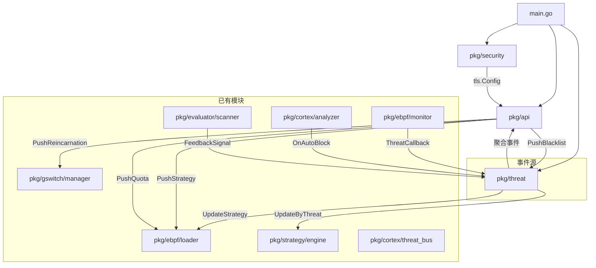
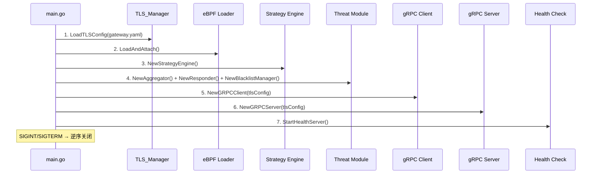

# 设计文档：Phase 1 — Gateway 闭环

## 概述

本设计覆盖 Mirage-Gateway 三个空模块（`pkg/security`、`pkg/threat`、`pkg/api`）的实现方案，以及 `main.go` 启动序列的集成改造。

核心目标：使 Gateway 成为可独立运行、可与 Mirage-OS 双向 gRPC 通信的完整战斗单元。

设计约束：
- 纯 Go 控制面开发，不涉及 C/eBPF 数据面变更
- Go→C 通过 eBPF Map，C→Go 通过 Ring Buffer（铁律不变）
- 所有 Gateway↔OS 通信走 mTLS
- Go 控制面响应 < 100ms，内存 < 200MB

## 架构

### 模块依赖关系



### 启动序列



### 数据流

```mermaid
flowchart LR
    subgraph 上行（Gateway → OS）
        HB[心跳 30s] --> GC[gRPC Client]
        TR[流量统计 60s] --> GC
        TE[威胁事件 实时] --> GC
        GC --> |mTLS| OS[Mirage-OS]
    end
    
    subgraph 下行（OS → Gateway）
        OS --> |mTLS| GS[gRPC Server]
        GS --> CH[Command Handler]
        CH --> |PushStrategy| EBPF[eBPF Map]
        CH --> |PushBlacklist| BL[Blacklist Manager]
        CH --> |PushQuota| EBPF
        CH --> |PushReincarnation| GSW[G-Switch]
    end
```

## 组件与接口

### 1. pkg/security

#### tls_manager.go

```go
// TLSManager mTLS 证书管理器
type TLSManager struct {
    certFile   string
    keyFile    string
    caFile     string
    serverName string
    enabled    bool
    mu         sync.RWMutex
    tlsConfig  *tls.Config
    watcher    *fsnotify.Watcher  // 证书热重载
}

// NewTLSManager 从 gateway.yaml 配置创建
func NewTLSManager(cfg TLSConfig) (*TLSManager, error)

// TLSConfig 对应 gateway.yaml 中 mcc.tls 段
type TLSConfig struct {
    Enabled    bool   `yaml:"enabled"`
    CertFile   string `yaml:"cert_file"`
    KeyFile    string `yaml:"key_file"`
    CAFile     string `yaml:"ca_file"`
    ServerName string `yaml:"server_name"`
}

// GetClientTLSConfig 返回 gRPC 客户端用的 tls.Config（含客户端证书 + CA 池）
func (tm *TLSManager) GetClientTLSConfig() (*tls.Config, error)

// GetServerTLSConfig 返回 gRPC 服务端用的 tls.Config（含 ClientAuth: RequireAndVerifyClientCert）
func (tm *TLSManager) GetServerTLSConfig() (*tls.Config, error)

// StartCertWatcher 启动证书文件监控，60 秒内检测变更并热重载
func (tm *TLSManager) StartCertWatcher(ctx context.Context) error

// Close 关闭 watcher
func (tm *TLSManager) Close() error
```

#### shadow_auth.go

```go
// ShadowAuth Ed25519 挑战-响应认证器
type ShadowAuth struct {
    mu             sync.Mutex
    pendingChallenges map[string]time.Time  // nonce → 创建时间
    challengeTTL   time.Duration            // 300 秒
}

// Challenge 挑战结构
type Challenge struct {
    Nonce     string `json:"nonce"`
    Timestamp int64  `json:"timestamp"`
    Raw       string `json:"raw"`  // "mirage-auth:{nonce}:{timestamp}"
}

// NewShadowAuth 创建认证器
func NewShadowAuth() *ShadowAuth

// GenerateChallenge 生成挑战字符串（含随机 nonce + 时间戳）
func (sa *ShadowAuth) GenerateChallenge() (*Challenge, error)

// VerifySignature 验证 Ed25519 签名
// publicKeyHex: hex 编码的 Ed25519 公钥（与 mirage-cli keygen 输出兼容）
// challenge: 原始挑战字符串
// signatureHex: hex 编码的签名
func (sa *ShadowAuth) VerifySignature(publicKeyHex, challenge, signatureHex string) error

// CleanExpired 清理过期挑战
func (sa *ShadowAuth) CleanExpired()
```

### 2. pkg/threat

#### aggregator.go

```go
// UnifiedThreatEvent 统一威胁事件格式
type UnifiedThreatEvent struct {
    Timestamp  time.Time
    EventType  ThreatEventType
    SourceIP   string
    SourcePort uint16
    Severity   int          // 0-10
    Source     EventSource  // EBPF / CORTEX / EVALUATOR
    Count      int          // 聚合计数
    RawData    interface{}  // 原始事件数据
}

type ThreatEventType int
const (
    ThreatActiveProbing ThreatEventType = iota + 1
    ThreatReplayAttack
    ThreatTimingAttack
    ThreatDPIDetection
    ThreatJA4Scan
    ThreatSNIProbe
    ThreatHighRiskFingerprint
    ThreatAnomalyDetected
)

type EventSource int
const (
    SourceEBPF      EventSource = iota + 1
    SourceCortex
    SourceEvaluator
)

// Aggregator 威胁事件聚合器
type Aggregator struct {
    inCh       chan *UnifiedThreatEvent       // 输入通道
    outCh      chan *UnifiedThreatEvent       // 输出通道（分发给 Responder + gRPC Client）
    dedup      map[string]*UnifiedThreatEvent // key: "{sourceIP}:{eventType}" → 60 秒去重窗口
    mu         sync.Mutex
    maxQueue   int                            // 10000
    dropCount  uint64
}

// NewAggregator 创建聚合器
func NewAggregator(maxQueue int) *Aggregator

// Start 启动聚合循环
func (a *Aggregator) Start(ctx context.Context)

// Subscribe 获取输出通道
func (a *Aggregator) Subscribe() <-chan *UnifiedThreatEvent

// IngestEBPF 接入 eBPF Monitor 事件（实现 ebpf.ThreatCallback 签名）
func (a *Aggregator) IngestEBPF(event *ebpf.ThreatEvent)

// IngestCortex 接入 Cortex 高危指纹事件
func (a *Aggregator) IngestCortex(ip string, reason string)

// IngestEvaluator 接入 Evaluator 异常检测事件
func (a *Aggregator) IngestEvaluator(signal evaluator.FeedbackSignal)

// GetDropCount 获取丢弃计数
func (a *Aggregator) GetDropCount() uint64
```

#### responder.go

```go
// ThreatLevel 威胁等级
type ThreatLevel int
const (
    LevelLow      ThreatLevel = 1
    LevelMedium   ThreatLevel = 2
    LevelHigh     ThreatLevel = 3
    LevelCritical ThreatLevel = 4
    LevelExtreme  ThreatLevel = 5
)

// Responder 威胁响应器
type Responder struct {
    currentLevel  ThreatLevel
    engine        *strategy.StrategyEngine
    loader        *ebpf.Loader
    grpcNotify    func(level ThreatLevel)  // 通知 gRPC Client 上报
    cooldownUntil time.Time                // 降级冷却期
    mu            sync.Mutex
}

// NewResponder 创建响应器
func NewResponder(engine *strategy.StrategyEngine, loader *ebpf.Loader) *Responder

// Start 启动响应循环，消费 Aggregator 输出
func (r *Responder) Start(ctx context.Context, events <-chan *UnifiedThreatEvent)

// SetGRPCNotify 设置 gRPC 上报回调
func (r *Responder) SetGRPCNotify(fn func(level ThreatLevel))

// GetCurrentLevel 获取当前威胁等级
func (r *Responder) GetCurrentLevel() ThreatLevel
```

#### blacklist.go

```go
// BlacklistEntry 黑名单条目
type BlacklistEntry struct {
    CIDR      string
    AddedAt   time.Time
    ExpireAt  time.Time
    Source    BlacklistSource  // LOCAL / GLOBAL
}

type BlacklistSource int
const (
    SourceLocal  BlacklistSource = iota
    SourceGlobal
)

// BlacklistManager 黑名单管理器
type BlacklistManager struct {
    entries    map[string]*BlacklistEntry  // CIDR → entry
    loader     *ebpf.Loader               // 用于同步到 eBPF LPM Trie
    mu         sync.RWMutex
    maxEntries int                         // 65536
}

// NewBlacklistManager 创建黑名单管理器
func NewBlacklistManager(loader *ebpf.Loader, maxEntries int) *BlacklistManager

// Add 添加条目，1 秒内同步到 eBPF LPM Trie Map
func (bm *BlacklistManager) Add(cidr string, expireAt time.Time, source BlacklistSource) error

// Remove 移除条目
func (bm *BlacklistManager) Remove(cidr string) error

// MergeGlobal 合并 OS 下发的全局黑名单（全局优先级高于本地）
func (bm *BlacklistManager) MergeGlobal(entries []BlacklistEntry) error

// StartExpiry 启动过期清理循环
func (bm *BlacklistManager) StartExpiry(ctx context.Context)

// Count 获取当前条目数
func (bm *BlacklistManager) Count() int
```

### 3. pkg/api

#### proto/mirage.proto

```protobuf
syntax = "proto3";
package mirage;
option go_package = "mirage-gateway/pkg/api/proto";

// ========== 上行服务（Gateway → OS）==========
service GatewayUplink {
    rpc SyncHeartbeat(HeartbeatRequest) returns (HeartbeatResponse);
    rpc ReportTraffic(TrafficRequest) returns (TrafficResponse);
    rpc ReportThreat(ThreatRequest) returns (ThreatResponse);
}

// ========== 下行服务（OS → Gateway）==========
service GatewayDownlink {
    rpc PushBlacklist(BlacklistPush) returns (PushResponse);
    rpc PushStrategy(StrategyPush) returns (PushResponse);
    rpc PushQuota(QuotaPush) returns (PushResponse);
    rpc PushReincarnation(ReincarnationPush) returns (PushResponse);
}

// ========== 枚举 ==========
enum GatewayStatus {
    ONLINE = 0;
    DEGRADED = 1;
    EMERGENCY = 2;
}

enum ThreatType {
    THREAT_UNKNOWN = 0;
    ACTIVE_PROBING = 1;
    REPLAY_ATTACK = 2;
    TIMING_ATTACK = 3;
    DPI_DETECTION = 4;
    JA4_SCAN = 5;
    SNI_PROBE = 6;
}

enum BlacklistSourceType {
    BL_LOCAL = 0;
    BL_GLOBAL = 1;
}

// ========== 上行消息 ==========
message HeartbeatRequest {
    string gateway_id = 1;
    int64 timestamp = 2;
    GatewayStatus status = 3;
    bool ebpf_loaded = 4;
    int32 threat_level = 5;
    int64 active_connections = 6;
    int32 memory_usage_mb = 7;
}

message HeartbeatResponse {
    bool ack = 1;
    int64 server_time = 2;
}

message TrafficRequest {
    string gateway_id = 1;
    int64 timestamp = 2;
    uint64 business_bytes = 3;
    uint64 defense_bytes = 4;
    int32 period_seconds = 5;
}

message TrafficResponse {
    bool ack = 1;
}

message ThreatEvent {
    int64 timestamp = 1;
    ThreatType threat_type = 2;
    string source_ip = 3;
    uint32 source_port = 4;
    int32 severity = 5;
    uint32 packet_count = 6;
}

message ThreatRequest {
    string gateway_id = 1;
    repeated ThreatEvent events = 2;
}

message ThreatResponse {
    bool ack = 1;
}

// ========== 下行消息 ==========
message BlacklistEntryProto {
    string cidr = 1;
    int64 expire_at = 2;
    BlacklistSourceType source = 3;
}

message BlacklistPush {
    repeated BlacklistEntryProto entries = 1;
}

message StrategyPush {
    int32 defense_level = 1;
    uint32 jitter_mean_us = 2;
    uint32 jitter_stddev_us = 3;
    uint32 noise_intensity = 4;
    uint32 padding_rate = 5;
    uint32 template_id = 6;
}

message QuotaPush {
    uint64 remaining_bytes = 1;
}

message ReincarnationPush {
    string new_domain = 1;
    string new_ip = 2;
    string reason = 3;
    int32 deadline_seconds = 4;
}

message PushResponse {
    bool success = 1;
    string message = 2;
}
```

#### grpc_client.go

```go
// GRPCClient 上行 gRPC 客户端
type GRPCClient struct {
    conn          *grpc.ClientConn
    uplinkClient  proto.GatewayUplinkClient
    gatewayID     string
    tlsConfig     *tls.Config
    endpoint      string
    connected     atomic.Bool
    degradedSince time.Time
    eventBuffer   []*proto.ThreatEvent  // 断连缓存，最多 1000 条
    mu            sync.Mutex
}

// NewGRPCClient 创建客户端
func NewGRPCClient(endpoint, gatewayID string, tlsConfig *tls.Config) *GRPCClient

// Connect 建立连接（含指数退避重连）
func (c *GRPCClient) Connect(ctx context.Context) error

// StartHeartbeat 启动心跳循环（30 秒间隔）
func (c *GRPCClient) StartHeartbeat(ctx context.Context, statusFn func() *proto.HeartbeatRequest)

// StartTrafficReport 启动流量上报循环（60 秒间隔）
func (c *GRPCClient) StartTrafficReport(ctx context.Context, trafficFn func() *proto.TrafficRequest)

// ReportThreat 上报威胁事件（5 秒内发送）
func (c *GRPCClient) ReportThreat(events []*proto.ThreatEvent) error

// IsConnected 连接状态
func (c *GRPCClient) IsConnected() bool

// Close 关闭连接
func (c *GRPCClient) Close() error
```

#### grpc_server.go

```go
// GRPCServer 下行 gRPC 服务端
type GRPCServer struct {
    server    *grpc.Server
    handler   *CommandHandler
    port      int
    tlsConfig *tls.Config
}

// NewGRPCServer 创建服务端（mTLS 认证）
func NewGRPCServer(port int, tlsConfig *tls.Config, handler *CommandHandler) *GRPCServer

// Start 启动 gRPC 服务
func (s *GRPCServer) Start() error

// Stop 优雅关闭
func (s *GRPCServer) Stop()
```

#### handlers.go

```go
// CommandHandler 下行指令处理器
type CommandHandler struct {
    loader     *ebpf.Loader
    blacklist  *threat.BlacklistManager
    gswitch    *gswitch.GSwitchManager
    proto.UnimplementedGatewayDownlinkServer
}

// NewCommandHandler 创建处理器
func NewCommandHandler(
    loader *ebpf.Loader,
    blacklist *threat.BlacklistManager,
    gswitch *gswitch.GSwitchManager,
) *CommandHandler

// PushStrategy 处理策略下发 → 写入 eBPF Map（< 100ms）
func (h *CommandHandler) PushStrategy(ctx context.Context, req *proto.StrategyPush) (*proto.PushResponse, error)

// PushBlacklist 处理黑名单下发 → 合并到 BlacklistManager
func (h *CommandHandler) PushBlacklist(ctx context.Context, req *proto.BlacklistPush) (*proto.PushResponse, error)

// PushQuota 处理配额下发 → 写入 eBPF quota_map（0 时触发内核态阻断）
func (h *CommandHandler) PushQuota(ctx context.Context, req *proto.QuotaPush) (*proto.PushResponse, error)

// PushReincarnation 处理转生指令 → 调用 GSwitch.TriggerEscape
func (h *CommandHandler) PushReincarnation(ctx context.Context, req *proto.ReincarnationPush) (*proto.PushResponse, error)
```

### 4. main.go 集成改造

```go
func main() {
    // 1. 加载配置
    cfg := loadConfig("configs/gateway.yaml")
    
    // 2. mTLS 初始化（关键模块，失败则终止）
    tlsMgr, err := security.NewTLSManager(cfg.MCC.TLS)
    if err != nil { log.Fatalf(...) }
    
    // 3. eBPF 加载（关键模块，失败则终止）
    loader := ebpf.NewLoader(cfg.Network.Interface)
    if err := loader.LoadAndAttach(); err != nil { log.Fatalf(...) }
    
    // 4. 策略引擎
    engine := strategy.NewStrategyEngine(...)
    
    // 5. 威胁编排
    aggregator := threat.NewAggregator(10000)
    responder := threat.NewResponder(engine, loader)
    blacklist := threat.NewBlacklistManager(loader, 65536)
    
    // 6. 注册事件源
    monitor.RegisterCallback(aggregator.IngestEBPF)
    cortexAnalyzer.OnAutoBlock(aggregator.IngestCortex)
    
    // 7. gRPC 客户端（非关键，失败降级）
    clientTLS, _ := tlsMgr.GetClientTLSConfig()
    grpcClient := api.NewGRPCClient(cfg.MCC.Endpoint, gatewayID, clientTLS)
    
    // 8. gRPC 服务端（非关键，失败降级）
    serverTLS, _ := tlsMgr.GetServerTLSConfig()
    handler := api.NewCommandHandler(loader, blacklist, gswitchMgr)
    grpcServer := api.NewGRPCServer(50847, serverTLS, handler)
    
    // 9. 健康检查（增强版）
    startEnhancedHealthServer(...)
    
    // 10. 优雅退出（逆序关闭，30 秒超时）
    // grpcServer → grpcClient → aggregator → responder → blacklist → loader → tlsMgr
}
```

## 数据模型

### 统一威胁事件

| 字段 | 类型 | 说明 |
|------|------|------|
| Timestamp | time.Time | 事件时间 |
| EventType | ThreatEventType | 威胁类型枚举 |
| SourceIP | string | 源 IP |
| SourcePort | uint16 | 源端口 |
| Severity | int | 严重程度 0-10 |
| Source | EventSource | 来源：EBPF/CORTEX/EVALUATOR |
| Count | int | 聚合计数 |

### 黑名单条目

| 字段 | 类型 | 说明 |
|------|------|------|
| CIDR | string | IP 或 CIDR 前缀 |
| AddedAt | time.Time | 添加时间 |
| ExpireAt | time.Time | 过期时间 |
| Source | BlacklistSource | LOCAL/GLOBAL |

### 威胁等级 → 协议参数映射

| 等级 | Jitter 均值 | Jitter 标准差 | 噪声强度 | 填充率 |
|------|------------|-------------|---------|--------|
| 低(1) | 10ms | 3ms | 5% | 10% |
| 中(2) | 30ms | 10ms | 15% | 20% |
| 高(3) | 50ms | 15ms | 20% | 25% |
| 严重(4) | 80ms | 25ms | 25% | 30% |
| 极限(5) | 100ms | 30ms | 30% | 35% |

### eBPF Map 交互

| Map 名称 | 方向 | 用途 |
|----------|------|------|
| jitter_config_map | Go→C | Jitter-Lite 参数 |
| vpc_config_map | Go→C | VPC 噪声参数 |
| quota_map | Go→C | 配额值（0 时内核态阻断） |
| threat_events | C→Go | 威胁事件 Ring Buffer |
| traffic_stats | C→Go | 流量统计 |


## 正确性属性

*属性是在系统所有有效执行中都应成立的特征或行为——本质上是对系统应做什么的形式化陈述。属性是人类可读规范与机器可验证正确性保证之间的桥梁。*

### Property 1: Ed25519 签名往返一致性

*For any* 随机生成的 Ed25519 密钥对和任意挑战字符串，使用私钥签名后，用 hex 编码的公钥调用 VerifySignature 应当验证成功。

**Validates: Requirements 2.2, 2.5**

### Property 2: 挑战唯一性

*For any* N 次调用 GenerateChallenge（N >= 2），所有返回的 nonce 值应当互不相同。

**Validates: Requirements 2.1, 2.6**

### Property 3: 无效签名统一拒绝

*For any* 有效的 Ed25519 公钥和挑战字符串，使用随机篡改的签名调用 VerifySignature 应当返回错误，且错误信息不包含具体失败原因。

**Validates: Requirements 2.3**

### Property 4: 过期挑战拒绝

*For any* 时间偏移量 > 300 秒，使用该偏移量生成的过期挑战进行签名验证应当被拒绝。

**Validates: Requirements 2.4**

### Property 5: 威胁事件标准化完整性

*For any* 来自 eBPF Monitor、Cortex Analyzer 或 Evaluator Scanner 的原始事件，经 Aggregator 标准化后的 UnifiedThreatEvent 应当包含非零 Timestamp、有效 EventType、非空 SourceIP、有效 Severity（0-10）和正确的 Source 标识。

**Validates: Requirements 3.2**

### Property 6: 同源事件聚合

*For any* 源 IP 和事件类型的组合，在 60 秒窗口内注入 N 个相同事件（N >= 1），Aggregator 输出的聚合事件 Count 应当等于 N。

**Validates: Requirements 3.3**

### Property 7: 事件队列上限

*For any* 注入事件数量 N > 10000，Aggregator 的内部队列深度不应超过 10000，且丢弃计数应等于 N - 10000。

**Validates: Requirements 3.5**

### Property 8: 威胁等级参数单调性

*For any* 两个威胁等级 L1 < L2（范围 1-5），L2 对应的防御参数（Jitter 均值、噪声强度、填充率）应当大于等于 L1 对应的参数值。且当等级 >= 4 时，应触发 gRPC 上报通知。

**Validates: Requirements 4.1, 4.3, 4.4**

### Property 9: 黑名单添加往返

*For any* 有效的 IPv4 地址或 CIDR 前缀，添加到 BlacklistManager 后，查询该条目应当存在且包含正确的 AddedAt、ExpireAt 和 Source 字段。

**Validates: Requirements 5.1, 5.4**

### Property 10: 全局黑名单优先合并

*For any* 本地黑名单集合 L 和全局黑名单集合 G，当 L 和 G 存在相同 CIDR 条目时，MergeGlobal 后该 CIDR 的 Source 应当为 GLOBAL。

**Validates: Requirements 5.3**

### Property 11: Protobuf 序列化往返一致性

*For any* 有效的 Protobuf 消息（HeartbeatRequest、TrafficRequest、ThreatRequest、BlacklistPush、StrategyPush、ReincarnationPush），使用 proto.Marshal 序列化后再使用 proto.Unmarshal 反序列化应当产生与原始消息等价的对象。

**Validates: Requirements 6.3, 6.4, 6.5, 6.6, 6.7, 6.8, 6.9**

### Property 12: 断连缓存上限

*For any* 在 gRPC 连接断开期间产生的 N 个威胁事件（N > 1000），GRPCClient 的本地缓存不应超过 1000 条。

**Validates: Requirements 7.5**

### Property 13: 无效下行指令拒绝

*For any* 包含越界参数的下行指令（如负数 defense_level、空 CIDR、deadline_seconds <= 0），CommandHandler 应当返回 gRPC InvalidArgument 错误码。

**Validates: Requirements 8.6**

## 错误处理

### 分级错误策略

| 模块 | 错误类型 | 处理方式 |
|------|---------|---------|
| TLS_Manager | 证书文件不存在/格式无效 | 返回 error，main.go 终止进程 |
| TLS_Manager | 热重载失败 | 记录告警日志，保持旧证书 |
| ShadowAuth | 签名验证失败 | 返回统一错误（不泄露原因） |
| ShadowAuth | 挑战过期 | 返回挑战过期错误 |
| Aggregator | 队列溢出 | 丢弃最旧事件，递增 dropCount |
| Responder | eBPF Map 写入失败 | 记录错误日志，保持当前参数 |
| BlacklistManager | LPM Trie 容量满 | 淘汰最早过期条目 |
| GRPCClient | 连接断开 | 指数退避重连（1s→60s），本地缓存事件 |
| GRPCClient | OS 不可达 > 300s | 标记 DEGRADED，记录告警 |
| GRPCServer | 无效指令 | 返回 InvalidArgument，记录告警 |
| GRPCServer | 未通过 mTLS | 拒绝连接 |
| main.go | 关键模块失败 | 终止进程（非零退出码） |
| main.go | 非关键模块失败 | 降级运行，记录告警 |

### 关键模块 vs 非关键模块

- 关键模块（失败终止）：TLS_Manager、eBPF Loader
- 非关键模块（失败降级）：gRPC Client、gRPC Server、Health Check

## 测试策略

### 属性测试（Property-Based Testing）

使用 Go 的 `testing/quick` 标准库 + `pgregory.net/rapid` 进行属性测试。

每个属性测试最少运行 100 次迭代。每个测试用注释标注对应的设计属性：

```go
// Feature: gateway-closure, Property 1: Ed25519 签名往返一致性
func TestProperty_Ed25519RoundTrip(t *testing.T) { ... }
```

属性测试覆盖范围：
- Property 1-4: pkg/security 的 Ed25519 签名逻辑
- Property 5-7: pkg/threat/aggregator 的事件聚合逻辑
- Property 8: pkg/threat/responder 的等级映射逻辑
- Property 9-10: pkg/threat/blacklist 的黑名单管理逻辑
- Property 11: pkg/api/proto 的 Protobuf 序列化
- Property 12: pkg/api/grpc_client 的缓存逻辑
- Property 13: pkg/api/handlers 的参数校验逻辑

### 单元测试

针对具体示例和边界条件：
- TLS 配置加载（有效/无效路径、enabled=false）
- 降级冷却期（120 秒）
- 黑名单过期清理
- 启动序列（关键模块失败终止、非关键模块降级）
- 健康检查端点（/status、/healthz、/readyz）

### 集成测试

- mTLS 双向认证（有效/无效证书）
- gRPC 上行/下行完整链路
- eBPF Map 写入验证
- 证书热重载
- 优雅关闭序列
