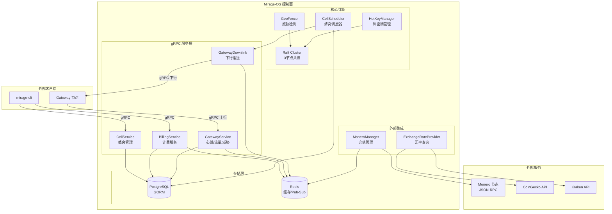
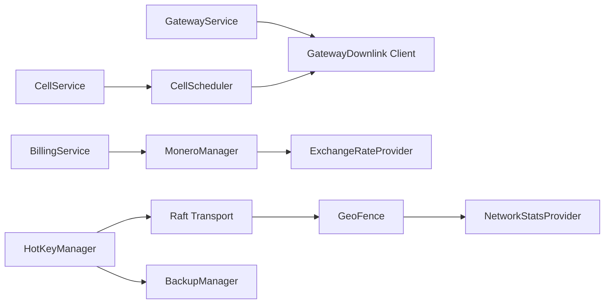

# 设计文档：Mirage-OS 控制面 P0 待办任务完成

## 概述

本设计文档覆盖 Mirage-OS 控制面 13 项 P0 待办任务的技术实现方案。核心目标是将现有代码中的 TODO/mock 实现替换为生产级代码，打通商业闭环。

实现范围分为四大模块：

1. **gRPC 服务层**（需求 1-4）：GatewayDownlink、CellService、BillingService、GatewayService 的完整服务端实现
2. **Raft 安全层**（需求 5-6）：Shamir 份额收集与密钥轮换的真实实现
3. **威胁检测层**（需求 7-10）：GeoFence 的政府审计、DDoS、异常流量检测，通过 provider 接口实现可测试性
4. **集成层**（需求 11-13）：CellScheduler 与 GatewayDownlink 的集成、Monero RPC 客户端、汇率查询

所有实现遵循：Go 控制面原则、接口驱动设计（可测试性）、GORM/go-redis 现有模式、gRPC status code 错误处理。

## 架构

### 系统架构总览



### 模块依赖关系



## 组件与接口

### 1. GatewayDownlink 下行服务

**文件**: `mirage-os/gateway-bridge/pkg/grpc/downlink.go`

GatewayDownlink 需要一个连接管理器来维护到各 Gateway 的 gRPC 客户端连接。

```go
// GatewayConnectionManager 管理到 Gateway 的 gRPC 连接
type GatewayConnectionManager struct {
    mu          sync.RWMutex
    connections map[string]*grpc.ClientConn // gatewayID -> conn
    db          *gorm.DB
    rdb         *redis.Client
}

// DownlinkService 下行推送服务
type DownlinkService struct {
    connMgr *GatewayConnectionManager
    rdb     *redis.Client
    db      *gorm.DB
}

// 接口方法
func (ds *DownlinkService) PushBlacklist(gatewayID string, entries []*pb.BlacklistEntryProto) error
func (ds *DownlinkService) PushStrategy(gatewayID string, strategy *pb.StrategyPush) error
func (ds *DownlinkService) PushQuota(gatewayID string, remainingBytes uint64) error
func (ds *DownlinkService) PushReincarnation(gatewayID string, push *pb.ReincarnationPush) error
```

**状态对齐模型（Desired State Reconciliation）**：

放弃事件重试队列，改用 K8s 式的期望状态对齐：
- OS 侧在 Redis 中维护每个 Gateway 的最新期望状态（Desired State）：`gateway:{id}:desired_state`（JSON Hash）
- 每次策略/黑名单/配额变更时，直接覆盖 Desired State 并计算 `StateHash`
- Gateway 每次 `SyncHeartbeat` 时携带自身 `CurrentStateHash`
- OS 发现 Hash 不一致时，下发全量最新 Desired State
- 彻底消灭队列积压和时序风暴，实现自愈（Self-Healing）

对于 `PushReincarnation`（转生指令）等一次性事件，仍使用 Redis List 队列 `mirage:downlink:events:{gatewayID}`，但带有 TTL 和去重机制。

### 2. CellService gRPC 服务

**文件**: `mirage-os/services/cellular/cell_service.go`

```go
type CellServiceImpl struct {
    pb.UnimplementedCellServiceServer
    db  *gorm.DB
    rdb *redis.Client
}

func (s *CellServiceImpl) RegisterCell(ctx, *pb.RegisterCellRequest) (*pb.RegisterCellResponse, error)
func (s *CellServiceImpl) ListCells(ctx, *pb.ListCellsRequest) (*pb.ListCellsResponse, error)
func (s *CellServiceImpl) AllocateGateway(ctx, *pb.AllocateRequest) (*pb.AllocateResponse, error)
func (s *CellServiceImpl) HealthCheck(ctx, *pb.HealthCheckRequest) (*pb.HealthCheckResponse, error)
func (s *CellServiceImpl) SwitchCell(ctx, *pb.SwitchCellRequest) (*pb.SwitchCellResponse, error)
```

设计决策：
- `AllocateGateway` 使用负载最低策略：按 `load_percent ASC` 排序，取第一个满足等级和国家偏好的蜂窝
- `SwitchCell` 若未指定 `target_cell_id`，自动选择同等级、不同管辖区、负载最低的蜂窝
- 连接令牌使用 `crypto/rand` 生成 32 字节 hex 字符串

### 3. BillingService gRPC 服务

**文件**: `mirage-os/services/billing/billing_service.go`

```go
type BillingServiceImpl struct {
    pb.UnimplementedBillingServiceServer
    db           *gorm.DB
    rdb          *redis.Client
    moneroMgr    *MoneroManager
}

func (s *BillingServiceImpl) CreateAccount(ctx, *pb.CreateAccountRequest) (*pb.CreateAccountResponse, error)
func (s *BillingServiceImpl) Deposit(ctx, *pb.DepositRequest) (*pb.DepositResponse, error)
func (s *BillingServiceImpl) GetBalance(ctx, *pb.BalanceRequest) (*pb.BalanceResponse, error)
func (s *BillingServiceImpl) PurchaseQuota(ctx, *pb.PurchaseRequest) (*pb.PurchaseResponse, error)
func (s *BillingServiceImpl) GetBillingLogs(ctx, *pb.BillingLogsRequest) (*pb.BillingLogsResponse, error)
```

设计决策：
- `PurchaseQuota` 在数据库事务中执行：验证余额 → 扣减余额 → 创建 QuotaPurchase 记录 → 增加用户配额
- 流量包价格表硬编码为常量 map，按 `PackageType × CellLevel` 索引
- `Deposit` **不接受用户手动提交 TxHash**。改用 Sub-address 隔离方案：
  - `CreateAccount` 时通过 `monero-wallet-rpc` 的 `create_address` 为用户生成专属子地址
  - `MoneroManager.MonitorDeposits` 后台轮询 `get_transfers`，仅处理目标地址为系统有效子地址的入账
  - 彻底阻断 TxHash 重放抢占攻击（用户 B 无法通过提交用户 A 的公开 TxHash 来窃取充值）
  - `Deposit` RPC 仅作为手动触发确认检查的辅助接口，不再是充值的主入口

### 4. GatewayService gRPC 服务

**文件**: `mirage-os/services/api-gateway/gateway_service.go`

```go
type GatewayServiceImpl struct {
    pb.UnimplementedGatewayServiceServer
    db  *gorm.DB
    rdb *redis.Client
}

func (s *GatewayServiceImpl) SyncHeartbeat(ctx, *pb.HeartbeatRequest) (*pb.HeartbeatResponse, error)
func (s *GatewayServiceImpl) ReportTraffic(ctx, *pb.TrafficReport) (*pb.TrafficResponse, error)
func (s *GatewayServiceImpl) ReportThreat(ctx, *pb.ThreatReport) (*pb.ThreatResponse, error)
func (s *GatewayServiceImpl) GetQuota(ctx, *pb.QuotaRequest) (*pb.QuotaResponse, error)
```

设计决策：
- `SyncHeartbeat` 同时写 PostgreSQL（GORM Upsert）和 Redis（`gateway:{id}:status`，TTL 60s）
- `ReportTraffic` 配额扣减使用 Redis DECRBY 原子操作，定期同步到 PostgreSQL
- `ReportThreat` 威胁评估逻辑：severity ≥ 8 → ACTION_EMERGENCY_SHUTDOWN，≥ 6 → ACTION_SWITCH_CELL，≥ 4 → ACTION_BLOCK_IP，≥ 2 → ACTION_INCREASE_DEFENSE

### 5. HotKeyManager 份额收集

**文件**: `mirage-os/pkg/raft/hot_key_manager.go`（修改现有 `collectShares`）

引入 `ShareProvider` 接口实现可测试性：

```go
// ShareProvider 份额提供者接口
type ShareProvider interface {
    RequestShare(ctx context.Context, nodeAddr string) (*crypto.Share, error)
    GetOnlineNodes() ([]string, error)
}

// RaftShareProvider 基于 Raft Transport 的真实实现
type RaftShareProvider struct {
    cluster *Cluster
}
```

`collectShares` 流程：
1. 调用 `ShareProvider.GetOnlineNodes()` 获取在线节点列表
2. 并发向每个节点发送份额请求，单节点超时 5 秒
3. 验证份额有效性（Index 1-5，Value 长度 32 字节）
4. 收集到 ≥ 3 个有效份额即返回，否则返回错误

### 6. HotKeyManager 密钥轮换

**文件**: `mirage-os/pkg/raft/hot_key_manager.go`（修改现有 `RefreshHotKey`）

**关键设计决策：通过 Raft Log 强一致性分发份额，而非带外 gRPC 通道。**

取消独立的 `ShareDistributor` gRPC 接口。将份额分发作为 Raft Command 提交，确保过半节点 commit 后才生效，彻底避免 Split-Brain 导致的密钥撕裂。

```go
// KeyRotationCommand Raft 日志中的密钥轮换命令
type KeyRotationCommand struct {
    Type           string                    `json:"type"` // "key_rotation"
    EncryptedShares map[string][]byte        `json:"encrypted_shares"` // nodeID -> 用节点公钥加密的份额
    Epoch          uint64                    `json:"epoch"` // 轮换纪元号，单调递增
}
```

`RefreshHotKey` 流程：
1. 备份旧份额引用
2. 生成新 32 字节 AES-256 主密钥（`crypto/rand`）
3. 使用 `SplitSecret` 分割为 5 份
4. 用各节点公钥加密对应份额，打包为 `KeyRotationCommand`
5. 通过 `raft.Apply(command)` 提交到 Raft 日志（需过半节点 commit）
6. FSM Apply 时各节点解密并存储自己的份额
7. Leader 收集份额并激活新热密钥，然后 `DeactivateHotKey` 清除旧密钥
8. 如果 `raft.Apply` 失败（未过半 commit），保持旧密钥不变，记录错误日志

### 7. GeoFence 威胁检测（分层解耦架构）

**文件**: `mirage-os/pkg/raft/geo_fence.go`（修改现有文件）

**关键设计决策：威胁分层解耦，区分 Gateway 级威胁和 Control Plane 级威胁。**

将 GeoFence 拆分为两个分析器，避免 Gateway 级攻击（DDoS/SYN Flood）错误触发控制面退位：

```go
// ControlPlaneThreatAnalyzer 控制面威胁分析器（触发 Raft 退位）
// 仅响应：政府审计、数据中心物理入侵、路由跳数异常
type ControlPlaneThreatAnalyzer struct {
    govIPChecker GovernmentIPChecker
    dcAccess     DataCenterAccessProvider
    netStats     NetworkStatsProvider
}

// GatewayThreatAnalyzer Gateway 级威胁分析器（触发蜂窝调度）
// 仅响应：DDoS、SYN Flood、UDP Flood、异常连接数
type GatewayThreatAnalyzer struct {
    netStats NetworkStatsProvider
}
```

Provider 接口：

```go
// NetworkStatsProvider 网络统计数据提供者
type NetworkStatsProvider interface {
    GetConnectionsBySourceIP() (map[string]int, error)
    GetTrafficRateBps() (uint64, error)
    GetSYNRate() (uint64, error)
    GetUDPRate() (uint64, error)
    GetConnectionSources() ([]ConnectionSource, error)
    GetRouteHops() ([]RouteHop, error)
}

// GovernmentIPChecker 政府 IP 段检查器
type GovernmentIPChecker interface {
    IsGovernmentIP(ip string) bool
}

// DataCenterAccessProvider 数据中心访问监控
type DataCenterAccessProvider interface {
    GetUnplannedAccessEvents(since time.Time) ([]AccessEvent, error)
}
```

### 8-10. 威胁检测具体实现（分层）

**Control Plane 级威胁**（触发 Raft Leader 跨国退位）：
- `detectGovernmentAudit()`: 使用 `GovernmentIPChecker` + `DataCenterAccessProvider` + `NetworkStatsProvider.GetRouteHops()`
- 检测到时设置 ThreatLevelCritical(9)，触发 LeadershipTransfer

**Gateway 级威胁**（触发蜂窝调度/IP 切换/防御升级，不触发 Raft 退位）：
- `detectDDoS()`: 使用 `NetworkStatsProvider.GetTrafficRateBps/GetSYNRate/GetUDPRate()`，与滑动窗口基线比较
- `detectAnomalousTraffic()`: 使用 `NetworkStatsProvider.GetConnectionsBySourceIP/GetConnectionSources()`，检测标准差偏离
- 检测到时通过 CellScheduler 触发蜂窝熔断/IP 切换/防御等级提升，**不影响 Raft 集群稳定性**

### 11. CellScheduler Gateway 通信

**文件**: `mirage-os/pkg/strategy/cell_manager.go`（修改现有文件）

为 CellScheduler 注入 `DownlinkClient` 接口：

```go
// DownlinkClient Gateway 下行通信接口
type DownlinkClient interface {
    PushStrategy(gatewayID string, strategy *pb.StrategyPush) error
    PushQuota(gatewayID string, remainingBytes uint64) error
}
```

在生命周期转换点调用：
- `RegisterGateway` → `PushStrategy(noise_intensity=80)` 启动 VPC 噪声注入
- `promoteToCalibration` → `PushStrategy(探测参数)` 启动网络质量测量
- `PromoteToActive` → `PushStrategy(template_id=X)` 下发 B-DNA 模板

### 12. Monero RPC 客户端

**文件**: `mirage-os/services/billing/monero_manager.go`（修改现有文件）

引入 `MoneroRPCClient` 接口：

```go
// MoneroRPCClient Monero JSON-RPC 客户端接口
type MoneroRPCClient interface {
    GetTransferByTxID(ctx context.Context, txHash string) (*TransferResult, error)
}

// HTTPMoneroRPCClient 基于 net/http 的真实实现
type HTTPMoneroRPCClient struct {
    endpoint   string
    httpClient *http.Client
}
```

JSON-RPC 2.0 请求格式：
```json
{
    "jsonrpc": "2.0",
    "id": "0",
    "method": "get_transfer_by_txid",
    "params": {"txid": "<tx_hash>"}
}
```

### 13. 汇率查询

**文件**: `mirage-os/services/billing/exchange_rate.go`（新文件）

```go
// ExchangeRateProvider 汇率提供者接口
type ExchangeRateProvider interface {
    GetXMRUSDRate(ctx context.Context) (float64, error)
}

// CachedExchangeRateProvider 带 Redis 缓存的汇率提供者
type CachedExchangeRateProvider struct {
    rdb       *redis.Client
    primary   ExchangeRateProvider // CoinGecko
    fallback  ExchangeRateProvider // Kraken
    cacheTTL  time.Duration        // 5 分钟
    cacheKey  string               // "mirage:xmr_usd_rate"
}
```

## 数据模型

### 现有 GORM 模型（无需修改）

所有 gRPC 服务直接使用 `mirage-os/pkg/models/db.go` 中已定义的模型：

| 模型 | 用途 | 关键字段 |
|------|------|---------|
| `User` | 用户账户 | UserID, Balance, BalanceUSD, RemainingQuota, TotalQuota, CellLevel |
| `Cell` | 蜂窝拓扑 | CellID, CellLevel, Country, Status, MaxGateways |
| `Gateway` | 网关状态 | GatewayID, CellID, Phase, NetworkQuality, IsOnline, CurrentThreatLevel |
| `BillingLog` | 计费流水 | UserID, GatewayID, BusinessBytes, DefenseBytes, CostUSD, LogType |
| `ThreatIntel` | 威胁情报 | SrcIP, ThreatType, Severity, JA4Fingerprint, HitCount |
| `Deposit` | 充值记录 | UserID, TxHash, AmountXMR, AmountUSD, Status, Confirmations |
| `QuotaPurchase` | 流量包购买 | UserID, PackageType, QuotaBytes, CostUSD, CellLevel |

### Redis 键设计

| Key 模式 | 类型 | TTL | 用途 |
|----------|------|-----|------|
| `gateway:{id}:status` | String | 60s | Gateway 在线状态 |
| `gateway:{id}:addr` | String | 0 | Gateway gRPC 地址（Downlink 连接用） |
| `gateway:{id}:desired_state` | Hash | 0 | Gateway 期望状态（策略/黑名单/配额） |
| `gateway:{id}:state_hash` | String | 0 | 期望状态的 SHA-256 哈希 |
| `mirage:downlink:events:{gatewayID}` | List | 3600s | 一次性事件队列（转生指令等） |
| `mirage:xmr_usd_rate` | String | 300s | XMR/USD 汇率缓存 |
| `mirage:user:{userID}:quota` | String | 0 | 用户配额快速读取 |
| `mirage:user:{userID}:events` | Pub/Sub | - | 用户事件通知通道 |
| `mirage:user:{userID}:subaddr` | String | 0 | 用户 Monero 子地址 |

### 流量包价格表

| PackageType | 标准蜂窝 (USD) | 白金蜂窝 (USD) | 钻石蜂窝 (USD) | 配额 (bytes) |
|-------------|---------------|---------------|---------------|-------------|
| 10GB | 2.00 | 4.00 | 8.00 | 10,737,418,240 |
| 50GB | 8.00 | 16.00 | 32.00 | 53,687,091,200 |
| 100GB | 14.00 | 28.00 | 56.00 | 107,374,182,400 |
| 500GB | 60.00 | 120.00 | 240.00 | 536,870,912,000 |
| 1TB | 100.00 | 200.00 | 400.00 | 1,099,511,627,776 |


## 正确性属性

*属性是在系统所有有效执行中都应成立的特征或行为——本质上是对系统应做什么的形式化陈述。属性是人类可读规范与机器可验证正确性保证之间的桥梁。*

### Property 1: RegisterCell 输入验证完整性

*For any* RegisterCellRequest，如果 cell_id 为空、等级为 LEVEL_UNKNOWN、或地理位置缺少 country 字段，则 RegisterCell 应返回 InvalidArgument 错误且数据库中不新增记录；如果所有字段有效且 cell_id 唯一，则应返回 success=true 且数据库中存在对应记录。

**Validates: Requirements 2.1**

### Property 2: ListCells 筛选条件正确性

*For any* 蜂窝数据集和 ListCellsRequest 筛选条件组合，返回的每个蜂窝都必须满足所有指定的筛选条件：若指定了等级则蜂窝等级匹配，若指定了国家则蜂窝国家匹配，若 online_only=true 则蜂窝状态为 active。

**Validates: Requirements 2.2**

### Property 3: AllocateGateway 最优选择

*For any* 蜂窝数据集和 AllocateRequest，如果存在满足偏好条件（等级、国家）的可用蜂窝，则分配结果应是这些蜂窝中负载率最低的那个；如果不存在满足条件的蜂窝，则应返回错误。

**Validates: Requirements 2.3**

### Property 4: SwitchCell 目标蜂窝约束

*For any* 蜂窝数据集和 SwitchCellRequest（未指定 target_cell_id），选择的目标蜂窝应满足：与当前蜂窝同等级、不同管辖区（jurisdiction）、状态为 active、且是满足条件中负载最低的。

**Validates: Requirements 2.5**

### Property 5: PurchaseQuota 余额不变量

*For any* 用户初始余额 B、流量包类型 P 和蜂窝等级 L，设价格为 price(P, L)：若 B ≥ price(P, L)，则购买后用户余额 = B - price(P, L) 且配额增加 quota(P) 字节；若 B < price(P, L)，则购买被拒绝且余额和配额不变。

**Validates: Requirements 3.4**

### Property 6: 流量配额扣减与告警

*For any* 初始配额 Q 和流量报告中的业务流量 T（T ≥ 0），扣减后剩余配额 = Q - T（不低于 0），且当剩余配额 < 总配额 × 10% 时 quota_warning = true，否则 quota_warning = false。

**Validates: Requirements 4.2**

### Property 7: 威胁严重程度到动作的映射

*For any* 威胁严重程度 severity（0-10），返回的 ThreatAction 应满足：severity ≥ 8 → EMERGENCY_SHUTDOWN，6 ≤ severity < 8 → SWITCH_CELL，4 ≤ severity < 6 → BLOCK_IP，2 ≤ severity < 4 → INCREASE_DEFENSE，severity < 2 → NONE。

**Validates: Requirements 4.3**

### Property 8: Shamir 份额验证

*For any* Share 数据，当且仅当 Index 在 [1, 5] 范围内且 Value 长度为 32 字节时，该份额应被判定为有效。

**Validates: Requirements 5.4**

### Property 9: Shamir 秘密分享 Round-Trip

*For any* 32 字节随机密钥，使用 3-of-5 方案分割后，任取 3 个份额组合恢复的结果应等于原始密钥。

**Validates: Requirements 6.3**

### Property 10: 威胁等级触发退位

*For any* 威胁等级 level 和 Leader 状态 isLeader，当且仅当 level ≥ 8 且 isLeader = true 时，应触发 LeadershipTransfer。

**Validates: Requirements 7.2**

### Property 11: 综合威胁等级计算

*For any* 威胁指标列表（每个包含 Severity 和 Timestamp），calculateOverallThreat 应返回最近 5 分钟内所有指标中的最高 Severity；若最近 5 分钟内无指标，则返回 ThreatLevelNone（0）。

**Validates: Requirements 7.3**

### Property 12: 政府审计网络检测

*For any* 网络连接列表和已知政府 IP 段集合，当且仅当存在至少一个连接的源 IP 属于政府 IP 段，或存在路由跳数异常（与基线差异 > 2 跳），detectGovernmentAudit 应返回 true。

**Validates: Requirements 8.1, 8.3**

### Property 13: DDoS 攻击检测

*For any* 流量基线 baseline、当前流量 current、SYN 速率 synRate、UDP 速率 udpRate，当且仅当 current > baseline × 5 或 synRate > 10000 或 udpRate > 50000 时，detectDDoS 应返回 true。

**Validates: Requirements 9.1, 9.2, 9.3**

### Property 14: 异常流量检测

*For any* 流量历史基线（均值 μ、标准差 σ）、当前流量值 v、IP 连接数映射 connMap、连接地理分布 geoDist，当且仅当 |v - μ| > 3σ 或 connMap 中存在值 > 1000 的条目 或 geoDist 中非预期区域连接比例超过阈值时，detectAnomalousTraffic 应返回 true。

**Validates: Requirements 10.1, 10.2, 10.3**

### Property 15: Monero RPC 响应解析

*For any* 有效的 JSON-RPC 2.0 响应（包含 `result.transfer.confirmations` 字段），解析函数应返回与响应中 confirmations 字段相同的整数值。

**Validates: Requirements 12.2**

## 错误处理

### gRPC 错误码规范

| 场景 | gRPC Status Code | 说明 |
|------|-----------------|------|
| 请求参数缺失或无效 | `InvalidArgument` | cell_id 为空、金额为负等 |
| 资源不存在 | `NotFound` | 蜂窝不存在、用户不存在 |
| 资源冲突 | `AlreadyExists` | cell_id 重复、账户已存在 |
| 余额不足 | `FailedPrecondition` | 购买流量包时余额不足 |
| 数据库/Redis 错误 | `Internal` | 底层存储异常 |
| 外部服务不可用 | `Unavailable` | Monero RPC、汇率 API 不可用 |
| Gateway 不可达 | `Unavailable` | 下行推送失败，加入重试队列 |

### 重试策略

- **GatewayDownlink 推送失败**: 序列化到 Redis List，Gateway 心跳时触发重试，最多重试 3 次
- **Monero RPC 调用失败**: 不重试，返回错误，由上层 MonitorDeposits 下次轮询重试
- **汇率 API 调用失败**: CoinGecko → Kraken 回退，两者都失败则返回错误

### 密钥轮换失败恢复

RefreshHotKey 失败时的恢复流程：
1. 保存旧份额引用（在停用前）
2. 如果新密钥生成/分割/分发任一步骤失败
3. 使用旧份额调用 `ActivateHotKey` 恢复
4. 如果恢复也失败，记录 CRITICAL 日志，系统进入冷启动模式

## 测试策略

### 属性测试（Property-Based Testing）

使用 Go 的 `pgregory.net/rapid` 库进行属性测试，每个属性至少运行 100 次迭代。

适用于属性测试的模块：
- **蜂窝选择算法**（Property 2-4）：生成随机蜂窝数据集和请求参数
- **计费计算**（Property 5-6）：生成随机余额、流量包类型、流量数据
- **威胁评估**（Property 7, 10-14）：生成随机威胁指标和网络统计数据
- **Shamir 密码学**（Property 8-9）：生成随机密钥和份额
- **JSON 解析**（Property 15）：生成随机 JSON-RPC 响应

每个属性测试必须包含注释标签：
```go
// Feature: mirage-os-completion, Property 9: Shamir round-trip
```

### 单元测试（Example-Based）

适用于具体场景和边界条件：
- gRPC 服务方法的正常路径和错误路径
- 重试队列的入队和出队
- 缓存命中/未命中/回退逻辑
- 密钥轮换失败恢复
- Monero RPC 错误场景（网络错误、交易不存在）

### 集成测试

适用于外部依赖交互：
- GatewayDownlink 推送（mock gRPC 服务端）
- 数据库 CRUD 操作（使用测试数据库）
- Redis 缓存操作（使用测试 Redis）
- Monero RPC 调用（mock HTTP 服务器）

### 测试依赖

所有外部依赖通过接口注入，测试时使用 mock 实现：
- `ShareProvider` / `ShareDistributor` → mock Raft 节点通信
- `NetworkStatsProvider` / `GovernmentIPChecker` / `DataCenterAccessProvider` → mock 网络统计
- `MoneroRPCClient` → mock Monero 节点
- `ExchangeRateProvider` → mock 汇率 API
- `DownlinkClient` → mock Gateway 下行通信
