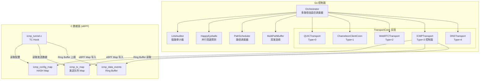
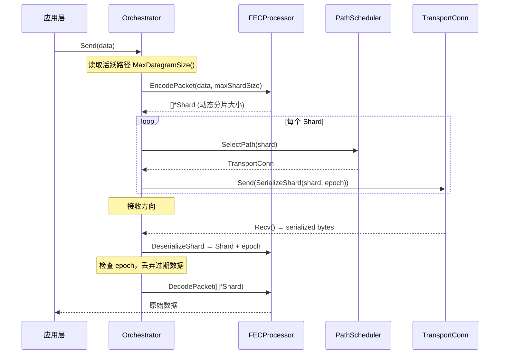
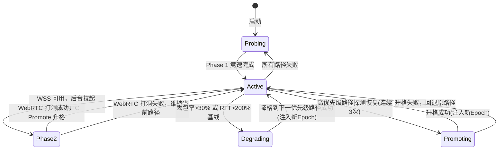
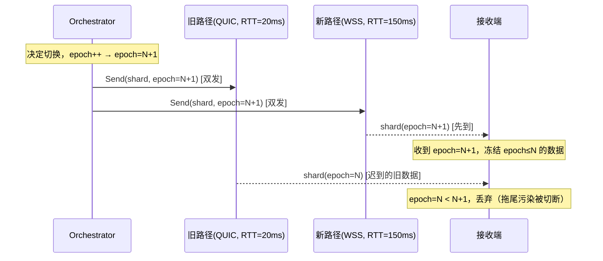

# 设计文档：多路径自适应传输（Multi-Path Adaptive Transport）

## 概述

本设计在现有 G-Tunnel 双通道架构（QUIC/UDP + WSS/TCP）基础上，扩展三种极端环境生存协议（WebRTC DataChannel、ICMP Tunnel、DNS Tunnel），并构建统一的多路径自适应调度器（Orchestrator）。

核心设计决策：
- **Orchestrator 替代 TransportManager**：将现有串行降级逻辑（ConnectWithFallback）重构为并发竞速 + 优先级调度
- **ICMP 数据面走 eBPF TC Hook**：遵循 C 数据面 / Go 控制面分离架构，通过 eBPF Map 下发配置、Ring Buffer 上报数据
- **WebRTC / DNS 纯 Go 控制面**：无内核态操作需求，使用 pion/webrtc 和 miekg/dns 库
- **统一 TransportConn 接口**：Orchestrator 仅通过接口交互，不感知具体协议实现

## 架构

### 系统组件图



### 数据流



### Orchestrator 状态机



### Epoch Barrier 机制（解决双发选收乱序风暴）



ShardHeader 扩展：
```go
type ShardHeader struct {
    PacketID    uint64
    ShardID     uint8
    TotalData   uint8
    TotalParity uint8
    IsParity    uint8
    DataSize    uint16
    Epoch       uint32  // 新增：纪元标识，路径切换时递增
    Reserved    uint16
}
```

## 组件与接口

### 1. TransportType 扩展

```go
// TransportConn 统一传输连接接口
type TransportConn interface {
	// Send 发送原始 IP 包
	Send(data []byte) error
	// Recv 接收原始 IP 包
	Recv() ([]byte, error)
	// Close 关闭连接
	Close() error
	// Type 返回传输类型
	Type() TransportType
	// RTT 返回当前 RTT
	RTT() time.Duration
	// RemoteAddr 远端地址
	RemoteAddr() net.Addr
	// MaxDatagramSize 返回该传输协议单次 Send 可承载的最大字节数
	MaxDatagramSize() int
}
```

各协议 MaxDatagramSize 参考值：
| 协议 | MaxDatagramSize | 约束来源 |
|------|----------------|---------|
| QUIC | 1200 | QUIC Initial Packet 最小 MTU |
| WSS | 65535 | WebSocket Frame 上限 |
| WebRTC | 16384 | SCTP DataChannel 默认 |
| ICMP | 1024 | ICMP Payload 实际可用 |
| DNS | 110 | RFC 1035 Label 63B × 多 Label - Base32 膨胀 |
```

### 2. Orchestrator（替代 TransportManager）

```go
// orchestrator.go — 新文件
type Orchestrator struct {
    mu            sync.RWMutex
    activePath    *ManagedPath
    paths         map[TransportType]*ManagedPath
    priorities    []PriorityLevel
    auditor       *LinkAuditor
    scheduler     *PathScheduler
    fec           *FECProcessor
    mpBuffer      *MultiPathBuffer
    config        OrchestratorConfig
    state         OrchestratorState
    epoch         uint32          // 当前纪元号，每次路径切换递增
    probeTicker   *time.Ticker
    stopCh        chan struct{}
    onStateChange func(old, new OrchestratorState)
    wssConn       TransportConn   // WSS 连接引用，用于 WebRTC Phase 2 信令
}

type OrchestratorState uint8
const (
    StateProbing   OrchestratorState = 0
    StateActive    OrchestratorState = 1
    StateDegrading OrchestratorState = 2
    StatePromoting OrchestratorState = 3
)

type ManagedPath struct {
    Conn         TransportConn
    Priority     PriorityLevel
    Enabled      bool
    Available    bool
    ProbeSuccess int  // 连续探测成功次数
    BaselineRTT  time.Duration
    Phase        int  // 竞速阶段：1=Phase1(无依赖), 2=Phase2(有依赖)
}

type PriorityLevel uint8
const (
    PriorityQUIC   PriorityLevel = 0 // 最高
    PriorityWebRTC PriorityLevel = 1
    PriorityWSS    PriorityLevel = 2
    PriorityICMP   PriorityLevel = 3 // 最低（与 DNS 同级）
    PriorityDNS    PriorityLevel = 3
)

// 核心方法
func (o *Orchestrator) Start(ctx context.Context) error                // 分阶段 HappyEyeballs
func (o *Orchestrator) Send(data []byte) error                         // 通过活跃路径发送
func (o *Orchestrator) Recv() ([]byte, error)                          // 从活跃路径接收
func (o *Orchestrator) Close() error
func (o *Orchestrator) demote() error                                  // 降格（带 Epoch Barrier）
func (o *Orchestrator) promote(target TransportType) error             // 升格（带 Epoch Barrier）
func (o *Orchestrator) probeLoop(ctx context.Context)                  // 心跳探测循环
func (o *Orchestrator) happyEyeballsPhase1(ctx context.Context) error  // Phase 1: 无依赖协议竞速
func (o *Orchestrator) happyEyeballsPhase2(ctx context.Context)        // Phase 2: WebRTC 后台拉起
func (o *Orchestrator) nextEpoch() uint32                              // 递增并返回新 Epoch
func (o *Orchestrator) notifyFECMTU(conn TransportConn)                // 通知 FEC 调整分片大小
```

### 3. LinkAuditor（链路审计器）

```go
// link_auditor.go — 新文件
type LinkAuditor struct {
    mu          sync.RWMutex
    metrics     map[TransportType]*PathMetrics
    thresholds  AuditThresholds
    onDegrade   func(TransportType, *PathMetrics) // 劣化回调
}

type PathMetrics struct {
    RTT         time.Duration
    BaselineRTT time.Duration
    LossRate    float64
    Jitter      time.Duration
    LastUpdate  time.Time
    SampleCount int64
}

type AuditThresholds struct {
    MaxLossRate    float64       // 默认 0.30 (30%)
    MaxRTTMultiple float64       // 默认 2.0 (200% 基线)
    WindowSize     time.Duration // 滑动窗口大小
}

func (la *LinkAuditor) RecordSample(t TransportType, rtt time.Duration, lost bool)
func (la *LinkAuditor) ShouldDegrade(t TransportType) bool
func (la *LinkAuditor) GetMetrics(t TransportType) *PathMetrics
```

### 4. WebRTCTransport

```go
// webrtc_transport.go — 新文件
type WebRTCTransport struct {
    pc       *webrtc.PeerConnection
    dc       *webrtc.DataChannel
    recvChan chan []byte
    rtt      time.Duration
    mu       sync.RWMutex
    ctx      context.Context
    cancel   context.CancelFunc
}

// 通过现有 WSS 通道交换 SDP 信令
type SDPSignaler interface {
    SendOffer(offer webrtc.SessionDescription) error
    RecvAnswer() (webrtc.SessionDescription, error)
    SendCandidate(candidate webrtc.ICECandidateInit) error
    RecvCandidate() (webrtc.ICECandidateInit, error)
}

func NewWebRTCTransport(signaler SDPSignaler) (*WebRTCTransport, error)
func (w *WebRTCTransport) Send(data []byte) error
func (w *WebRTCTransport) Recv() ([]byte, error)
func (w *WebRTCTransport) Close() error
func (w *WebRTCTransport) Type() TransportType  // 返回 TransportWebRTC (2)
func (w *WebRTCTransport) RTT() time.Duration
func (w *WebRTCTransport) RemoteAddr() net.Addr
func (w *WebRTCTransport) MaxDatagramSize() int // 返回 16384
```

### 5. ICMPTransport（Go 控制面 + C 数据面）

```go
// icmp_transport.go — 新文件（Go 控制面）
type ICMPTransport struct {
    loader     *ebpf.Loader
    configMap  *ebpf.Map  // icmp_config_map: Go → C
    txMap      *ebpf.Map  // icmp_tx_map: Go → C 发送队列
    rxReader   *ringbuf.Reader // icmp_data_events: C → Go
    recvChan   chan []byte
    rtt        time.Duration
    remoteAddr net.Addr
    mu         sync.RWMutex
    ctx        context.Context
    cancel     context.CancelFunc
}

func NewICMPTransport(loader *ebpf.Loader, remoteIP net.IP) (*ICMPTransport, error)
func (i *ICMPTransport) Send(data []byte) error    // 写入 icmp_tx_map
func (i *ICMPTransport) Recv() ([]byte, error)     // 从 Ring Buffer 读取
func (i *ICMPTransport) Close() error              // 清理 eBPF 资源
func (i *ICMPTransport) Type() TransportType       // 返回 TransportICMP (3)
func (i *ICMPTransport) RTT() time.Duration
func (i *ICMPTransport) RemoteAddr() net.Addr
func (i *ICMPTransport) MaxDatagramSize() int      // 返回 1024
```

### 6. DNSTransport

```go
// dns_transport.go — 新文件
type DNSTransport struct {
    domain    string       // 权威域名（如 t.example.com）
    resolver  string       // DNS 服务器地址
    recvChan  chan []byte
    rtt       time.Duration
    mu        sync.RWMutex
    ctx       context.Context
    cancel    context.CancelFunc
}

func NewDNSTransport(domain, resolver string) (*DNSTransport, error)
func (d *DNSTransport) Send(data []byte) error    // Base32 编码为子域名查询
func (d *DNSTransport) Recv() ([]byte, error)     // 从 TXT/CNAME 记录解码
func (d *DNSTransport) Close() error
func (d *DNSTransport) Type() TransportType       // 返回 TransportDNS (4)
func (d *DNSTransport) RTT() time.Duration
func (d *DNSTransport) RemoteAddr() net.Addr
func (d *DNSTransport) MaxDatagramSize() int      // 返回 ~110 字节（受 RFC 1035 约束）

// 网关侧权威 DNS 服务器
type DNSServer struct {
    domain   string
    listener net.PacketConn
    sessions map[string]*DNSSession
    onRecv   func(clientID string, data []byte)
}

func NewDNSServer(domain string, listenAddr string) (*DNSServer, error)
func (s *DNSServer) Start() error
func (s *DNSServer) SendToClient(clientID string, data []byte) error
func (s *DNSServer) Stop() error
```

### 7. ICMP eBPF 数据面（C）

```c
// bpf/icmp_tunnel.c — 新文件

/* ICMP Tunnel 配置（Go → C） */
struct icmp_config {
    __u32 enabled;          // 是否启用
    __u32 target_ip;        // 目标 IP（网络字节序）
    __u32 gateway_ip;       // 网关 IP
    __u16 identifier;       // ICMP Identifier（会话标识）
    __u16 reserved;
};

/* ICMP 发送队列条目（Go → C） */
struct icmp_tx_entry {
    __u32 seq;              // 序列号
    __u16 data_len;         // 数据长度
    __u16 reserved;
    __u8  data[1024];       // 加密后的 Payload
};

/* ICMP 接收事件（C → Go） */
struct icmp_rx_event {
    __u64 timestamp;
    __u32 src_ip;
    __u16 identifier;
    __u16 seq;
    __u16 data_len;
    __u16 reserved;
    __u8  data[1024];       // 提取的 Payload
};

// eBPF Maps
struct { ... } icmp_config_map SEC(".maps");     // HASH, Go → C
struct { ... } icmp_tx_map SEC(".maps");         // QUEUE, Go → C
struct { ... } icmp_data_events SEC(".maps");    // RINGBUF, C → Go

// TC egress: 构造 ICMP Echo Request
SEC("tc") int icmp_tunnel_egress(struct __sk_buff *skb);

// TC ingress: 截获 ICMP Echo Reply
SEC("tc") int icmp_tunnel_ingress(struct __sk_buff *skb);
```

## 数据模型

### OrchestratorConfig

```go
type OrchestratorConfig struct {
    // 协议启用开关
    EnableQUIC   bool
    EnableWSS    bool
    EnableWebRTC bool
    EnableICMP   bool
    EnableDNS    bool

    // 探测参数
    ProbeCycle         time.Duration // 默认 30s
    ProbeCycleLevel3   time.Duration // Level 3 时缩短为 15s
    PromoteThreshold   int           // 连续成功次数，默认 3

    // 降格阈值
    DemoteLossRate     float64       // 默认 0.30
    DemoteRTTMultiple  float64       // 默认 2.0

    // 双发选收
    DualSendDuration   time.Duration // 默认 100ms

    // 各协议独立配置
    QUICConfig   QUICTransportConfig
    WSSConfig    ChameleonDialConfig
    WebRTCConfig WebRTCTransportConfig
    ICMPConfig   ICMPTransportConfig
    DNSConfig    DNSTransportConfig
}
```

### WebRTCTransportConfig

```go
type WebRTCTransportConfig struct {
    ICEServers     []webrtc.ICEServer
    Ordered        bool          // DataChannel 是否有序，默认 false
    MaxRetransmits *uint16       // 最大重传次数，nil = 不可靠模式
}
```

### ICMPTransportConfig

```go
type ICMPTransportConfig struct {
    TargetIP    net.IP
    GatewayIP   net.IP
    Identifier  uint16        // ICMP 会话标识
    MaxPayload  int           // 单包最大 Payload，默认 1024
}
```

### DNSTransportConfig

```go
type DNSTransportConfig struct {
    Domain       string        // 权威域名
    Resolver     string        // DNS 服务器地址
    QueryType    uint16        // dns.TypeTXT 或 dns.TypeCNAME
    MaxLabelLen  int           // 子域名最大长度，默认 63
}
```

### gateway.yaml 配置扩展

```yaml
gtunnel:
  enabled: true
  path_count: 3
  fec_ratio: 1.2
  reorder_buffer: 256
  
  # 新增：Orchestrator 配置
  orchestrator:
    probe_cycle: 30s
    probe_cycle_level3: 15s
    promote_threshold: 3
    demote_loss_rate: 0.30
    demote_rtt_multiple: 2.0
    dual_send_duration: 100ms
  
  # 新增：各传输协议配置
  transports:
    quic:
      enabled: true
      addr: "gateway.example.com:443"
      timeout: 3s
    wss:
      enabled: true
      endpoint: "wss://gateway.example.com:443/api/v2/stream"
      sni: "cdn.cloudflare.com"
    webrtc:
      enabled: true
      ice_servers:
        - urls: ["stun:stun.l.google.com:19302"]
      ordered: false
    icmp:
      enabled: false
      target_ip: "198.51.100.1"
      gateway_ip: "203.0.113.1"
      identifier: 0x4D52
    dns:
      enabled: false
      domain: "t.example.com"
      resolver: "8.8.8.8:53"
      query_type: "TXT"
```

### ICMP eBPF Map 与 Go 结构体对齐

```go
// Go 侧（pkg/ebpf/types.go 扩展）
type ICMPConfig struct {
    Enabled   uint32
    TargetIP  uint32  // 网络字节序
    GatewayIP uint32
    Identifier uint16
    Reserved  uint16
}

type ICMPTxEntry struct {
    Seq      uint32
    DataLen  uint16
    Reserved uint16
    Data     [1024]byte
}

type ICMPRxEvent struct {
    Timestamp  uint64
    SrcIP      uint32
    Identifier uint16
    Seq        uint16
    DataLen    uint16
    Reserved   uint16
    Data       [1024]byte
}
```


## 正确性属性（Correctness Properties）

*属性（Property）是在系统所有合法执行中都应成立的特征或行为——本质上是对系统行为的形式化陈述。属性是人类可读规格说明与机器可验证正确性保证之间的桥梁。*

### Property 1: Shard 序列化往返一致性

*For any* 合法的 Shard 对象和任意 packetID，执行 `SerializeShard(shard, packetID)` 后再执行 `DeserializeShard`，应还原出等价的 Shard 对象（Index、Data、IsParity 一致）和相同的 packetID。

**Validates: Requirements 8.3, 8.4**

### Property 2: DNS Base32 编码往返一致性

*For any* 长度不超过 DNS 子域名限制的字节切片，将其 Base32 编码为子域名后再解码，应还原出原始字节切片。

**Validates: Requirements 3.2**

### Property 3: HappyEyeballs Phase 1 不包含 WebRTC

*For any* 传输协议启用/禁用配置组合，HappyEyeballs Phase 1 实际探测的协议集合中不应包含 WebRTC，即使 WebRTC 已启用。

**Validates: Requirements 1.4, 5.2**

### Property 4: HappyEyeballs Phase 1 选择最快协议

*For any* 一组启用的 mock TransportConn（排除 WebRTC，各自具有随机正延迟），Phase 1 竞速完成后选择的协议应为延迟最小的那个。

**Validates: Requirements 5.5**

### Property 5: 降格判定阈值正确性

*For any* PathMetrics（随机丢包率 0.0~1.0、随机 RTT、随机 baselineRTT），`LinkAuditor.ShouldDegrade` 返回 true 当且仅当 `lossRate > demoteLossRate` 或 `rtt > demoteRTTMultiple * baselineRTT`。

**Validates: Requirements 5.8**

### Property 6: 升格判定连续成功计数

*For any* 布尔值探测结果序列，升格触发当且仅当序列中存在连续 ≥ `promoteThreshold` 个 true 值。

**Validates: Requirements 6.2**

### Property 7: 禁用协议跳过探测

*For any* 传输协议启用/禁用配置组合，Orchestrator 实际探测的协议集合应严格等于配置中启用的协议集合。

**Validates: Requirements 9.4**

### Property 8: 缺失配置使用默认值

*For any* 部分 OrchestratorConfig（随机缺失某些传输协议配置段），解析后缺失字段的值应等于该协议的默认配置值。

**Validates: Requirements 9.5**

### Property 9: Epoch Barrier 切断拖尾污染

*For any* 双发选收场景（旧路径 epoch=N，新路径 epoch=N+1），接收端收到 epoch=N+1 的 Shard 后，所有后续到达的 epoch≤N 的 Shard 应被丢弃，不进入 FEC 解码流水线。

**Validates: Requirements 5.9**

### Property 10: 动态 MTU 约束分片大小

*For any* TransportConn 实现，FECProcessor 生成的每个 Shard 序列化后的字节长度 SHALL 不超过该 TransportConn 的 MaxDatagramSize() 返回值。

**Validates: Requirements 4.7**

## 错误处理

| 场景 | 处理策略 |
|------|---------|
| QUIC 连接超时 | Orchestrator 降格到下一优先级路径 |
| WebRTC SDP 交换失败 | 标记 WebRTC 不可用，跳过该优先级 |
| WebRTC DataChannel 断开 | Recv 返回 `io.EOF`，触发降格 |
| ICMP eBPF 加载失败 | 标记 ICMP 不可用，降级运行（非 critical） |
| ICMP eBPF Map 无匹配配置 | C 数据面返回 `TC_ACT_OK` 放行 |
| ICMP 通道不可达 | Go 控制面返回错误，释放 eBPF 资源 |
| DNS 查询超时 | 返回明确错误，重试或降格 |
| DNS 解析失败 | 返回错误信息，标记 DNS 不可用 |
| 所有路径失败 | Orchestrator 回到 Probing 状态，重新探测 |
| 升格过程中新路径失败 | 立即回退原路径，重置探测计数器 |
| Ring Buffer 满 | C 数据面丢弃事件（`bpf_ringbuf_reserve` 返回 NULL） |
| DeserializeShard 数据过短 | 返回明确错误，丢弃该分片 |
| 配置文件缺失协议段 | 使用默认配置值 |
| CAP_NET_RAW 权限不足 | ICMP 启动失败，标记不可用 |

## 测试策略

### 单元测试

- **Shard 序列化/反序列化**：验证 `SerializeShard` / `DeserializeShard` 的边界条件（空数据、最大分片、非法头部）
- **LinkAuditor 阈值判定**：验证具体丢包率和 RTT 值的降格/不降格决策
- **DNS Base32 编码**：验证特定输入的编码输出
- **TransportType 常量**：验证五个枚举值正确
- **OrchestratorConfig 默认值**：验证各协议默认配置
- **探测周期切换**：验证 Level 3 时周期缩短为 15s

### 属性测试（Property-Based Testing）

使用 `pgregory.net/rapid` 库（Go 生态成熟的 PBT 库）。

每个属性测试最少运行 100 次迭代，每个测试标注对应的设计属性：

```go
// Feature: multi-path-adaptive-transport, Property 1: Shard 序列化往返一致性
func TestProperty_ShardRoundTrip(t *testing.T) { ... }

// Feature: multi-path-adaptive-transport, Property 2: DNS Base32 编码往返一致性
func TestProperty_DNSBase32RoundTrip(t *testing.T) { ... }

// Feature: multi-path-adaptive-transport, Property 3: HappyEyeballs Phase 1 不包含 WebRTC
func TestProperty_Phase1ExcludesWebRTC(t *testing.T) { ... }

// Feature: multi-path-adaptive-transport, Property 4: HappyEyeballs Phase 1 选择最快协议
func TestProperty_HappyEyeballsSelectsFastest(t *testing.T) { ... }

// Feature: multi-path-adaptive-transport, Property 5: 降格判定阈值正确性
func TestProperty_DemoteThreshold(t *testing.T) { ... }

// Feature: multi-path-adaptive-transport, Property 6: 升格判定连续成功计数
func TestProperty_PromoteConsecutiveSuccess(t *testing.T) { ... }

// Feature: multi-path-adaptive-transport, Property 7: 禁用协议跳过探测
func TestProperty_DisabledProtocolsSkipped(t *testing.T) { ... }

// Feature: multi-path-adaptive-transport, Property 8: 缺失配置使用默认值
func TestProperty_MissingConfigUsesDefaults(t *testing.T) { ... }

// Feature: multi-path-adaptive-transport, Property 9: Epoch Barrier 切断拖尾污染
func TestProperty_EpochBarrierDropsStale(t *testing.T) { ... }

// Feature: multi-path-adaptive-transport, Property 10: 动态 MTU 约束分片大小
func TestProperty_DynamicMTUConstraint(t *testing.T) { ... }
```

### 集成测试

- **ICMP eBPF 加载与通信**：验证 icmp_tunnel.c 加载、Map 写入、Ring Buffer 读取
- **WebRTC 端到端**：验证 SDP 交换 → DataChannel 建立 → 数据传输
- **DNS 端到端**：验证 DNS 查询 → 权威服务器响应 → 数据解码
- **Orchestrator 降格/升格流程**：模拟路径劣化触发降格，恢复触发升格
- **HappyEyeballs 并行探测**：验证多协议并发竞速

### 性能测试

- **ICMP eBPF 延迟**：使用 `bpftrace` 验证单包处理 < 1ms
- **Go 控制面响应**：使用 `pprof` 验证 Orchestrator 决策 < 100ms
