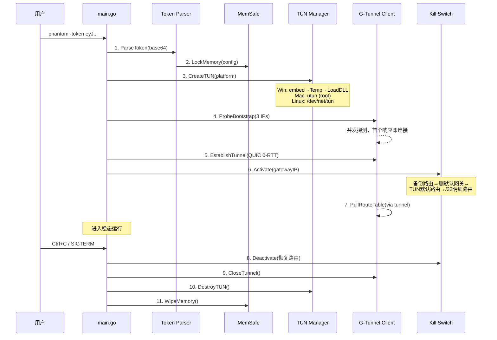
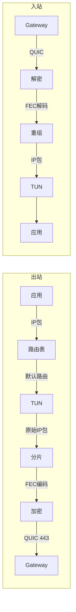

# 设计文档：Phase 5 — Phantom Client 用户端安全隧道

## 概述

本设计覆盖 Phantom Client 的五个子系统：
- **核心基建**：跨平台 TUN 管理、单文件编译、生命周期管理
- **路由暴力劫持**：Kill Switch、默认网关删除/重建、/32 白名单注入
- **内存态鉴权与配置**：Token 解析、Secure Buffer、Bootstrap 故障转移
- **G-Tunnel 客户端栈**：FEC 对称编解码、重叠采样、QUIC 传输、双向转发
- **反取证与伪装**：Version Info 注入、图标伪装、代码签名、行为白名单化

设计约束：
- 纯 Go 静态编译，`CGO_ENABLED=0`，不涉及 eBPF/XDP/TC
- 配置不落地，所有敏感数据仅存在于进程内存（mlock + 零覆盖）
- Fail-Closed Kill Switch，崩溃即断网
- 行为白名单化，不触发 EDR
- G-Tunnel 传输层与 Gateway 对称实现（FEC + 重叠采样）

## 架构

### 整体定位

```
用户宿主机                              服务端
┌────────────────────────────┐        ┌──────────────────────────┐
│  应用程序 (浏览器/工具)      │        │   Mirage-Gateway          │
│         ↓                   │        │   eBPF 数据面 (C)         │
│  系统路由表 → TUN 网卡       │        │   Go 控制面               │
│         ↓                   │        │   NPM/B-DNA/Jitter/VPC   │
│  Phantom Client (Go)       │──G-Tunnel──→ G-Switch/Cortex      │
│   ├─ TUN Manager           │ QUIC/UDP │                         │
│   ├─ G-Tunnel Client       │  443    │                         │
│   ├─ FEC Codec (纯 Go)     │        │                         │
│   ├─ Kill Switch           │        │                         │
│   └─ Secure Buffer         │        │                         │
└────────────────────────────┘        └──────────────────────────┘
```

### 模块依赖关系

```mermaid
graph TD
    MAIN[cmd/phantom/main.go] --> TOKEN[pkg/token]
    MAIN --> TUN[pkg/tun]
    MAIN --> GT[pkg/gtclient]
    MAIN --> KS[pkg/killswitch]
    MAIN --> MEM[pkg/memsafe]

    TOKEN -->|BootstrapConfig| GT
    TOKEN -->|Gateway IPs| KS
    MEM -->|内存锁定/擦除| TOKEN

    GT -->|连接状态/当前 GW IP| KS
    GT -->|动态路由表| GT
    TUN -->|IP 包读写| GT

    subgraph 维度一：核心基建
        TUN
        MAIN
    end

    subgraph 维度二：路由劫持
        KS
    end

    subgraph 维度三：内存态配置
        TOKEN
        MEM
    end

    subgraph 维度四：数据面
        GT
    end
```

### 启动序列



### 数据流




## 组件与接口

### 维度一：核心基建

#### pkg/tun — 跨平台 TUN 管理

```go
// TUNDevice 跨平台 TUN 接口
type TUNDevice interface {
    Read(buf []byte) (int, error)
    Write(buf []byte) (int, error)
    Name() string
    MTU() int
    Close() error
}

// CreateTUN 工厂函数，自动检测平台
func CreateTUN(name string, mtu int) (TUNDevice, error)

// CleanupStale 清理上次崩溃残留（Windows Wintun DLL）
func CleanupStale()
```

**tun_windows.go — Wintun 实现**：

```go
//go:embed wintun.dll
var wintunDLL []byte

type WintunDevice struct {
    adapter  uintptr
    session  uintptr
    dllPath  string
    dllDir   string
    name     string
    mtu      int
}

// 创建流程：
// 1. os.MkdirTemp() → 随机临时目录
// 2. 写入 wintun.dll
// 3. windows.LoadDLL() 加载
// 4. WintunCreateAdapter() 创建适配器
// 5. WintunStartSession() 启动会话
// 6. defer: Close → CloseAdapter → FreeLibrary → 删文件/目录
```

**tun_darwin.go — utun 实现**：

```go
type UtunDevice struct {
    fd   int
    name string // utun0, utun1, ...
    mtu  int
}

// 创建流程：
// 1. socket(PF_SYSTEM, SOCK_DGRAM, SYSPROTO_CONTROL)
// 2. connect() → com.apple.net.utun_control
// 3. getsockopt() → 获取分配的 utun 名称
// 4. ifconfig 设置 IP 和 MTU
```

**tun_linux.go — /dev/net/tun 实现**：

```go
type LinuxTUNDevice struct {
    fd   int
    name string
    mtu  int
}

// 创建流程：
// 1. open("/dev/net/tun")
// 2. ioctl(TUNSETIFF, IFF_TUN | IFF_NO_PI)
// 3. ip link set <name> up
// 4. ip addr add 10.7.0.2/24 dev <name>
```

#### cmd/phantom/main.go — 主程序

```go
func main() {
    // 解析命令行
    token := parseArgs() // -token <base64> 或 stdin

    // 1. Token 解析 + 内存安全
    config, err := token.ParseToken(tokenStr)
    if err != nil { fatal("Invalid token") }

    // 2. 清理残留 + 创建 TUN
    tun.CleanupStale()
    device, err := tun.CreateTUN("mirage0", 1400)
    if err != nil { memsafe.WipeAll(); fatal(err) }

    // 3. Bootstrap 探测 + G-Tunnel 建立
    client := gtclient.NewGTunnelClient(config)
    err = client.ProbeAndConnect(ctx, config.BootstrapPool)
    // 失败 → 重试循环

    // 4. Kill Switch 激活
    ks := killswitch.NewKillSwitch(device.Name())
    err = ks.Activate(client.CurrentGateway().IP)
    if err != nil { client.Close(); device.Close(); fatal(err) }

    // 5. 拉取动态路由表
    client.PullRouteTable(ctx)

    // 6. 双向转发
    go forwardTUNToTunnel(device, client)
    go forwardTunnelToTUN(client, device)

    // 7. Gateway 切换监听
    client.OnGatewaySwitch(func(newIP string) {
        ks.UpdateGatewayRoute(newIP)
    })

    // 8. 等待退出信号
    waitForSignal()

    // 9. 优雅关闭（逆序，30s 超时）
    ks.Deactivate()
    client.Close()
    device.Close()
    memsafe.WipeAll()
}
```

### 维度二：路由暴力劫持

#### pkg/killswitch — Fail-Closed 路由劫持

```go
type KillSwitch struct {
    originalGW    string // 备份的原始默认网关 IP
    originalIface string // 原始网关接口
    tunName       string
    gatewayIP     string // 当前 Gateway IP
    activated     bool
    mu            sync.Mutex
    platform      Platform
}

// Platform 平台路由操作抽象
type Platform interface {
    GetDefaultGateway() (ip, iface string, err error)
    DeleteDefaultRoute() error
    AddDefaultRoute(tunName string) error
    AddHostRoute(ip, gateway, iface string) error
    DeleteHostRoute(ip string) error
    RestoreDefaultRoute(gateway, iface string) error
}

func NewKillSwitch(tunName string) *KillSwitch

// Activate 激活 Kill Switch（4 步序列）
func (ks *KillSwitch) Activate(gatewayIP string) error

// UpdateGatewayRoute 原子更新（先加新再删旧，无空窗）
func (ks *KillSwitch) UpdateGatewayRoute(newGatewayIP string) error

// Deactivate 恢复原始路由
func (ks *KillSwitch) Deactivate() error

func (ks *KillSwitch) IsActivated() bool
```

**平台实现**：

| 平台 | 删默认路由 | 加 TUN 默认路由 | 加 /32 明细路由 |
|------|-----------|----------------|----------------|
| Windows | `route delete 0.0.0.0` | `route add 0.0.0.0 mask 0.0.0.0 <tun_gw> if <tun_idx>` | `route add <ip>/32 <orig_gw>` |
| macOS | `route delete default` | `route add default -interface <tun>` | `route add -host <ip> <orig_gw>` |
| Linux | `ip route del default` | `ip route add default dev <tun>` | `ip route add <ip>/32 via <orig_gw>` |

### 维度三：内存态鉴权与配置

#### pkg/memsafe — 安全内存管理

```go
type SecureBuffer struct {
    data   []byte
    locked bool
    mu     sync.Mutex
}

func NewSecureBuffer(size int) (*SecureBuffer, error)
func (sb *SecureBuffer) Write(data []byte) error
func (sb *SecureBuffer) Read() []byte
func (sb *SecureBuffer) Wipe()  // 逐字节零覆盖 + munlock

// 全局注册表
var registry []*SecureBuffer
func WipeAll() // 擦除所有已注册的 SecureBuffer
```

#### pkg/token — Bootstrap Token 解析

```go
type BootstrapConfig struct {
    BootstrapPool   []GatewayEndpoint
    AuthKey         []byte
    PreSharedKey    []byte
    CertFingerprint string
    UserID          string
    ExpiresAt       time.Time
}

type GatewayEndpoint struct {
    IP     string
    Port   int
    Region string
}

// ParseToken Base64 解码 → ChaCha20 解密 → JSON 反序列化 → mlock
func ParseToken(token string) (*BootstrapConfig, error)

// TokenToBase64 序列化（服务端生成用）
func TokenToBase64(config *BootstrapConfig, key []byte) (string, error)
```

### 维度四：G-Tunnel 客户端栈

#### pkg/gtclient — G-Tunnel 客户端

```go
type GTunnelClient struct {
    conn       quic.Connection
    fec        *FECCodec
    sampler    *OverlapSampler
    routeTable *RouteTable
    currentGW  GatewayEndpoint
    mu         sync.RWMutex
}

func NewGTunnelClient(config *BootstrapConfig) *GTunnelClient

// ProbeAndConnect 并发探测 3 节点，首个响应即连接
func (c *GTunnelClient) ProbeAndConnect(ctx context.Context, pool []GatewayEndpoint) error

// Send TUN→分片→FEC→加密→QUIC
func (c *GTunnelClient) Send(packet []byte) error

// Receive QUIC→解密→FEC→重组→TUN
func (c *GTunnelClient) Receive() ([]byte, error)

// PullRouteTable 通过隧道拉取动态节点列表
func (c *GTunnelClient) PullRouteTable(ctx context.Context) error

// Reconnect 故障转移（< 5s）
func (c *GTunnelClient) Reconnect(ctx context.Context) error

func (c *GTunnelClient) CurrentGateway() GatewayEndpoint
func (c *GTunnelClient) OnGatewaySwitch(fn func(newIP string))
func (c *GTunnelClient) Close() error
```

#### pkg/gtclient/fec.go — 纯 Go FEC

```go
type FECCodec struct {
    dataShards   int // 8
    parityShards int // 4
    enc          reedsolomon.Encoder
}

func NewFECCodec(data, parity int) (*FECCodec, error)
func (f *FECCodec) Encode(data []byte) ([][]byte, error)
func (f *FECCodec) Decode(shards [][]byte) ([]byte, error)
```

#### pkg/gtclient/sampler.go — 重叠采样

```go
type OverlapSampler struct {
    ChunkSize   int // 400
    OverlapSize int // 100
}

type Fragment struct {
    Data      []byte
    SeqNum    int
    OverlapID uint32
}

func (s *OverlapSampler) Split(data []byte) []Fragment
func (s *OverlapSampler) Reassemble(fragments []Fragment) ([]byte, error)
```

#### RouteTable — 内存动态路由表

```go
type RouteTable struct {
    nodes   []GatewayEndpoint
    mu      sync.RWMutex
    updated time.Time
}

func (rt *RouteTable) Update(nodes []GatewayEndpoint)
func (rt *RouteTable) NextAvailable(exclude string) (GatewayEndpoint, error)
func (rt *RouteTable) Count() int
```

### 维度五：反取证与伪装

#### 构建时元数据注入

**Windows Version Info（go-winres）**：

```json
{
    "RT_VERSION": {
        "#1": {
            "0000": {
                "CompanyName": "Contoso Enterprise Solutions",
                "FileDescription": "Enterprise Sync Agent",
                "ProductName": "Contoso Sync",
                "FileVersion": "3.2.1.0",
                "LegalCopyright": "© 2026 Contoso Inc."
            }
        }
    },
    "RT_GROUP_ICON": {
        "#1": "assets/app.ico"
    }
}
```

**构建脚本签名集成**：

```bash
# build.sh
# Windows
if [ -n "$SIGN_CERT" ]; then
    signtool sign /f "$SIGN_CERT" /p "$SIGN_PASS" \
        /tr http://timestamp.digicert.com /td sha256 phantom.exe
fi

# macOS
if [ -n "$APPLE_IDENTITY" ]; then
    codesign --sign "$APPLE_IDENTITY" --timestamp phantom
fi
```

## 数据模型

### Bootstrap Token 结构

| 字段 | 类型 | 说明 |
|------|------|------|
| BootstrapPool | []GatewayEndpoint | 3 个不同管辖区的 Gateway 入口 |
| AuthKey | []byte | Ed25519 私钥或会话密钥 |
| PreSharedKey | []byte | G-Tunnel 预共享密钥 |
| CertFingerprint | string | Gateway 证书 SHA-256 指纹 |
| UserID | string | 匿名用户标识 |
| ExpiresAt | time.Time | Token 过期时间 |

### G-Tunnel 客户端参数

| 参数 | 默认值 | 说明 |
|------|--------|------|
| ChunkSize | 400 bytes | 基础分片大小 |
| OverlapSize | 100 bytes | 重叠区域大小 |
| FEC DataShards | 8 | 数据分片数 |
| FEC ParityShards | 4 | 校验分片数 |
| QUIC MaxIdleTimeout | 30s | QUIC 空闲超时 |
| ReconnectTimeout | 5s | 故障转移超时 |
| BootstrapRetryInit | 2s | 初始重试间隔 |
| BootstrapRetryMax | 120s | 最大重试间隔 |

### Kill Switch 路由操作序列

| 阶段 | 操作 | 说明 |
|------|------|------|
| 激活 Step 1 | 备份默认网关 | 记录原始 gateway IP 和接口 |
| 激活 Step 2 | 删除默认路由 | 系统默认网关消失 |
| 激活 Step 3 | TUN 默认路由 | 所有流量进 TUN |
| 激活 Step 4 | /32 明细路由 | Gateway IP 走原始物理网关 |
| 切换 | 先加新再删旧 | 原子更新，无空窗 |
| 解除 | 恢复原始路由 | 删 TUN 路由 + 恢复默认网关 |

## 正确性属性

### Property 1: Token 解析往返一致性

*For any* 有效的 BootstrapConfig，TokenToBase64 序列化后再 ParseToken 反序列化 SHALL 产生等价的结构体（BootstrapPool 长度、AuthKey 内容、PreSharedKey 内容一致）。

**Validates: Requirements 6.1, 6.2**

### Property 2: 无效 Token 统一拒绝

*For any* 随机字节序列（非有效 Token），ParseToken SHALL 返回错误，且错误信息仅为 "Invalid token"。

**Validates: Requirements 6.5**

### Property 3: 内存擦除完整性

*For any* 写入 SecureBuffer 的数据，Wipe() 后底层内存 SHALL 全部为零字节。

**Validates: Requirements 7.2**

### Property 4: FEC 纠错能力

*For any* 原始数据和最多 parityShards 个丢失分片，FEC Decode SHALL 完整恢复原始数据。

**Validates: Requirements 9.5**

### Property 5: FEC 编解码往返一致性

*For any* 1 字节 - 64KB 的原始数据，FEC Encode 后 Decode（无丢失）SHALL 产生与原始数据相同的字节序列。

**Validates: Requirements 9.1**

### Property 6: 重叠采样分片重组一致性

*For any* 20 字节 - 65535 字节的 IP 包，Split 后 Reassemble SHALL 产生与原始 IP 包相同的字节序列。

**Validates: Requirements 9.1, 9.6**

### Property 7: Bootstrap Pool 探测活性

*For any* Bootstrap Pool 中至少 1 个节点可达，ProbeAndConnect SHALL 在有限时间内成功建立连接。

**Validates: Requirements 8.1**

### Property 8: Kill Switch 路由原子性

*For any* UpdateGatewayRoute 操作，在变更过程中任意时刻，系统路由表 SHALL 始终存在至少一条到 Gateway IP 的 /32 明细路由。

**Validates: Requirements 5.1**

### Property 9: 动态路由表内存隔离

*For any* RouteTable 更新操作，更新前后的节点列表 SHALL 仅存在于 Go 堆内存中，不触发文件系统写入。

**Validates: Requirements 8.5**

### Property 10: Token 一次性消费

*For any* 已被成功消费的 Token，再次使用同一 Token 连接 SHALL 被 Mirage_OS 拒绝。

**Validates: Requirements 6.7**

## 错误处理

### 分级错误策略

| 模块 | 错误类型 | 处理方式 |
|------|---------|---------|
| Token Parser | Token 无效/解密失败 | 输出 "Invalid token"，终止 |
| Token Parser | Token 过期 | 输出 "Token expired"，终止 |
| MemSafe | mlock 失败 | 告警，降级运行（仍执行零覆盖） |
| TUN Manager | 权限不足 | 输出权限要求，终止 |
| TUN Manager | Wintun DLL 加载失败 | 输出错误，终止 |
| TUN Manager | 残留清理失败 | 告警，继续启动 |
| GTunnel Client | 所有 Bootstrap 不可达 | 指数退避重试（2s→120s） |
| GTunnel Client | 当前 Gateway 断连 | 5s 内从路由表切换 |
| GTunnel Client | FEC 解码失败 | 丢弃该包，等待重传 |
| Kill Switch | 路由操作失败 | 拒绝启动隧道，终止 |
| Kill Switch | 恢复路由失败 | 输出手动恢复命令，强制退出 |
| main.go | SIGINT/SIGTERM | 优雅关闭（逆序），30s 超时 |

### 关键步骤 vs 非关键步骤

- 关键（失败终止）：Token 解析、TUN 创建、Kill Switch 激活
- 非关键（失败重试/降级）：Bootstrap 探测、路由表拉取、mlock

## 代码结构

```
phantom-client/
├── cmd/
│   └── phantom/
│       └── main.go
├── pkg/
│   ├── token/
│   │   ├── token.go
│   │   └── token_test.go
│   ├── memsafe/
│   │   ├── buffer.go
│   │   └── buffer_test.go
│   ├── tun/
│   │   ├── tun.go            # 接口 + 工厂
│   │   ├── tun_windows.go    # Wintun
│   │   ├── tun_darwin.go     # utun
│   │   ├── tun_linux.go      # /dev/net/tun
│   │   └── tun_test.go
│   ├── gtclient/
│   │   ├── client.go         # G-Tunnel 客户端
│   │   ├── fec.go            # 纯 Go FEC
│   │   ├── sampler.go        # 重叠采样
│   │   └── gtclient_test.go
│   └── killswitch/
│       ├── killswitch.go     # 核心逻辑
│       ├── route_windows.go
│       ├── route_darwin.go
│       ├── route_linux.go
│       └── killswitch_test.go
├── assets/
│   ├── app.ico               # Windows 图标
│   └── winres.json           # Version Info 配置
├── embed/
│   └── wintun.dll            # 微软签名 Wintun 驱动
├── go.mod
├── go.sum
├── build.sh
└── Makefile
```

## 编译与分发

### 交叉编译

```bash
# Windows (amd64)
CGO_ENABLED=0 GOOS=windows GOARCH=amd64 go build \
  -ldflags="-s -w -X main.Version=1.0.0 -X main.BuildTime=$(date -u +%Y%m%d%H%M%S)" \
  -o phantom.exe cmd/phantom/main.go

# macOS (arm64)
CGO_ENABLED=0 GOOS=darwin GOARCH=arm64 go build \
  -ldflags="-s -w" -o phantom cmd/phantom/main.go

# Linux (amd64)
CGO_ENABLED=0 GOOS=linux GOARCH=amd64 go build \
  -ldflags="-s -w" -o phantom cmd/phantom/main.go
```

## 测试策略

### 属性测试（Property-Based Testing）

使用 `pgregory.net/rapid`，每个属性最少 100 次迭代：

```go
// Feature: phantom-client, Property 1: Token 解析往返一致性
func TestProperty_TokenRoundTrip(t *testing.T) { ... }
```

覆盖范围：
- Property 1-2: pkg/token — Token 往返一致性、无效拒绝
- Property 3: pkg/memsafe — 内存擦除完整性
- Property 4-6: pkg/gtclient — FEC 纠错、FEC 往返、分片重组
- Property 8: pkg/killswitch — 路由原子性

### 单元测试

- Token：有效/无效/过期 Token
- TUN：各平台 mock 测试、CleanupStale
- FEC：边界条件（空数据、单字节、最大包 64KB）
- Kill Switch：激活/解除序列、路由操作 mock
- 内存擦除：Wipe 后全零验证

### 集成测试

- 端到端：TUN → G-Tunnel → 回环 → TUN
- 故障转移：模拟 Gateway 断连 → 自动切换
- Kill Switch：激活/解除后路由表状态验证