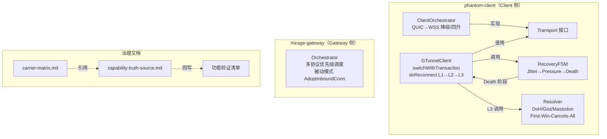
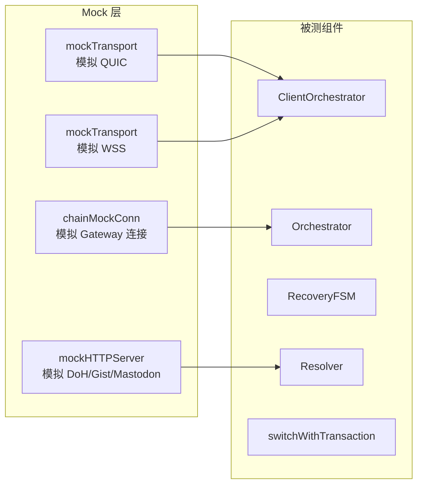

# 设计文档：Phase 1 链路连续性闭环

## 概述

本设计文档覆盖北极星实施计划 Phase 1（链路连续性闭环）的验证与证据沉淀方案。本 spec 不新增功能，只为现有代码补齐端到端测试、冻结承载矩阵、产出治理证据。

核心目标：
- M1：冻结承载矩阵文档
- M2：ClientOrchestrator QUIC→WSS 降级/回升 + Gateway Orchestrator 协议优先级端到端测试
- M3：RecoveryFSM + Resolver 节点阵亡恢复演练测试
- M4：switchWithTransaction 业务连续性样板测试
- M9（证据）：回写功能验证清单与 capability-truth-source

所有测试均使用 mock transport，不依赖真实 QUIC/WSS 连接。Property-based testing 使用 `pgregory.net/rapid`。

注意：mock 测试只能证明代码逻辑正确性，不能直接支撑治理状态升级。M2/M3/M4 各需额外产出受控演练脚本（drill script）、运行日志、复验命令和受控演练报告，作为 capability-truth-source 状态回写的证据。

## 架构

本 spec 涉及的组件关系如下：



### 测试架构

所有测试使用 mock transport 模式，不依赖真实网络连接：



## 组件与接口

### 1. ClientOrchestrator（M2 测试目标）

位置：`phantom-client/pkg/gtclient/client_orchestrator.go`

关键接口：
- `Connect(ctx) error` — 先尝试 QUIC，超时后降级到 WSS
- `ActiveType() string` — 返回当前活跃传输类型 "quic" / "wss"
- `SendDatagram(data) error` — 通过活跃传输发送
- `ReceiveDatagram(ctx) ([]byte, error)` — 从活跃传输接收
- `Close() error`

配置参数：
- `FallbackTimeout` — QUIC 拨号超时（构造默认值 3s，产品实际运行值 10s，由 ProbeAndConnect 传入）
- `ProbeInterval` — 降级后 QUIC 探测间隔（默认 30s）
- `PromoteThreshold` — 连续成功次数后回升（默认 3）

测试文件：`phantom-client/pkg/gtclient/client_orchestrator_test.go`（新建）

### 2. Gateway Orchestrator（M2 补充测试目标）

位置：`mirage-gateway/pkg/gtunnel/orchestrator.go`

关键接口：
- `AdoptInboundConn(conn, type)` — 接受入站连接
- `GetActiveType() TransportType` — 当前活跃路径类型
- `Send(data) error` — 通过活跃路径发送
- `StartPassive(ctx)` — 被动模式启动

优先级：QUIC(0) > WebRTC(1) > WSS(2) > ICMP(3) = DNS(3)

测试文件：`mirage-gateway/pkg/gtunnel/orchestrator_test.go`（扩展，已有测试基础）和 `mirage-gateway/pkg/gtunnel/orchestrator_integration_test.go`（扩展）

### 3. RecoveryFSM（M3 测试目标）

位置：`phantom-client/pkg/gtclient/recovery_fsm.go`

关键接口：
- `Evaluate(disconnectDuration) RecoveryPhase` — 纯函数，根据断连时长判定阶段
- `Execute(ctx, phase, client) (*RecoveryResult, error)` — 执行恢复流程

阶段边界：
- PhaseJitter: d < 5s
- PhasePressure: 5s ≤ d < 30s
- PhaseDeath: d ≥ 30s

测试文件：`phantom-client/pkg/gtclient/recovery_fsm_test.go`（新建）

### 4. Resolver（M3 补充测试目标）

位置：`phantom-client/pkg/resonance/resolver.go`

关键接口：
- `Resolve(ctx) (*ResolvedSignal, error)` — First-Win-Cancels-All 并发竞速
- `Stats() (attempts, successes, failures)` — 统计信息

三通道：DoH (DNS TXT)、GitHub Gist、Mastodon Hashtag

测试文件：`phantom-client/pkg/resonance/resolver_test.go`（扩展）

### 5. switchWithTransaction（M4 测试目标）

位置：`phantom-client/pkg/gtclient/client.go`

三阶段事务：
1. 同 IP 检查：newIP == oldIP → 直接 adoptConnection
2. PreAdd(newIP) → adoptConnection → Commit(oldIP, newIP)
3. PreAdd 失败 → 关闭新 engine，返回错误
4. 注意：switchRollbackFn 已注册但当前代码未调用，无 Commit 失败回滚路径

adoptConnection 行为：
- 若 transport 为 ClientOrchestrator：替换其内部 active 为新 QUICTransportAdapter，transport 本身不变
- 若无 Orchestrator：直接设置 transport = 新 QUICTransportAdapter

测试文件：`phantom-client/pkg/gtclient/business_continuity_test.go`（新建）

### 6. 承载矩阵文档（M1 产出）

位置：`docs/governance/carrier-matrix.md`（新建）

内容：五种承载协议（QUIC/WSS/WebRTC/ICMP/DNS）的当前状态、实现边界、降级参数。

## 数据模型

### 测试用 Mock 数据结构

```go
// mockTransport 用于 ClientOrchestrator 测试
type mockTransport struct {
    connected bool
    sendErr   error
    recvData  []byte
    closed    bool
}

// chainMockConn 用于 Gateway Orchestrator 测试（已存在）
type chainMockConn struct {
    ttype     gtunnel.TransportType
    sendCount int32
    recvData  chan []byte
}
```

### 承载矩阵数据结构

| 字段 | 说明 |
|------|------|
| 承载协议 | QUIC / WSS / WebRTC / ICMP / DNS |
| Gateway 侧状态 | Orchestrator 中的实现状态 |
| Client 侧状态 | ClientOrchestrator 中的实现状态 |
| 承诺等级 | 正式承诺 / 已接线待闭环 |
| 降级参数 | FallbackTimeout / ProbeInterval / PromoteThreshold |

## 正确性属性

*正确性属性（Correctness Property）是一种在系统所有合法执行路径上都应成立的行为特征，本质上是对系统行为的形式化陈述。属性是连接人类可读规格说明与机器可验证正确性保证之间的桥梁。*

### Property 1: RecoveryFSM.Evaluate 单调性与边界正确性

*For any* 两个非负断连时长 d1 和 d2，若 d1 < d2，则 Evaluate(d1) ≤ Evaluate(d2)（阶段值单调递增）。同时，对于任意非负 d：d < 5s → PhaseJitter，5s ≤ d < 30s → PhasePressure，d ≥ 30s → PhaseDeath。

**Validates: Requirements 5.1, 5.2, 5.3, 5.7**

### Property 2: ClientOrchestrator 降级正确性

*For any* ClientOrchestrator 配置，当 QUIC dial 总是失败且 WSS dial 成功时，Connect 完成后 ActiveType 应为 "wss"。

**Validates: Requirements 2.1**

### Property 3: ClientOrchestrator 回升正确性

*For any* PromoteThreshold 值 N（1 ≤ N ≤ 10），当 ClientOrchestrator 处于 WSS 降级状态且 QUIC 探测连续成功达到 N 次时，ActiveType 应变为 "quic"。

**Validates: Requirements 2.3**

### Property 4: Orchestrator 优先级排序

*For any* 协议接入顺序的排列组合，AdoptInboundConn 完成后，GetActiveType 应始终返回已接入协议中优先级最高的类型（QUIC=0 > WebRTC=1 > WSS=2 > ICMP=3 = DNS=3）。

**Validates: Requirements 3.1, 3.2**

### Property 5: Orchestrator Send 路由正确性

*For any* 已注入多个 mock 连接的 Orchestrator，Send(data) 应仅增加活跃路径 mock 的 sendCount，非活跃路径的 sendCount 应保持不变。

**Validates: Requirements 3.5**

### Property 6: Resolver First-Win 竞速

*For any* 至少有一个通道成功的 Resolver 配置，Resolve 应返回成功结果（非 error），且返回的 ResolvedSignal 包含有效的 Gateways 列表和 Channel 名称。

**Validates: Requirements 6.2, 6.3**

### Property 7: Resolver 全失败聚合错误

*For any* 所有已配置通道均失败的 Resolver 配置，Resolve 应返回 error，且错误信息包含所有失败通道的错误描述。

**Validates: Requirements 6.4**

### Property 8: switchWithTransaction 同 IP 幂等性

*For any* probeResult 其中 newIP == oldIP，switchWithTransaction 应直接执行 adoptConnection 而不调用 switchPreAddFn 或 switchCommitFn。

**Validates: Requirements 8.1**

### Property 9: switchWithTransaction 后状态一致性

*For any* 成功的 switchWithTransaction 调用，完成后 GTunnelClient.currentGW 应更新为新网关信息（IP/Port/Region 一致）。若 transport 为 ClientOrchestrator，则 Orchestrator 内部 active 被替换为新 QUICTransportAdapter，transport 本身仍为 ClientOrchestrator 实例不变。

**Validates: Requirements 8.4, 8.5**

## 错误处理

| 场景 | 预期行为 | 验证方式 |
|------|----------|----------|
| QUIC + WSS 均不可达 | ClientOrchestrator.Connect 返回 "all transports failed" | example test |
| L1/L2/L3 全部失败 | doReconnect 返回 "all reconnection strategies exhausted" | integration test |
| RecoveryFSM 总超时（60s） | Execute 返回 "all recovery phases exhausted" | integration test |
| Resolver 所有通道失败 | 返回聚合错误，包含每个通道的错误信息 | property test (Property 7) |
| switchWithTransaction PreAdd 失败 | 关闭新 engine，返回 "pre-add route failed" 错误，不修改当前活跃连接 | example test |
| Resolver 单通道超时 | 不阻塞其余通道，ChannelTimeout 默认 10s | example test |
| Reconnect 首次 Evaluate | disconnectStart 在进入 StateReconnecting 时记录，首次几乎总是 PhaseJitter | integration test |

## 测试策略

### 测试框架与工具

- Go 标准 `testing` 包
- Property-based testing: `pgregory.net/rapid`（已在项目中使用）
- Mock: 手写 mock transport/conn（与现有测试风格一致）

### Property-Based Tests（PBT）

每个 property test 最少运行 100 次迭代。每个 test 函数注释中标注对应的 design property。

| Property | 测试文件 | Tag |
|----------|----------|-----|
| Property 1: RecoveryFSM 单调性 | `recovery_fsm_test.go` | Feature: phase1-link-continuity, Property 1: RecoveryFSM.Evaluate monotonicity and boundary correctness |
| Property 2: 降级正确性 | `client_orchestrator_test.go` | Feature: phase1-link-continuity, Property 2: ClientOrchestrator degradation correctness |
| Property 3: 回升正确性 | `client_orchestrator_test.go` | Feature: phase1-link-continuity, Property 3: ClientOrchestrator promotion correctness |
| Property 4: 优先级排序 | `orchestrator_test.go` | Feature: phase1-link-continuity, Property 4: Orchestrator priority ordering |
| Property 5: Send 路由 | `orchestrator_test.go` | Feature: phase1-link-continuity, Property 5: Orchestrator Send routing correctness |
| Property 6: First-Win 竞速 | `resolver_test.go` | Feature: phase1-link-continuity, Property 6: Resolver First-Win racing |
| Property 7: 全失败聚合 | `resolver_test.go` | Feature: phase1-link-continuity, Property 7: Resolver all-fail aggregated error |
| Property 8: 同 IP 幂等 | `business_continuity_test.go` | Feature: phase1-link-continuity, Property 8: switchWithTransaction same-IP idempotency |
| Property 9: 状态一致性 | `business_continuity_test.go` | Feature: phase1-link-continuity, Property 9: switchWithTransaction post-state consistency |

### Example-Based / Integration Tests

| 测试场景 | 测试文件 | 覆盖需求 |
|----------|----------|----------|
| 降级→数据传输→回升→数据传输完整链路 | `client_orchestrator_test.go` | 2.4 |
| QUIC+WSS 全失败返回错误 | `client_orchestrator_test.go` | 2.8 |
| 节点阵亡→L1/L2 失败→L3 Resolver 发现→切换→恢复 | `node_death_drill_test.go` | 4.1-4.5 |
| 所有恢复策略失败返回错误 | `node_death_drill_test.go` | 4.7 |
| RecoveryFSM 阶段递进（Jitter→Pressure→Death） | `recovery_fsm_test.go` | 5.4, 5.5 |
| Reconnect 首次 Evaluate 从 PhaseJitter 起步 | `recovery_fsm_test.go` | 4.1 |
| PreAdd 失败不修改当前活跃连接 | `business_continuity_test.go` | 8.2 |
| PreAdd→adoptConnection→Commit 正常流程 | `business_continuity_test.go` | 8.3 |
| 业务连续性：切换前后数据流状态记录 | `business_continuity_test.go` | 7.2, 7.3 |
| Gateway 优先级逐步接入（DNS→ICMP→WSS→WebRTC→QUIC） | `orchestrator_test.go` | 3.1, 3.2, 3.4 |
| Gateway auditor.ShouldDegrade 触发降级 | `orchestrator_test.go` | 3.3 |

### 文档产出（非代码测试）

| 产出 | 文件路径 | 覆盖需求 |
|------|----------|----------|
| 承载矩阵 | `docs/governance/carrier-matrix.md` | 1.1-1.6 |
| 功能验证清单回写 | `docs/Mirage 功能确认与功能验证任务清单.md` | 9.2-9.4 |
| capability-truth-source 回写 | `docs/governance/capability-truth-source.md` | 1.6, 9.1, 9.5 |

### 受控演练产出（治理状态升级必须）

| 产出 | 说明 | 覆盖需求 |
|------|------|----------|
| M2 降级/回升演练脚本 | 可独立执行的 drill script，产出运行日志 | 2.4, 2.7 |
| M3 节点阵亡恢复演练脚本 | 模拟主节点失效→恢复的受控演练，产出事件记录 | 4.5, 4.6 |
| M4 业务连续性样板报告 | 分层结论：传输层切换结果 + 业务层影响量化数据（丢包数、恢复时间、边界说明） | 7.5, 7.6 |
| 复验命令固化 | 每个里程碑对应的 `go test` 复验命令，可直接写入 CI | 9.2-9.4 |

### 测试文件清单

| 文件 | 状态 | 内容 |
|------|------|------|
| `phantom-client/pkg/gtclient/client_orchestrator_test.go` | 新建 | Property 2, 3 + 降级/回升集成测试 |
| `phantom-client/pkg/gtclient/recovery_fsm_test.go` | 新建 | Property 1 + 阶段递进集成测试 |
| `phantom-client/pkg/gtclient/node_death_drill_test.go` | 新建 | 节点阵亡恢复完整链路集成测试 |
| `phantom-client/pkg/gtclient/business_continuity_test.go` | 新建 | Property 8, 9 + 业务连续性样板测试 |
| `phantom-client/pkg/resonance/resolver_test.go` | 扩展 | Property 6, 7 |
| `mirage-gateway/pkg/gtunnel/orchestrator_test.go` | 扩展 | Property 4, 5 + 优先级逐步接入测试 |
