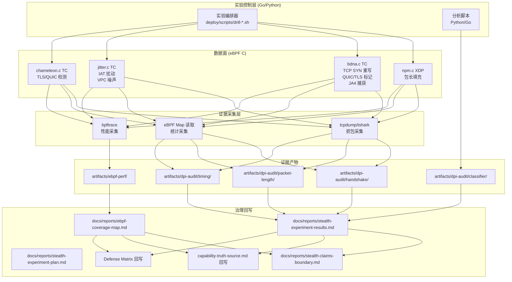
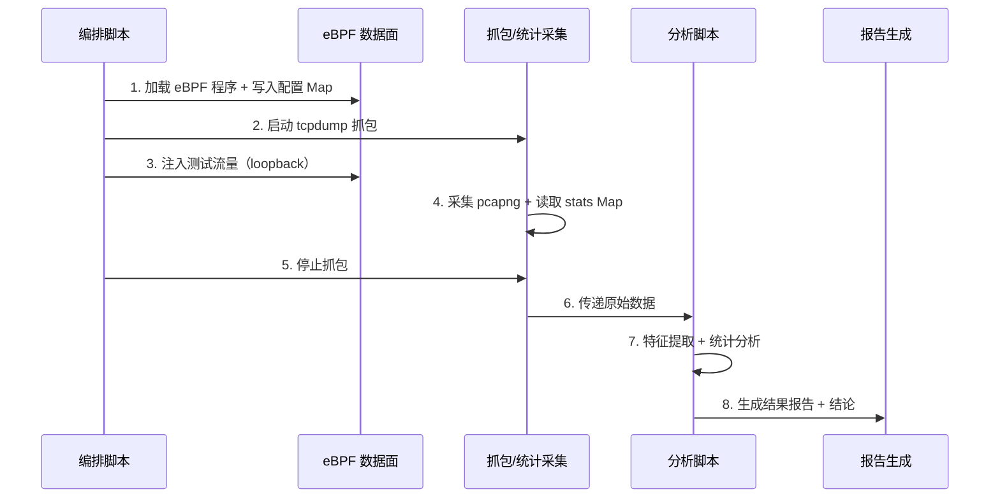
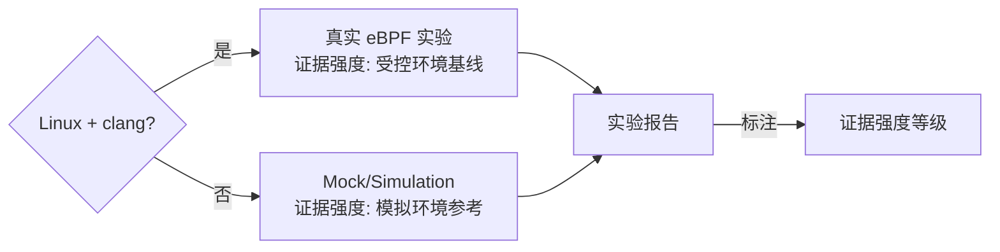

# 设计文档：Phase 2 隐匿与数据面证据闭环

## 概述

本设计文档描述 Phase 2（隐匿与数据面证据闭环）的技术实现方案。Phase 2 的核心目标不是新功能开发，而是为现有隐匿能力和 eBPF 数据面产出可信证据，将"可讲故事"推进为"可拿证据"。

设计覆盖三个里程碑：
- **M5**: 隐匿实验方案冻结 — 统一实验方法论和表述边界
- **M6**: 最小实验结果产出 — 四个检测面的受控环境实验
- **M7**: eBPF 覆盖图与性能证据 — 数据面参与边界和性能基线

关键设计约束：
1. 所有实验在受控本地环境（loopback/mock）执行，证据强度标注为"受控环境基线"
2. 实验结果必须诚实反映当前能力，不膨胀表述
3. 需要 Linux + clang 环境运行真实 eBPF 程序；非 Linux 环境降级为 mock/simulation
4. 证据产物按固定路径沉淀，脚本可复验

## 架构

### 实验架构总览



### 实验执行流水线

每个检测面实验遵循统一流水线：



### 非 Linux 降级策略



## 组件与接口

### M5: 实验方案与表述边界

| 组件 | 产出路径 | 职责 |
|------|----------|------|
| Stealth_Experiment_Plan | `docs/reports/stealth-experiment-plan.md` | 定义四个检测面的实验方法论、对照组、采集条件 |
| Claims_Boundary_List | `docs/reports/stealth-claims-boundary.md` | 基于证据划定允许/不允许表述 |

实验方案需定义的四个检测面：

1. **握手指纹** — 对照组: 真实 Chrome + 常见 uTLS；比较维度: JA3 hash、JA4 fingerprint、TCP options、TLS extension 顺序、QUIC transport parameters
2. **包长分布** — 采集规模: ≥1000 次新建连接；统计维度: 前 10 包长度、方向、上下行比例、熵值
3. **时序分布** — 采集维度: IAT、burst 结构、时段特征；对照: 启用/关闭 Jitter-Lite 和 VPC
4. **简单分类器** — 分类器: 优先 RandomForest + XGBoost（XGBoost 不可用时降级为仅 RandomForest 并标注）；指标: AUC、F1、准确率

### M6: 四个检测面实验

#### 检测面 1: 握手指纹实验

```
输入:
  - BDNA_Program 加载 + active_profile_map 配置指纹模板
  - 对照组: 真实 Chrome 流量 pcap / uTLS 配置流量 pcap

处理:
  - bdna_tcp_rewrite: 内核态 TCP SYN 重写 (Window Size, MSS, WScale, SACK, Timestamps)
  - bdna_tls_rewrite: 内核标记 (skb->mark = 0x544C5348) + 用户态协同
  - bdna_quic_rewrite: 内核标记 (skb->mark = 0x51554943) + 用户态协同
  - bdna_ja4_capture: JA4 指纹捕获 → ja4_events Ring Buffer

产出:
  - artifacts/dpi-audit/handshake/*.pcapng
  - bdna_stats_map 统计: tcp_rewritten, quic_rewritten, tls_rewritten, skipped
  - JA4 差异分析报告
```

#### 检测面 2: 包长分布实验

```
输入:
  - NPM_Program 加载 + npm_config_map 配置三种填充模式
  - 对照组: 无填充流量

处理:
  - npm_xdp_main → handle_npm_padding: XDP 层 bpf_xdp_adjust_tail 填充
  - 三种模式: NPM_MODE_FIXED_MTU(0), NPM_MODE_RANDOM_RANGE(1), NPM_MODE_GAUSSIAN(2)
  - calculate_padding: 根据 mode 计算填充大小

产出:
  - artifacts/dpi-audit/packet-length/*.pcapng
  - npm_stats_map 统计: total_packets, padded_packets, padding_bytes, skipped_packets
  - 包长直方图 + KL/JS 散度
```

#### 检测面 3: 时序分布实验

```
输入:
  - Jitter_Program 加载 + jitter_config_map / dna_template_map 配置
  - 四种配置组合: Jitter±VPC 的 2×2 矩阵

处理:
  - jitter_lite_egress: skb->tstamp 修改 (dna_template_map 优先, jitter_config_map 回退)
  - jitter_lite_physical: VPC 综合物理噪声 (光缆抖动 + 路由器队列 + 跨洋光缆 + 数据中心)
  - gaussian_sample / get_mimic_delay: 延迟采样

产出:
  - artifacts/dpi-audit/timing/*.pcapng
  - IAT 分布统计 (均值, 标准差, P50/P95/P99)
  - 四种配置组合对比
```

#### 检测面 4: 简单分类器实验

```
输入:
  - 检测面 1-3 的特征数据

处理:
  - Python sklearn: 优先 RandomForest + XGBoost（XGBoost 不可用时降级为仅 RandomForest 并标注）
  - 单维度 + 多维度联合分类

产出:
  - artifacts/dpi-audit/classifier/ (训练脚本, 模型, 评估结果)
  - AUC, F1, 准确率, 混淆矩阵
  - 高可区分性风险标注 (单维度 AUC > 0.9)
```

### M7: eBPF 覆盖图与性能证据

#### eBPF 程序清单：运行态挂载（loader.go 为真相源）

以下仅列出 loader.go `LoadAndAttach()` 中实际挂载的程序。源码中定义但未被 loader 挂载的 SEC 函数（如 `bdna_tls_rewrite`、`jitter_lite_adaptive`、`jitter_lite_physical`、`jitter_lite_social`、`emergency_wipe`、`heartbeat_check`、`vpc_content_injection`）不计入运行态覆盖。

| 程序 | 文件 | 挂载类型 | 方向 | 协议层 | 用户态协同 | loader 函数 |
|------|------|----------|------|--------|-----------|-------------|
| `npm_xdp_main` | npm.c | XDP | ingress（单入口，内部合并 padding+strip） | L3 | 独立完成 | `attachNPM` |
| `bdna_tcp_rewrite` | bdna.c | TC | egress | L4 | 独立完成 | `attachBDNA` |
| `bdna_quic_rewrite` | bdna.c | TC | egress | L4 | `skb->mark` 协同 | `attachBDNA`（降级） |
| `bdna_ja4_capture` | bdna.c | TC | ingress | L4-L7 | Ring Buffer 上报 | `attachBDNA`（降级） |
| `jitter_lite_egress` | jitter.c | TC | egress | L3 | 独立完成 | `loadMasterProgram` |
| `vpc_ingress_detect` | jitter.c | TC | ingress | L3-L4 | Ring Buffer 上报 | `loadMasterProgram`（降级） |
| `chameleon_tls_rewrite` | chameleon.c | TC | egress | L4-L7 | `skb->mark` 协同 | `attachChameleon` |
| `chameleon_quic_rewrite` | chameleon.c | TC | egress | L4 | `skb->mark` 协同 | `attachChameleon` |
| `l1_silent_egress` | l1_silent.c | TC | egress | L3-L4 | 独立完成 | `attachL1Silent` |
| `sockmap_sockops` | sockmap.c | sockops | - | L4 | 独立完成 | `loadSockmap` |
| `sockmap_redirect` | sockmap.c | sk_msg | - | L4 | 独立完成 | `loadSockmap` |

注意：L1_Defense 程序（`l1_defense.c`）在 loader 中未见独立 attach 函数，其 XDP 逻辑可能内联在其他入口或由 main.go 直接管理。M7 覆盖图需以 loader 实际行为为准。

#### 源码定义但未被 loader 挂载的 SEC 函数

| 函数 | 文件 | SEC 类型 | 状态 |
|------|------|----------|------|
| `bdna_tls_rewrite` | bdna.c | TC | 源码存在，loader 未挂载 |
| `jitter_lite_adaptive` | jitter.c | TC | 源码存在，loader 未挂载 |
| `jitter_lite_physical` | jitter.c | TC | 源码存在，loader 未挂载 |
| `jitter_lite_social` | jitter.c | TC | 源码存在，loader 未挂载 |
| `emergency_wipe` | jitter.c | TC | 源码存在，loader 未挂载 |
| `heartbeat_check` | jitter.c | TC | 源码存在，loader 未挂载 |
| `vpc_content_injection` | chameleon.c | TC | 源码存在，loader 未挂载 |
| `npm_decoy_marker` | npm.c | TC | 源码存在，loader 未挂载 |
| `npm_mtu_probe` | npm.c | XDP | 源码存在，loader 未挂载 |

#### 用户态处理路径（不经过 eBPF）

| 路径 | 实现位置 | 说明 |
|------|----------|------|
| G-Tunnel 分片与重组 | `mirage-gateway/pkg/gtunnel/` | Go 用户态 |
| FEC 编解码 | `mirage-gateway/pkg/gtunnel/` | Go 用户态 |
| QUIC 握手与传输参数协商 | Go quic-go 库 | Go 用户态 |
| TLS ClientHello 完整重写 | Go uTLS 库 | Go 用户态（eBPF 仅标记） |
| HTTP/2 SETTINGS 与请求序列 | Go net/http2 | Go 用户态 |
| G-Switch 域名转生 | `mirage-gateway/pkg/gswitch/` | Go 用户态 |
| B-DNA 画像 registry 管理 | `mirage-gateway/pkg/ebpf/bdna_profile_updater.go` | Go 用户态 |

#### 性能采集接口

```
采集工具:
  延迟: benchmarks/ebpf_latency.bt (bpftrace) — XDP/TC P50/P95/P99
  CPU: perf top / mpstat — eBPF 程序 CPU 占用百分比
  内存: /proc/meminfo + bpftool map show — eBPF Map 内存占用
对照基准: protocol-language-rules.md 要求 (C 数据面延迟 < 1ms, CPU < 5%, 内存 < 50MB)
产出路径: artifacts/ebpf-perf/ (latency-report.txt, cpu-report.txt, memory-report.txt)
```

## 数据模型

### eBPF Map 统计结构（实验采集目标）

```c
// NPM 统计 (npm_stats_map, PERCPU_ARRAY)
struct npm_stats {
    __u64 total_packets;
    __u64 padded_packets;
    __u64 padding_bytes;
    __u64 decoy_packets;
    __u64 skipped_packets;
};

// B-DNA 统计 (bdna_stats_map, PERCPU_ARRAY)
struct bdna_stats {
    __u64 tcp_rewritten;
    __u64 quic_rewritten;
    __u64 tls_rewritten;
    __u64 skipped;
};

// VPC 噪声统计 (vpc_noise_stats, PERCPU_ARRAY)
struct vpc_noise_stats {
    __u64 total_packets;
    __u64 delayed_packets;
    __u64 total_delay_us;
    __u64 dropped_packets;
    __u64 reordered_packets;
    __u64 duplicated_packets;
};
```

### 实验配置结构

```c
// NPM 配置 (npm_config_map)
struct npm_config {
    __u32 enabled;
    __u32 filling_rate;      // 0-100
    __u32 global_mtu;        // 目标 MTU
    __u32 min_packet_size;   // 小包跳过阈值
    __u32 padding_mode;      // 0=固定MTU, 1=随机区间, 2=正态分布
    __u32 decoy_rate;        // 0-100
};

// Jitter 配置 (jitter_config_map)
struct jitter_config {
    __u32 enabled;
    __u32 mean_iat_us;
    __u32 stddev_iat_us;
    __u32 template_id;
};

// B-DNA 拟态模板 (dna_template_map)
struct dna_template {
    __u32 target_iat_mu;
    __u32 target_iat_sigma;
    __u32 padding_strategy;  // 0:固定, 1:正态分布, 2:跟随载荷
    __u16 target_mtu;
    __u16 reserved;
    __u32 burst_size;
    __u32 burst_interval;
};

// 指纹模板 (fingerprint_map)
struct stack_fingerprint {
    __u16 tcp_window;
    __u8  tcp_wscale;
    __u16 tcp_mss;
    __u8  tcp_sack_ok;
    __u8  tcp_timestamps;
    __u32 quic_max_idle;
    __u32 quic_max_data;
    __u32 quic_max_streams_bi;
    __u32 quic_max_streams_uni;
    __u16 quic_ack_delay_exp;
    __u16 tls_version;
    __u8  tls_ext_order[32];
    __u8  tls_ext_count;
    __u32 profile_id;
    char  profile_name[32];
};
```

### 实验结果数据模型

```python
# 握手指纹对比结果
class HandshakeComparison:
    source: str           # "remirage" | "chrome" | "utls"
    tcp_window: int
    tcp_mss: int
    tcp_wscale: int
    tcp_sack: bool
    tcp_timestamps: bool
    ja4_fingerprint: str
    tls_extensions: list[int]
    match_score: float    # 0.0-1.0 与目标画像的匹配度

# 包长分布结果
class PacketLengthDistribution:
    mode: str             # "fixed_mtu" | "random_range" | "gaussian"
    first_10_lengths: list[int]
    histogram: dict[int, int]
    kl_divergence: float  # 与对照组的 KL 散度
    js_divergence: float  # 与对照组的 JS 散度

# 时序分布结果
class TimingDistribution:
    config: str           # "none" | "jitter_only" | "vpc_only" | "jitter+vpc"
    iat_mean_us: float
    iat_stddev_us: float
    iat_p50_us: float
    iat_p95_us: float
    iat_p99_us: float

# 分类器结果
class ClassifierResult:
    classifier: str       # "RandomForest" | "XGBoost"
    feature_set: str      # "handshake" | "packet_length" | "timing" | "combined"
    auc: float
    f1: float
    accuracy: float
    confusion_matrix: list[list[int]]
```

### 证据产物目录结构

```
artifacts/
├── dpi-audit/
│   ├── handshake/
│   │   ├── remirage-syn.pcapng
│   │   ├── chrome-syn.pcapng
│   │   ├── utls-syn.pcapng
│   │   ├── extract-features.py
│   │   └── comparison.csv
│   ├── packet-length/
│   │   ├── mode-fixed-mtu.pcapng
│   │   ├── mode-random-range.pcapng
│   │   ├── mode-gaussian.pcapng
│   │   ├── baseline-no-padding.pcapng
│   │   ├── analyze-distribution.py
│   │   └── distributions.csv
│   ├── timing/
│   │   ├── config-none.pcapng
│   │   ├── config-jitter-only.pcapng
│   │   ├── config-vpc-only.pcapng
│   │   ├── config-jitter-vpc.pcapng
│   │   ├── analyze-timing.py
│   │   └── iat-stats.csv
│   └── classifier/
│       ├── train-classifier.py
│       ├── features.csv
│       ├── results.json
│       └── confusion-matrices/
└── ebpf-perf/
    ├── latency-report.txt
    ├── ebpf_latency.bt
    └── raw-data/
```


## 正确性属性

*属性（Property）是一种在系统所有有效执行中都应成立的特征或行为——本质上是对系统应做什么的形式化陈述。属性是人类可读规格与机器可验证正确性保证之间的桥梁。*

Phase 2 主要是证据采集而非新功能开发，但其中涉及的 eBPF 数据面逻辑（NPM 填充、B-DNA 重写、Jitter 扰动）具有明确的输入/输出行为，适合用属性基测试验证正确性。以下属性聚焦于 eBPF 程序的核心逻辑，确保实验采集的数据基于正确运行的代码。

### Property 1: NPM 填充正确性

*对任意* 有效的 `npm_config`（enabled=1, padding_mode ∈ {0,1,2}, global_mtu > 0）和任意包大小 `current_size`：
- 若 `current_size < min_packet_size`，则该包不应被填充（跳过）
- 若 `current_size >= target_mtu`，则 `calculate_padding` 返回 0
- 若 `current_size < target_mtu` 且 `current_size >= min_packet_size`：
  - `NPM_MODE_FIXED_MTU(0)`: padding = target_mtu - current_size
  - `NPM_MODE_RANDOM_RANGE(1)`: 0 < padding ≤ target_mtu - current_size
  - `NPM_MODE_GAUSSIAN(2)`: padding 在 [0, target_mtu - current_size] 范围内
- 当 padding > 0 时，`MIN_PADDING_SIZE(64) ≤ padding ≤ MAX_PADDING_SIZE(1400)`

**Validates: Requirements 3.1, 3.4**

### Property 2: NPM 统计一致性

*对任意* 包序列经过 `handle_npm_padding` 处理后，`npm_stats_map` 中的计数器应满足：
- `padded_packets + skipped_packets ≤ total_packets`
- `padding_bytes > 0` 当且仅当 `padded_packets > 0`
- `padded_packets ≤ total_packets - skipped_packets`

**Validates: Requirements 3.3**

### Property 3: B-DNA TCP SYN 重写匹配

*对任意* 有效的 `stack_fingerprint` 模板（tcp_window > 0, tcp_mss > 0）加载到 `fingerprint_map` 并通过 `active_profile_map` 激活后，`bdna_tcp_rewrite` 处理 TCP SYN 包时，输出包的以下字段应与模板值匹配：
- TCP Window Size = fingerprint.tcp_window
- MSS Option = fingerprint.tcp_mss
- Window Scale Option = fingerprint.tcp_wscale

**Validates: Requirements 2.1**

### Property 4: B-DNA 统计一致性

*对任意* 包序列经过 B-DNA 程序处理后，`bdna_stats_map` 中的计数器应满足：
- 对于 TCP SYN 包：要么 `tcp_rewritten` 递增（成功重写），要么 `skipped` 递增（无指纹模板）
- 对于 QUIC Initial 包：`quic_rewritten` 递增
- 对于 TLS ClientHello 包：`tls_rewritten` 递增
- 对于非匹配包：计数器不变

**Validates: Requirements 2.3**

### Property 5: Jitter IAT 方差增加

*对任意* 有效的 `jitter_config`（enabled=1, mean_iat_us > 0, stddev_iat_us > 0）和同一组测试流量，启用 `jitter_lite_egress` 后的 IAT（包间到达时间）方差应大于关闭时的 IAT 方差。

**Validates: Requirements 4.1**

### Property 6: Jitter 配置优先级

*对任意* 包经过 `jitter_lite_egress` 处理时：
- 若 `dna_template_map` 中存在对应模板，则使用 `get_mimic_delay(tpl)` 计算延迟
- 若 `dna_template_map` 中不存在模板，则回退到 `jitter_config_map` 使用 `gaussian_sample` 计算延迟
- 两条路径都应导致 `skb->tstamp` 被修改为 `now + delay_ns`（delay_ns > 0）

**Validates: Requirements 4.4**

## 错误处理

### 实验环境错误

| 错误场景 | 处理策略 |
|----------|----------|
| 非 Linux 环境 | 降级为 mock/simulation，标注证据强度为"模拟环境参考" |
| clang 未安装 | 跳过 eBPF 编译，使用预编译 .o 文件或 mock |
| 内核版本 < 5.15 | 使用 XDP generic mode，标注兼容性限制 |
| bpftrace 未安装 | 跳过延迟采集，标注"延迟数据缺失" |
| perf/mpstat 未安装 | 跳过 CPU 采集，标注"CPU 数据缺失" |
| bpftool 未安装 | 跳过 Map 内存采集，标注"内存数据缺失" |
| tcpdump 权限不足 | 提示需要 root/CAP_NET_RAW，降级为 eBPF Map 统计 |

### eBPF 程序错误

| 错误场景 | 处理策略 |
|----------|----------|
| eBPF 程序加载失败 | 记录错误，标注该检测面实验为"未完成"，不伪造数据 |
| Map 读取返回空值 | 使用默认值或跳过，记录到实验日志 |
| bpf_xdp_adjust_tail 失败 | NPM 返回 XDP_PASS（不填充），统计不递增 |
| bpf_skb_change_tail 失败 | Jitter TC 层 padding 重置为 0，记录失败 |
| Ring Buffer 满 | bpf_ringbuf_reserve 返回 NULL，事件丢失，记录丢失率 |

### 实验结果错误

| 错误场景 | 处理策略 |
|----------|----------|
| 样本量不足 | 标注实际样本量，降低结论置信度 |
| 分类器过拟合 | 使用交叉验证，报告训练集和测试集指标 |
| 统计指标异常 | 记录原始数据，不修改，标注异常原因分析 |
| 实验结果不支撑表述 | 降级表述，不隐瞒结果 |

## 测试策略

### 双轨测试方法

Phase 2 采用属性基测试（PBT）+ 单元测试的双轨方法：

- **属性基测试**: 验证 eBPF 数据面逻辑的通用正确性（上述 6 个属性）
- **单元测试**: 验证具体示例、边界条件和集成点
- **集成测试**: 验证端到端实验流水线（编排脚本 → eBPF → 抓包 → 分析）

### 属性基测试配置

- **PBT 库**: Go 使用 `testing/quick` 或 `pgregory.net/rapid`；Python 使用 `hypothesis`
- **最小迭代次数**: 每个属性 100 次
- **标签格式**: `Feature: phase2-stealth-evidence, Property {N}: {property_text}`

#### Property 1-4 (eBPF 逻辑测试)

由于 eBPF 程序运行在内核态，PBT 需要通过以下方式之一实现：
1. **提取纯函数测试**: 将 `calculate_padding` 等纯函数逻辑提取为可独立编译的 C 函数，用 Go CGO 或 C 测试框架调用
2. **Map 驱动测试**: 通过 Go 控制面写入不同配置到 eBPF Map，注入测试包，读取统计 Map 验证结果
3. **Mock 测试**: 在 Go 层模拟 eBPF 逻辑（如 calculate_padding 的 Go 等价实现），用 PBT 验证逻辑正确性

推荐方案: 方案 3（Mock 测试）作为主要 PBT 路径，方案 2（Map 驱动）作为集成验证。

#### Property 5-6 (Jitter 行为测试)

- Property 5 需要统计验证（方差比较），适合用 Map 驱动测试 + 统计断言
- Property 6 需要验证配置优先级，适合用 Map 驱动测试（设置/清除 dna_template_map）

### 单元测试覆盖

| 测试目标 | 测试类型 | 说明 |
|----------|----------|------|
| 实验方案文档完整性 | SMOKE | 检查四个检测面方法论是否完整 |
| Claims Boundary 文档完整性 | SMOKE | 检查允许/不允许表述清单 |
| eBPF 编译回归 | SMOKE | 已有 `bpf_compile_test.go` |
| 抓包文件生成 | INTEGRATION | 验证 pcapng 文件可生成 |
| 统计分析脚本 | INTEGRATION | 验证分析脚本可运行 |
| 分类器训练 | INTEGRATION | 验证分类器可训练并输出指标 |
| 治理文档回写 | SMOKE | 检查回写内容与实验结论一致 |

### 测试执行环境要求

| 环境 | 要求 | 降级方案 |
|------|------|----------|
| Linux + clang | eBPF 编译和加载 | Mock/simulation |
| Python 3.8+ | 分类器训练和统计分析 | 跳过分类器实验 |
| root/CAP_NET_RAW | tcpdump 抓包 | 仅使用 eBPF Map 统计 |
| bpftrace | 延迟采集 | 跳过延迟数据 |
| perf/mpstat | CPU 采集 | 跳过 CPU 数据 |
| bpftool | Map 内存采集 | 跳过内存数据 |
| Kernel ≥ 5.15 | XDP/TC/sockops 完整支持 | XDP generic mode |
