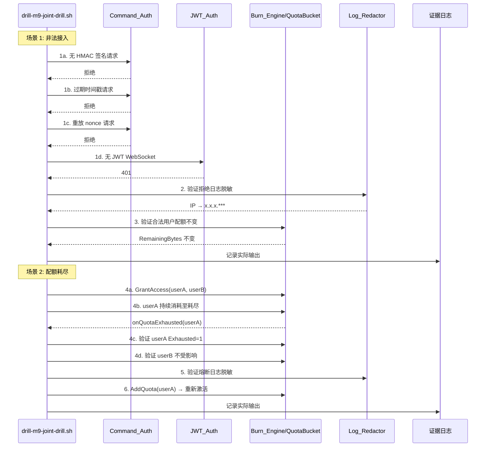

# 设计文档：Phase 3 可运营基线固化

## 概述

本设计文档描述 Phase 3（可运营基线固化）的技术实现方案。Phase 3 的核心目标是将"反取证与最小运行痕迹"和"准入控制与防滥用"两个能力域从"强组件"推进为"可运营基线"。

设计覆盖两个里程碑：
- **M8**: 最小运行痕迹基线冻结 — 部署等级定义、基线检查清单、Runbook 对齐
- **M9**: 准入控制联合演练通过 — 非法接入演练、配额耗尽演练、长期验证入口固化

关键设计约束：
1. 不新增功能，只安排部署等级定义、联合演练、证据沉淀和 Runbook 对齐
2. 所有产出必须诚实反映当前代码实际行为
3. 证据产物按固定路径沉淀，脚本可复验
4. 复用现有测试文件，避免重复建设
5. 演练脚本必须包含完整步骤，不仅仅是 `go test` 的包装

## 架构

### Phase 3 产出架构

```mermaid
graph TB
    subgraph "M8: 部署基线冻结"
        DT[Deployment_Tier_Document<br/>docs/reports/deployment-tiers.md]
        BC[Baseline_Checklist<br/>docs/reports/deployment-baseline-checklist.md]
        DS[drill-m8-baseline.sh<br/>deploy/scripts/]
    end

    subgraph "M9: 准入控制联合演练"
        JD[Joint_Drill_Record<br/>docs/reports/access-control-joint-drill.md]
        D9[drill-m9-joint-drill.sh<br/>deploy/scripts/]
    end

    subgraph "现有组件（只读引用）"
        RS[RAM_Shield<br/>pkg/security/ram_shield.go]
        EW[Emergency_Wipe<br/>deploy/scripts/emergency-wipe.sh]
        CR[Cert_Rotate<br/>deploy/scripts/cert-rotate.sh]
        TC[Tmpfs_Compose<br/>docker-compose.tmpfs.yml]
        CA[Command_Auth<br/>pkg/api/command_auth.go]
        JA[JWT_Auth<br/>ws-gateway/auth_test.go]
        BE[Burn_Engine<br/>pkg/ebpf/burn_engine.go]
        LR[Log_Redactor<br/>pkg/redact/redact.go]
        RA[Redis_Auth<br/>docker-compose.os.yml]
    end

    subgraph "Runbook（交叉引用）"
        SI[Secret_Injection_Runbook]
        LP[Least_Privilege_Runbook]
        NR[Node_Replacement_Runbook]
    end

    subgraph "治理回写"
        CTS[capability-truth-source.md]
        VC[功能验证清单]
    end

    subgraph "证据日志"
        E8[deploy/evidence/m8-baseline-drill.log]
        E9[deploy/evidence/m9-joint-drill.log]
    end

    DT --> RS & EW & CR & TC
    DT --> SI & LP & NR
    BC --> RS & EW & CR & TC
    DS --> BC
    DS --> E8

    JD --> CA & JA & BE & LR & RA
    D9 --> JD
    D9 --> E9

    DT & BC --> CTS & VC
    JD --> CTS & VC
```



### 联合演练执行流



## 组件与接口

### M8 产出组件

| 组件 | 产出路径 | 职责 |
|------|----------|------|
| Deployment_Tier_Document | `docs/reports/deployment-tiers.md` | 定义 Default/Hardened/Extreme Stealth 三个部署等级 |
| Baseline_Checklist | `docs/reports/deployment-baseline-checklist.md` | 每个等级的可执行检查项清单 |
| drill-m8-baseline.sh | `deploy/scripts/drill-m8-baseline.sh` | M8 基线验证演练脚本 |
| m8-baseline-drill.log | `deploy/evidence/m8-baseline-drill.log` | M8 演练证据日志 |

### M9 产出组件

| 组件 | 产出路径 | 职责 |
|------|----------|------|
| Joint_Drill_Record | `docs/reports/access-control-joint-drill.md` | 联合演练完整记录 |
| drill-m9-joint-drill.sh | `deploy/scripts/drill-m9-joint-drill.sh` | M9 联合演练脚本 |
| m9-joint-drill.log | `deploy/evidence/m9-joint-drill.log` | M9 演练证据日志 |

### 部署等级配置矩阵

| 配置项 | Default | Hardened | Extreme Stealth |
|--------|---------|----------|-----------------|
| RAM_Shield (mlock) | 可选 | 强制 | 强制 |
| Core dump 禁用 | 可选 | 强制 | 强制 |
| 证书存储 | 磁盘 | tmpfs | tmpfs |
| Swap | 允许 | 禁用 (`mem_swappiness: 0`) | 禁用 |
| Cert_Rotate | 可选 | 启用 (≤72h) | 启用 (≤72h，当前签发有效期 3 天) |
| 只读根文件系统 | 否 | 是 | 是 |
| 日志持久化 | 允许 | 允许 | 不持久化 (`max-file: 1`) |
| Emergency_Wipe | 可选 | 预装 | 自动触发条件预配置（当前不支持） |
| 持久化卷 | 允许 | 最小化 | 无 |
| 密钥注入 | Compose 环境变量 | Docker Secrets / Vault | Vault + tmpfs Volume Mount |
| 证书 ≤24h 有效期 | - | - | 候选强化项（需新增签发策略） |

#### 当前代码支持状态

| 配置项 | 支持状态 | 证据锚点 |
|--------|----------|----------|
| RAM_Shield (mlock + core dump) | 已支持 | `mirage-gateway/pkg/security/ram_shield.go` |
| Swap 检测 | 已支持 | `ram_shield.go` → `CheckSwapUsage()` |
| tmpfs 证书存储 | 已支持 | `mirage-gateway/docker-compose.tmpfs.yml` |
| Cert_Rotate (local + API) | 已支持 | `deploy/scripts/cert-rotate.sh` |
| 只读根文件系统 | 已支持 | `docker-compose.tmpfs.yml` → `read_only: true` |
| `mem_swappiness: 0` | 已支持 | `docker-compose.tmpfs.yml` |
| Emergency_Wipe | 已支持 | `deploy/scripts/emergency-wipe.sh` |
| 日志 `max-file: 1` | 已支持 | `docker-compose.tmpfs.yml` → logging 配置 |
| 证书 ≤24h 有效期 | 候选强化项 | `cert-rotate.sh` → `--days-before` 是轮转预警阈值，非签发有效期；`gen_gateway_cert.sh` 签发 3 天；需新增签发策略 |
| Emergency_Wipe 自动触发 | 不支持 | 当前仅手动触发（`--confirm` + "WIPE" 输入） |
| Vault + tmpfs Volume Mount | 需配置 | `secret-injection.md` 描述了迁移路径，当前 Compose 用环境变量 |

### Runbook 交叉引用矩阵

| 部署等级 | Secret_Injection | Least_Privilege | Node_Replacement |
|----------|-----------------|-----------------|------------------|
| Default | Compose 环境变量 | 标准权限矩阵 | 标准流程 |
| Hardened | Docker Secrets / Vault | 标准权限矩阵 | 证书 72h 自然过期 |
| Extreme Stealth | Vault + tmpfs | 标准权限矩阵 | 证书 72h 过期 + Emergency_Wipe 优先（≤24h 为候选强化项） |

### 联合演练组件交互

#### 场景 1: 非法接入链路

```
请求 → Command_Auth.Verify() → 拒绝
                                  ↓
                            日志输出（含 IP）
                                  ↓
                            Log_Redactor.RedactIPInText()
                                  ↓
                            脱敏日志（IP → x.x.x.***）
                                  ↓
                            验证合法用户 QuotaBucket 不变
```

验证点：
- `Command_Auth` `pkg/api` 包 HMAC 回归测试全部通过（`security_regression_test.go`）
- `JWT_Auth` `services/ws-gateway` 包鉴权测试全部通过（`auth_test.go`）
- `RedactIPInText` 替换所有 IPv4 最后一段（`pkg/redact` 包测试全部通过）
- 合法用户 `RemainingBytes` 在非法请求前后不变

#### 场景 2: 配额耗尽链路

```
GrantAccess(userA, 1000) + GrantAccess(userB, 5000)
        ↓
userA 消耗 → Consume() → RemainingBytes 递减
        ↓
RemainingBytes = 0 → Exhausted = 1
        ↓
onQuotaExhausted(userA) 回调触发
        ↓
验证 userB: RemainingBytes 不变, Exhausted = 0
        ↓
AddQuota(userA, 2000) → Exhausted = 0, 白名单恢复
```

验证点：
- `QuotaBucket` 隔离测试 `-count=10` 连续通过无串扰（`pkg/api` 包）
- `FuseCallback` 仅断开目标用户（`fuse_callback_test.go`）
- `AddQuota` 重置耗尽状态（`quota_bucket_test.go` → `TestQuotaBucket_UpdateResetsExhausted`）
- 集成测试多用户隔离（`integration_test.go`）

## 数据模型

### 部署等级文档结构

```yaml
# docs/reports/deployment-tiers.md 结构
deployment_tiers:
  - name: Default
    scenario: "标准部署，适用于受控网络内的开发/测试环境"
    security_boundary: "基础安全，依赖宿主机隔离"
    config_items:
      - name: "RAM_Shield"
        status: "可选"
        evidence: "mirage-gateway/pkg/security/ram_shield.go"
        support: "已支持"
      # ...

  - name: Hardened
    scenario: "加固部署，适用于生产环境"
    security_boundary: "内存隔离 + 短生命周期证书 + 只读文件系统"
    config_items:
      # ...

  - name: Extreme Stealth
    scenario: "极限隐匿部署，适用于高风险场景"
    security_boundary: "无持久化 + 极短证书 + 自动擦除"
    config_items:
      # ...
```

### 基线检查项结构

```yaml
# docs/reports/deployment-baseline-checklist.md 结构
checklist:
  - name: "mlock 生效检查"
    tier: [Hardened, Extreme Stealth]
    command: "grep VmLck /proc/<pid>/status"
    expected: "VmLck 字段非零"
    automation: "可脚本化"

  - name: "Core dump 禁用检查"
    tier: [Hardened, Extreme Stealth]
    command: "ulimit -c"
    expected: "0"
    automation: "可脚本化"

  - name: "Swap 禁用检查"
    tier: [Hardened, Extreme Stealth]
    command: "swapon --show"
    expected: "输出为空"
    automation: "可脚本化"
    # ...
```

### 联合演练记录结构

```yaml
# docs/reports/access-control-joint-drill.md 结构
drill_record:
  scenario_1_illegal_access:
    steps:
      - id: "1a"
        action: "发送无 HMAC 签名请求"
        component: "Command_Auth"
        expected: "拒绝"
        actual_output: "<实际命令输出>"
        result: "PASS/FAIL"
      # ...
    log_redaction_verification:
      ip_redacted: true
      token_redacted: true
      secret_redacted: true
    quota_impact_verification:
      user_remaining_before: 5000
      user_remaining_after: 5000
      delta: 0

  scenario_2_quota_exhaustion:
    steps:
      - id: "4a"
        action: "GrantAccess(userA=1000, userB=5000)"
        # ...
    fuse_callback_verification:
      triggered_for: "userA"
      userB_affected: false
    addquota_reactivation:
      userA_exhausted_before: true
      userA_exhausted_after: false
```

### 演练脚本接口

```bash
# drill-m8-baseline.sh
# 输入: 部署等级 (default|hardened|extreme)
# 输出: deploy/evidence/m8-baseline-drill.log
# 步骤:
#   1. 检查 RAM_Shield 状态 (mlock, core dump, swap)
#   2. 检查证书配置 (tmpfs, 有效期, CA 私钥)
#   3. 检查文件系统 (只读根, 可写挂载点, swap 分区)
#   4. 检查 Emergency_Wipe 可用性 (脚本存在, 依赖工具)
#   5. 汇总结果

# drill-m9-joint-drill.sh
# 输入: 无（自包含）
# 输出: deploy/evidence/m9-joint-drill.log
# 步骤:
#   场景 1: 运行 pkg/api 包 HMAC 回归测试
#           运行 services/ws-gateway 包 JWT 鉴权测试
#           运行 pkg/redact 包 Gateway 侧 + OS 侧脱敏测试
#           验证配额隔离 (pkg/api 包 -count=10)
#   场景 2: 运行 pkg/api 包熔断回调测试
#           运行 pkg/api 包集成测试（含 critical tests）
#           验证 AddQuota 重置 (quota_bucket_test.go)
#   汇总: 生成联合演练记录
```


## 正确性属性

*属性（Property）是一种在系统所有有效执行中都应成立的特征或行为——本质上是对系统应做什么的形式化陈述。属性是人类可读规格与机器可验证正确性保证之间的桥梁。*

Phase 3 主要是基线固化和联合演练，但其中涉及的准入控制逻辑（配额隔离、熔断回调、日志脱敏、HMAC 校验）具有明确的输入/输出行为，适合用属性基测试验证正确性。以下属性聚焦于跨组件协同的核心不变量。

### Property 1: QuotaBucket 用户隔离

*对任意*两个用户 A 和 B，各自拥有独立配额，当用户 A 的配额被完全耗尽时：
- 用户 B 的 `RemainingBytes` 不应减少（除 B 自身消耗外）
- 用户 B 的 `Exhausted` 标志应保持为 0
- 用户 B 的 `Consume()` 调用应继续成功（在 B 自身配额范围内）

**Validates: Requirements 5.3, 6.1, 6.3**

### Property 2: FuseCallback 精确定向

*对任意*已耗尽配额的用户，`onQuotaExhausted` 回调应且仅应以该用户的 UID 作为参数触发。其他未耗尽用户不应触发该回调。

**Validates: Requirements 6.2**

### Property 3: IP 脱敏完整性

*对任意*包含 IPv4 地址的字符串，`RedactIPInText` 处理后：
- 所有 IPv4 地址的最后一段应被替换为 `***`
- 输出中不应包含任何原始 IPv4 地址的完整最后一段
- 非 IPv4 文本内容应保持不变

**Validates: Requirements 5.2, 6.4**

### Property 4: AddQuota 重新激活

*对任意*已耗尽配额的用户（`Exhausted = 1`），调用 `AddQuota(uid, additionalBytes)` 后：
- `Exhausted` 标志应重置为 0
- `RemainingBytes` 应增加 `additionalBytes`
- eBPF 白名单应重新授权（`allowed = 1`）

**Validates: Requirements 6.5**

### Property 5: HMAC 校验确定性

*对任意*固定的 `(commandType, timestamp, nonce, payloadHash, secret)` 组合，`CommandAuthenticator.Verify()` 应产生一致的接受/拒绝结果。即：
- 相同的合法输入始终通过
- 相同的非法输入始终拒绝
- 修改任一字段（commandType、timestamp、nonce、payloadHash）应导致签名不匹配

**Validates: Requirements 5.1**

## 错误处理

### M8 基线检查错误

| 错误场景 | 处理策略 |
|----------|----------|
| 非 Linux 环境 | 跳过 `/proc` 相关检查，标注"需 Linux 环境验证" |
| 容器外执行 | 跳过 tmpfs/只读根检查，标注"需容器环境验证" |
| 工具缺失 (shred/bpftool) | 标注 Emergency_Wipe 依赖不满足，记录缺失工具 |
| 证书文件不存在 | 标注"证书未部署"，不视为检查失败 |
| 权限不足 | 提示需要 root/sudo，降级为可执行的检查子集 |

### M9 联合演练错误

| 错误场景 | 处理策略 |
|----------|----------|
| Go 测试编译失败 | 记录编译错误，标注该验证点为"未完成" |
| 测试超时 | 记录超时信息，标注为"需排查" |
| 配额回调未触发 | 记录等待时间和状态，标注为"回调异常" |
| 日志未脱敏 | 完整记录异常现象，标注为"脱敏缺陷"，触发能力域降级评估 |
| 配额串扰 | 完整记录串扰证据，标注为"隔离缺陷"，触发能力域降级评估 |
| 非 eBPF 环境 | 使用 mock 替代 eBPF Map 操作，标注"mock 环境" |

### 治理回写错误

| 错误场景 | 处理策略 |
|----------|----------|
| 演练结果不支撑当前状态 | 降级能力域状态，不隐瞒结果 |
| 跨文档表述不一致 | 以 Deployment_Tier_Document 和 Joint_Drill_Record 的实际结论为准 |
| 证据锚点文件路径变更 | 更新所有引用该路径的文档 |

## 测试策略

### 双轨测试方法

Phase 3 采用属性基测试（PBT）+ 单元测试的双轨方法：

- **属性基测试**: 验证准入控制逻辑的通用正确性（上述 5 个属性）
- **单元测试**: 复用现有测试覆盖具体示例和边界条件
- **集成测试**: 联合演练脚本验证跨组件协同

### 属性基测试配置

- **PBT 库**: Go `pgregory.net/rapid`（首选）或 `testing/quick`
- **最小迭代次数**: 每个属性 100 次
- **标签格式**: `Feature: phase3-operational-baseline, Property {N}: {property_text}`

#### Property 1 (QuotaBucket 隔离)

测试方法：生成随机的 (quotaA, quotaB, consumeAmounts) 三元组，创建两个用户，耗尽用户 A 的配额，验证用户 B 的状态不变。

复用基础：`mirage-gateway/pkg/api/quota_bucket_test.go` 中的 `TestQuotaBucket_IsolationTwoUsers` 已验证具体示例，PBT 扩展为随机配额和消耗量。

#### Property 2 (FuseCallback 定向)

测试方法：生成随机的 (userCount, exhaustedUserIndex) 组合，注册多个用户，耗尽指定用户，验证回调仅触发一次且参数正确。

复用基础：`fuse_callback_test.go` 中的 `TestFuseCallback_OnlyAffectsTargetUser` 已验证两用户场景。

#### Property 3 (IP 脱敏完整性)

测试方法：生成包含随机数量 IPv4 地址的随机文本，调用 `RedactIPInText`，验证输出中无完整 IPv4 最后一段。

复用基础：`redact_test.go` 中的 `TestRedactIPInText_NoLeakLastOctet` 已验证具体示例。

#### Property 4 (AddQuota 重新激活)

测试方法：生成随机的 (initialQuota, additionalQuota) 组合，先耗尽配额，再调用 AddQuota，验证 Exhausted 重置和 RemainingBytes 增加。

复用基础：`quota_bucket_test.go` 中的 `TestQuotaBucket_UpdateResetsExhausted` 已验证具体示例。

#### Property 5 (HMAC 确定性)

测试方法：生成随机的 (commandType, timestamp, nonce, payloadHash) 组合，对同一输入调用两次 Verify，验证结果一致。再修改任一字段，验证结果变化。

复用基础：`security_regression_test.go` 中的 HMAC 回归测试已覆盖具体拒绝场景。

### 现有测试复用清单

| 测试文件 | 覆盖范围 | 演练角色 |
|----------|----------|----------|
| `mirage-gateway/pkg/api/security_regression_test.go` | HMAC、时间戳、nonce、高危命令、重放 | 场景 1 回归基线 |
| `mirage-os/services/ws-gateway/auth_test.go` | JWT 缺失/无效/空 secret/health 旁路 | 场景 1 回归基线 |
| `mirage-gateway/pkg/redact/redact_test.go` + `log_redaction_test.go` | IP/Token/Secret 脱敏 + 文本内 IP 脱敏 | 场景 1 脱敏验证 |
| `mirage-os/pkg/redact/redact_test.go` | OS 侧脱敏 | 场景 1 脱敏验证 |
| `mirage-gateway/pkg/api/quota_bucket_test.go` | 配额隔离、重置、未知用户、全局桶 | 场景 2 隔离验证 |
| `mirage-gateway/pkg/api/fuse_callback_test.go` | 熔断触发、隔离、会话断开 | 场景 2 熔断验证 |
| `mirage-gateway/pkg/api/integration_test.go` | 多用户隔离、计费归属、幂等上报、会话生命周期 | 场景 2 集成验证 |

### 新增 Critical Test 入口

联合演练中发现的跨组件验证点（非单组件测试可覆盖的），需定义新的 critical test：

| 测试名称 | 验证点 | 执行命令 | 所属部署等级 | 环境依赖 |
|----------|--------|----------|-------------|----------|
| 非法请求不影响配额 | 拒绝请求后合法用户配额不变 | `go test ./pkg/api -run TestCritical_IllegalRequestNoQuotaImpact -v` | All | 无 eBPF 依赖 |
| 熔断后日志脱敏 | 熔断事件日志中 IP 已脱敏 | `go test ./pkg/api -run TestCritical_FuseLogRedaction -v` | All | 无 eBPF 依赖 |
| 配额重新激活端到端 | AddQuota 后可继续消费 | `go test ./pkg/api -run TestCritical_QuotaReactivationE2E -v` | All | 无 eBPF 依赖 |

这些 critical test 应添加到现有测试文件中（`integration_test.go`），避免创建新文件。

### Smoke Test 入口汇总

```bash
# M8 基线验证 smoke test
bash deploy/scripts/drill-m8-baseline.sh

# M9 联合演练 smoke test（完整）
bash deploy/scripts/drill-m9-joint-drill.sh

# M9 快速回归（仅运行 Go 测试）
cd mirage-gateway && go test ./pkg/api -run "TestSecurityRegression_|TestQuotaBucket_|TestFuseCallback_|TestIntegration_|TestCritical_" -count=1 -v
cd mirage-gateway && go test ./pkg/redact/ -v
cd mirage-os && go test ./services/ws-gateway -run "TestJWTAuth_" -v
cd mirage-os && go test ./pkg/redact/ -v

# M9 Redis 鉴权连通性验证（需 docker-compose 环境）
# 复用功能验证清单中"生产配置鉴权闭环"口径
Select-String -Path deploy/docker-compose.os.yml -Pattern 'requirepass|MIRAGE_REDIS_PASSWORD|redis://:'
```
