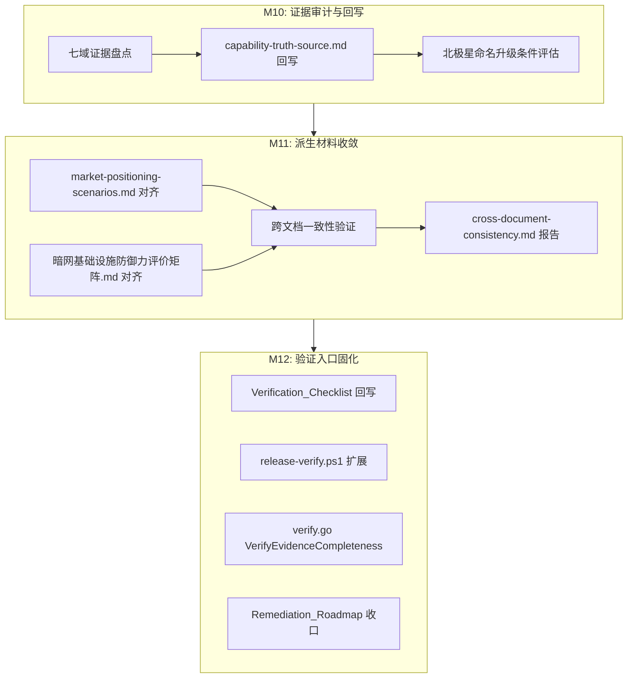

# 设计文档：Phase 4 北极星升级判定

## 概述

Phase 4 是北极星实施计划的收官阶段，不新增能力域，只负责将 Phase 1-3 产出的局部证据收敛为正式能力升级判定。

核心工作分三类：

1. **治理文档回写**（M10-M11）：七域证据盘点 → `capability-truth-source.md` 状态回写 → `market-positioning-scenarios.md` 和 `暗网基础设施防御力评价矩阵.md` 收敛对齐 → 跨文档一致性验证
2. **验证入口固化**（M12）：`Verification_Checklist` 新增条目 → `release-verify.ps1` 扩展 Gate → `verify.go` 新增 `VerifyEvidenceCompleteness`
3. **周期收口**（M12）：`capability-gap-remediation-roadmap.md` 标记完成 → `source-of-truth-map.md` 归档登记

新增代码量极小，仅涉及：
- `scripts/release-verify.ps1`：追加 Phase 1-3 关键检查 Gate
- `deploy/release/verify.go`：新增 `VerifyEvidenceCompleteness` 函数
- `deploy/release/evidence.go`：新增 `EvidenceManifest` 结构体和默认清单

## 架构

Phase 4 不改变系统架构。工作流为线性文档管道 + 少量代码扩展：



## 组件与接口

### 1. 治理文档组件（纯文档操作）

| 文档 | 操作 | 依赖 |
|------|------|------|
| `docs/governance/capability-truth-source.md` | 七域状态回写 + 证据锚点更新 | Phase 1-3 证据产物 |
| `docs/governance/market-positioning-scenarios.md` | 商业叙事与主文档对齐 | capability-truth-source.md 回写结果 |
| `docs/暗网基础设施防御力评价矩阵.md` | 评分与话术对齐 | capability-truth-source.md 回写结果 |
| `docs/governance/source-of-truth-map.md` | 归档登记更新 | M12 完成 |
| `docs/governance/capability-gap-remediation-roadmap.md` | Status 更新 + 本轮总结 | M10-M12 全部完成 |
| `docs/Mirage 功能确认与功能验证任务清单.md` | 新增 M1-M12 验证条目 | Phase 1-3 drill 脚本路径 |

### 2. 证据审计报告（新建文档）

`docs/reports/phase4-evidence-audit.md`：七域证据盘点结果，每域包含当前状态、证据列表、验收标准达成情况、升级判定结论。

`docs/reports/cross-document-consistency.md`：跨文档一致性检查报告，按七个能力域出结构化核对表，每域包含：Status_Level 是否一致、是否有限定语、是否引用主证据锚点边界、是否存在绝对化违规词。

### 3. Release_Verify_Script 扩展

在 `scripts/release-verify.ps1` 现有 15 项 Gate 之后追加新 Gate：

```powershell
# Gate 6: Phase 1-3 关键测试回归
Check "Phase1 Client Orchestrator tests" { ... }
Check "Phase1 RecoveryFSM tests"         { ... }
Check "Phase1 Resolver tests"            { ... }
Check "Phase2 NPM PBT"                   { ... }
Check "Phase2 BDNA PBT"                  { ... }
Check "Phase3 Quota isolation -count=10" { ... }  # 已有类似 Gate，可合并或跳过
Check "Phase3 Security regression"       { ... }  # 已有类似 Gate，可合并或跳过

# Gate 7: 证据文件存在性
Check "Evidence: carrier-matrix"         { Test-Path ... }
Check "Evidence: stealth-experiment"     { Test-Path ... }
Check "Evidence: ebpf-coverage-map"      { Test-Path ... }
Check "Evidence: deployment-tiers"       { Test-Path ... }
Check "Evidence: joint-drill"            { Test-Path ... }
```

设计要点：
- 新增 Gate 追加在现有 Gate 之后，不修改现有 15 项
- 引入三态结果模型：现有 15 项保持 PASS/FAIL 二态；新增 Gate 支持 SKIP（环境不满足或路径缺失）
- Result 行格式更新为 `$Pass passed, $Fail failed, $Skip skipped`（现有 Gate 的 $Skip 始终为 0，向后兼容）
- eBPF 相关 Gate 在非 Linux 环境 SKIP（检测 `$IsLinux`）
- 引用路径不存在时 SKIP 而非 FAIL（使用 `Test-Path` 前置检查）
- 新增 `$Skip` 变量，初始化为 0，新增 Gate 中条件不满足时 `$Skip++` 而非 `$Fail++`

### 4. VerifyEvidenceCompleteness（Go 代码）

新增文件 `deploy/release/evidence.go`：

```go
// EvidenceItem 单条证据文件
type EvidenceItem struct {
    Domain    string `json:"domain"`     // 能力域名称
    Milestone string `json:"milestone"`  // M1-M12
    Path      string `json:"path"`       // 文件路径（相对项目根）
    Required  bool   `json:"required"`   // true=必须存在, false=可选
}

// EvidenceManifest 证据清单
type EvidenceManifest struct {
    Items []EvidenceItem `json:"items"`
}

// EvidenceResult 验证结果
type EvidenceResult struct {
    MissingRequired []EvidenceItem // 缺失的必须文件
    MissingOptional []EvidenceItem // 缺失的可选文件
}

// VerifyEvidenceCompleteness 校验证据完整性
func VerifyEvidenceCompleteness(manifest *EvidenceManifest, rootDir string) (*EvidenceResult, error)
```

函数行为：
- 遍历 `manifest.Items`，对每个 item 检查 `filepath.Join(rootDir, item.Path)` 是否存在
- required 文件缺失 → 收集到 `MissingRequired`
- optional 文件缺失 → 收集到 `MissingOptional`
- `len(MissingRequired) > 0` 时返回 error，error message 包含所有缺失 required 文件的路径和所属能力域
- `len(MissingRequired) == 0` 时返回 nil error（即使有 optional 缺失）
- 现有 `VerifyManifest` 函数不变

### 5. Drill 脚本（新建）

| 脚本 | 用途 |
|------|------|
| `deploy/scripts/drill-m10-evidence-audit.sh` | M10 证据审计：检查七域证据文件存在性 + capability-truth-source.md 回写完整性 |
| `deploy/scripts/drill-m11-convergence.sh` | M11 收敛验证：按七域结构化核对表检查三份文档一致性（Status_Level / 限定语 / 主证据锚点引用 / 绝对化违规词） |
| `deploy/scripts/drill-m12-release-gate.sh` | M12 验证入口：执行 release-verify.ps1 + `go test ./deploy/release/` + 检查 Remediation_Roadmap Status |

## 数据模型

### EvidenceManifest 默认内容

默认 manifest 覆盖 M1-M12 全部里程碑的关键证据文件：

| 能力域 | 里程碑 | 路径 | Required |
|--------|--------|------|----------|
| 多承载编排与降级 | M1 | `docs/governance/carrier-matrix.md` | true |
| 多承载编排与降级 | M2 | `deploy/evidence/m2-degradation-drill.log` | true |
| 节点恢复与共振发现 | M3 | `deploy/evidence/m3-node-death-drill.log` | true |
| 会话连续性与链路漂移 | M4 | `deploy/evidence/m4-continuity-drill.log` | true |
| 会话连续性与链路漂移 | M4 | `deploy/evidence/m4-continuity-report.md` | true |
| 流量整形与特征隐匿 | M5 | `docs/reports/stealth-experiment-plan.md` | true |
| 流量整形与特征隐匿 | M6 | `docs/reports/stealth-experiment-results.md` | true |
| 流量整形与特征隐匿 | M6 | `docs/reports/stealth-claims-boundary.md` | true |
| eBPF 深度参与 | M7 | `docs/reports/ebpf-coverage-map.md` | true |
| 反取证与最小运行痕迹 | M8 | `docs/reports/deployment-tiers.md` | true |
| 反取证与最小运行痕迹 | M8 | `docs/reports/deployment-baseline-checklist.md` | true |
| 准入控制与防滥用 | M9 | `docs/reports/access-control-joint-drill.md` | true |
| 全域 | M10 | `docs/reports/phase4-evidence-audit.md` | true |
| 全域 | M11 | `docs/reports/cross-document-consistency.md` | true |
| 全域 | M12 | `deploy/release/evidence.go` | true |
| 全域 | M12 | `deploy/release/evidence_test.go` | true |
| 多承载编排与降级 | M2 | `deploy/scripts/drill-m2-degradation.sh` | optional |
| 节点恢复与共振发现 | M3 | `deploy/scripts/drill-m3-node-death.sh` | optional |
| 会话连续性与链路漂移 | M4 | `deploy/scripts/drill-m4-continuity.sh` | optional |
| 流量整形与特征隐匿 | M6 | `deploy/scripts/drill-m6-experiment.sh` | optional |
| eBPF 深度参与 | M7 | `deploy/scripts/drill-m7-ebpf-coverage.sh` | optional |
| 反取证与最小运行痕迹 | M8 | `deploy/scripts/drill-m8-baseline.sh` | optional |
| 准入控制与防滥用 | M9 | `deploy/scripts/drill-m9-joint-drill.sh` | optional |


## 正确性属性

*正确性属性是在系统所有合法执行中都应成立的特征或行为——本质上是对系统应做什么的形式化陈述。属性是人类可读规格说明与机器可验证正确性保证之间的桥梁。*

### PBT 适用性评估

Phase 4 的工作以治理文档回写和跨文档对齐为主，绝大多数验收标准属于文档操作（INTEGRATION）或一次性检查（SMOKE/EXAMPLE），不适合 PBT。

唯一适合 PBT 的代码组件是 `VerifyEvidenceCompleteness` 函数：
- 纯函数（输入 manifest + 文件系统状态 → 输出 result/error）
- 行为随输入显著变化（不同 manifest 内容、不同文件存在/缺失组合）
- 100+ 次迭代可发现边界情况（空 manifest、全 required、全 optional、混合、路径边界）

需求 8.1/8.3/8.4 合并为一个综合属性：

### Property 1: VerifyEvidenceCompleteness 正确性

*For any* Evidence Manifest（包含任意数量的 required 和 optional 条目）和任意文件存在状态组合，`VerifyEvidenceCompleteness` 返回 error 当且仅当存在至少一个 required 文件缺失；且 error message 包含所有缺失 required 文件的路径；且 optional 文件缺失不导致 error。

**Validates: Requirements 8.1, 8.3, 8.4**

### 向后兼容属性（Example-Based）

以下属性通过 example-based 测试验证，不使用 PBT：

- **现有 VerifyManifest 不变**：扩展后 `VerifyManifest` 函数签名和行为与扩展前完全一致（需求 8.5）
- **Release_Verify_Script 向后兼容**：现有 15 项 Gate 在扩展后产生相同 PASS/FAIL 结果（需求 7.6）

## 错误处理

### VerifyEvidenceCompleteness

| 场景 | 处理 |
|------|------|
| manifest 为 nil 或 Items 为空 | 返回空 result + nil error（无需检查） |
| rootDir 不存在 | 所有文件视为缺失，按正常逻辑返回 |
| 文件路径包含 `..` 或绝对路径 | 正常 Join 处理，不做路径安全校验（信任 manifest 内容） |
| required 文件缺失 | 收集所有缺失项后一次性返回 error（不 fail-fast） |
| os.Stat 返回非 NotExist 错误（权限等） | 视为缺失，记录到 result |

### Release_Verify_Script

| 场景 | 处理 |
|------|------|
| 新增 Gate 引用的测试包不存在 | SKIP + 输出原因 |
| 非 Linux 环境执行 eBPF Gate | SKIP（检测 `$IsLinux`） |
| Phase 1-3 证据文件不存在 | SKIP + 输出 "evidence file not found" |
| 新增 Gate 执行超时 | 依赖 Go test 自身超时机制 |

## 测试策略

### 双轨测试方法

Phase 4 代码量极小，测试策略以 example-based 为主，PBT 仅用于 `VerifyEvidenceCompleteness`。

### Property-Based Testing

- 库：`pgregory.net/rapid`（与 Phase 1-3 一致）
- 最少 100 次迭代
- 测试文件：`deploy/release/evidence_test.go`
- 标签格式：`// Feature: phase4-northstar-verdict, Property 1: VerifyEvidenceCompleteness correctness`

PBT 测试设计：
- 使用 `rapid` 生成随机 `EvidenceManifest`（items 数量 ∈ [0,20]，每个 item 随机 required/optional）
- 使用临时目录 + 随机创建/不创建文件模拟文件系统状态
- 验证返回值与预期一致

### Example-Based Testing

| 测试 | 文件 | 验证内容 |
|------|------|----------|
| `TestVerifyEvidenceCompleteness_AllPresent` | `evidence_test.go` | 全部文件存在 → nil error |
| `TestVerifyEvidenceCompleteness_RequiredMissing` | `evidence_test.go` | required 缺失 → error 包含路径 |
| `TestVerifyEvidenceCompleteness_OptionalMissing` | `evidence_test.go` | optional 缺失 → nil error + warning |
| `TestVerifyEvidenceCompleteness_EmptyManifest` | `evidence_test.go` | 空 manifest → nil error |
| `TestVerifyManifest_Unchanged` | `verify_test.go` | 现有 VerifyManifest 行为不变 |
| `TestDefaultEvidenceManifest_CoversM1ToM12` | `evidence_test.go` | 默认 manifest 覆盖 M1-M12 |

### 文档验证（脚本化）

跨文档一致性检查通过 drill 脚本实现，不属于 Go 测试范畴：
- `drill-m10-evidence-audit.sh`：七域证据文件存在性检查
- `drill-m11-convergence.sh`：按七域结构化核对表检查三份文档一致性（Status_Level / 限定语 / 主证据锚点引用 / 绝对化违规词）
- `drill-m12-release-gate.sh`：release-verify.ps1 执行 + `go test ./deploy/release/` 执行 + Remediation_Roadmap Status 检查
