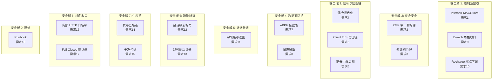
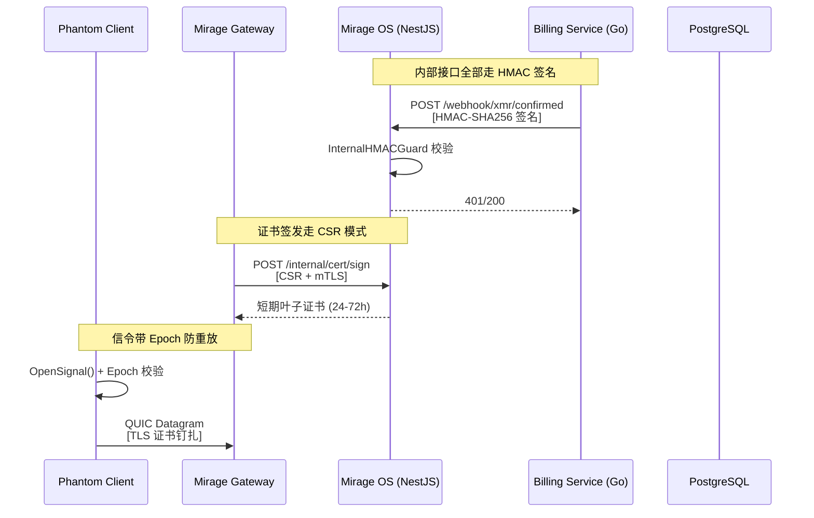

# 技术设计文档：运营前安全加固（Pre-Launch Security Hardening）

## 概述

本设计文档基于 18 项安全审计发现（T01~T18），为 Mirage 系统的运营前安全加固提供技术方案。系统采用 Go + TypeScript (NestJS) + C (eBPF) 混合架构：

- **OS 控制面**：NestJS (api-server) + Go (services/billing, gateway-bridge)
- **Gateway 数据面**：Go (mirage-gateway) + C (bpf/)
- **Client**：Go (phantom-client)
- **数据库**：Prisma + PostgreSQL

设计按 9 个安全域组织，每个域对应一组需求，覆盖从控制面鉴权到数据面 eBPF 健康监测的完整攻击面。

---

## 架构

### 安全域划分



### 跨组件交互



---

## 组件与接口

### 1. InternalHMACGuard（NestJS 中间件）

**位置**：`mirage-os/api-server/src/common/internal-hmac.guard.ts`

```typescript
interface InternalHMACGuardConfig {
  secret: string;           // HMAC-SHA256 密钥
  timestampTolerance: number; // 时间窗口（秒），默认 300
  nonceStore: NonceStore;   // nonce 去重存储
}

// 请求头
// X-Internal-Timestamp: Unix 秒
// X-Internal-Nonce: UUID v4
// X-Internal-Signature: HMAC-SHA256(secret, timestamp + nonce + SHA256(body))
```

**校验流程**：
1. 提取 timestamp、nonce、signature
2. 校验 timestamp 在 ±5 分钟窗口内
3. 校验 nonce 未在窗口期内使用过（内存 Map + TTL 清理）
4. 计算 HMAC-SHA256 并比对签名
5. 任一步骤失败返回 401/403

### 2. 信令世代化扩展（Go）

**位置**：`mirage-gateway/pkg/gswitch/signal_crypto.go`

```go
// SignalPayload 扩展字段
type SignalPayload struct {
    Timestamp  int64          // 已有
    TTL        uint32         // 已有
    Epoch      uint64         // 新增：世代编号，单调递增
    ManifestID [16]byte       // 新增：路由表版本标识
    ExpireAt   int64          // 新增：绝对过期时间
    Gateways   []GatewayEntry
    Domains    []string
}
```

**Epoch 校验规则**：
- `Epoch < CurrentEpoch` → 丢弃
- `Epoch == CurrentEpoch` → 要求 `Timestamp > lastAcceptedTimestamp`
- `Epoch > CurrentEpoch` → 接受并更新 `CurrentEpoch`
- `ExpireAt < now` → 丢弃（即使验签通过）

**持久化**：`~/.phantom-client/epoch` 文件存储 `CurrentEpoch`，重启后加载。

### 3. eBPF 金丝雀挂载（Go）

**位置**：`mirage-gateway/pkg/ebpf/canary.go`

```go
// CanaryAttach 金丝雀挂载流程
// 1. 创建 dummy0 虚拟接口
// 2. 在 dummy0 上挂载所有 eBPF 程序
// 3. 执行自检（发送测试包，验证 Map 读写）
// 4. 卸载 dummy0 上的程序
// 5. 删除 dummy0
// 6. 返回校验结果
func (l *Loader) CanaryAttach() error
```

**健康检查器**：`mirage-gateway/pkg/ebpf/health_checker.go`

```go
type HealthChecker struct {
    programs    map[string]*HealthStatus
    thresholds  HealthThresholds
    fallbackFn  func(progName string) error // iptables fallback
}

type HealthThresholds struct {
    MaxSoftIRQDelta   uint64        // SoftIRQ 增量阈值
    MaxDropRate       float64       // 丢包率阈值
    MaxRingBufErrors  uint64        // Ring Buffer 错误阈值
    CheckInterval     time.Duration // 采样间隔
}

type HealthStatus struct {
    Name      string
    Healthy   bool
    LastCheck time.Time
    Metrics   HealthMetrics
}
```

### 4. 日志脱敏器（Go）

**位置**：`mirage-gateway/pkg/logger/sanitizer.go`

```go
type Sanitizer struct{}

// SanitizeIP 截断 IP 为 /24 网段: "1.2.3.4" → "1.2.3.*/24"
func (s *Sanitizer) SanitizeIP(ip string) string

// SanitizeUserID 截断 userID: "abc12345-xxxx" → "abc12345..."
func (s *Sanitizer) SanitizeUserID(id string) string

// SanitizeToken 只保留前 4 位: "abcdef123456" → "abcd****"
func (s *Sanitizer) SanitizeToken(token string) string
```

**日志分级**：
- `audit`：审计日志，独立通道，不受 LOG_LEVEL 控制
- `ops`：运维日志，默认开启
- `debug`：仅 `LOG_LEVEL=debug` 时开启，生产禁止落盘

### 5. 证书签发 API（NestJS）

**位置**：`mirage-os/api-server/src/modules/certs/cert-sign.controller.ts`

```typescript
// POST /internal/cert/sign
// Guard: InternalHMACGuard + mTLS
interface CertSignRequest {
  csr: string;        // PEM 编码的 CSR
  gatewayId: string;  // 网关标识
}

interface CertSignResponse {
  certificate: string; // PEM 编码的叶子证书
  expiresAt: string;   // ISO 8601 过期时间
  serialNumber: string;
}
```

### 6. 审计脱敏拦截器（NestJS）

**位置**：`mirage-os/api-server/src/modules/audit/audit-interceptor.ts`（修改）

```typescript
// 敏感键黑名单
const SENSITIVE_KEYS = new Set([
  'password', 'passwordHash', 'totpCode', 'totpSecret',
  'token', 'secret', 'signature', 'key', 'ed25519Pubkey'
]);

// 敏感路径前缀
const SENSITIVE_PATHS = ['/auth/', '/billing/'];

function sanitizeBody(body: any, path: string): any
```

### 7. Session Shaper（Go - Client 侧）

**位置**：`phantom-client/pkg/gtclient/session_shaper.go`

```go
type SessionShaper struct {
    window     time.Duration // 聚合窗口 (10-50ms)
    buffer     [][]byte      // 待发送片段缓冲
    flushTimer *time.Timer
    tier       ProductTier   // Standard/Platinum/Diamond
}

type ProductTier int
const (
    TierStandard ProductTier = iota // 无去相关
    TierPlatinum                     // 30ms 窗口
    TierDiamond                      // 50ms 窗口
)
```

### 8. Path Health Scorer（Go - Client 侧）

**位置**：`phantom-client/pkg/gtclient/path_health.go`

```go
type PathHealthScorer struct {
    rttBaseline    float64 // EWMA RTT 基线
    ewmaAlpha      float64 // EWMA 衰减系数
    failCount      int     // 连续失败计数
    switchFreq     int     // 切换频率
    suspiciousScore float64
    threshold      float64
}
```

**状态机扩展**：在 `state.go` 中新增 `StateSuspicious` 状态，介于 `StateConnected` 和 `StateDegraded` 之间。

### 9. Command Auth 扩展（Go - Gateway 侧）

**位置**：`mirage-gateway/pkg/api/command_auth.go`（修改）

HMAC 签名覆盖范围扩展：`commandType + timestamp + nonce + SHA256(payload)`

新增 nonce 重放缓存（内存 LRU，TTL 120s）。

---

## 数据模型

### Prisma Schema 变更

```prisma
model User {
  // 已有字段...
  invitedBy        String?    @map("invited_by")
  inviteRoot       String?    @map("invite_root")
  inviteDepth      Int        @default(0) @map("invite_depth")
  observationEndsAt DateTime? @map("observation_ends_at")
}

model Deposit {
  // 已有字段...
  transferIndex Int? @map("transfer_index")
  // 唯一键变更
  @@unique([txHash, transferIndex])
}

model QuotaPurchase {
  // 已有字段...
  depositId String? @map("deposit_id")
  deposit   Deposit? @relation(fields: [depositId], references: [id])
}
```

### 信令 Epoch 持久化格式

```
# ~/.phantom-client/epoch
# 二进制文件，8 字节 little-endian uint64
```

### Release Manifest 结构

```go
type ReleaseManifest struct {
    Version    string `json:"version"`
    BuildTime  string `json:"build_time"`
    GitCommit  string `json:"git_commit"`
    BinarySHA256 string `json:"binary_sha256"`
    Signature  string `json:"signature"` // Ed25519 签名（hex）
}
```

---

## 正确性属性

*属性是系统在所有有效执行中都应保持为真的特征或行为——本质上是对系统应做什么的形式化陈述。属性是人类可读规范与机器可验证正确性保证之间的桥梁。*

### Property 1: HMAC Guard 拒绝无效请求

*对于任意*请求体和时间戳组合，如果 HMAC 签名无效（错误密钥、错误 body hash、时间戳超出 ±5 分钟窗口、或 nonce 已被使用），InternalHMACGuard 应拒绝该请求并返回 401/403。

**Validates: Requirements 1.1, 1.2, 1.3**

### Property 2: 充值落账幂等性

*对于任意*处于 PENDING 状态的 Deposit 记录，调用 confirmDeposit N 次（N ≥ 1），用户余额应恰好增加一次；对于任意非 PENDING 状态的 Deposit，调用 confirmDeposit 应不改变余额。

**Validates: Requirements 2.2, 2.3**

### Property 3: 充值子地址唯一性

*对于任意*同一用户的 N 次充值请求，生成的 N 个订单级子地址应两两不同。

**Validates: Requirements 2.5**

### Property 4: 邀请链深度正确性

*对于任意*邀请链，当邀请码被核销时，新用户的 invite_depth 应等于邀请人的 depth + 1，且 invite_root 应与邀请链根节点一致。

**Validates: Requirements 3.1**

### Property 5: 观察期配额限制

*对于任意*处于 7 天观察期内的用户，配额上限应不超过 1GB 且并发会话数应不超过 1。

**Validates: Requirements 3.2**

### Property 6: 邀请树熔断完整性

*对于任意*邀请树结构，触发熔断操作后，所有共享同一 invite_root 的用户应全部被冻结。

**Validates: Requirements 3.3**

### Property 7: 注册速率限制

*对于任意* IP 地址，在一小时窗口内使用同一邀请码来源的第 4 次及后续注册尝试应被拒绝。

**Validates: Requirements 3.4**

### Property 8: 信令世代化防重放

*对于任意*信令，如果其 Epoch < Client 本地 CurrentEpoch，或 Epoch == CurrentEpoch 但 Timestamp ≤ 上一条已接受信令的 Timestamp，或 ExpireAt < 当前时间，Client 应丢弃该信令。

**Validates: Requirements 4.2, 4.3, 4.4**

### Property 9: Epoch 持久化 Round-Trip

*对于任意* uint64 类型的 Epoch 值，写入持久化文件后重新读取应得到相同的值。

**Validates: Requirements 4.5**

### Property 10: 路由表签名验证

*对于任意*路由表载荷，篡改载荷中的任意字节应导致签名验证失败。

**Validates: Requirements 5.4**

### Property 11: 短期证书有效期约束

*对于任意*有效的 CSR 请求，OS 签发的叶子证书有效期应在 24h 到 72h 之间。

**Validates: Requirements 6.1**

### Property 12: eBPF 程序隔离摘钩

*对于任意*一组 eBPF 程序，当其中某个程序的健康指标超过阈值时，Manager 应仅 detach 该程序并切换到 fallback，其余程序应保持正常运行。

**Validates: Requirements 7.3, 7.4**

### Property 13: 日志脱敏格式正确性

*对于任意*有效的 IPv4 地址，SanitizeIP 应输出 `x.x.x.*/24` 格式；*对于任意* userID，SanitizeUserID 应输出前 8 位加 `...`；*对于任意* token，SanitizeToken 应输出前 4 位加 `****`。

**Validates: Requirements 8.2**

### Property 14: Breach 认证角色过滤

*对于任意*绑定了 Ed25519 公钥但不具有 operator/admin 角色的用户，Breach 认证应拒绝签发 admin token。

**Validates: Requirements 9.1**

### Property 15: Gateway 命令签名完整性与防重放

*对于任意*有效的 Gateway 命令，修改 commandType、timestamp、nonce 或 payload 中的任意字段应导致 HMAC 验证失败；且同一 nonce 在 120 秒内重复使用应被拒绝。

**Validates: Requirements 9.5, 9.6**

### Property 16: Recharge 端点角色限制

*对于任意*不具有 admin 角色的用户，调用 POST /billing/recharge 应返回 403。

**Validates: Requirements 10.1**

### Property 17: 用户详情敏感字段排除

*对于任意*用户，findOne 返回的对象不应包含 passwordHash、totpSecret 或 ed25519Pubkey 字段。

**Validates: Requirements 11.1**

### Property 18: 审计日志敏感键过滤

*对于任意*包含敏感键（password、totpCode、token、secret、signature、key）的请求体，经审计拦截器处理后的 actionParams 不应包含任何这些键。

**Validates: Requirements 11.2, 11.3**

### Property 19: 命令审计摘要化

*对于任意*命令及其参数，审计日志的 Params 字段应仅包含命令类型和级别摘要，不包含原始参数全文。

**Validates: Requirements 11.4**

### Property 20: Session Shaper 产品层级窗口映射

*对于任意*产品层级，Session Shaper 的聚合窗口应满足：Standard = 0（不启用）、Platinum = 30ms、Diamond = 50ms。

**Validates: Requirements 12.4**

### Property 21: 路径健康评分驱动状态转换

*对于任意* RTT 样本序列，当健康评分越过阈值时 Client 应进入 StateSuspicious 并暂停控制面写入；当评分恢复时应退出 StateSuspicious。

**Validates: Requirements 13.4, 13.5**

### Property 22: 发布产物签名验证

*对于任意*二进制内容，计算 SHA-256 并与 ReleaseManifest 中的签名比对，篡改任意单字节应导致验证失败。

**Validates: Requirements 14.2**

### Property 23: 内部 HTTP 白名单过滤

*对于任意* URL，如果其 host 不在白名单（127.0.0.1、localhost、::1、配置的内网地址）内，Internal_HTTP_Client 应拒绝该请求。

**Validates: Requirements 16.1**

### Property 24: 启动时 URL 环境变量白名单校验

*对于任意* `*_URL` 环境变量，如果其 host 不在白名单内，服务启动应失败。

**Validates: Requirements 16.4**

---

## 错误处理

### 分层错误处理策略

| 层级 | 错误类型 | 处理方式 |
|------|---------|---------|
| NestJS Guard | HMAC 校验失败 | 返回 401/403，记录审计日志 |
| NestJS Guard | 角色不足 | 返回 403，记录审计日志 |
| Go Billing | 状态前置条件不满足 | 跳过操作，返回幂等成功 |
| Go Signal | Epoch/Timestamp 校验失败 | 丢弃信令，记录 ops 日志 |
| Go eBPF | Canary 挂载失败 | 阻止启动，返回错误 |
| Go eBPF | 运行时健康异常 | 自动摘钩 + iptables fallback |
| Go TLS | 证书续签失败 | 保持旧证书，重试，记录告警 |
| Go Client | TLS 验证失败 | 拒绝连接，报告错误 |
| 配置校验 | 必填项缺失 | Fail-Closed，拒绝启动 |

### Fail-Closed 原则

所有安全关键配置缺失时，服务必须拒绝启动：
- `JWT_SECRET` 为空 → NestJS 模块初始化抛异常
- `BRIDGE_INTERNAL_SECRET` 为空 → 启动抛异常
- `CommandSecret` 为空 → Gateway 启动失败
- `grpc.tls_enabled` 为 false → OS 启动失败
- `*_URL` host 不在白名单 → 启动失败

---

## 测试策略

### 属性测试（Property-Based Testing）

本特性涉及大量输入验证、签名校验、状态机转换等逻辑，适合使用属性测试。

**Go 侧**：使用 `pgregory.net/rapid` 库
**TypeScript 侧**：使用 `fast-check` 库

**配置要求**：
- 每个属性测试最少运行 100 次迭代
- 每个测试用注释标注对应的设计属性
- 标注格式：`Feature: pre-launch-security-hardening, Property {number}: {property_text}`

**属性测试覆盖范围**（对应上述 24 个 Property）：

| Property | 测试位置 | 框架 |
|----------|---------|------|
| 1 (HMAC Guard) | api-server 单元测试 | fast-check |
| 2 (充值幂等) | billing service 单元测试 | rapid |
| 3 (子地址唯一) | billing service 单元测试 | rapid |
| 4 (邀请链深度) | auth service 单元测试 | rapid |
| 5 (观察期配额) | quota service 单元测试 | rapid |
| 6 (邀请树熔断) | admin service 单元测试 | rapid |
| 7 (注册速率) | auth service 单元测试 | fast-check |
| 8 (信令防重放) | signal_crypto 单元测试 | rapid |
| 9 (Epoch Round-Trip) | persist 单元测试 | rapid |
| 10 (路由表签名) | client 单元测试 | rapid |
| 11 (证书有效期) | cert-sign 单元测试 | fast-check |
| 12 (eBPF 隔离摘钩) | health_checker 单元测试 | rapid |
| 13 (日志脱敏) | sanitizer 单元测试 | rapid |
| 14 (Breach 角色) | breach service 单元测试 | fast-check |
| 15 (命令签名) | command_auth 单元测试 | rapid |
| 16 (Recharge 角色) | billing controller 单元测试 | fast-check |
| 17 (字段排除) | users service 单元测试 | fast-check |
| 18 (审计脱敏) | audit interceptor 单元测试 | fast-check |
| 19 (命令审计摘要) | command_audit 单元测试 | rapid |
| 20 (Shaper 窗口) | session_shaper 单元测试 | rapid |
| 21 (健康评分) | path_health 单元测试 | rapid |
| 22 (发布签名) | release verify 单元测试 | rapid |
| 23 (HTTP 白名单) | internal_http 单元测试 | fast-check |
| 24 (URL 校验) | startup validation 单元测试 | fast-check |

### 单元测试

针对 SMOKE 和 EXAMPLE 类型的验收标准：

- **启动校验测试**：JWT_SECRET 为空、CommandSecret 为空、tls_enabled=false 等场景
- **Schema 约束测试**：唯一键、外键、必填字段
- **配置检查测试**：Docker Compose 端口绑定、.gitignore 条目
- **集成点测试**：Canary 挂载顺序、证书续签流程

### 集成测试

- **TLS 信任链**：使用错误证书的 mock server 验证 Client 拒绝连接
- **证书续签流程**：短期证书过期后自动续签
- **eBPF 健康监测**：注入异常指标验证自动摘钩
- **端到端充值流程**：从 XMR 确认到余额增加的完整链路
