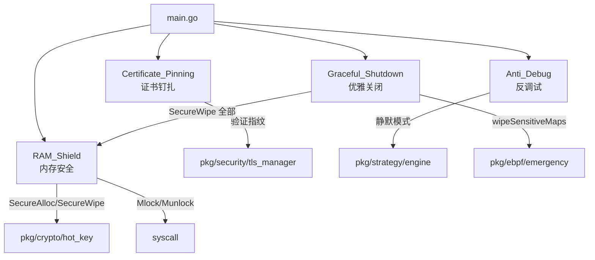
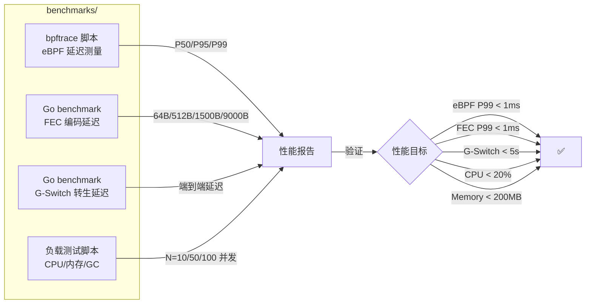

# 设计文档：Phase 4 — 生产加固与交付

## 概述

本设计覆盖 Phase 4 的四个子系统：
- **安全加固**（Go，扩展 mirage-gateway）：RAM_Shield 增强 + 证书钉扎 + 反调试 + tmpfs 验证 + 优雅关闭擦除
- **部署自动化**（Ansible + Shell）：Gateway Ansible playbook + OS docker-compose + mTLS 证书链生成
- **性能验证**（Go benchmark + bpftrace + Shell）：eBPF 延迟 / FEC 编码 / G-Switch 转生 / 资源占用
- **安全检查**（Go test）：自动化安全检查清单验证

设计约束：
- 安全加固模块在 mirage-gateway 进程内运行，扩展已有的 ram_shield.go 和 emergency.go
- 部署自动化使用 Ansible（Gateway）和 docker-compose（OS），不引入 Kubernetes
- 性能验证使用 Go 标准 benchmark + bpftrace 脚本，不引入第三方性能测试框架
- 所有安全功能需要 Linux 平台（/proc 文件系统、syscall.Mlock），提供 Windows/macOS 降级桩
- C 数据面不做变更，仅 Go 控制面加固

## 架构

### 安全加固模块关系



### 部署架构

```mermaid
graph TD
    subgraph 运维工作站
        ANSIBLE[Ansible Controller]
        CERTS[deploy/certs/<br/>证书生成脚本]
    end

    subgraph Gateway 节点（Ansible 部署）
        GW_BIN[mirage-gateway 二进制]
        GW_BPF[eBPF .o 对象文件]
        GW_CERT[/etc/mirage/certs/<br/>gateway.crt + key]
        GW_SVC[systemd<br/>mirage-gateway.service]
        GW_YAML[/etc/mirage/gateway.yaml]
    end

    subgraph OS 节点（docker-compose 部署）
        BRIDGE[gateway-bridge<br/>Go gRPC :50847]
        API[api-server<br/>NestJS :3000]
        PG[(PostgreSQL 15)]
        REDIS[(Redis 7)]
        OS_CERT[/etc/mirage/certs/<br/>os.crt + key]
    end

    ANSIBLE --> |1. 生成证书链| CERTS
    CERTS --> |Root CA + Gateway Cert| GW_CERT
    CERTS --> |Root CA + OS Cert| OS_CERT
    ANSIBLE --> |2. 编译 eBPF + Go| GW_BIN
    ANSIBLE --> |2. 编译 eBPF + Go| GW_BPF
    ANSIBLE --> |3. 生成配置| GW_YAML
    ANSIBLE --> |4. 部署 systemd| GW_SVC

    GW_SVC --> |启动| GW_BIN
    GW_BIN --> |mTLS| BRIDGE
    BRIDGE --> PG
    BRIDGE --> REDIS
    API --> PG
```

### 性能验证架构



## 组件与接口

### 1. pkg/security/ram_shield.go — 内存安全（扩展已有 ram_shield.go）

```go
// SecureBuffer mlock 锁定的安全缓冲区
type SecureBuffer struct {
    data   []byte
    locked bool
}

// RAMShield 增强版内存保护器（扩展 strategy.RAMShield）
type RAMShield struct {
    mu              sync.Mutex
    registeredBufs  []*SecureBuffer // 已注册的敏感缓冲区
    totalLocked     int64
}

// NewRAMShield 创建增强版内存保护器
func NewRAMShield() *RAMShield

// SecureAlloc 分配 mlock 锁定的内存缓冲区
// - 分配指定大小的 []byte
// - 调用 syscall.Mlock 锁定内存页
// - 注册到 registeredBufs 列表
// - Linux 平台实现，Windows/macOS 降级为普通分配
func (rs *RAMShield) SecureAlloc(size int) (*SecureBuffer, error)

// SecureWipe 安全擦除指定缓冲区
// - 逐字节覆写零值（防止编译器优化跳过）
// - 调用 syscall.Munlock 解锁内存页
// - 触发 runtime.GC()
// - 从 registeredBufs 中移除
func (rs *RAMShield) SecureWipe(buf *SecureBuffer) error

// DisableCoreDump 禁用 core dump
// - 设置 RLIMIT_CORE = 0（syscall.Setrlimit）
// - Linux 平台实现，其他平台记录告警
func (rs *RAMShield) DisableCoreDump() error

// CheckSwapUsage 检测内存是否被交换到磁盘
// - 读取 /proc/self/status 中 VmSwap 字段
// - 返回 VmSwap 值（KB）
// - VmSwap > 0 时记录告警并尝试 mlockall
func (rs *RAMShield) CheckSwapUsage() (int64, error)

// WipeAll 擦除所有已注册的敏感缓冲区（Graceful_Shutdown 调用）
func (rs *RAMShield) WipeAll() error
```

### 2. pkg/security/cert_pinning.go — 证书钉扎

```go
// CertPin 证书钉扎管理器
type CertPin struct {
    mu          sync.RWMutex
    pinnedHash  [32]byte   // SHA-256 指纹
    pinned      bool
    configHash  string     // 配置文件预设指纹（hex）
}

// NewCertPin 创建证书钉扎管理器
// - 如果 configHash 非空，使用预设指纹
func NewCertPin(configHash string) *CertPin

// PinCertificate 钉扎证书
// - 计算证书 DER 编码的 SHA-256 指纹
// - 存储到内存中
func (cp *CertPin) PinCertificate(cert *x509.Certificate) error

// VerifyPin 验证证书指纹
// - 计算证书 SHA-256 指纹
// - 与钉扎值比较
// - 不匹配返回 error + 记录安全告警
func (cp *CertPin) VerifyPin(cert *x509.Certificate) error

// UpdatePin 通过安全通道更新钉扎指纹
// - 替换内存中的钉扎值
// - 用于 OS 证书轮换场景
func (cp *CertPin) UpdatePin(newCert *x509.Certificate) error

// GetPinnedHash 获取当前钉扎的指纹（hex 编码）
func (cp *CertPin) GetPinnedHash() string
```

### 3. pkg/security/anti_debug.go — 反调试检测

```go
// AntiDebug 反调试检测器
type AntiDebug struct {
    mu           sync.RWMutex
    silentMode   bool
    lastCheck    time.Time
    interval     time.Duration  // 默认 30 秒
    onSilent     func()         // 进入静默模式回调
    onRecover    func()         // 恢复正常回调
    ctx          context.Context
    cancel       context.CancelFunc
}

// NewAntiDebug 创建反调试检测器
func NewAntiDebug(interval time.Duration) *AntiDebug

// StartMonitor 启动检测循环
// - 每 interval 读取 /proc/self/status 检查 TracerPid
// - 扫描 /proc 中 gdb/strace/ltrace/perf 进程
// - 检测到调试器 → 进入静默模式
// - 调试器脱离 → 10 秒内恢复
func (ad *AntiDebug) StartMonitor(ctx context.Context) error

// IsDebuggerPresent 返回当前是否检测到调试器
// - 读取 /proc/self/status 中 TracerPid
// - 扫描常见调试器进程
func (ad *AntiDebug) IsDebuggerPresent() bool

// EnterSilentMode 进入静默模式
// - 设置 silentMode = true
// - 调用 onSilent 回调
func (ad *AntiDebug) EnterSilentMode()

// ExitSilentMode 退出静默模式
// - 设置 silentMode = false
// - 调用 onRecover 回调
func (ad *AntiDebug) ExitSilentMode()

// IsSilent 返回是否处于静默模式
func (ad *AntiDebug) IsSilent() bool

// SetCallbacks 设置静默/恢复回调
func (ad *AntiDebug) SetCallbacks(onSilent, onRecover func())

// Stop 停止检测循环
func (ad *AntiDebug) Stop()

// ParseTracerPid 解析 /proc/self/status 中的 TracerPid（可测试的纯函数）
func ParseTracerPid(statusContent string) (int, error)
```

### 4. pkg/security/graceful_shutdown.go — 优雅关闭

```go
// ShutdownModule 可关闭模块接口
type ShutdownModule interface {
    Name() string
    Shutdown(ctx context.Context) error
}

// GracefulShutdown 优雅关闭管理器
type GracefulShutdown struct {
    mu              sync.Mutex
    modules         []ShutdownModule       // 注册顺序
    sensitiveBuffers []*SecureBuffer       // 敏感内存区域
    ramShield       *RAMShield
    emergencyMgr    EmergencyWiper         // 接口，方便 mock
    timeout         time.Duration          // 默认 30 秒
}

// EmergencyWiper 紧急擦除接口（对应 emergency.go）
type EmergencyWiper interface {
    TriggerWipe() error
}

// NewGracefulShutdown 创建优雅关闭管理器
func NewGracefulShutdown(ramShield *RAMShield, emergencyMgr EmergencyWiper, timeout time.Duration) *GracefulShutdown

// RegisterModule 注册可关闭模块（按注册顺序记录）
func (gs *GracefulShutdown) RegisterModule(module ShutdownModule)

// RegisterSensitiveBuffer 注册敏感内存区域
func (gs *GracefulShutdown) RegisterSensitiveBuffer(buf *SecureBuffer)

// Shutdown 执行优雅关闭
// 1. 按注册顺序的逆序关闭所有模块
// 2. 调用 EmergencyWiper.TriggerWipe 清空 eBPF Map
// 3. 调用 RAMShield.WipeAll 擦除所有敏感内存
// 4. 30 秒超时后强制退出
// 5. 返回 nil 表示正常完成
func (gs *GracefulShutdown) Shutdown() error
```

### 5. deploy/ansible/ — Ansible Playbook 结构

```
deploy/ansible/
├── playbook.yml                 # 主 playbook
├── inventory/
│   └── hosts.yml                # 主机清单模板
├── roles/
│   ├── common/                  # 通用：内核版本检查、依赖安装
│   │   └── tasks/main.yml
│   ├── certs/                   # 证书：Root CA 生成、节点证书签发
│   │   ├── tasks/main.yml
│   │   └── templates/
│   │       └── openssl.cnf.j2
│   ├── gateway/                 # Gateway：编译 eBPF + Go、部署 systemd
│   │   ├── tasks/main.yml
│   │   ├── templates/
│   │   │   └── gateway.yaml.j2
│   │   └── handlers/main.yml
│   └── upgrade/                 # 升级：停止→备份→部署→重启
│       └── tasks/main.yml
└── group_vars/
    └── all.yml                  # 全局变量
```

#### playbook.yml 核心流程

```yaml
---
- name: Deploy Mirage Gateway
  hosts: gateways
  become: true
  vars:
    mirage_user: mirage
    mirage_dir: /opt/mirage-gateway
    cert_dir: /etc/mirage/certs
    min_kernel: "5.15"

  roles:
    - role: common       # 1. 内核版本检查 + 依赖安装
    - role: certs        # 2. 证书生成/分发
    - role: gateway      # 3. 编译 + 部署 + 启动
```

#### group_vars/all.yml 关键变量

```yaml
# 证书配置
root_ca_bits: 4096
root_ca_days: 3650
gateway_cert_bits: 2048
gateway_cert_days: 365

# OS 端点
os_endpoint: "https://mirage-os:50847"
os_cert_hash: ""  # 预设证书钉扎指纹（可选）

# 编译配置
go_version: "1.21"
clang_flags: "-O2 -target bpf -g -D__TARGET_ARCH_x86"

# 部署路径
gateway_bin_path: /opt/mirage-gateway/bin/mirage-gateway
gateway_config_path: /etc/mirage/gateway.yaml
gateway_service_name: mirage-gateway
```

### 6. deploy/certs/ — 证书生成脚本

```
deploy/certs/
├── gen_root_ca.sh       # 生成自签名 Root CA（RSA 4096，10 年）
├── gen_gateway_cert.sh  # 生成 Gateway 节点证书（RSA 2048，1 年）
├── gen_os_cert.sh       # 生成 OS 节点证书（RSA 2048，1 年）
└── openssl.cnf          # OpenSSL 配置模板
```

#### gen_root_ca.sh 核心逻辑

```bash
#!/bin/bash
# 生成 Root CA（幂等：已存在则跳过）
CA_DIR="${1:-/etc/mirage/certs}"
if [ -f "$CA_DIR/ca.key" ]; then
    echo "Root CA 已存在，跳过生成"
    exit 0
fi
openssl genrsa -out "$CA_DIR/ca.key" 4096
openssl req -new -x509 -key "$CA_DIR/ca.key" -out "$CA_DIR/ca.crt" \
    -days 3650 -subj "/CN=Mirage Root CA/O=Mirage"
chmod 600 "$CA_DIR/ca.key"
```

#### gen_gateway_cert.sh 核心逻辑

```bash
#!/bin/bash
# 生成 Gateway 节点证书
NODE_ID="$1"
CA_DIR="${2:-/etc/mirage/certs}"
openssl genrsa -out "$CA_DIR/gateway.key" 2048
openssl req -new -key "$CA_DIR/gateway.key" \
    -out "$CA_DIR/gateway.csr" \
    -subj "/CN=mirage-gateway-${NODE_ID}/O=Mirage"
openssl x509 -req -in "$CA_DIR/gateway.csr" \
    -CA "$CA_DIR/ca.crt" -CAkey "$CA_DIR/ca.key" \
    -CAcreateserial -out "$CA_DIR/gateway.crt" -days 365
chmod 600 "$CA_DIR/gateway.key"
rm -f "$CA_DIR/gateway.csr"
```

### 7. deploy/docker-compose.os.yml — OS 部署

```yaml
version: '3.8'

services:
  postgres:
    image: postgres:15-alpine
    environment:
      POSTGRES_DB: ${MIRAGE_DB_NAME:-mirage}
      POSTGRES_USER: ${MIRAGE_DB_USER:-mirage}
      POSTGRES_PASSWORD: ${MIRAGE_DB_PASSWORD}
    volumes:
      - pg_data:/var/lib/postgresql/data
    healthcheck:
      test: ["CMD-SHELL", "pg_isready -U ${MIRAGE_DB_USER:-mirage}"]
      interval: 5s
      timeout: 3s
      retries: 5

  redis:
    image: redis:7-alpine
    command: redis-server --appendonly yes
    volumes:
      - redis_data:/data
    healthcheck:
      test: ["CMD", "redis-cli", "ping"]
      interval: 5s
      timeout: 3s
      retries: 5

  gateway-bridge:
    build: ./gateway-bridge
    depends_on:
      postgres:
        condition: service_healthy
      redis:
        condition: service_healthy
    environment:
      DATABASE_URL: postgres://${MIRAGE_DB_USER:-mirage}:${MIRAGE_DB_PASSWORD}@postgres:5432/${MIRAGE_DB_NAME:-mirage}
      REDIS_URL: redis://redis:6379
      TLS_CERT: /etc/mirage/certs/os.crt
      TLS_KEY: /etc/mirage/certs/os.key
      TLS_CA: /etc/mirage/certs/ca.crt
    volumes:
      - ${MIRAGE_CERT_DIR:-./certs}:/etc/mirage/certs:ro
    ports:
      - "50847:50847"

  api-server:
    build: ./api-server
    depends_on:
      postgres:
        condition: service_healthy
      redis:
        condition: service_healthy
    environment:
      DATABASE_URL: postgres://${MIRAGE_DB_USER:-mirage}:${MIRAGE_DB_PASSWORD}@postgres:5432/${MIRAGE_DB_NAME:-mirage}
      REDIS_URL: redis://redis:6379
      JWT_SECRET: ${MIRAGE_JWT_SECRET}
    ports:
      - "3000:3000"

volumes:
  pg_data:
  redis_data:
```

### 8. benchmarks/ — 性能基准测试

```
benchmarks/
├── ebpf_latency.bt          # bpftrace 脚本：eBPF 延迟测量
├── fec_bench_test.go        # Go benchmark：FEC 编码延迟
├── gswitch_bench_test.go    # Go benchmark：G-Switch 转生延迟
├── resource_bench_test.go   # Go benchmark：资源占用
└── load_test.sh             # 负载测试脚本
```

#### ebpf_latency.bt

```
#!/usr/bin/env bpftrace
// 测量 XDP 和 TC 程序执行延迟
kprobe:bpf_prog_run_xdp { @start[tid] = nsecs; }
kretprobe:bpf_prog_run_xdp /@start[tid]/ {
    @xdp_latency_ns = hist(nsecs - @start[tid]);
    @xdp_count = count();
    delete(@start[tid]);
}
kprobe:bpf_prog_run_generic_xdp { @start_tc[tid] = nsecs; }
kretprobe:bpf_prog_run_generic_xdp /@start_tc[tid]/ {
    @tc_latency_ns = hist(nsecs - @start_tc[tid]);
    @tc_count = count();
    delete(@start_tc[tid]);
}
interval:s:10 { print(@xdp_latency_ns); print(@tc_latency_ns); }
END { clear(@start); clear(@start_tc); }
```

#### fec_bench_test.go 接口

```go
package benchmarks

// BenchmarkFECEncode_64B   测量 64 字节数据包 FEC 编码延迟
// BenchmarkFECEncode_512B  测量 512 字节数据包 FEC 编码延迟
// BenchmarkFECEncode_1500B 测量 1500 字节数据包 FEC 编码延迟
// BenchmarkFECEncode_9000B 测量 9000 字节数据包 FEC 编码延迟
// BenchmarkFECDecode_64B   测量 64 字节数据包 FEC 解码延迟
// 每个 benchmark 验证 P99 < 1ms（通过 b.ReportMetric 输出）
```

#### gswitch_bench_test.go 接口

```go
package benchmarks

// BenchmarkGSwitchReincarnation 测量从收到转生指令到新域名生效的端到端延迟
// - 创建 GSwitchManager + mock eBPF Map
// - 预填充热备域名池
// - 测量 TriggerEscape 执行时间
// - 验证延迟 < 5s
```

#### resource_bench_test.go 接口

```go
package benchmarks

// BenchmarkResourceUsage_10  模拟 10 并发连接，采集 CPU/内存
// BenchmarkResourceUsage_50  模拟 50 并发连接
// BenchmarkResourceUsage_100 模拟 100 并发连接
// 每个 benchmark 输出：
// - runtime.MemStats.Alloc（验证 < 200MB）
// - CPU 使用率（验证 < 20%）
// - runtime.NumGoroutine
// - GC 暂停时间
```

### 9. tests/security_checklist_test.go — 安全检查清单

```go
package tests

// TestSecurityChecklist_MlockRegistered
// - 验证所有加密密钥缓冲区已注册到 RAMShield
// - 检查 RAMShield.registeredBufs 非空

// TestSecurityChecklist_MTLSEnabled
// - 验证生产配置中 mcc.tls.enabled == true
// - 加载 gateway.yaml 检查

// TestSecurityChecklist_CertPinningActive
// - 验证 CertPin.pinned == true
// - 创建 CertPin 并钉扎证书后检查

// TestSecurityChecklist_AntiDebugRunning
// - 验证 AntiDebug 检测循环已启动
// - 启动 AntiDebug 后检查 IsDebuggerPresent 可调用

// TestSecurityChecklist_NoTmpfsDiskWrite
// - 验证 tmpfs 模式下无磁盘写入
// - 读取 /proc/self/io 中 write_bytes 字段

// TestSecurityChecklist_EmergencyWipe
// - 调用 EmergencyManager.TriggerWipe
// - 验证所有敏感 Map 被清空

// TestSecurityChecklist_GracefulShutdownWipe
// - 注册敏感缓冲区 → 触发 Shutdown
// - 验证所有缓冲区字节为零
```

## 数据模型

### gateway.yaml 安全配置扩展

```yaml
# 安全加固配置（新增）
security:
  ram_shield:
    enabled: true
    disable_core_dump: true
    check_swap_interval: 60s    # swap 检查间隔
  cert_pinning:
    enabled: true
    preset_hash: ""             # 预设 OS 证书 SHA-256 指纹（hex，可选）
  anti_debug:
    enabled: true
    check_interval: 30s
    silent_mode_action: "noise" # noise | drop | shutdown
  graceful_shutdown:
    timeout: 30s
```

### Ansible inventory 模板

```yaml
# deploy/ansible/inventory/hosts.yml
all:
  children:
    gateways:
      hosts:
        gw-iceland:
          ansible_host: 10.0.1.10
          node_id: gw-iceland-01
          network_interface: eth0
        gw-switzerland:
          ansible_host: 10.0.2.10
          node_id: gw-switzerland-01
          network_interface: eth0
    os_nodes:
      hosts:
        os-primary:
          ansible_host: 10.0.3.10
```

### 安全检查清单数据结构

```go
// CheckResult 安全检查结果
type CheckResult struct {
    Name    string `json:"name"`
    Passed  bool   `json:"passed"`
    Detail  string `json:"detail"`
}

// ChecklistReport 检查报告
type ChecklistReport struct {
    Timestamp time.Time      `json:"timestamp"`
    Results   []CheckResult  `json:"results"`
    AllPassed bool           `json:"all_passed"`
}
```


## 正确性属性

*属性是在系统所有有效执行中都应成立的特征或行为——本质上是对系统应做什么的形式化陈述。属性是人类可读规范与机器可验证正确性保证之间的桥梁。*

### Property 1: SecureWipe 内存清零

*For any* 随机生成的字节缓冲区（1-4096 字节），调用 SecureWipe 后缓冲区中的每个字节 SHALL 等于 0。

**Validates: Requirements 1.2, 1.4**

### Property 2: SecureAlloc/SecureWipe 往返一致性

*For any* 通过 SecureAlloc 分配的缓冲区，写入随机数据后调用 SecureWipe，缓冲区 SHALL 被完全清零，且 RAMShield.registeredBufs 中不再包含该缓冲区。

**Validates: Requirements 1.3, 1.4**

### Property 3: CheckSwapUsage 解析正确性

*For any* 包含 VmSwap 字段的 /proc/self/status 内容（VmSwap 值范围 0-1000000 KB），CheckSwapUsage 解析出的值 SHALL 等于文件中 VmSwap 字段的实际数值。

**Validates: Requirements 1.6**

### Property 4: 证书钉扎验证往返

*For any* 随机生成的 X.509 证书，调用 PinCertificate 钉扎后，使用相同证书调用 VerifyPin SHALL 返回 nil；使用不同证书调用 VerifyPin SHALL 返回 error。

**Validates: Requirements 2.1, 2.2, 2.3**

### Property 5: 证书钉扎更新后旧证书拒绝

*For any* 两个不同的随机 X.509 证书 A 和 B，钉扎 A 后调用 UpdatePin(B)，VerifyPin(B) SHALL 返回 nil，VerifyPin(A) SHALL 返回 error。

**Validates: Requirements 2.5**

### Property 6: TracerPid 检测正确性

*For any* 随机生成的 /proc/self/status 内容（TracerPid 值范围 0-65535），ParseTracerPid 返回的值 SHALL 等于文件中 TracerPid 字段的实际数值，且当 TracerPid != 0 时 IsDebuggerPresent SHALL 返回 true。

**Validates: Requirements 3.1, 3.4**

### Property 7: 优雅关闭逆序

*For any* N 个注册模块（N >= 1），Shutdown 调用各模块 Shutdown 的顺序 SHALL 是注册顺序的严格逆序。

**Validates: Requirements 5.1**

### Property 8: 优雅关闭擦除所有注册缓冲区

*For any* N 个通过 RegisterSensitiveBuffer 注册的非零缓冲区（N >= 1），Shutdown 完成后所有缓冲区的每个字节 SHALL 等于 0。

**Validates: Requirements 5.2**

## 错误处理

### 分级错误策略

| 模块 | 错误类型 | 处理方式 |
|------|---------|---------|
| RAMShield | Mlock 失败（权限不足） | 记录告警日志，降级运行（不锁定内存） |
| RAMShield | DisableCoreDump 失败 | 记录告警日志，继续运行 |
| RAMShield | /proc/self/status 读取失败 | 返回 error，记录告警 |
| CertPin | 证书指纹不匹配 | 返回 error，记录安全告警，拒绝连接 |
| CertPin | 未钉扎时调用 VerifyPin | 返回 error（未初始化） |
| AntiDebug | /proc/self/status 读取失败 | 记录告警，假设无调试器 |
| AntiDebug | 进程扫描失败 | 记录告警，跳过本次检查 |
| GracefulShutdown | 单个模块关闭超时 | 记录错误，继续关闭下一个模块 |
| GracefulShutdown | 总超时 30 秒 | 强制退出（os.Exit(1)） |
| GracefulShutdown | WipeAll 失败 | 记录错误，仍然退出 |
| Ansible | 内核版本 < 5.15 | 终止部署，输出错误信息 |
| Ansible | eBPF 编译失败 | 终止部署，输出编译错误 |
| Ansible | Go 编译失败 | 终止部署，输出编译错误 |
| Ansible | 服务启动失败 | 回滚到旧版本，输出错误 |
| docker-compose | PostgreSQL 健康检查失败 | 应用服务等待，不启动 |
| docker-compose | Redis 健康检查失败 | 应用服务等待，不启动 |
| Benchmark | 性能指标超标 | 输出告警，测试标记为 FAIL |
| SecurityChecklist | 检查项未通过 | 记录失败详情，报告 AllPassed=false |

### 关键模块 vs 非关键模块

- 关键模块（失败终止 Gateway）：无（安全加固模块全部降级运行）
- 降级模块（失败记录告警）：RAMShield（Mlock）、AntiDebug、CertPin
- 关键部署步骤（失败终止部署）：内核版本检查、eBPF 编译、Go 编译

## 测试策略

### 属性测试（Property-Based Testing）

使用 `pgregory.net/rapid` 进行属性测试，每个属性测试最少运行 100 次迭代。

```go
// Feature: production-delivery, Property 1: SecureWipe 内存清零
func TestProperty_SecureWipeZeroes(t *testing.T) { ... }
```

属性测试覆盖范围：
- Property 1-2: pkg/security/ram_shield_test.go — SecureWipe 清零、SecureAlloc/Wipe 往返
- Property 3: pkg/security/ram_shield_test.go — CheckSwapUsage 解析
- Property 4-5: pkg/security/cert_pinning_test.go — 证书钉扎验证往返、更新后拒绝
- Property 6: pkg/security/anti_debug_test.go — TracerPid 解析
- Property 7-8: pkg/security/graceful_shutdown_test.go — 逆序关闭、缓冲区擦除

### 单元测试

- RAMShield: DisableCoreDump 调用验证、VmSwap > 0 时 mlockall 触发、空缓冲区边界
- CertPin: 预设指纹加载、未钉扎时 VerifyPin 返回错误
- AntiDebug: 静默模式进入/退出、10 秒恢复计时、调试器进程名匹配
- GracefulShutdown: 30 秒超时强制退出、空模块列表、EmergencyWiper 调用验证
- SecurityChecklist: 各检查项独立验证

### 集成测试

- Ansible playbook: 在 Vagrant/Docker 测试环境中运行完整部署流程
- docker-compose: `docker-compose up` 验证四个服务启动和健康检查
- 证书链: 生成 Root CA → 签发 Gateway/OS 证书 → mTLS 握手验证
- 端到端安全: 启动 Gateway → 验证 RAM_Shield + CertPin + AntiDebug 全部激活

### 性能基准测试

- eBPF 延迟: bpftrace 脚本 1000 次采样，验证 P99 < 1ms
- FEC 编码: Go benchmark 四种包大小，验证 P99 < 1ms
- G-Switch 转生: Go benchmark 端到端延迟，验证 < 5s
- 资源占用: 负载测试 N=10/50/100，验证 CPU < 20%、内存 < 200MB
