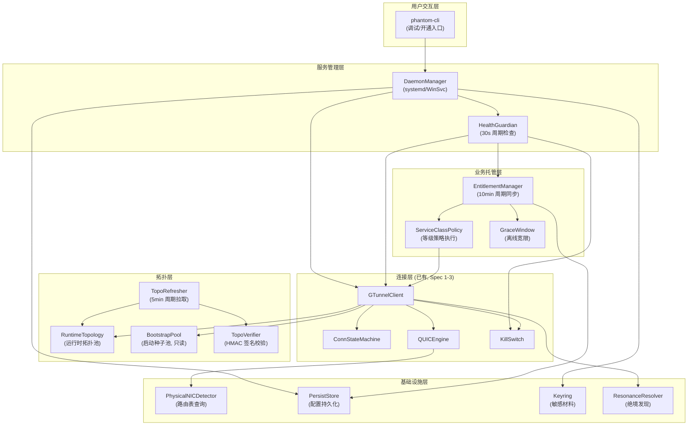
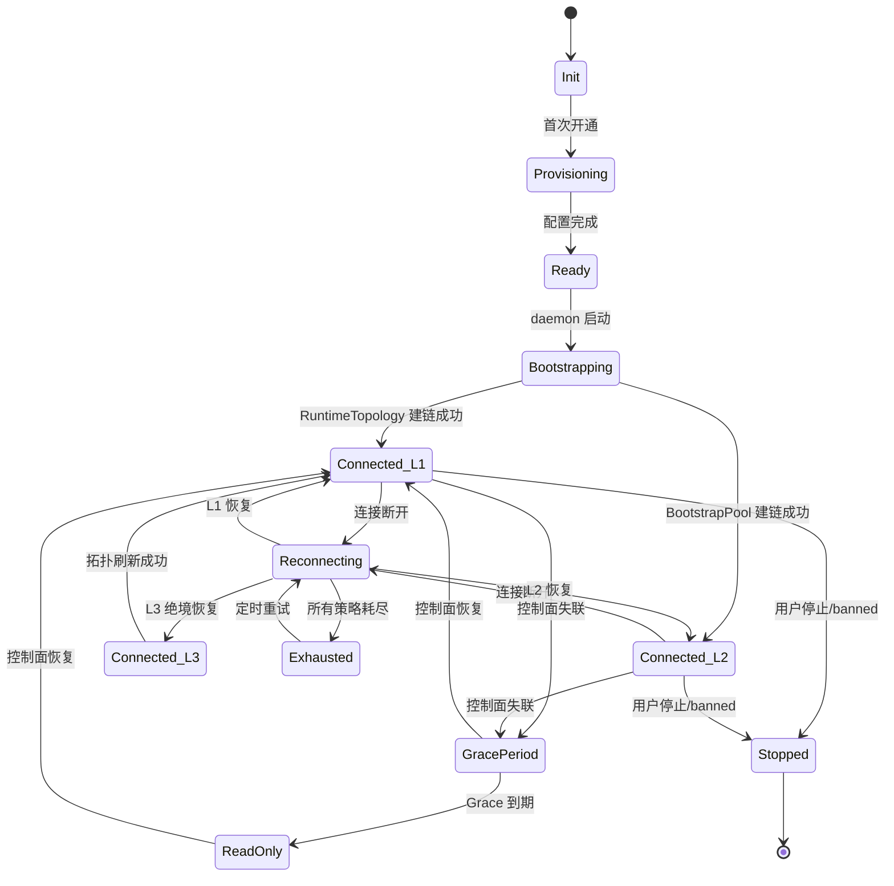

# 技术设计：Client 产品化（拓扑学习 + 订阅托管 + 后台服务化）

## 概述

本设计将 phantom-client 从前台 CLI 原型升级为可长期常驻、自愈、可托管的正式产品形态。涵盖三大能力域：

1. **拓扑学习**（需求 1-5）：实现 PullRouteTable 真正可用、持续刷新、绝境发现接入、双池分离、可信校验
2. **订阅托管**（需求 6-7, 11）：运行时 Entitlement 同步、服务等级策略执行、离线宽限
3. **后台服务化**（需求 8-9, 10, 12-14）：daemon 化、开通/运行分离、健康守护、NIC 探测重构、路由回滚保护

前置依赖：
- Spec 1-3（v1-client-fsm-route-fix）：统一连接状态机、单飞重连、原子事务切换已就绪
- Spec 2-3（v1-os-control-plane）：OS 侧拓扑同步 API 和 Entitlement API 已就绪

## 架构

### 整体架构变更



### 新增包结构

```
phantom-client/
├── cmd/phantom/
│   ├── main.go              # 重构：daemon 入口 + provisioning 入口
│   └── provision.go         # 首次开通流程
├── pkg/
│   ├── gtclient/
│   │   ├── client.go        # 修改：双池分离、退化等级
│   │   ├── topo.go          # 新增：TopoRefresher + TopoVerifier
│   │   ├── state.go         # 修改：增加 DegradationLevel
│   │   └── ...
│   ├── entitlement/
│   │   ├── manager.go       # 新增：EntitlementManager
│   │   ├── policy.go        # 新增：ServiceClassPolicy
│   │   └── grace.go         # 新增：GraceWindow
│   ├── daemon/
│   │   ├── manager.go       # 新增：DaemonManager
│   │   ├── health.go        # 新增：HealthGuardian
│   │   ├── service_linux.go # 新增：systemd 集成
│   │   └── service_windows.go # 新增：Windows Service 集成
│   ├── persist/
│   │   ├── store.go         # 新增：非敏感配置持久化
│   │   └── keyring.go       # 新增：OS 密钥管理封装
│   ├── nicdetect/
│   │   ├── detect.go        # 新增：PhysicalNICDetector 接口
│   │   ├── detect_linux.go  # 新增：ip route get 实现
│   │   └── detect_windows.go # 新增：GetBestRoute2 实现
│   ├── killswitch/
│   │   ├── killswitch.go    # 修改：增加状态持久化 + 残留清理
│   │   └── ...
│   └── ...
```

## 组件与接口

### 1. TopoRefresher（拓扑刷新器）

负责周期性从 OS 控制面拉取 Gateway 拓扑，写入 RuntimeTopology。

```go
// pkg/gtclient/topo.go

// RouteTableResponse OS 控制面返回的路由表
type RouteTableResponse struct {
    Gateways    []GatewayNode `json:"gateways"`
    Version     uint64        `json:"version"`
    PublishedAt time.Time     `json:"published_at"`
    Signature   []byte        `json:"signature"` // HMAC-SHA256
}

// GatewayNode 带优先级和区域的网关节点
type GatewayNode struct {
    IP       string `json:"ip"`
    Port     int    `json:"port"`
    Priority uint8  `json:"priority"` // 0=最高
    Region   string `json:"region"`
    CellID   string `json:"cell_id"`
}

// TopoRefresher 拓扑周期刷新器
type TopoRefresher struct {
    client       *http.Client
    osEndpoint   string           // OS 控制面地址
    authKey      []byte           // 认证密钥
    interval     time.Duration    // 刷新周期，默认 5min
    verifier     *TopoVerifier
    onUpdate     func([]GatewayNode) // 更新回调
    onAlert      func(string)        // 告警回调

    backoff      *ExponentialBackoff
    failCount    atomic.Int32
}

func NewTopoRefresher(cfg TopoRefresherConfig) *TopoRefresher
func (tr *TopoRefresher) Start(ctx context.Context)
func (tr *TopoRefresher) PullOnce(ctx context.Context) (*RouteTableResponse, error)
func (tr *TopoRefresher) Stop()
```

### 2. TopoVerifier（拓扑签名校验器）

```go
// pkg/gtclient/topo.go

// TopoVerifier 路由表签名校验
type TopoVerifier struct {
    hmacKey        []byte    // PSK 派生的 HMAC 密钥
    currentVersion uint64
    currentPubTime time.Time
    sigFailCount   atomic.Int32
    pauseUntil     atomic.Int64  // Unix timestamp，签名连续失败时暂停
}

func NewTopoVerifier(psk []byte) *TopoVerifier
func (tv *TopoVerifier) Verify(resp *RouteTableResponse) error
func (tv *TopoVerifier) IsPaused() bool
```

校验逻辑：
1. HMAC-SHA256 签名校验（使用 PSK 前 32 字节派生）
2. 版本号单调递增校验（新版本 > 当前版本）
3. 发布时间不早于当前拓扑发布时间（防回滚）
4. Gateway 列表非空校验
5. 连续 3 次签名失败 → 暂停 30 分钟 + 安全告警

### 3. RuntimeTopology（运行时拓扑池）

```go
// pkg/gtclient/client.go 中扩展

// RuntimeTopology 运行时拓扑池（可更新）
type RuntimeTopology struct {
    nodes      []GatewayNode
    version    uint64
    publishedAt time.Time
    updatedAt  time.Time
    mu         sync.RWMutex
}

func (rt *RuntimeTopology) Update(nodes []GatewayNode, version uint64, pubTime time.Time) bool
func (rt *RuntimeTopology) NextByPriority(exclude string) (GatewayNode, error)
func (rt *RuntimeTopology) Count() int
func (rt *RuntimeTopology) Version() uint64
func (rt *RuntimeTopology) IsEmpty() bool
```

BootstrapPool 保持现有 `[]token.GatewayEndpoint` 不变，标记为只读。

### 4. EntitlementManager（订阅托管管理器）

```go
// pkg/entitlement/manager.go

// Entitlement 订阅权益
type Entitlement struct {
    ExpiresAt      time.Time    `json:"expires_at"`
    QuotaRemaining int64        `json:"quota_remaining_bytes"`
    ServiceClass   ServiceClass `json:"service_class"`
    Banned         bool         `json:"banned"`
    FetchedAt      time.Time    `json:"fetched_at"`
}

// ServiceClass 服务等级
type ServiceClass string
const (
    ClassStandard ServiceClass = "standard"
    ClassPlatinum ServiceClass = "platinum"
    ClassDiamond  ServiceClass = "diamond"
)

// EntitlementManager 订阅托管管理器
type EntitlementManager struct {
    client      *http.Client
    osEndpoint  string
    userID      string
    authKey     []byte
    interval    time.Duration  // 默认 10min
    graceWindow *GraceWindow

    current     atomic.Pointer[Entitlement]
    onChange    func(old, new *Entitlement) // 状态变更回调
    onBanned   func()                       // 封禁回调
    backoff    *ExponentialBackoff
}

func NewEntitlementManager(cfg EntitlementConfig) *EntitlementManager
func (em *EntitlementManager) Start(ctx context.Context)
func (em *EntitlementManager) Current() *Entitlement
func (em *EntitlementManager) Stop()
```

### 5. ServiceClassPolicy（服务等级策略）

```go
// pkg/entitlement/policy.go

// ServiceClassPolicy 服务等级对应的运行时行为参数
type ServiceClassPolicy struct {
    GatewayPoolFilter  func([]GatewayNode) []GatewayNode // 可用池过滤
    ReconnBackoffBase  time.Duration                      // 重连退避基数
    ReconnBackoffMax   time.Duration                      // 重连退避上限
    ResonanceEnabled   bool                               // 绝境发现是否启用
    HeartbeatInterval  time.Duration                      // 心跳频率
    TopoRefreshInterval time.Duration                     // 拓扑刷新频率
}

func PolicyForClass(class ServiceClass) *ServiceClassPolicy
```

等级策略矩阵：

| 参数 | Standard | Platinum | Diamond |
|------|----------|----------|---------|
| Gateway 池 | 全量 | 全量 | 全量 + 专属 |
| 重连退避基数 | 5s | 2s | 1s |
| 重连退避上限 | 120s | 60s | 30s |
| 绝境发现 | ❌ 禁用 | ✅ 启用 | ✅ 启用 |
| 心跳频率 | 30s | 15s | 10s |
| 拓扑刷新 | 10min | 5min | 2min |

### 6. GraceWindow（离线宽限）

```go
// pkg/entitlement/grace.go

// OfflineScenario 离线场景类型
type OfflineScenario int
const (
    ScenarioControlPlaneLost OfflineScenario = iota // 控制面失联
    ScenarioQuotaExhausted                          // 配额耗尽
    ScenarioSubscriptionExpired                     // 订阅到期
    ScenarioAccountBanned                           // 账号停用
)

// GraceWindow 离线宽限管理
type GraceWindow struct {
    duration       time.Duration // 默认 24h
    lastSuccessAt  atomic.Int64  // 最近成功拉取时间戳
    cachedState    atomic.Pointer[Entitlement]
}

func NewGraceWindow(duration time.Duration) *GraceWindow
func (gw *GraceWindow) RecordSuccess(ent *Entitlement)
func (gw *GraceWindow) IsWithinGrace() bool
func (gw *GraceWindow) DetermineScenario(ent *Entitlement, controlPlaneReachable bool) OfflineScenario
func (gw *GraceWindow) CachedEntitlement() *Entitlement
```

场景策略：

| 场景 | 行为 |
|------|------|
| 控制面失联 | Grace 内维持连接，禁止等级升级；到期后进入只读模式 |
| 配额耗尽 | 维持当前连接，禁止新建，提示充值 |
| 订阅到期 | Grace 到期后受控断开，保留本地配置 |
| 账号停用 | 立即受控断开，清除本地敏感材料 |

### 7. DaemonManager（后台服务管理器）

```go
// pkg/daemon/manager.go

// DaemonManager 后台服务管理
type DaemonManager struct {
    serviceName string
    configDir   string
    logDir      string
}

func NewDaemonManager(name string) *DaemonManager
func (dm *DaemonManager) Install() error   // 注册系统服务
func (dm *DaemonManager) Uninstall() error // 卸载系统服务
func (dm *DaemonManager) Start() error
func (dm *DaemonManager) Stop() error
func (dm *DaemonManager) Status() (ServiceStatus, error)
```

平台实现：
- Linux: 生成 `/etc/systemd/system/phantom-client.service`，配置 `Restart=on-failure`, `RestartSec=5s`
- Windows: 通过 `golang.org/x/sys/windows/svc` 注册 Windows Service，Recovery 设置自动重启

### 8. HealthGuardian（健康守护器）

```go
// pkg/daemon/health.go

// HealthCheck 单项健康检查结果
type HealthCheck struct {
    Name    string
    Healthy bool
    Detail  string
}

// HealthGuardian 健康守护器
type HealthGuardian struct {
    interval time.Duration // 默认 30s
    checks   []func(ctx context.Context) HealthCheck
    onRepair func(check string, err error) // 修复回调
}

func NewHealthGuardian(interval time.Duration) *HealthGuardian
func (hg *HealthGuardian) Register(name string, check func(ctx context.Context) HealthCheck)
func (hg *HealthGuardian) Start(ctx context.Context)
func (hg *HealthGuardian) Stop()
```

检查项：
1. TUN 设备存在且可读写
2. QUIC 连接存活
3. KillSwitch 路由与当前 Gateway 一致
4. Entitlement 在有效期内

### 9. PhysicalNICDetector（物理网卡探测器）

```go
// pkg/nicdetect/detect.go

// PhysicalNICDetector 物理出口探测接口
type PhysicalNICDetector interface {
    // DetectOutbound 返回到达 targetIP 的物理出口 IP
    DetectOutbound(targetIP string) (net.IP, error)
}

// NewDetector 创建平台特定探测器
func NewDetector() PhysicalNICDetector
```

平台实现：
- Linux: `ip route get <gateway_ip>` 解析 `src` 字段
- Windows: `GetBestRoute2` Win32 API 或 `route print` 解析
- 回退: 枚举非 loopback、非 TUN 接口，选第一个有效 IPv4

### 10. PersistStore + Keyring（配置持久化）

```go
// pkg/persist/store.go

// PersistConfig 非敏感持久化配置
type PersistConfig struct {
    BootstrapPool    []token.GatewayEndpoint `json:"bootstrap_pool"`
    CertFingerprint  string                  `json:"cert_fingerprint"`
    UserID           string                  `json:"user_id"`
    OSEndpoint       string                  `json:"os_endpoint"`
    LastEntitlement  *entitlement.Entitlement `json:"last_entitlement,omitempty"`
}

func Load(path string) (*PersistConfig, error)
func Save(path string, cfg *PersistConfig) error

// pkg/persist/keyring.go

// Keyring OS 密钥管理封装
type Keyring interface {
    Store(service, key string, value []byte) error
    Load(service, key string) ([]byte, error)
    Delete(service, key string) error
}

func NewKeyring() Keyring // Linux: keyring, Windows: Credential Manager
```

### 11. DegradationLevel（退化等级）

```go
// pkg/gtclient/state.go 扩展

type DegradationLevel int32
const (
    L1_Normal     DegradationLevel = iota // 使用 RuntimeTopology
    L2_Degraded                           // 回退到 BootstrapPool
    L3_LastResort                         // 进入 Resonance 绝境发现
)

// DegradationEvent 退化事件
type DegradationEvent struct {
    Level     DegradationLevel
    Reason    string
    EnteredAt time.Time
    Attempts  int
    Duration  time.Duration // 恢复耗时（仅恢复时填充）
}
```

### 12. KillSwitch 扩展（路由状态持久化 + 残留清理）

```go
// pkg/killswitch/killswitch.go 扩展

// RouteState 路由状态快照（用于崩溃恢复）
type RouteState struct {
    OriginalGW    string `json:"original_gw"`
    OriginalIface string `json:"original_iface"`
    CurrentGWIP   string `json:"current_gw_ip"`
    TUNName       string `json:"tun_name"`
    ActivatedAt   time.Time `json:"activated_at"`
}

func (ks *KillSwitch) PersistState(path string) error
func (ks *KillSwitch) CleanupStaleRoutes(path string) error
```

## 数据模型

### Route Table Protocol 请求/响应

```
GET /api/v1/topology?version={current_version}
Authorization: Bearer {auth_key_base64}
X-Client-ID: {user_id}

Response 200:
{
  "gateways": [
    {"ip": "1.2.3.4", "port": 443, "priority": 0, "region": "ap-east-1", "cell_id": "cell-01"},
    {"ip": "5.6.7.8", "port": 443, "priority": 1, "region": "ap-east-1", "cell_id": "cell-02"}
  ],
  "version": 42,
  "published_at": "2025-01-15T10:00:00Z",
  "signature": "base64-hmac-sha256..."
}

Response 304 (Not Modified): 版本未变化
```

### Entitlement Protocol 请求/响应

```
GET /api/v1/entitlement
Authorization: Bearer {auth_key_base64}
X-Client-ID: {user_id}

Response 200:
{
  "expires_at": "2025-06-15T00:00:00Z",
  "quota_remaining_bytes": 107374182400,
  "service_class": "platinum",
  "banned": false
}
```

### 本地持久化文件布局

```
~/.phantom-client/              # Linux: ~/.config/phantom-client/
├── config.json                 # PersistConfig（非敏感）
├── route-state.json            # KillSwitch RouteState（崩溃恢复）
└── logs/
    └── phantom-client.log      # daemon 模式日志
```

敏感材料（PSK、AuthKey）存储在 OS Keyring，不落盘。

### 状态机扩展（退化等级集成）




## Correctness Properties

*A property is a characteristic or behavior that should hold true across all valid executions of a system — essentially, a formal statement about what the system should do. Properties serve as the bridge between human-readable specifications and machine-verifiable correctness guarantees.*

### Property 1: RouteTableResponse 序列化往返

*For any* 有效的 RouteTableResponse（包含任意 Gateway 列表、版本号、发布时间、签名），JSON 序列化后再反序列化应产生等价对象。

**Validates: Requirements 1.2**

### Property 2: Entitlement 序列化往返

*For any* 有效的 Entitlement（包含任意有效期、配额、服务等级、封禁状态），JSON 序列化后再反序列化应产生等价对象。

**Validates: Requirements 6.2**

### Property 3: PersistConfig 序列化往返

*For any* 有效的 PersistConfig（包含任意 BootstrapPool、CertFingerprint、UserID、OSEndpoint），Save 后 Load 应产生等价配置。

**Validates: Requirements 9.3**

### Property 4: RouteState 序列化往返

*For any* 有效的 RouteState（包含任意原始网关、接口、当前 Gateway IP、TUN 名称），PersistState 后加载应产生等价状态。

**Validates: Requirements 14.4**

### Property 5: RuntimeTopology 更新正确性

*For any* 有效的 GatewayNode 列表，写入 RuntimeTopology 后，Count() 应等于列表长度，且每个节点均可通过 NextByPriority 遍历获取。

**Validates: Requirements 1.3, 3.3**

### Property 6: 拉取失败保留现有拓扑

*For any* 已有 RuntimeTopology 状态，当拉取失败时，RuntimeTopology 的节点列表、版本号和更新时间均应保持不变。

**Validates: Requirements 1.4**

### Property 7: BootstrapPool 不可变性

*For any* 初始 BootstrapPool 和任意序列的 RuntimeTopology 更新操作，BootstrapPool 的内容在整个操作序列后应与初始值完全一致。

**Validates: Requirements 4.1, 4.3**

### Property 8: 优先级有序网关选择

*For any* 包含不同优先级的 GatewayNode 列表，RuntimeTopology.NextByPriority 应按优先级升序（0=最高）返回节点。

**Validates: Requirements 1.5**

### Property 9: 指数退避计算

*For any* 失败次数 N（N ≥ 0）、基础间隔 base 和最大间隔 max，退避延迟应等于 min(base × 2^N, max)。

**Validates: Requirements 2.2, 6.4**

### Property 10: 单调版本+时间戳接受策略

*For any* 当前版本 V 和当前发布时间 T，新路由表仅当 version > V 且 publishedAt > T 时才被接受；否则被拒绝且现有拓扑不变。

**Validates: Requirements 2.3, 5.3**

### Property 11: HMAC 签名校验

*For any* 有效的 RouteTableResponse 和正确的 PSK 派生密钥，签名校验应通过；对响应体任意字节的篡改应导致签名校验失败。

**Validates: Requirements 5.2**

### Property 12: 状态变更事件触发

*For any* 两个 Entitlement 状态 A 和 B，当 A ≠ B 时应触发变更事件；当 A = B 时不应触发。

**Validates: Requirements 6.3**

### Property 13: ServiceClass → Policy 映射

*For any* ServiceClass 值（Standard/Platinum/Diamond），PolicyForClass 应返回对应的策略参数，且 Standard 的 ResonanceEnabled 为 false，Platinum 和 Diamond 为 true。

**Validates: Requirements 7.2, 7.4**

### Property 14: Grace Window 时间计算

*For any* lastSuccessAt 时间戳和 grace duration，IsWithinGrace 应返回 true 当且仅当 now - lastSuccessAt < duration。

**Validates: Requirements 11.1**

### Property 15: 离线场景分类

*For any* 状态组合（controlPlaneReachable, banned, expired, quotaExhausted），DetermineScenario 应返回正确的 OfflineScenario：banned → AccountBanned，expired → SubscriptionExpired，quotaExhausted → QuotaExhausted，controlPlaneLost → ControlPlaneLost。优先级：banned > expired > quotaExhausted > controlPlaneLost。

**Validates: Requirements 11.2**

### Property 16: 退化事件完整性

*For any* 退化等级转换（L1↔L2↔L3），生成的 DegradationEvent 应包含非零的 Level、非空的 Reason、非零的 EnteredAt；当从高等级恢复到低等级时，Duration 应 > 0。

**Validates: Requirements 10.2, 10.3, 10.5**

### Property 17: KillSwitch 事务回滚

*For any* KillSwitch 事务（Activate 或 Switch）中任意步骤的失败注入，事务完成后的路由状态应等于事务开始前的路由状态。

**Validates: Requirements 14.1, 14.2**

### Property 18: NIC 回退接口选择

*For any* 网络接口列表（包含 loopback、TUN、物理接口的任意组合），当路由表查询失败时，回退选择应返回第一个非 loopback、非 TUN、具有有效 IPv4 地址的接口；若无符合条件的接口则返回错误。

**Validates: Requirements 13.4**

## 错误处理

### 拓扑层错误处理

| 错误场景 | 处理策略 |
|----------|----------|
| OS 控制面不可达 | 保留现有拓扑，指数退避重试（30s→10min） |
| 路由表签名校验失败 | 拒绝更新，计数器+1；连续 3 次 → 暂停 30min + 安全告警 |
| 路由表版本回滚 | 拒绝更新，记录告警 |
| 路由表 Gateway 列表为空 | 拒绝更新，记录异常事件 |
| 连续 3 次拉取失败 | 发出拓扑刷新告警事件 |

### 订阅层错误处理

| 错误场景 | 处理策略 |
|----------|----------|
| Entitlement 拉取失败 | 指数退避重试，保留最近成功状态 |
| banned=true | 立即受控断开，清除本地敏感材料 |
| 订阅到期 | Grace Window 内维持连接，到期后受控断开 |
| 配额耗尽 | 维持当前连接，禁止新建，提示充值 |
| 控制面失联 | Grace Window 内维持连接，到期后进入只读模式 |

### 服务层错误处理

| 错误场景 | 处理策略 |
|----------|----------|
| TUN 设备丢失 | HealthGuardian 尝试重建 TUN + 重新激活 KillSwitch |
| 路由不一致 | HealthGuardian 尝试修复路由指向当前 Gateway |
| 进程异常退出 | defer + signal handler 双重保护执行 Deactivate |
| SIGKILL/崩溃 | 下次启动时通过 route-state.json 检测残留路由并清理 |
| KillSwitch Activate 中途失败 | 回滚已执行步骤，恢复原始路由 |
| 网关切换事务失败 | 回滚预加路由，保持切换前状态 |
| NIC 探测失败 | 回退到枚举非 loopback/非 TUN 接口 |
| 本地配置缺失 | 提示用户执行 Provisioning Flow |
| Keyring 不可用 | 降级到内存持有（进程退出即丢失），记录告警 |

## 测试策略

### Property-Based Testing

使用 `pgregory.net/rapid`（项目已有依赖）作为 PBT 框架。

每个 Property 对应一个 PBT 测试，最少 100 次迭代。标签格式：

```
// Feature: v1-client-productization, Property N: <property_text>
```

PBT 覆盖的 18 个 Property 测试纯逻辑层：
- 序列化往返（P1-P4）
- 数据结构不变量（P5-P8）
- 纯函数计算（P9-P11, P13-P16, P18）
- 状态机事务性（P12, P17）

### Unit Testing（Example-Based）

针对特定场景和边界条件：
- 连续 3 次拉取失败触发告警（2.4）
- 连续 3 次签名失败触发暂停（5.5）
- banned=true 触发立即断开（6.5）
- Resonance 未注入时跳过 L3（3.2）
- RuntimeTopology 为空时回退 BootstrapPool（4.5）
- Grace Window 到期进入只读模式（11.3）
- 残留路由清理后正常启动（14.5）

### Integration Testing

针对外部依赖和系统交互：
- OS 控制面 HTTP 拉取（1.1, 6.1）
- systemd/Windows Service 注册（8.1, 8.2）
- Keyring 存取（9.4）
- 信号处理和 Deactivate（12.5）
- 平台特定 NIC 探测（13.2, 13.3）

### Smoke Testing

一次性配置和启动检查：
- Resonance Resolver 注入（3.1）
- 绝境发现超时配置（3.4）
- --daemon / --foreground 参数识别（8.3, 8.5）
- ServiceClass 枚举存在（7.3）
- DegradationLevel 枚举存在（10.1）
