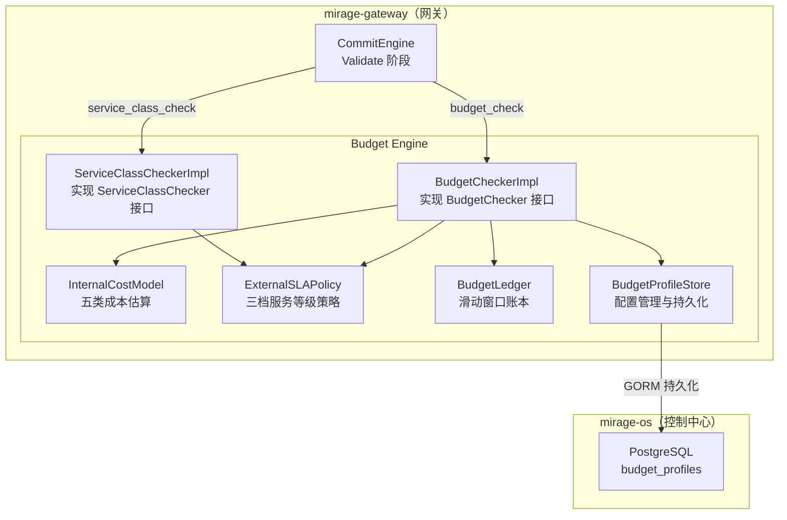
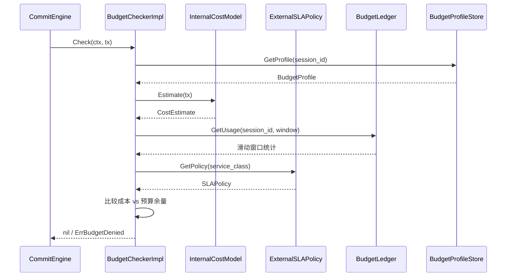
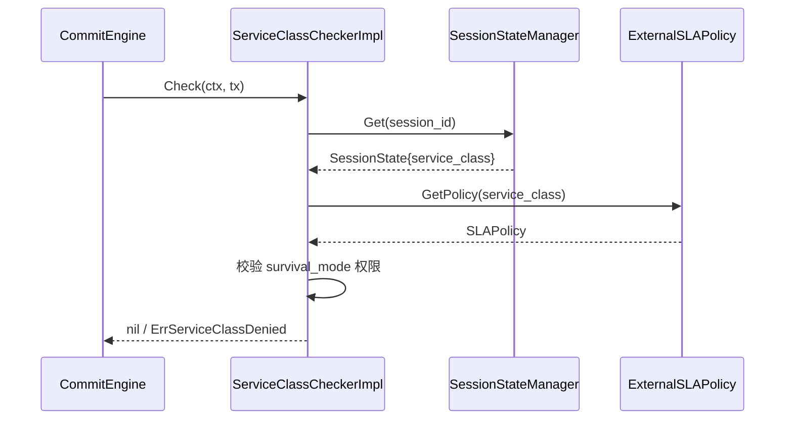
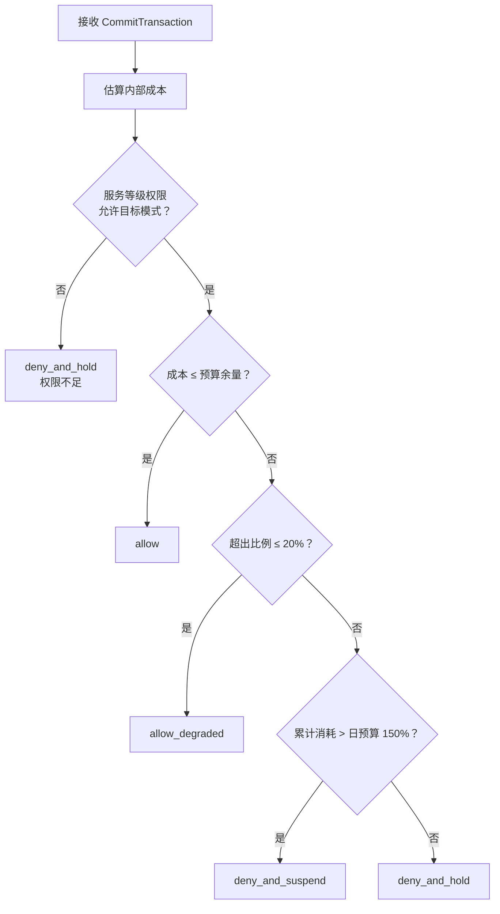

# 设计文档：V2 Budget Engine

## 概述

本设计实现 Mirage V2 编排内核的预算引擎（Budget Engine），负责将所有编排动作约束在有限预算范围内。Budget Engine 采用双层模型：Internal Cost Model 计算内部资源消耗成本，External SLA / Service Policy 映射用户服务等级权限。两层结合产生五种判定结果（allow / allow_degraded / allow_with_charge / deny_and_hold / deny_and_suspend），替换 Commit Engine 中的 DefaultBudgetChecker 和 DefaultServiceClassChecker。

核心设计目标：
- 每次编排动作（PersonaSwitch、LinkMigration、GatewayReassignment、SurvivalModeSwitch）必须经过预算评估
- 五类内部成本分量（bandwidth、latency、switch、entry_burn、gateway_load）按事务类型组合计算
- 三档服务等级（Standard / Platinum / Diamond）映射不同权限策略
- 滑动窗口统计切换频率和入口消耗，防止超限
- BudgetProfile 持久化到 PostgreSQL，支持重启恢复
- 所有核心数据结构支持 JSON round-trip

本模块位于 `mirage-gateway/pkg/orchestrator/budget/`，数据库模型扩展位于 `mirage-os/pkg/models/`。

## 架构

### 整体分层



### 预算判定流程



### ServiceClassChecker 流程



### Verdict 判定逻辑



## 组件与接口

### 1. 枚举与常量（`pkg/orchestrator/budget/types.go`）

```go
// BudgetVerdict 预算判定结果枚举
type BudgetVerdict string
const (
    VerdictAllow           BudgetVerdict = "allow"
    VerdictAllowDegraded   BudgetVerdict = "allow_degraded"
    VerdictAllowWithCharge BudgetVerdict = "allow_with_charge"
    VerdictDenyAndHold     BudgetVerdict = "deny_and_hold"
    VerdictDenyAndSuspend  BudgetVerdict = "deny_and_suspend"
)

// OverBudgetThreshold 超预算降级阈值（20%）
const OverBudgetThreshold = 0.20

// DailySuspendThreshold 日预算挂起阈值（150%）
const DailySuspendThreshold = 1.50
```

### 2. BudgetProfile（`pkg/orchestrator/budget/profile.go`）

```go
// BudgetProfile 预算配置对象
type BudgetProfile struct {
    ProfileID            string  `json:"profile_id" gorm:"primaryKey;size:64"`
    SessionID            string  `json:"session_id" gorm:"uniqueIndex;size:64"`  // 空字符串表示全局
    LatencyBudgetMs      int64   `json:"latency_budget_ms" gorm:"not null"`
    BandwidthBudgetRatio float64 `json:"bandwidth_budget_ratio" gorm:"type:numeric(5,4);not null"`
    SwitchBudgetPerHour  int     `json:"switch_budget_per_hour" gorm:"not null"`
    EntryBurnBudgetPerDay int    `json:"entry_burn_budget_per_day" gorm:"not null"`
    GatewayLoadBudget    float64 `json:"gateway_load_budget" gorm:"type:numeric(5,4);not null"`
    HardenedAllowed      bool    `json:"hardened_allowed" gorm:"not null;default:false"`
    EscapeAllowed        bool    `json:"escape_allowed" gorm:"not null;default:false"`
    LastResortAllowed    bool    `json:"last_resort_allowed" gorm:"not null;default:false"`
    CreatedAt            time.Time  `json:"created_at" gorm:"autoCreateTime"`
    UpdatedAt            time.Time  `json:"updated_at" gorm:"autoUpdateTime"`
}

func (BudgetProfile) TableName() string { return "budget_profiles" }

// Validate 校验所有数值字段在合法范围内
func (bp *BudgetProfile) Validate() error

// DefaultBudgetProfile 返回 Standard 等级默认配置
func DefaultBudgetProfile() *BudgetProfile
```

### 3. CostEstimate（`pkg/orchestrator/budget/cost.go`）

```go
// CostEstimate 成本估算结果
type CostEstimate struct {
    BandwidthCost   float64 `json:"bandwidth_cost"`
    LatencyCost     float64 `json:"latency_cost"`
    SwitchCost      float64 `json:"switch_cost"`
    EntryBurnCost   float64 `json:"entry_burn_cost"`
    GatewayLoadCost float64 `json:"gateway_load_cost"`
    TotalCost       float64 `json:"total_cost"`
}

// InternalCostModel 内部成本模型
type InternalCostModel interface {
    // Estimate 根据事务类型估算五类成本
    Estimate(tx *commit.CommitTransaction) (*CostEstimate, error)
}
```

### 4. SLAPolicy 与 ExternalSLAPolicy（`pkg/orchestrator/budget/sla.go`）

```go
// SLAPolicy 服务等级策略
type SLAPolicy struct {
    HardenedAllowed    bool `json:"hardened_allowed"`
    EscapeAllowed      bool `json:"escape_allowed"`
    LastResortAllowed  bool `json:"last_resort_allowed"`
    MaxSwitchPerHour   int  `json:"max_switch_per_hour"`
    MaxEntryBurnPerDay int  `json:"max_entry_burn_per_day"`
}

// ExternalSLAPolicy 外部服务等级策略管理
type ExternalSLAPolicy interface {
    // GetPolicy 根据 ServiceClass 返回对应策略，不存在则返回 Standard 默认策略
    GetPolicy(serviceClass orchestrator.ServiceClass) *SLAPolicy
}
```

### 5. BudgetDecision（`pkg/orchestrator/budget/decision.go`）

```go
// BudgetDecision 预算判定完整响应
type BudgetDecision struct {
    Verdict         BudgetVerdict  `json:"verdict"`
    CostEstimate    *CostEstimate  `json:"cost_estimate"`
    RemainingBudget *BudgetProfile `json:"remaining_budget"`
    DenyReason      string         `json:"deny_reason,omitempty"`
}
```

### 6. BudgetLedger（`pkg/orchestrator/budget/ledger.go`）

```go
// LedgerEntry 账本条目
type LedgerEntry struct {
    SessionID    string        `json:"session_id"`
    TxType       commit.TxType `json:"tx_type"`
    CostEstimate *CostEstimate `json:"cost_estimate"`
    Timestamp    time.Time     `json:"timestamp"`
}

// BudgetLedger 预算账本接口
type BudgetLedger interface {
    // Record 记录一次预算消耗
    Record(entry *LedgerEntry)
    // SwitchCountInLastHour 统计过去 1 小时内指定 session 的切换次数
    // 统计 LinkMigration + GatewayReassignment
    SwitchCountInLastHour(sessionID string) int
    // EntryBurnCountInLastDay 统计过去 24 小时内指定 session 的入口消耗次数
    // 统计 GatewayReassignment
    EntryBurnCountInLastDay(sessionID string) int
    // Cleanup 清理超过 24 小时的历史记录
    Cleanup()
}
```

### 7. BudgetProfileStore（`pkg/orchestrator/budget/store.go`）

```go
// BudgetProfileStore 预算配置存储接口
type BudgetProfileStore interface {
    // Get 获取指定 session 的 BudgetProfile，不存在返回 DefaultBudgetProfile
    Get(ctx context.Context, sessionID string) (*BudgetProfile, error)
    // Save 创建或更新 BudgetProfile
    Save(ctx context.Context, profile *BudgetProfile) error
    // LoadAll 从数据库加载所有 BudgetProfile
    LoadAll(ctx context.Context) ([]*BudgetProfile, error)
}
```

### 8. BudgetCheckerImpl（`pkg/orchestrator/budget/checker.go`）

```go
// BudgetCheckerImpl 实现 commit.BudgetChecker 接口
type BudgetCheckerImpl struct {
    costModel   InternalCostModel
    slaPolicy   ExternalSLAPolicy
    ledger      BudgetLedger
    store       BudgetProfileStore
}

// Check 执行预算判定，返回 nil（allow 类）或 ErrBudgetDenied（deny 类）
func (bc *BudgetCheckerImpl) Check(ctx context.Context, tx *commit.CommitTransaction) error

// Evaluate 执行完整预算判定，返回 BudgetDecision
func (bc *BudgetCheckerImpl) Evaluate(ctx context.Context, tx *commit.CommitTransaction) (*BudgetDecision, error)
```

### 9. ServiceClassCheckerImpl（`pkg/orchestrator/budget/service_class_checker.go`）

```go
// SessionGetter 获取 Session 信息的接口（依赖 Spec 4-1 SessionStateManager）
type SessionGetter interface {
    Get(ctx context.Context, sessionID string) (*orchestrator.SessionState, error)
}

// ServiceClassCheckerImpl 实现 commit.ServiceClassChecker 接口
type ServiceClassCheckerImpl struct {
    slaPolicy     ExternalSLAPolicy
    sessionGetter SessionGetter
}

// Check 执行服务等级校验
func (sc *ServiceClassCheckerImpl) Check(ctx context.Context, tx *commit.CommitTransaction) error
```

### 10. 错误类型（`pkg/orchestrator/budget/errors.go`）

```go
// ErrBudgetDenied 预算拒绝错误
type ErrBudgetDenied struct {
    Verdict BudgetVerdict
    Reason  string
}
func (e *ErrBudgetDenied) Error() string

// ErrServiceClassDenied 服务等级拒绝错误
type ErrServiceClassDenied struct {
    ServiceClass string
    DeniedMode   string
}
func (e *ErrServiceClassDenied) Error() string

// ErrInvalidBudgetProfile 无效预算配置错误
type ErrInvalidBudgetProfile struct {
    Field   string
    Message string
}
func (e *ErrInvalidBudgetProfile) Error() string
```

## 数据模型

### budget_profiles 表

| 字段 | 类型 | 约束 | 说明 |
|------|------|------|------|
| profile_id | VARCHAR(64) | PK | 配置唯一标识（UUID v4） |
| session_id | VARCHAR(64) | UNIQUE INDEX | 会话 ID，空字符串表示全局配置 |
| latency_budget_ms | BIGINT | NOT NULL, CHECK > 0 | 延迟预算毫秒数 |
| bandwidth_budget_ratio | NUMERIC(5,4) | NOT NULL, CHECK 0.0-1.0 | 带宽预算比率 |
| switch_budget_per_hour | INT | NOT NULL, CHECK >= 0 | 每小时切换预算次数 |
| entry_burn_budget_per_day | INT | NOT NULL, CHECK >= 0 | 每日入口消耗预算次数 |
| gateway_load_budget | NUMERIC(5,4) | NOT NULL, CHECK 0.0-1.0 | Gateway 负载预算比率 |
| hardened_allowed | BOOLEAN | NOT NULL, DEFAULT false | 是否允许 Hardened 模式 |
| escape_allowed | BOOLEAN | NOT NULL, DEFAULT false | 是否允许 Escape 模式 |
| last_resort_allowed | BOOLEAN | NOT NULL, DEFAULT false | 是否允许 LastResort 模式 |
| created_at | TIMESTAMPTZ | AUTO | 创建时间 |
| updated_at | TIMESTAMPTZ | AUTO | 更新时间 |

### GORM 模型注册

BudgetProfile 加入 `mirage-os/pkg/models/db.go` 的 AutoMigrate：

```go
func AutoMigrate(db *gorm.DB) error {
    return db.AutoMigrate(
        // ... 现有模型 ...
        &BudgetProfile{},
    )
}
```

### SLA 策略常量表（内存，非持久化）

| ServiceClass | hardened_allowed | escape_allowed | last_resort_allowed | max_switch_per_hour | max_entry_burn_per_day |
|---|---|---|---|---|---|
| Standard | false | false | false | 5 | 2 |
| Platinum | true | false | false | 15 | 5 |
| Diamond | true | true | true | 30 | 10 |

### 成本分量矩阵（事务类型 → 计算分量）

| TxType | bandwidth | latency | switch | entry_burn | gateway_load |
|---|---|---|---|---|---|
| PersonaSwitch | ✓ | ✓ | | | |
| LinkMigration | ✓ | ✓ | ✓ | | |
| GatewayReassignment | | | ✓ | ✓ | ✓ |
| SurvivalModeSwitch | ✓ | ✓ | ✓ | ✓ | ✓ |


## 正确性属性

*属性（Property）是在系统所有合法执行中都应成立的特征或行为——本质上是对系统行为的形式化陈述。属性是人类可读规格说明与机器可验证正确性保证之间的桥梁。*

### Property 1: BudgetProfile 校验正确性

*For any* BudgetProfile 对象，当所有数值字段在合法范围内（latency_budget_ms > 0，bandwidth_budget_ratio ∈ [0.0, 1.0]，switch_budget_per_hour ≥ 0，entry_burn_budget_per_day ≥ 0，gateway_load_budget ∈ [0.0, 1.0]）时 Validate() 返回 nil；当任何字段超出范围时 Validate() 返回 ErrInvalidBudgetProfile，且错误包含违规字段名。

**Validates: Requirements 1.3, 1.4**

### Property 2: 成本分量矩阵正确性

*For any* CommitTransaction，InternalCostModel.Estimate 返回的 CostEstimate 应满足：PersonaSwitch 仅 bandwidth_cost 和 latency_cost 非零；LinkMigration 仅 switch_cost、latency_cost、bandwidth_cost 非零；GatewayReassignment 仅 gateway_load_cost、entry_burn_cost、switch_cost 非零；SurvivalModeSwitch 全部五类分量非零。所有成本分量均为非负值。

**Validates: Requirements 2.2, 2.3, 2.4, 2.5, 2.7**

### Property 3: CostEstimate 总成本不变量

*For any* CostEstimate 对象，total_cost 应严格等于 bandwidth_cost + latency_cost + switch_cost + entry_burn_cost + gateway_load_cost。

**Validates: Requirements 2.6**

### Property 4: 预算判定决策树正确性

*For any* CommitTransaction、BudgetProfile 和 BudgetLedger 状态组合，Evaluate 返回的 BudgetDecision 应满足：成本在预算内且权限允许 → allow；成本超出预算但 ≤ 20% 且权限允许 → allow_degraded；成本超出预算 > 20% → deny_and_hold；权限不允许目标模式 → deny_and_hold；累计消耗 > 日预算 150% → deny_and_suspend。deny 类判定的 deny_reason 非空。

**Validates: Requirements 4.2, 4.3, 4.4, 4.5, 4.6, 4.7**

### Property 5: ServiceClassChecker 权限校验正确性

*For any* ServiceClass 和 SurvivalMode 组合，当 tx_type 为 SurvivalModeSwitch 时，ServiceClassChecker.Check 的结果应与 SLAPolicy 的权限字段一致：Hardened 取决于 hardened_allowed，Escape 取决于 escape_allowed，LastResort 取决于 last_resort_allowed。校验失败时返回 ErrServiceClassDenied 包含正确的 ServiceClass 和 DeniedMode。非 SurvivalModeSwitch 类型事务始终通过。

**Validates: Requirements 6.3, 6.4, 6.5, 6.6, 6.7**

### Property 6: 滑动窗口计数正确性

*For any* BudgetLedger 条目集合和查询时间点，SwitchCountInLastHour 应等于过去 1 小时内该 session 的 LinkMigration + GatewayReassignment 条目数；EntryBurnCountInLastDay 应等于过去 24 小时内该 session 的 GatewayReassignment 条目数。

**Validates: Requirements 7.2, 7.3**

### Property 7: 账本清理正确性

*For any* BudgetLedger 条目集合，执行 Cleanup 后不应存在时间戳超过 24 小时的条目，且 24 小时内的条目应全部保留。

**Validates: Requirements 7.4**

### Property 8: JSON 序列化 round-trip

*For any* 合法的 BudgetProfile、BudgetDecision 或 CostEstimate 对象，JSON 序列化后再反序列化应产生等价对象（所有字段值保持不变），且 BudgetProfile 的 JSON 输出使用 snake_case 字段命名。

**Validates: Requirements 9.1, 9.2, 9.3, 9.4**

### Property 9: 错误消息内容正确性

*For any* ErrBudgetDenied 对象，Error() 返回的字符串应包含 verdict 值和 reason 值；*For any* ErrServiceClassDenied 对象，Error() 返回的字符串应包含 service_class 值和 denied_mode 值。

**Validates: Requirements 10.4, 10.5**

## 错误处理

### 预算判定错误

| 错误场景 | 处理方式 |
|----------|----------|
| 成本超出预算 ≤ 20% | 返回 allow_degraded，BudgetDecision 包含成本明细 |
| 成本超出预算 > 20% | 返回 deny_and_hold，ErrBudgetDenied 包含 verdict 和原因 |
| 累计消耗 > 日预算 150% | 返回 deny_and_suspend，ErrBudgetDenied 包含 verdict 和原因 |
| 服务等级权限不足 | 返回 deny_and_hold，ErrBudgetDenied 包含被拒绝的 SurvivalMode |

### 服务等级校验错误

| 错误场景 | 处理方式 |
|----------|----------|
| Standard 用户请求 Hardened/Escape/LastResort | 返回 ErrServiceClassDenied{ServiceClass, DeniedMode} |
| Platinum 用户请求 Escape/LastResort | 返回 ErrServiceClassDenied{ServiceClass, DeniedMode} |
| 非 SurvivalModeSwitch 事务 | 始终返回 nil |

### 配置校验错误

| 错误场景 | 处理方式 |
|----------|----------|
| latency_budget_ms ≤ 0 | 返回 ErrInvalidBudgetProfile{Field: "latency_budget_ms", Message: "must be > 0"} |
| bandwidth_budget_ratio 超出 [0.0, 1.0] | 返回 ErrInvalidBudgetProfile{Field: "bandwidth_budget_ratio", Message: "must be in [0.0, 1.0]"} |
| switch_budget_per_hour < 0 | 返回 ErrInvalidBudgetProfile{Field: "switch_budget_per_hour", Message: "must be >= 0"} |
| entry_burn_budget_per_day < 0 | 返回 ErrInvalidBudgetProfile{Field: "entry_burn_budget_per_day", Message: "must be >= 0"} |
| gateway_load_budget 超出 [0.0, 1.0] | 返回 ErrInvalidBudgetProfile{Field: "gateway_load_budget", Message: "must be in [0.0, 1.0]"} |

### 存储错误

| 错误场景 | 处理方式 |
|----------|----------|
| session_id 对应的 BudgetProfile 不存在 | 返回 DefaultBudgetProfile |
| 数据库连接失败 | 返回原始错误，调用方降级使用内存缓存 |

## 测试策略

### 属性测试（Property-Based Testing）

使用 `pgregory.net/rapid`（已在 go.mod 中）作为 PBT 库。

每个属性测试运行至少 100 次迭代，标签格式：`Feature: v2-budget-engine, Property N: <描述>`

属性测试覆盖 Property 1-9，重点验证：
- BudgetProfile 校验（Property 1）
- 成本分量矩阵（Property 2）
- 总成本不变量（Property 3）
- 判定决策树（Property 4）
- 服务等级权限（Property 5）
- 滑动窗口计数（Property 6）
- 账本清理（Property 7）
- JSON round-trip（Property 8）
- 错误消息内容（Property 9）

### 单元测试

- BudgetVerdict 枚举值字符串表示
- DefaultBudgetProfile 默认值正确性
- SLA 策略常量表（Standard / Platinum / Diamond 精确值）
- 成本分量矩阵（每种 TxType 的非零分量）
- BudgetCheckerImpl 接口兼容性（编译期检查）
- ServiceClassCheckerImpl 接口兼容性（编译期检查）
- 全局事务（空 session_id）使用全局 BudgetProfile

### 集成测试

- GORM AutoMigrate 创建 budget_profiles 表
- CHECK 约束生效验证
- BudgetProfile 持久化 round-trip（Save → LoadAll）
- 系统启动加载所有 BudgetProfile
- BudgetLedger 并发安全（多 goroutine 读写）
