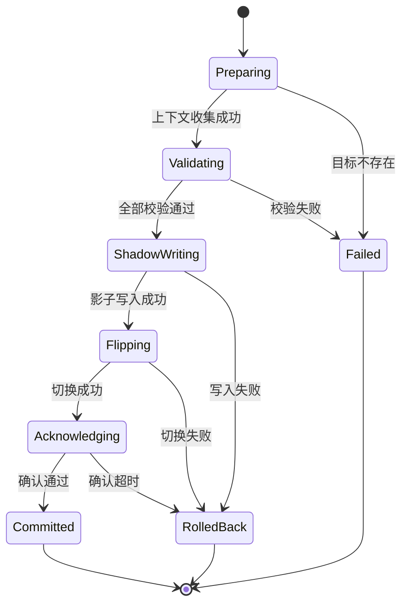
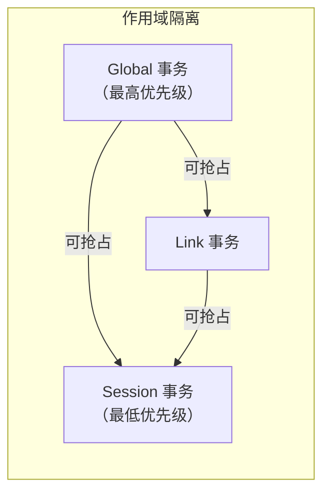
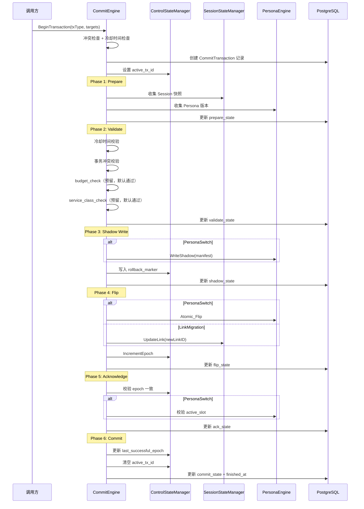

# 设计文档：V2 State Commit Engine

## 概述

本设计实现 Mirage V2 编排内核的事务化状态提交引擎（State Commit Engine），负责所有关键状态变更（PersonaSwitch、LinkMigration、GatewayReassignment、SurvivalModeSwitch）的事务化管理。通过标准六阶段提交流程（Prepare → Validate Constraint → Shadow Write → Flip → Acknowledge → Commit/Rollback）保证状态变更的原子性和可恢复性。

核心设计目标：
- 所有受管变更统一走六阶段提交流程，禁止绕过
- 事务阶段转换受严格状态机约束，防止跳过关键阶段
- 同一作用域同一时刻最多一个活跃事务，通过优先级抢占解决冲突
- 同类型事务之间有冷却时间，防止高频抖动
- 崩溃恢复基于 rollback_marker 回到上一个稳定 Epoch
- 预算校验和服务等级校验预留接口，待 Spec 5-1 Budget Engine 接入
- 所有事务记录持久化到 PostgreSQL，支持审计和诊断

本模块位于 `mirage-gateway/pkg/orchestrator/commit/`，数据库模型扩展位于 `mirage-os/pkg/models/`，HTTP API 位于 `mirage-os` 的 API 层。

## 架构

### 整体分层

```mermaid
graph TB
    subgraph "mirage-os（控制中心）"
        API["Transaction Query API<br/>HTTP JSON"]
        DB["PostgreSQL<br/>commit_transactions"]
        API --> DB
    end

    subgraph "mirage-gateway（网关）"
        CE["CommitEngine"]
        subgraph "六阶段流水线"
            P["Prepare"]
            V["Validate"]
            SW["Shadow Write"]
            F["Flip"]
            A["Acknowledge"]
            CR["Commit / Rollback"]
        end
        CE --> P --> V --> SW --> F --> A --> CR

        subgraph "依赖组件（Spec 4-1 / 4-2）"
            CSM["ControlStateManager"]
            SSM["SessionStateManager"]
            LSM["LinkStateManager"]
            PE["PersonaEngine"]
            LM["LockManager"]
        end
        CE --> CSM
        CE --> SSM
        CE --> LSM
        CE --> PE
        CE --> LM
    end

    CE -->|"GORM 持久化"| DB
```



### TX_Phase 状态机



### 事务冲突与优先级



### 标准提交流程时序




## 组件与接口

### 1. 枚举定义（`pkg/orchestrator/commit/types.go`）

```go
// TxType 事务类型枚举
type TxType string
const (
    TxTypePersonaSwitch        TxType = "PersonaSwitch"
    TxTypeLinkMigration        TxType = "LinkMigration"
    TxTypeGatewayReassignment  TxType = "GatewayReassignment"
    TxTypeSurvivalModeSwitch   TxType = "SurvivalModeSwitch"
)

// TxPhase 事务阶段枚举
type TxPhase string
const (
    TxPhasePreparing     TxPhase = "Preparing"
    TxPhaseValidating    TxPhase = "Validating"
    TxPhaseShadowWriting TxPhase = "ShadowWriting"
    TxPhaseFlipping      TxPhase = "Flipping"
    TxPhaseAcknowledging TxPhase = "Acknowledging"
    TxPhaseCommitted     TxPhase = "Committed"
    TxPhaseRolledBack    TxPhase = "RolledBack"
    TxPhaseFailed        TxPhase = "Failed"
)

// TxScope 事务作用域枚举
type TxScope string
const (
    TxScopeSession TxScope = "Session"
    TxScopeLink    TxScope = "Link"
    TxScopeGlobal  TxScope = "Global"
)

// TxTypeScopeMap 事务类型到作用域的映射
var TxTypeScopeMap = map[TxType]TxScope{
    TxTypePersonaSwitch:       TxScopeSession,
    TxTypeLinkMigration:       TxScopeLink,
    TxTypeGatewayReassignment: TxScopeSession,
    TxTypeSurvivalModeSwitch:  TxScopeGlobal,
}

// TxScopePriority 作用域优先级（数值越大优先级越高）
var TxScopePriority = map[TxScope]int{
    TxScopeSession: 1,
    TxScopeLink:    2,
    TxScopeGlobal:  3,
}
```

### 2. CommitTransaction 结构体（`pkg/orchestrator/commit/transaction.go`）

```go
// CommitTransaction 提交事务对象
type CommitTransaction struct {
    TxID               string          `json:"tx_id" gorm:"primaryKey;size:64"`
    TxType             TxType          `json:"tx_type" gorm:"size:32;not null;check:tx_type IN ('PersonaSwitch','LinkMigration','GatewayReassignment','SurvivalModeSwitch')"`
    TxPhase            TxPhase         `json:"tx_phase" gorm:"size:16;not null;check:tx_phase IN ('Preparing','Validating','ShadowWriting','Flipping','Acknowledging','Committed','RolledBack','Failed')"`
    TxScope            TxScope         `json:"tx_scope" gorm:"size:16;not null;check:tx_scope IN ('Session','Link','Global')"`
    TargetSessionID    string          `json:"target_session_id" gorm:"index;size:64"`
    TargetLinkID       string          `json:"target_link_id" gorm:"size:64"`
    TargetPersonaID    string          `json:"target_persona_id" gorm:"size:64"`
    TargetSurvivalMode string          `json:"target_survival_mode" gorm:"size:16"`
    PrepareState       json.RawMessage `json:"prepare_state" gorm:"type:jsonb;default:'{}'"`
    ValidateState      json.RawMessage `json:"validate_state" gorm:"type:jsonb;default:'{}'"`
    ShadowState        json.RawMessage `json:"shadow_state" gorm:"type:jsonb;default:'{}'"`
    FlipState          json.RawMessage `json:"flip_state" gorm:"type:jsonb;default:'{}'"`
    AckState           json.RawMessage `json:"ack_state" gorm:"type:jsonb;default:'{}'"`
    CommitState        json.RawMessage `json:"commit_state" gorm:"type:jsonb;default:'{}'"`
    RollbackMarker     uint64          `json:"rollback_marker" gorm:"not null;default:0"`
    CreatedAt          time.Time       `json:"created_at" gorm:"index;autoCreateTime"`
    FinishedAt         *time.Time      `json:"finished_at,omitempty"`
}

func (CommitTransaction) TableName() string {
    return "commit_transactions"
}
```

### 3. TX_Phase 状态机（`pkg/orchestrator/commit/phase_machine.go`）

```go
// ValidTransitions 合法的阶段转换路径
var ValidTransitions = map[TxPhase][]TxPhase{
    TxPhasePreparing:     {TxPhaseValidating, TxPhaseFailed},
    TxPhaseValidating:    {TxPhaseShadowWriting, TxPhaseFailed},
    TxPhaseShadowWriting: {TxPhaseFlipping, TxPhaseRolledBack},
    TxPhaseFlipping:      {TxPhaseAcknowledging, TxPhaseRolledBack},
    TxPhaseAcknowledging: {TxPhaseCommitted, TxPhaseRolledBack},
    // Committed、RolledBack、Failed 是终态，无后续转换
}

// TerminalPhases 终态集合
var TerminalPhases = map[TxPhase]bool{
    TxPhaseCommitted:  true,
    TxPhaseRolledBack: true,
    TxPhaseFailed:     true,
}

// TransitionPhase 执行阶段转换，返回转换时间戳
func TransitionPhase(current, target TxPhase) (time.Time, error)
```

### 4. CommitEngine 接口（`pkg/orchestrator/commit/engine.go`）

```go
// CommitEngine 事务化状态提交引擎
type CommitEngine interface {
    // BeginTransaction 创建并启动新事务，返回事务对象
    // 内部执行：冲突检查 → 冷却时间检查 → 创建记录 → 设置 active_tx_id
    BeginTransaction(ctx context.Context, req *BeginTxRequest) (*CommitTransaction, error)

    // ExecuteTransaction 执行完整的六阶段提交流程
    // 从 Prepare 开始，依次执行到 Commit 或 Rollback
    ExecuteTransaction(ctx context.Context, txID string) error

    // RollbackTransaction 手动回滚指定事务
    RollbackTransaction(ctx context.Context, txID string, reason string) error

    // GetTransaction 查询事务详情
    GetTransaction(ctx context.Context, txID string) (*CommitTransaction, error)

    // ListTransactions 按条件查询事务列表
    ListTransactions(ctx context.Context, filter *TxFilter) ([]*CommitTransaction, error)

    // GetActiveTransactions 查询所有活跃事务
    GetActiveTransactions(ctx context.Context) ([]*CommitTransaction, error)

    // RecoverOnStartup 系统启动时恢复未完成事务
    RecoverOnStartup(ctx context.Context) error
}

// BeginTxRequest 创建事务请求
type BeginTxRequest struct {
    TxType             TxType
    TargetSessionID    string
    TargetLinkID       string
    TargetPersonaID    string
    TargetSurvivalMode string
}

// TxFilter 事务查询过滤条件
type TxFilter struct {
    TxType          *TxType
    TxPhase         *TxPhase
    TargetSessionID *string
    CreatedAfter    *time.Time
    CreatedBefore   *time.Time
}
```

### 5. 冷却时间管理器（`pkg/orchestrator/commit/cooldown.go`）

```go
// CooldownConfig 冷却时间配置
type CooldownConfig struct {
    PersonaSwitch       time.Duration // 默认 30s
    LinkMigration       time.Duration // 默认 10s
    GatewayReassignment time.Duration // 默认 60s
    SurvivalModeSwitch  time.Duration // 默认 60s
}

// DefaultCooldownConfig 默认冷却时间配置
var DefaultCooldownConfig = CooldownConfig{
    PersonaSwitch:       30 * time.Second,
    LinkMigration:       10 * time.Second,
    GatewayReassignment: 60 * time.Second,
    SurvivalModeSwitch:  60 * time.Second,
}

// CooldownManager 冷却时间管理器
type CooldownManager interface {
    // CheckCooldown 检查指定类型事务是否在冷却期内
    // 返回 nil 表示可以执行，返回 ErrCooldownActive 包含剩余秒数
    CheckCooldown(ctx context.Context, txType TxType) error

    // RecordCompletion 记录事务完成时间
    RecordCompletion(txType TxType, finishedAt time.Time)
}
```

### 6. 事务冲突管理器（`pkg/orchestrator/commit/conflict.go`）

```go
// ConflictManager 事务冲突管理器
type ConflictManager interface {
    // CheckConflict 检查新事务是否与已有活跃事务冲突
    // 返回 nil 表示无冲突，返回 ErrTxConflict 包含冲突事务信息
    // 如果新事务优先级更高，自动回滚被抢占事务后返回 nil
    CheckConflict(ctx context.Context, newTx *CommitTransaction) error

    // RegisterActive 注册活跃事务
    RegisterActive(tx *CommitTransaction)

    // UnregisterActive 注销活跃事务（事务完成时调用）
    UnregisterActive(txID string)
}
```

### 7. 阶段执行器（`pkg/orchestrator/commit/phases.go`）

```go
// PhaseExecutor 各阶段执行器
type PhaseExecutor interface {
    // Prepare 收集上下文快照
    Prepare(ctx context.Context, tx *CommitTransaction) error
    // Validate 执行约束校验
    Validate(ctx context.Context, tx *CommitTransaction) error
    // ShadowWrite 写入影子区
    ShadowWrite(ctx context.Context, tx *CommitTransaction) error
    // Flip 执行单点切换
    Flip(ctx context.Context, tx *CommitTransaction) error
    // Acknowledge 确认检查
    Acknowledge(ctx context.Context, tx *CommitTransaction) error
    // Commit 最终提交
    Commit(ctx context.Context, tx *CommitTransaction) error
    // Rollback 回滚
    Rollback(ctx context.Context, tx *CommitTransaction, reason string) error
}
```

### 8. 预留校验接口（`pkg/orchestrator/commit/validators.go`）

```go
// BudgetChecker 预算校验接口（Spec 5-1 实现）
type BudgetChecker interface {
    Check(ctx context.Context, tx *CommitTransaction) error
}

// ServiceClassChecker 服务等级校验接口（Spec 5-1 实现）
type ServiceClassChecker interface {
    Check(ctx context.Context, tx *CommitTransaction) error
}

// DefaultBudgetChecker 默认预算校验（始终通过）
type DefaultBudgetChecker struct{}
func (d *DefaultBudgetChecker) Check(ctx context.Context, tx *CommitTransaction) error { return nil }

// DefaultServiceClassChecker 默认服务等级校验（始终通过）
type DefaultServiceClassChecker struct{}
func (d *DefaultServiceClassChecker) Check(ctx context.Context, tx *CommitTransaction) error { return nil }
```

### 9. Transaction Query API（mirage-os HTTP 端点）

| 方法 | 路径 | 说明 |
|------|------|------|
| GET | `/api/v2/transactions/{tx_id}` | 返回指定事务详情 |
| GET | `/api/v2/transactions` | 按 tx_type、tx_phase、target_session_id、时间范围过滤 |
| GET | `/api/v2/transactions/active` | 返回所有活跃事务 |

所有响应 JSON 格式，时间戳 RFC 3339。事务不存在返回 HTTP 404。


## 数据模型

### commit_transactions 表

| 字段 | 类型 | 约束 | 说明 |
|------|------|------|------|
| tx_id | VARCHAR(64) | PK | 事务唯一标识（UUID v4） |
| tx_type | VARCHAR(32) | NOT NULL, CHECK IN 枚举 | 事务类型 |
| tx_phase | VARCHAR(16) | NOT NULL, CHECK IN 枚举 | 当前阶段 |
| tx_scope | VARCHAR(16) | NOT NULL, CHECK IN 枚举 | 事务作用域 |
| target_session_id | VARCHAR(64) | INDEX | 目标会话 ID |
| target_link_id | VARCHAR(64) | | 目标链路 ID |
| target_persona_id | VARCHAR(64) | | 目标画像 ID |
| target_survival_mode | VARCHAR(16) | | 目标生存姿态 |
| prepare_state | JSONB | DEFAULT '{}' | 准备阶段快照 |
| validate_state | JSONB | DEFAULT '{}' | 校验结果 |
| shadow_state | JSONB | DEFAULT '{}' | 影子写入目标 |
| flip_state | JSONB | DEFAULT '{}' | 切换结果 |
| ack_state | JSONB | DEFAULT '{}' | 确认结果 |
| commit_state | JSONB | DEFAULT '{}' | 最终提交状态 |
| rollback_marker | BIGINT | NOT NULL, DEFAULT 0 | 回滚标记 Epoch |
| created_at | TIMESTAMPTZ | INDEX, AUTO | 创建时间 |
| finished_at | TIMESTAMPTZ | NULL | 完成时间 |

索引：
- `idx_commit_tx_session_created`: `(target_session_id, created_at)` — 支持按会话和时间范围查询
- `idx_commit_tx_type`: `(tx_type)` — 支持按类型过滤
- `idx_commit_tx_phase`: `(tx_phase)` — 支持按阶段过滤和活跃事务查询

### 阶段状态 JSON 结构

#### prepare_state

```json
{
  "session_snapshot": { "session_id": "...", "state": "Active", "current_link_id": "...", "current_persona_id": "...", "current_survival_mode": "Normal" },
  "link_snapshot": { "link_id": "...", "phase": "Active", "health_score": 85.0 },
  "persona_version": 42,
  "survival_mode": "Normal",
  "epoch": 100
}
```

#### validate_state

```json
{
  "cooldown_check": { "passed": true },
  "conflict_check": { "passed": true },
  "budget_check": { "passed": true },
  "service_class_check": { "passed": true },
  "failed_check": null,
  "failure_reason": ""
}
```

#### shadow_state

```json
{
  "new_persona_manifest": { "persona_id": "...", "version": 43 },
  "new_route_target": "link-002",
  "new_survival_mode": "Hardened"
}
```

#### flip_state

```json
{
  "success": true,
  "new_epoch": 101,
  "flip_timestamp": "2025-01-15T10:30:00Z"
}
```

#### ack_state

```json
{
  "control_plane_ack": { "passed": true, "epoch_match": true },
  "data_plane_ack": { "passed": true, "active_slot_correct": true },
  "failed_checks": []
}
```

#### commit_state

```json
{
  "result": "Committed",
  "reason": "",
  "final_epoch": 101
}
```

### GORM 模型注册

CommitTransaction 加入 `mirage-os/pkg/models/db.go` 的 AutoMigrate：

```go
func AutoMigrate(db *gorm.DB) error {
    return db.AutoMigrate(
        // ... 现有模型 ...
        &CommitTransaction{},
    )
}
```


## 正确性属性

*属性（Property）是在系统所有合法执行中都应成立的特征或行为——本质上是对系统行为的形式化陈述。属性是人类可读规格说明与机器可验证正确性保证之间的桥梁。*

### Property 1: 事务创建初始状态不变量

*For any* 合法的 BeginTxRequest 和任意 ControlState，创建的 CommitTransaction 应满足：tx_phase 等于 Preparing，rollback_marker 等于 ControlState 的 last_successful_epoch，tx_scope 等于 TxTypeScopeMap[tx_type] 的映射值，ControlState 的 active_tx_id 等于新事务的 tx_id。

**Validates: Requirements 1.5, 2.4**

### Property 2: TX_Phase 状态机转换合法性

*For any* TxPhase 对 (from, to)，TransitionPhase 的结果应与 ValidTransitions 表完全一致：合法转换成功执行并返回转换时间戳，非法转换返回包含当前阶段和目标阶段的错误。Committed、RolledBack、Failed 是终态，从这三个状态出发的任何转换均被拒绝。

**Validates: Requirements 8.1, 8.2, 8.3, 7.3**

### Property 3: 作用域活跃事务唯一性

*For any* 事务序列，在任意时刻同一 TxScope 下最多存在一个活跃事务（tx_phase 不是 Committed、RolledBack 或 Failed）。

**Validates: Requirements 9.1, 9.2, 9.3**

### Property 4: 优先级抢占正确性

*For any* 两个 TxScope 不同的事务，当新事务的 TxScopePriority 高于已有活跃事务时，已有事务应被回滚到 RolledBack 状态，新事务成功创建；当新事务的优先级不高于已有事务时，新事务应被拒绝并返回包含已有事务 tx_id 和 tx_type 的冲突错误。

**Validates: Requirements 9.4, 9.5, 9.6**

### Property 5: 冷却时间判定

*For any* TxType 和任意两个时间点 t1（上次同类型事务 finished_at）和 t2（当前时间），当 t2 - t1 < CooldownPeriod[txType] 时 CheckCooldown 应返回包含剩余秒数的错误；当 t2 - t1 ≥ CooldownPeriod[txType] 时应返回 nil。

**Validates: Requirements 10.2, 10.3**

### Property 6: Committed 后 ControlState 一致性

*For any* 成功提交的事务（tx_phase 变为 Committed），ControlState 应满足：last_successful_epoch 等于当前 epoch，rollback_marker 等于当前 epoch，active_tx_id 为空字符串，事务的 finished_at 非空。

**Validates: Requirements 7.1**

### Property 7: RolledBack 后 ControlState 一致性

*For any* 回滚的事务（tx_phase 变为 RolledBack），ControlState 应满足：epoch 恢复到事务的 rollback_marker 值，active_tx_id 为空字符串，事务的 finished_at 非空。

**Validates: Requirements 7.2**

### Property 8: 崩溃恢复正确性

*For any* 包含未完成事务（tx_phase 不是终态）的系统状态，执行 RecoverOnStartup 后：所有未完成事务的 tx_phase 应为 RolledBack，ControlState 的 epoch 应等于 rollback_marker 的值，active_tx_id 应为空字符串，control_health 应为 Recovering。

**Validates: Requirements 11.1, 11.2, 11.3, 11.5**

### Property 9: Prepare 阶段快照完整性

*For any* 合法的 CommitTransaction（target_session_id 非空时），Prepare 阶段完成后 prepare_state 应包含：对应 Session 的当前状态快照、当前 Persona 版本号、当前 Survival Mode、当前 epoch。这些值应与 Prepare 执行时的实际状态一致。

**Validates: Requirements 2.1**

### Property 10: CommitTransaction JSON round-trip

*For any* 合法的 CommitTransaction 对象，JSON 序列化后再反序列化应产生等价对象（所有字段值保持不变），且序列化结果中的 created_at 和 finished_at 字段符合 RFC 3339 格式，prepare_state、validate_state、shadow_state、flip_state、ack_state、commit_state 字段为合法的 JSON 对象或空对象。

**Validates: Requirements 14.1, 14.2, 14.3**

## 错误处理

### 事务创建错误

| 错误场景 | 处理方式 |
|----------|----------|
| 事务冲突（同作用域已有活跃事务且优先级不低于新事务） | 返回 `ErrTxConflict{ExistingTxID, ExistingTxType}`，包含已有事务信息 |
| 冷却时间未到 | 返回 `ErrCooldownActive{TxType, RemainingSeconds}`，包含剩余冷却秒数 |
| 目标 Session 不存在 | 返回 `ErrSessionNotFound{SessionID}` |
| 目标 Link 不存在 | 返回 `ErrLinkNotFound{LinkID}` |

### 阶段转换错误

| 错误场景 | 处理方式 |
|----------|----------|
| 非法阶段转换 | 返回 `ErrInvalidPhaseTransition{From, To}`，包含当前阶段和目标阶段 |
| 终态后尝试转换 | 返回 `ErrTerminalPhase{Phase}`，事务已结束 |

### 阶段执行错误

| 错误场景 | 处理方式 |
|----------|----------|
| Prepare 收集上下文失败 | tx_phase → Failed，记录失败原因，清空 active_tx_id |
| Validate 校验失败 | tx_phase → Failed，记录失败的校验项，清空 active_tx_id |
| Shadow Write 写入失败 | tx_phase → RolledBack，清理影子数据，清空 active_tx_id |
| Flip 切换失败 | tx_phase → RolledBack，恢复影子写入前状态，记录失败原因 |
| Acknowledge 超时 | tx_phase → RolledBack，记录未通过的确认项 |

### 恢复错误

| 错误场景 | 处理方式 |
|----------|----------|
| 未完成事务恢复 | tx_phase → RolledBack，epoch 恢复到 rollback_marker，control_health → Recovering |
| rollback_marker 不可恢复 | control_health → Faulted，记录错误日志，等待人工介入 |

## 测试策略

### 属性测试（Property-Based Testing）

使用 `pgregory.net/rapid`（已在 go.mod 中）作为 PBT 库。

每个属性测试运行至少 100 次迭代，标签格式：`Feature: v2-commit-engine, Property N: <描述>`

属性测试覆盖 Property 1-10，重点验证：
- 事务创建初始状态（Property 1）
- TX_Phase 状态机（Property 2）
- 作用域唯一性不变量（Property 3）
- 优先级抢占（Property 4）
- 冷却时间判定（Property 5）
- Committed/RolledBack 后 ControlState 一致性（Property 6, 7）
- 崩溃恢复（Property 8）
- Prepare 快照完整性（Property 9）
- JSON round-trip（Property 10）

### 单元测试

- TxType、TxPhase、TxScope 枚举值字符串表示
- TxTypeScopeMap 映射完整性
- TxScopePriority 排序正确性
- DefaultBudgetChecker 和 DefaultServiceClassChecker 始终返回 nil
- DefaultCooldownConfig 默认值正确性
- CommitTransaction 默认字段初始化

### 集成测试

- GORM AutoMigrate 创建 commit_transactions 表
- CHECK 约束生效验证（插入非法 tx_type/tx_phase 值应失败）
- 索引创建验证
- tx_phase 转换的数据库事务原子性
- HTTP API 端点请求/响应验证（GET transactions、active、by tx_id）
- 完整六阶段提交流程端到端验证（含 Mock 依赖组件）
