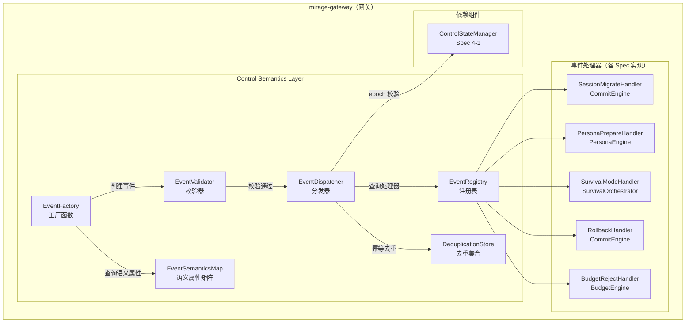
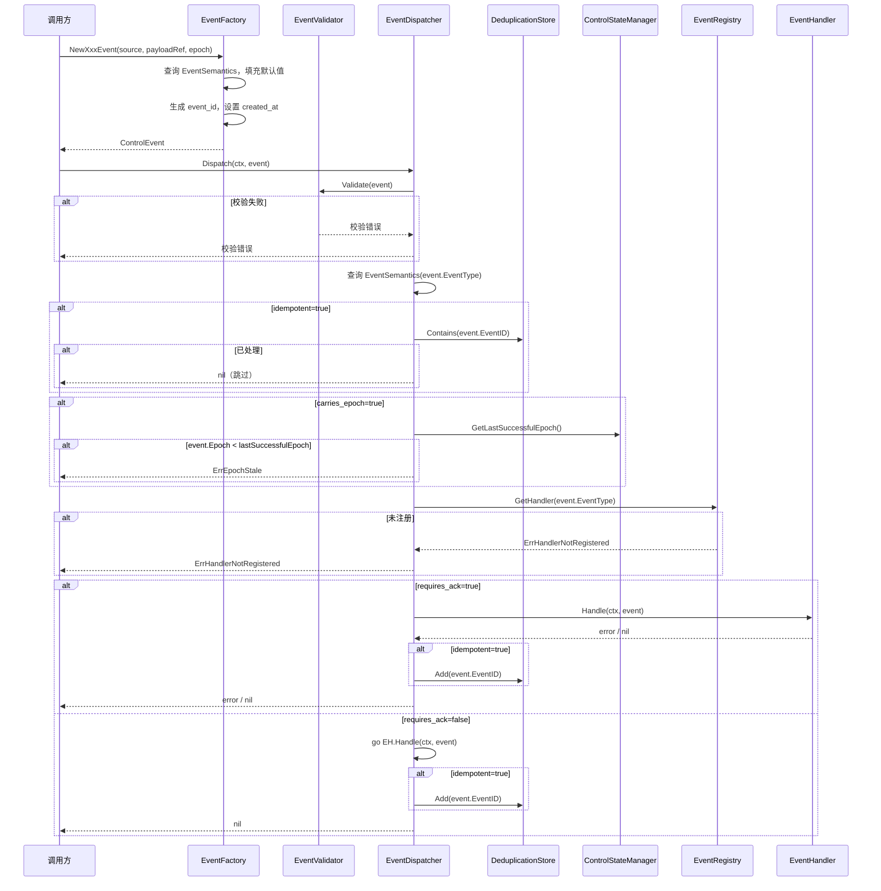
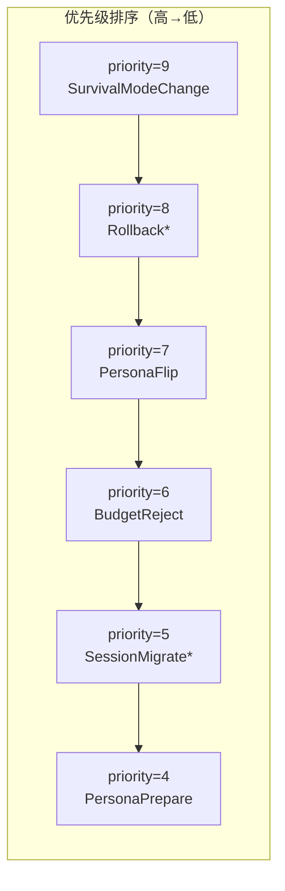

# 设计文档：V2 控制语义层

## 概述

本设计实现 Mirage V2 编排内核的控制语义层（Control Semantics Layer），为编排内核内部的关键操作定义统一的语义事件对象（ControlEvent）。控制语义层将会话迁移、Persona 切换、Survival Mode 变更、回滚、预算拒绝等操作封装为具备明确作用域、优先级、幂等性、可重放性和 Epoch 关联语义的事件对象，通过事件分发器路由到对应的处理器。

核心设计目标：
- 8 种 EventType 覆盖所有编排操作语义，每种类型绑定固定的语义属性矩阵
- 工厂函数自动填充默认语义属性，减少手动配置错误
- 事件分发前执行完整性校验（字段非空、priority 范围、requires_ack 一致性、epoch 有效性）
- 事件分发器按 priority 排序分发，requires_ack=true 同步等待，requires_ack=false 异步执行
- 幂等事件通过 event_id 去重集合保证重复投递无副作用
- carries_epoch=true 的事件在分发时校验 epoch ≥ last_successful_epoch，拒绝过期事件
- 事件注册表维护 EventType → EventHandler 一对一映射，禁止重复注册
- 所有核心数据结构支持 JSON round-trip，时间戳 RFC 3339
- 分发器、注册表、去重集合均并发安全

本模块位于 `mirage-gateway/pkg/orchestrator/events/`。

## 架构

### 整体分层



### 事件分发流程



### 优先级分发队列



## 组件与接口

### 1. 枚举定义（`pkg/orchestrator/events/types.go`）

```go
// EventType 事件类型枚举
type EventType string
const (
    EventSessionMigrateRequest EventType = "session.migrate.request"
    EventSessionMigrateAck     EventType = "session.migrate.ack"
    EventPersonaPrepare        EventType = "persona.prepare"
    EventPersonaFlip           EventType = "persona.flip"
    EventSurvivalModeChange    EventType = "survival.mode.change"
    EventRollbackRequest       EventType = "rollback.request"
    EventRollbackDone          EventType = "rollback.done"
    EventBudgetReject          EventType = "budget.reject"
)

// AllEventTypes 所有已定义的 EventType
var AllEventTypes = []EventType{
    EventSessionMigrateRequest,
    EventSessionMigrateAck,
    EventPersonaPrepare,
    EventPersonaFlip,
    EventSurvivalModeChange,
    EventRollbackRequest,
    EventRollbackDone,
    EventBudgetReject,
}

// EventScope 事件作用域枚举
type EventScope string
const (
    EventScopeSession EventScope = "Session"
    EventScopeLink    EventScope = "Link"
    EventScopeGlobal  EventScope = "Global"
)
```

### 2. EventSemantics 语义属性（`pkg/orchestrator/events/semantics.go`）

```go
// EventSemantics 事件语义属性
type EventSemantics struct {
    DefaultScope    EventScope `json:"default_scope"`
    DefaultPriority int        `json:"default_priority"`
    RequiresAck     bool       `json:"requires_ack"`
    Idempotent      bool       `json:"idempotent"`
    Replayable      bool       `json:"replayable"`
    CarriesEpoch    bool       `json:"carries_epoch"`
}

// EventSemanticsMap 事件类型到语义属性的映射
var EventSemanticsMap = map[EventType]*EventSemantics{
    EventSessionMigrateRequest: {
        DefaultScope: EventScopeSession, DefaultPriority: 5,
        RequiresAck: true, Idempotent: false, Replayable: false, CarriesEpoch: true,
    },
    EventSessionMigrateAck: {
        DefaultScope: EventScopeSession, DefaultPriority: 5,
        RequiresAck: false, Idempotent: true, Replayable: true, CarriesEpoch: true,
    },
    EventPersonaPrepare: {
        DefaultScope: EventScopeSession, DefaultPriority: 4,
        RequiresAck: true, Idempotent: true, Replayable: true, CarriesEpoch: true,
    },
    EventPersonaFlip: {
        DefaultScope: EventScopeSession, DefaultPriority: 7,
        RequiresAck: true, Idempotent: false, Replayable: false, CarriesEpoch: true,
    },
    EventSurvivalModeChange: {
        DefaultScope: EventScopeGlobal, DefaultPriority: 9,
        RequiresAck: true, Idempotent: false, Replayable: false, CarriesEpoch: true,
    },
    EventRollbackRequest: {
        DefaultScope: EventScopeSession, DefaultPriority: 8,
        RequiresAck: true, Idempotent: true, Replayable: true, CarriesEpoch: true,
    },
    EventRollbackDone: {
        DefaultScope: EventScopeSession, DefaultPriority: 8,
        RequiresAck: false, Idempotent: true, Replayable: true, CarriesEpoch: true,
    },
    EventBudgetReject: {
        DefaultScope: EventScopeSession, DefaultPriority: 6,
        RequiresAck: false, Idempotent: true, Replayable: true, CarriesEpoch: false,
    },
}

// GetSemantics 查询指定 EventType 的语义属性，未定义返回 nil
func GetSemantics(et EventType) *EventSemantics
```

### 3. ControlEvent 结构体（`pkg/orchestrator/events/event.go`）

```go
// ControlEvent 控制事件基础对象
type ControlEvent struct {
    EventID     string     `json:"event_id"`
    EventType   EventType  `json:"event_type"`
    Source      string     `json:"source"`
    TargetScope EventScope `json:"target_scope"`
    Priority    int        `json:"priority"`
    Epoch       uint64     `json:"epoch"`
    PayloadRef  string     `json:"payload_ref"`
    RequiresAck bool       `json:"requires_ack"`
    CreatedAt   time.Time  `json:"created_at"`
}

// Validate 对 ControlEvent 执行完整性校验
func (e *ControlEvent) Validate() error
```

### 4. 工厂函数（`pkg/orchestrator/events/factory.go`）

```go
// NewSessionMigrateRequestEvent 创建会话迁移请求事件
func NewSessionMigrateRequestEvent(source, payloadRef string, epoch uint64) *ControlEvent

// NewSessionMigrateAckEvent 创建会话迁移确认事件
func NewSessionMigrateAckEvent(source, payloadRef string, epoch uint64) *ControlEvent

// NewPersonaPrepareEvent 创建 Persona 准备事件
func NewPersonaPrepareEvent(source, payloadRef string, epoch uint64) *ControlEvent

// NewPersonaFlipEvent 创建 Persona 切换事件
func NewPersonaFlipEvent(source, payloadRef string, epoch uint64) *ControlEvent

// NewSurvivalModeChangeEvent 创建 Survival Mode 变更事件
func NewSurvivalModeChangeEvent(source, payloadRef string, epoch uint64) *ControlEvent

// NewRollbackRequestEvent 创建回滚请求事件
func NewRollbackRequestEvent(source, payloadRef string, epoch uint64) *ControlEvent

// NewRollbackDoneEvent 创建回滚完成事件
func NewRollbackDoneEvent(source, payloadRef string, epoch uint64) *ControlEvent

// NewBudgetRejectEvent 创建预算拒绝事件
func NewBudgetRejectEvent(source, payloadRef string, epoch uint64) *ControlEvent

// NewEvent 通用工厂函数，根据 EventType 创建事件
func NewEvent(eventType EventType, source, payloadRef string, epoch uint64) (*ControlEvent, error)
```

### 5. EventHandler 接口（`pkg/orchestrator/events/handler.go`）

```go
// EventHandler 事件处理器接口
type EventHandler interface {
    // Handle 处理控制事件
    Handle(ctx context.Context, event *ControlEvent) error
    // EventType 返回该处理器负责的事件类型
    EventType() EventType
}
```

### 6. EventRegistry 注册表（`pkg/orchestrator/events/registry.go`）

```go
// EventRegistry 事件注册表
type EventRegistry interface {
    // Register 注册事件处理器，同一 EventType 重复注册返回错误
    Register(handler EventHandler) error
    // GetHandler 获取指定 EventType 的处理器
    GetHandler(et EventType) (EventHandler, error)
    // ListRegistered 返回所有已注册的 EventType 列表
    ListRegistered() []EventType
    // IsRegistered 检查指定 EventType 是否已注册
    IsRegistered(et EventType) bool
}
```

### 7. EventDispatcher 分发器（`pkg/orchestrator/events/dispatcher.go`）

```go
// EpochProvider epoch 查询接口（依赖 Spec 4-1 ControlStateManager）
type EpochProvider interface {
    GetLastSuccessfulEpoch(ctx context.Context) (uint64, error)
}

// EventDispatcher 事件分发器
type EventDispatcher interface {
    // Dispatch 分发控制事件到已注册的处理器
    // 执行流程：校验 → 幂等去重 → epoch 校验 → 路由到处理器
    // requires_ack=true 同步等待处理结果
    // requires_ack=false 异步执行，立即返回 nil
    Dispatch(ctx context.Context, event *ControlEvent) error
}
```

### 8. DeduplicationStore 去重集合（`pkg/orchestrator/events/dedup.go`）

```go
// DeduplicationStore 幂等事件去重集合
type DeduplicationStore interface {
    // Contains 检查 event_id 是否已处理
    Contains(eventID string) bool
    // Add 添加已处理的 event_id
    Add(eventID string)
    // Cleanup 清理超过 1 小时的记录
    Cleanup()
}
```

### 9. 错误类型（`pkg/orchestrator/events/errors.go`）

```go
// ErrValidation 校验错误
type ErrValidation struct {
    Field   string // 违规字段名
    Message string // 错误描述
}
func (e *ErrValidation) Error() string

// ErrInvalidEventType 非法事件类型
type ErrInvalidEventType struct {
    Value string
}
func (e *ErrInvalidEventType) Error() string

// ErrInvalidScope 非法作用域
type ErrInvalidScope struct {
    Value string
}
func (e *ErrInvalidScope) Error() string

// ErrHandlerNotRegistered 处理器未注册
type ErrHandlerNotRegistered struct {
    EventType EventType
}
func (e *ErrHandlerNotRegistered) Error() string

// ErrDuplicateRegistration 重复注册
type ErrDuplicateRegistration struct {
    EventType EventType
}
func (e *ErrDuplicateRegistration) Error() string

// ErrEpochStale epoch 过期
type ErrEpochStale struct {
    EventEpoch   uint64
    CurrentEpoch uint64
}
func (e *ErrEpochStale) Error() string

// ErrDispatchFailed 分发失败（包装 Handler 错误）
type ErrDispatchFailed struct {
    EventID   string
    EventType EventType
    Cause     error
}
func (e *ErrDispatchFailed) Error() string
func (e *ErrDispatchFailed) Unwrap() error
```

## 数据模型

### ControlEvent 字段定义

| 字段 | 类型 | 约束 | 说明 |
|------|------|------|------|
| event_id | string | UUID v4，非空 | 事件唯一标识 |
| event_type | EventType | 8 种枚举值之一 | 事件类型 |
| source | string | 非空 | 事件来源标识 |
| target_scope | EventScope | Session/Link/Global | 事件作用域 |
| priority | int | 0-10 | 优先级，数值越大越高 |
| epoch | uint64 | carries_epoch=true 时非零 | 关联逻辑时钟 |
| payload_ref | string | 可为空 | 载荷引用标识 |
| requires_ack | bool | | 是否要求确认回执 |
| created_at | time.Time | RFC 3339 | 创建时间 |

### EventSemantics 语义属性矩阵

| EventType | default_scope | default_priority | requires_ack | idempotent | replayable | carries_epoch |
|---|---|---|---|---|---|---|
| session.migrate.request | Session | 5 | true | false | false | true |
| session.migrate.ack | Session | 5 | false | true | true | true |
| persona.prepare | Session | 4 | true | true | true | true |
| persona.flip | Session | 7 | true | false | false | true |
| survival.mode.change | Global | 9 | true | false | false | true |
| rollback.request | Session | 8 | true | true | true | true |
| rollback.done | Session | 8 | false | true | true | true |
| budget.reject | Session | 6 | false | true | true | false |

### DeduplicationStore 内存模型

| 字段 | 类型 | 说明 |
|------|------|------|
| event_id | string | 已处理事件 ID |
| processed_at | time.Time | 处理时间，用于 1 小时过期清理 |

使用 `sync.Map` 存储，key 为 event_id，value 为 processed_at。

### EventRegistry 内存模型

使用 `sync.RWMutex` 保护的 `map[EventType]EventHandler`，支持并发读写安全。


## 正确性属性

*属性（Property）是在系统所有合法执行中都应成立的特征或行为——本质上是对系统行为的形式化陈述。属性是人类可读规格说明与机器可验证正确性保证之间的桥梁。*

### Property 1: EventSemantics 矩阵完整性与正确性

*For any* 已定义的 EventType，GetSemantics 应返回非 nil 的 EventSemantics 对象，且各字段值与语义属性矩阵完全一致。具体地：EventSessionMigrateRequest 的 default_scope 为 Session、default_priority 为 5、requires_ack 为 true、idempotent 为 false、replayable 为 false、carries_epoch 为 true；EventBudgetReject 的 carries_epoch 为 false；EventSurvivalModeChange 的 default_priority 为 9、default_scope 为 Global；其余各类型均与矩阵定义一致。对未定义的 EventType 字符串，GetSemantics 应返回 nil。

**Validates: Requirements 3.1, 3.2, 3.3, 3.4, 3.5, 3.6, 3.7, 3.8, 3.9, 3.10**

### Property 2: 工厂函数默认值填充与自动字段生成

*For any* EventType 和任意 source（非空）、payloadRef、epoch 参数，通过工厂函数创建的 ControlEvent 应满足：event_id 为合法 UUID v4 格式且非空，created_at 为非零时间，target_scope 等于该 EventType 的 default_scope，priority 等于该 EventType 的 default_priority，requires_ack 等于该 EventType 的 requires_ack 默认值。当 carries_epoch 为 true 时，epoch 字段等于传入的 epoch 参数；当 carries_epoch 为 false 时，epoch 字段为 0（无论传入值为何）。

**Validates: Requirements 1.2, 4.2, 4.3, 4.4, 4.5**

### Property 3: Validate 综合校验正确性

*For any* ControlEvent 对象，Validate 方法的结果应满足以下规则的合取：(1) event_id 为空时返回包含 "event_id" 的 ErrValidation；(2) source 为空时返回包含 "source" 的 ErrValidation；(3) event_type 不属于 8 种已定义枚举时返回 ErrInvalidEventType；(4) target_scope 不属于 Session/Link/Global 时返回 ErrInvalidScope；(5) priority 超出 0-10 范围时返回包含 "priority" 的 ErrValidation；(6) 对 requires_ack=true 的 EventType，如果事件的 requires_ack 被设为 false，返回包含 "requires_ack" 的 ErrValidation；(7) 对 carries_epoch=true 的 EventType，如果事件的 epoch 为 0，返回包含 "epoch" 的 ErrValidation。所有字段合法时返回 nil。

**Validates: Requirements 1.3, 1.4, 1.5, 1.6, 5.1, 5.2, 5.3, 5.4, 5.5**

### Property 4: 注册表一对一映射与重复注册拒绝

*For any* EventHandler 注册序列，Register 首次注册某 EventType 应成功，GetHandler 返回该 Handler，IsRegistered 返回 true；对同一 EventType 再次注册不同 Handler 应返回 ErrDuplicateRegistration，且原 Handler 不被替换。ListRegistered 返回的列表应包含且仅包含所有成功注册的 EventType。

**Validates: Requirements 8.1, 8.2, 8.3, 8.4**

### Property 5: 幂等去重正确性

*For any* idempotent=true 的 ControlEvent，首次 Dispatch 应执行 Handler 并返回 Handler 结果；使用相同 event_id 再次 Dispatch 应跳过 Handler 执行并返回 nil。*For any* idempotent=false 的 ControlEvent，每次 Dispatch 都应执行 Handler，不进行去重检查。

**Validates: Requirements 9.1, 9.2, 9.3, 7.3**

### Property 6: Epoch 校验正确性

*For any* carries_epoch=true 的 ControlEvent 和任意 lastSuccessfulEpoch 值，当 event.epoch < lastSuccessfulEpoch 时 Dispatch 应返回 ErrEpochStale（包含事件 epoch 和当前 epoch），且不执行 Handler；当 event.epoch ≥ lastSuccessfulEpoch 时应正常分发。*For any* carries_epoch=false 的 ControlEvent，无论 epoch 值和 lastSuccessfulEpoch 值如何，都不应因 epoch 校验被拒绝。

**Validates: Requirements 10.1, 10.2, 10.3**

### Property 7: 同步/异步分发行为

*For any* requires_ack=true 的 ControlEvent，Dispatch 应同步等待 Handler 执行完成，返回 Handler 的结果（nil 或 error）。*For any* requires_ack=false 的 ControlEvent，Dispatch 应立即返回 nil，Handler 异步执行。

**Validates: Requirements 6.4, 6.5**

### Property 8: Handler 错误包装

*For any* requires_ack=true 的 ControlEvent，当 Handler 返回非 nil error 时，Dispatch 应返回 ErrDispatchFailed，其 EventID 等于事件的 event_id，EventType 等于事件的 event_type，Cause 等于 Handler 返回的原始错误（可通过 Unwrap 获取）。

**Validates: Requirements 6.7**

### Property 9: 去重集合清理正确性

*For any* DeduplicationStore 中的 event_id 记录集合，执行 Cleanup 后：processed_at 超过 1 小时的记录应被移除，1 小时内的记录应全部保留。

**Validates: Requirements 9.4**

### Property 10: JSON 序列化 round-trip

*For any* 合法的 ControlEvent 对象，JSON 序列化后再反序列化应产生等价对象（所有字段值保持不变），且 created_at 字段格式化为 RFC 3339 时间戳。*For any* 合法的 EventSemantics 对象，JSON 序列化后再反序列化应产生等价对象，且所有 JSON key 为 snake_case 格式。

**Validates: Requirements 11.1, 11.2, 11.3, 11.4, 11.5**

## 错误处理

### 校验错误

| 错误场景 | 处理方式 |
|----------|----------|
| event_id 为空 | 返回 `ErrValidation{Field: "event_id", Message: "must not be empty"}` |
| source 为空 | 返回 `ErrValidation{Field: "source", Message: "must not be empty"}` |
| event_type 非法 | 返回 `ErrInvalidEventType{Value: 非法值}` |
| target_scope 非法 | 返回 `ErrInvalidScope{Value: 非法值}` |
| priority 超出 0-10 | 返回 `ErrValidation{Field: "priority", Message: "must be 0-10, got: N"}` |
| requires_ack 不一致 | 返回 `ErrValidation{Field: "requires_ack", Message: "event_type X requires ack"}` |
| epoch 为 0 但 carries_epoch=true | 返回 `ErrValidation{Field: "epoch", Message: "event_type X requires epoch"}` |

### 分发错误

| 错误场景 | 处理方式 |
|----------|----------|
| 处理器未注册 | 返回 `ErrHandlerNotRegistered{EventType}` |
| epoch 过期 | 返回 `ErrEpochStale{EventEpoch, CurrentEpoch}`，不执行 Handler |
| Handler 返回错误 | 返回 `ErrDispatchFailed{EventID, EventType, Cause}`，Cause 可 Unwrap |

### 注册错误

| 错误场景 | 处理方式 |
|----------|----------|
| 重复注册同一 EventType | 返回 `ErrDuplicateRegistration{EventType}`，原 Handler 不变 |

### 工厂函数错误

| 错误场景 | 处理方式 |
|----------|----------|
| 未定义的 EventType | NewEvent 返回 `ErrInvalidEventType{Value}` |

## 测试策略

### 属性测试（Property-Based Testing）

使用 `pgregory.net/rapid`（已在 go.mod 中）作为 PBT 库。

每个属性测试运行至少 100 次迭代，标签格式：`Feature: v2-control-semantics, Property N: <描述>`

属性测试覆盖 Property 1-10，重点验证：
- EventSemantics 矩阵完整性（Property 1）
- 工厂函数默认值填充（Property 2）
- Validate 综合校验（Property 3）
- 注册表一对一映射（Property 4）
- 幂等去重（Property 5）
- Epoch 校验（Property 6）
- 同步/异步分发（Property 7）
- Handler 错误包装（Property 8）
- 去重集合清理（Property 9）
- JSON round-trip（Property 10）

### 单元测试

- 8 种 EventType 枚举值的字符串表示互不相同
- EventScope 三种枚举值的字符串表示
- AllEventTypes 包含 8 个元素
- ErrValidation、ErrInvalidEventType、ErrInvalidScope、ErrHandlerNotRegistered、ErrDuplicateRegistration、ErrEpochStale、ErrDispatchFailed 的 Error() 方法
- ErrDispatchFailed 的 Unwrap() 方法

### 集成测试

- EventDispatcher 多 goroutine 并发 Dispatch（-race 检测）
- EventRegistry 多 goroutine 并发 Register/IsRegistered/ListRegistered（-race 检测）
- DeduplicationStore 多 goroutine 并发 Contains/Add/Cleanup（-race 检测）
- 完整事件流程端到端验证：工厂创建 → 校验 → 注册 Handler → 分发 → Handler 执行
