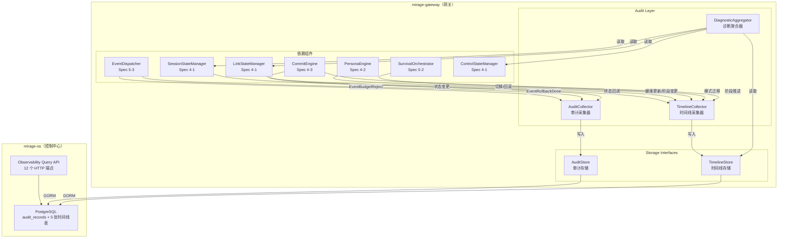
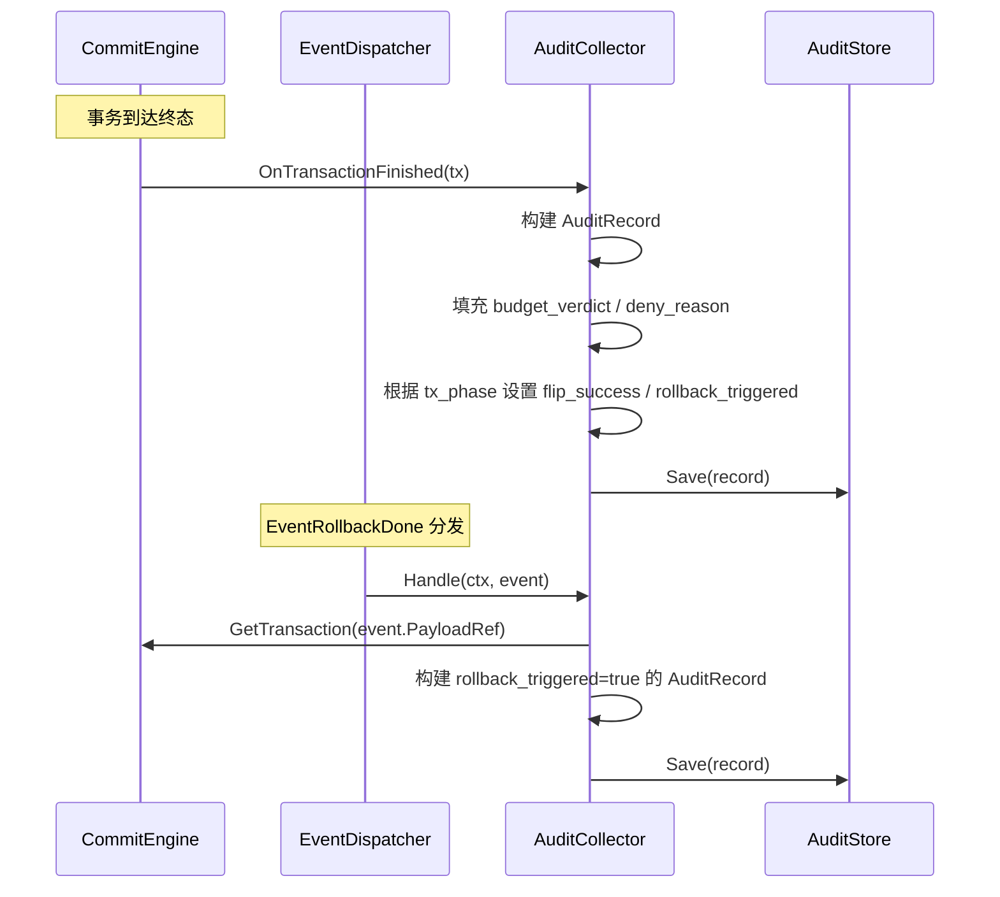
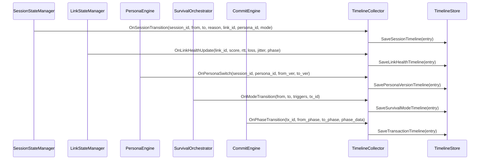
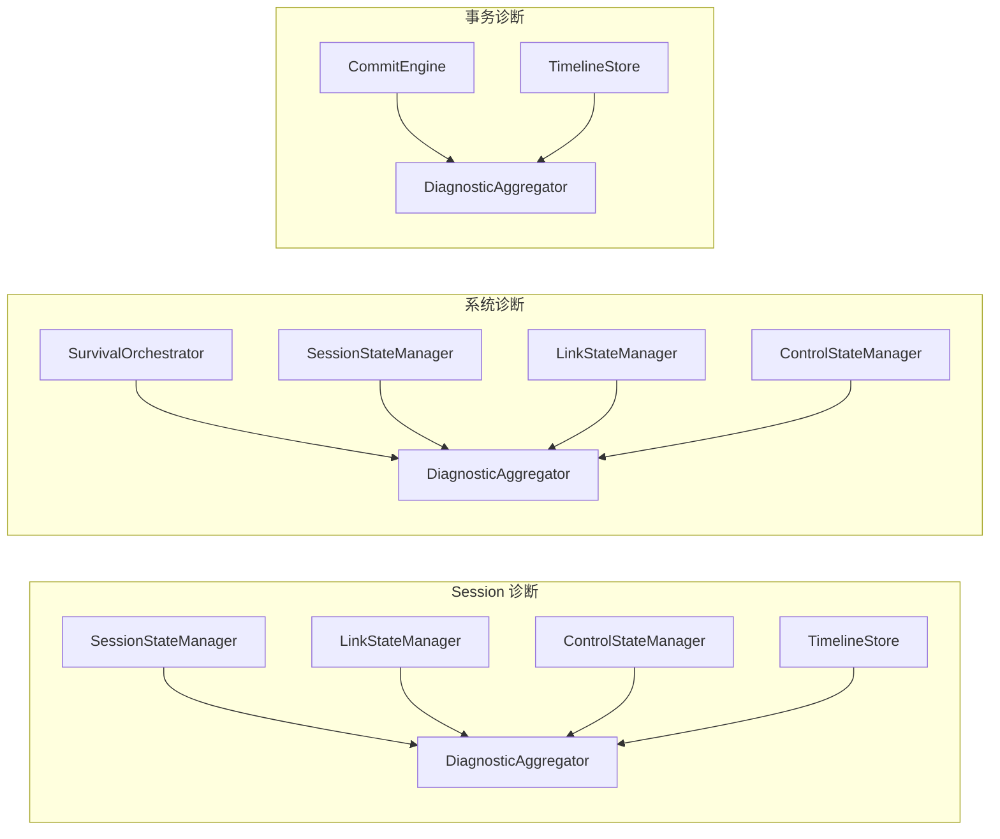

# 设计文档：V2 观测与审计

## 概述

本设计实现 Mirage V2 编排内核的观测与审计层（Observability & Audit Layer），为编排内核提供事务审计记录、五类状态时间线和三种最小诊断视图。该层使系统在 V2 上线后具备"可解释、可复盘、可诊断"的能力。

核心设计目标：
- 事务审计记录（Audit_Record）捕获每次 CommitTransaction 终态时的关键决策信息
- 五类时间线（Session / Link Health / Persona Version / Survival Mode / Transaction）记录各观测对象的状态变迁历史
- 三种诊断视图（Session / System / Transaction）实时聚合当前系统关键状态
- 审计采集器通过 Spec 5-3 EventHandler 接口自动触发，无需手动调用
- 时间线采集器监听各状态管理器的变更事件并生成条目
- 所有观测数据持久化到 PostgreSQL，支持按条件过滤查询
- 数据保留策略：审计记录 90 天，时间线 30 天
- 所有核心数据结构支持 JSON round-trip，时间戳 RFC 3339

涉及模块：
- `mirage-gateway/pkg/orchestrator/audit/` — 审计采集器、时间线采集器、诊断聚合器
- `mirage-os/pkg/models/` — DB 模型扩展（6 张新表）
- `mirage-os` API 层 — 12 个 HTTP 查询端点

前置依赖：
- Spec 4-1：SessionStateManager、LinkStateManager、ControlStateManager
- Spec 4-2：PersonaEngine（SwitchPersona / Rollback 事件）
- Spec 4-3：CommitEngine、CommitTransaction（TxPhase 终态事件）
- Spec 5-1：BudgetDecision（verdict / deny_reason）
- Spec 5-2：SurvivalOrchestrator、TransitionRecord
- Spec 5-3：ControlEvent、EventDispatcher、EventHandler、EventRegistry

## 架构

### 整体分层



### 审计采集流程



### 时间线采集流程



### 诊断视图聚合



## 组件与接口

### 1. AuditRecord 结构体（`pkg/orchestrator/audit/audit_record.go`）

```go
// AuditRecord 事务审计记录
type AuditRecord struct {
    AuditID            string          `json:"audit_id" gorm:"primaryKey;size:64"`
    TxID               string          `json:"tx_id" gorm:"index;size:64;not null"`
    TxType             commit.TxType   `json:"tx_type" gorm:"index;size:32;not null"`
    InitiatedAt        time.Time       `json:"initiated_at" gorm:"index;not null"`
    FinishedAt         time.Time       `json:"finished_at" gorm:"not null"`
    InitiationReason   string          `json:"initiation_reason" gorm:"size:256"`
    TargetState        json.RawMessage `json:"target_state" gorm:"type:jsonb;default:'{}'"`
    BudgetVerdict      string          `json:"budget_verdict" gorm:"size:32"`
    DenyReason         string          `json:"deny_reason,omitempty" gorm:"size:256"`
    FlipSuccess        bool            `json:"flip_success" gorm:"not null;default:false"`
    RollbackTriggered  bool            `json:"rollback_triggered" gorm:"index;not null;default:false"`
    CreatedAt          time.Time       `json:"created_at" gorm:"autoCreateTime"`
}

func (AuditRecord) TableName() string { return "audit_records" }

// Validate 校验 AuditRecord 必填字段
func (r *AuditRecord) Validate() error
```

### 2. 五类时间线条目（`pkg/orchestrator/audit/timeline_entries.go`）

```go
// SessionTimelineEntry Session 时间线条目
type SessionTimelineEntry struct {
    EntryID      string                    `json:"entry_id" gorm:"primaryKey;size:64"`
    SessionID    string                    `json:"session_id" gorm:"index;size:64;not null"`
    FromState    orchestrator.SessionPhase `json:"from_state" gorm:"size:16;not null"`
    ToState      orchestrator.SessionPhase `json:"to_state" gorm:"size:16;not null"`
    Reason       string                    `json:"reason" gorm:"size:256"`
    LinkID       string                    `json:"link_id" gorm:"size:64"`
    PersonaID    string                    `json:"persona_id" gorm:"size:64"`
    SurvivalMode orchestrator.SurvivalMode `json:"survival_mode" gorm:"size:16"`
    Timestamp    time.Time                 `json:"timestamp" gorm:"index;not null"`
}

func (SessionTimelineEntry) TableName() string { return "session_timeline" }

// LinkHealthTimelineEntry Link 健康时间线条目
type LinkHealthTimelineEntry struct {
    EntryID     string                 `json:"entry_id" gorm:"primaryKey;size:64"`
    LinkID      string                 `json:"link_id" gorm:"index;size:64;not null"`
    HealthScore float64                `json:"health_score" gorm:"type:numeric(5,2)"`
    RTTMs       int64                  `json:"rtt_ms"`
    LossRate    float64                `json:"loss_rate" gorm:"type:numeric(5,4)"`
    JitterMs    int64                  `json:"jitter_ms"`
    Phase       orchestrator.LinkPhase `json:"phase" gorm:"size:16;not null"`
    EventType   string                 `json:"event_type" gorm:"size:32;not null"` // "health_update" | "phase_transition"
    Timestamp   time.Time              `json:"timestamp" gorm:"index;not null"`
}

func (LinkHealthTimelineEntry) TableName() string { return "link_health_timeline" }

// PersonaVersionTimelineEntry Persona 版本时间线条目
type PersonaVersionTimelineEntry struct {
    EntryID     string    `json:"entry_id" gorm:"primaryKey;size:64"`
    SessionID   string    `json:"session_id" gorm:"index;size:64;not null"`
    PersonaID   string    `json:"persona_id" gorm:"index;size:64;not null"`
    FromVersion uint64    `json:"from_version"`
    ToVersion   uint64    `json:"to_version"`
    EventType   string    `json:"event_type" gorm:"size:32;not null"` // "switch" | "rollback"
    Timestamp   time.Time `json:"timestamp" gorm:"index;not null"`
}

func (PersonaVersionTimelineEntry) TableName() string { return "persona_version_timeline" }

// SurvivalModeTimelineEntry Survival Mode 时间线条目
type SurvivalModeTimelineEntry struct {
    EntryID  string                    `json:"entry_id" gorm:"primaryKey;size:64"`
    FromMode orchestrator.SurvivalMode `json:"from_mode" gorm:"size:16;not null"`
    ToMode   orchestrator.SurvivalMode `json:"to_mode" gorm:"size:16;not null"`
    Triggers json.RawMessage           `json:"triggers" gorm:"type:jsonb"`
    TxID     string                    `json:"tx_id" gorm:"size:64"`
    Timestamp time.Time                `json:"timestamp" gorm:"index;not null"`
}

func (SurvivalModeTimelineEntry) TableName() string { return "survival_mode_timeline" }

// TransactionTimelineEntry Transaction 时间线条目
type TransactionTimelineEntry struct {
    EntryID   string          `json:"entry_id" gorm:"primaryKey;size:64"`
    TxID      string          `json:"tx_id" gorm:"index;size:64;not null"`
    FromPhase commit.TxPhase  `json:"from_phase" gorm:"size:16;not null"`
    ToPhase   commit.TxPhase  `json:"to_phase" gorm:"size:16;not null"`
    PhaseData json.RawMessage `json:"phase_data" gorm:"type:jsonb;default:'{}'"`
    Timestamp time.Time       `json:"timestamp" gorm:"index;not null"`
}

func (TransactionTimelineEntry) TableName() string { return "transaction_timeline" }
```

### 3. 诊断视图结构体（`pkg/orchestrator/audit/diagnostic_views.go`）

```go
// SessionDiagnostic Session 诊断视图
type SessionDiagnostic struct {
    SessionID              string                    `json:"session_id"`
    CurrentLinkID          string                    `json:"current_link_id"`
    CurrentLinkPhase       orchestrator.LinkPhase    `json:"current_link_phase"`
    CurrentPersonaID       string                    `json:"current_persona_id"`
    CurrentPersonaVersion  uint64                    `json:"current_persona_version"`
    CurrentSurvivalMode    orchestrator.SurvivalMode `json:"current_survival_mode"`
    SessionState           orchestrator.SessionPhase `json:"session_state"`
    LastSwitchReason       string                    `json:"last_switch_reason"`
    LastRollbackReason     string                    `json:"last_rollback_reason"`
}

// SystemDiagnostic 系统诊断视图
type SystemDiagnostic struct {
    CurrentSurvivalMode    orchestrator.SurvivalMode `json:"current_survival_mode"`
    LastModeSwitchReason   string                    `json:"last_mode_switch_reason"`
    LastModeSwitchTime     *time.Time                `json:"last_mode_switch_time"`
    ActiveSessionCount     int                       `json:"active_session_count"`
    ActiveLinkCount        int                       `json:"active_link_count"`
    ActiveTransaction      *ActiveTxInfo             `json:"active_transaction"`
}

// ActiveTxInfo 活跃事务摘要
type ActiveTxInfo struct {
    TxID    string         `json:"tx_id"`
    TxType  commit.TxType  `json:"tx_type"`
    TxPhase commit.TxPhase `json:"tx_phase"`
}

// TransactionDiagnostic 事务诊断视图
type TransactionDiagnostic struct {
    TxID                string                    `json:"tx_id"`
    TxType              commit.TxType             `json:"tx_type"`
    CurrentPhase        commit.TxPhase            `json:"current_phase"`
    PhaseDurations      map[string]time.Duration  `json:"phase_durations"`
    StuckDuration       time.Duration             `json:"stuck_duration"`
    TargetSessionID     string                    `json:"target_session_id"`
    TargetSurvivalMode  orchestrator.SurvivalMode `json:"target_survival_mode"`
}
```

### 4. AuditStore 接口（`pkg/orchestrator/audit/audit_store.go`）

```go
// AuditFilter 审计记录查询过滤条件
type AuditFilter struct {
    TxType            *commit.TxType
    RollbackTriggered *bool
    StartTime         *time.Time
    EndTime           *time.Time
}

// AuditStore 审计存储接口
type AuditStore interface {
    // Save 保存审计记录
    Save(ctx context.Context, record *AuditRecord) error
    // GetByTxID 按 tx_id 查询审计记录
    GetByTxID(ctx context.Context, txID string) (*AuditRecord, error)
    // List 按过滤条件查询审计记录列表
    List(ctx context.Context, filter *AuditFilter) ([]*AuditRecord, error)
    // Cleanup 清理超过保留天数的记录，默认 90 天
    Cleanup(ctx context.Context, retentionDays int) (int64, error)
}
```

### 5. TimelineStore 接口（`pkg/orchestrator/audit/timeline_store.go`）

```go
// TimeRange 时间范围过滤
type TimeRange struct {
    Start *time.Time
    End   *time.Time
}

// TimelineStore 时间线存储接口
type TimelineStore interface {
    // Session 时间线
    SaveSessionEntry(ctx context.Context, entry *SessionTimelineEntry) error
    ListSessionEntries(ctx context.Context, sessionID string, tr *TimeRange) ([]*SessionTimelineEntry, error)

    // Link 健康时间线
    SaveLinkHealthEntry(ctx context.Context, entry *LinkHealthTimelineEntry) error
    ListLinkHealthEntries(ctx context.Context, linkID string, tr *TimeRange) ([]*LinkHealthTimelineEntry, error)

    // Persona 版本时间线
    SavePersonaVersionEntry(ctx context.Context, entry *PersonaVersionTimelineEntry) error
    ListPersonaVersionEntries(ctx context.Context, sessionID string, tr *TimeRange) ([]*PersonaVersionTimelineEntry, error)
    ListPersonaVersionEntriesByPersona(ctx context.Context, personaID string, tr *TimeRange) ([]*PersonaVersionTimelineEntry, error)

    // Survival Mode 时间线
    SaveSurvivalModeEntry(ctx context.Context, entry *SurvivalModeTimelineEntry) error
    ListSurvivalModeEntries(ctx context.Context, tr *TimeRange) ([]*SurvivalModeTimelineEntry, error)

    // Transaction 时间线
    SaveTransactionEntry(ctx context.Context, entry *TransactionTimelineEntry) error
    ListTransactionEntries(ctx context.Context, txID string) ([]*TransactionTimelineEntry, error)

    // 清理
    Cleanup(ctx context.Context, retentionDays int) (int64, error)
}
```

### 6. AuditCollector 审计采集器（`pkg/orchestrator/audit/audit_collector.go`）

```go
// TransactionProvider 事务查询接口（依赖 Spec 4-3 CommitEngine）
type TransactionProvider interface {
    GetTransaction(ctx context.Context, txID string) (*commit.CommitTransaction, error)
}

// BudgetDecisionProvider 预算判定查询接口（依赖 Spec 5-1）
type BudgetDecisionProvider interface {
    GetLastDecision(ctx context.Context, txID string) (*budget.BudgetDecision, error)
}

// AuditCollector 审计采集器
// 实现 events.EventHandler 接口，处理 EventRollbackDone 和 EventBudgetReject
type AuditCollector interface {
    // OnTransactionFinished 当 CommitTransaction 到达终态时调用
    OnTransactionFinished(ctx context.Context, tx *commit.CommitTransaction) error

    // Handle 实现 EventHandler 接口
    Handle(ctx context.Context, event *events.ControlEvent) error

    // EventType 返回处理的事件类型（注册多个时需要多个实例）
    EventType() events.EventType
}
```

### 7. TimelineCollector 时间线采集器（`pkg/orchestrator/audit/timeline_collector.go`）

```go
// TimelineCollector 时间线采集器
type TimelineCollector interface {
    // Session 状态变更
    OnSessionTransition(ctx context.Context, sessionID string,
        from, to orchestrator.SessionPhase, reason, linkID, personaID string,
        mode orchestrator.SurvivalMode) error

    // Link 健康更新
    OnLinkHealthUpdate(ctx context.Context, linkID string,
        score float64, rttMs int64, lossRate float64, jitterMs int64,
        phase orchestrator.LinkPhase) error

    // Link 阶段变更
    OnLinkPhaseTransition(ctx context.Context, linkID string,
        score float64, rttMs int64, lossRate float64, jitterMs int64,
        phase orchestrator.LinkPhase) error

    // Persona 切换
    OnPersonaSwitch(ctx context.Context, sessionID, personaID string,
        fromVersion, toVersion uint64) error

    // Persona 回滚
    OnPersonaRollback(ctx context.Context, sessionID, personaID string,
        fromVersion, toVersion uint64) error

    // Survival Mode 迁移
    OnModeTransition(ctx context.Context,
        from, to orchestrator.SurvivalMode,
        triggers json.RawMessage, txID string) error

    // Transaction 阶段推进
    OnTxPhaseTransition(ctx context.Context, txID string,
        from, to commit.TxPhase, phaseData json.RawMessage) error
}
```

### 8. DiagnosticAggregator 诊断聚合器（`pkg/orchestrator/audit/diagnostic_aggregator.go`）

```go
// DiagnosticAggregator 诊断聚合器
type DiagnosticAggregator interface {
    // GetSessionDiagnostic 获取 Session 诊断视图
    GetSessionDiagnostic(ctx context.Context, sessionID string) (*SessionDiagnostic, error)

    // GetSystemDiagnostic 获取系统诊断视图
    GetSystemDiagnostic(ctx context.Context) (*SystemDiagnostic, error)

    // GetTransactionDiagnostic 获取事务诊断视图
    GetTransactionDiagnostic(ctx context.Context, txID string) (*TransactionDiagnostic, error)
}
```

### 9. 错误类型（`pkg/orchestrator/audit/errors.go`）

```go
// ErrAuditRecordNotFound 审计记录不存在
type ErrAuditRecordNotFound struct {
    TxID string
}
func (e *ErrAuditRecordNotFound) Error() string

// ErrSessionNotFound Session 不存在
type ErrSessionNotFound struct {
    SessionID string
}
func (e *ErrSessionNotFound) Error() string

// ErrTransactionNotFound 事务不存在
type ErrTransactionNotFound struct {
    TxID string
}
func (e *ErrTransactionNotFound) Error() string

// ErrInvalidAuditRecord 无效审计记录
type ErrInvalidAuditRecord struct {
    Field   string
    Message string
}
func (e *ErrInvalidAuditRecord) Error() string
```

### 10. Observability Query API（mirage-os HTTP 端点）

| 方法 | 路径 | 说明 |
|------|------|------|
| GET | `/api/v2/audit/records` | 按 tx_type、时间范围、rollback_triggered 过滤审计记录 |
| GET | `/api/v2/audit/records/{tx_id}` | 返回指定事务的审计记录 |
| GET | `/api/v2/timelines/sessions/{session_id}` | 返回 Session 时间线 |
| GET | `/api/v2/timelines/links/{link_id}/health` | 返回 Link 健康时间线 |
| GET | `/api/v2/timelines/personas/{session_id}` | 返回 Persona 版本时间线 |
| GET | `/api/v2/timelines/survival-modes` | 返回 Survival Mode 时间线 |
| GET | `/api/v2/timelines/transactions/{tx_id}` | 返回 Transaction 时间线 |
| GET | `/api/v2/diagnostics/sessions/{session_id}` | 返回 Session 诊断视图 |
| GET | `/api/v2/diagnostics/system` | 返回系统诊断视图 |
| GET | `/api/v2/diagnostics/transactions/{tx_id}` | 返回事务诊断视图 |

所有响应 JSON 格式，时间戳 RFC 3339。资源不存在返回 HTTP 404。

时间线端点支持 `?start=RFC3339&end=RFC3339` 查询参数进行时间范围过滤。

## 数据模型

### audit_records 表

| 字段 | 类型 | 约束 | 说明 |
|------|------|------|------|
| audit_id | VARCHAR(64) | PK | 审计记录唯一标识（UUID v4） |
| tx_id | VARCHAR(64) | INDEX, NOT NULL | 关联事务 ID |
| tx_type | VARCHAR(32) | INDEX, NOT NULL | 事务类型 |
| initiated_at | TIMESTAMPTZ | INDEX, NOT NULL | 事务创建时间 |
| finished_at | TIMESTAMPTZ | NOT NULL | 事务完成时间 |
| initiation_reason | VARCHAR(256) | | 发起原因 |
| target_state | JSONB | DEFAULT '{}' | 目标状态 JSON |
| budget_verdict | VARCHAR(32) | | 预算判定结果 |
| deny_reason | VARCHAR(256) | | 拒绝原因（仅 deny 类 verdict） |
| flip_success | BOOLEAN | NOT NULL, DEFAULT false | flip 是否成功 |
| rollback_triggered | BOOLEAN | INDEX, NOT NULL, DEFAULT false | rollback 是否触发 |
| created_at | TIMESTAMPTZ | AUTO | 记录创建时间 |

### session_timeline 表

| 字段 | 类型 | 约束 | 说明 |
|------|------|------|------|
| entry_id | VARCHAR(64) | PK | 条目唯一标识 |
| session_id | VARCHAR(64) | INDEX, NOT NULL | 会话 ID |
| from_state | VARCHAR(16) | NOT NULL | 变更前 SessionPhase |
| to_state | VARCHAR(16) | NOT NULL | 变更后 SessionPhase |
| reason | VARCHAR(256) | | 变更原因 |
| link_id | VARCHAR(64) | | 当时绑定的 Link |
| persona_id | VARCHAR(64) | | 当时使用的 Persona |
| survival_mode | VARCHAR(16) | | 当时的 Survival Mode |
| timestamp | TIMESTAMPTZ | INDEX, NOT NULL | 事件时间 |

### link_health_timeline 表

| 字段 | 类型 | 约束 | 说明 |
|------|------|------|------|
| entry_id | VARCHAR(64) | PK | 条目唯一标识 |
| link_id | VARCHAR(64) | INDEX, NOT NULL | 链路 ID |
| health_score | NUMERIC(5,2) | | 健康分 |
| rtt_ms | BIGINT | | 往返延迟 |
| loss_rate | NUMERIC(5,4) | | 丢包率 |
| jitter_ms | BIGINT | | 抖动 |
| phase | VARCHAR(16) | NOT NULL | 当时的 LinkPhase |
| event_type | VARCHAR(32) | NOT NULL | "health_update" 或 "phase_transition" |
| timestamp | TIMESTAMPTZ | INDEX, NOT NULL | 事件时间 |

### persona_version_timeline 表

| 字段 | 类型 | 约束 | 说明 |
|------|------|------|------|
| entry_id | VARCHAR(64) | PK | 条目唯一标识 |
| session_id | VARCHAR(64) | INDEX, NOT NULL | 会话 ID |
| persona_id | VARCHAR(64) | INDEX, NOT NULL | 画像 ID |
| from_version | BIGINT | | 切换前版本号 |
| to_version | BIGINT | | 切换后版本号 |
| event_type | VARCHAR(32) | NOT NULL | "switch" 或 "rollback" |
| timestamp | TIMESTAMPTZ | INDEX, NOT NULL | 事件时间 |

### survival_mode_timeline 表

| 字段 | 类型 | 约束 | 说明 |
|------|------|------|------|
| entry_id | VARCHAR(64) | PK | 条目唯一标识 |
| from_mode | VARCHAR(16) | NOT NULL | 变更前模式 |
| to_mode | VARCHAR(16) | NOT NULL | 变更后模式 |
| triggers | JSONB | | 触发因素列表 |
| tx_id | VARCHAR(64) | | 关联事务 ID |
| timestamp | TIMESTAMPTZ | INDEX, NOT NULL | 事件时间 |

### transaction_timeline 表

| 字段 | 类型 | 约束 | 说明 |
|------|------|------|------|
| entry_id | VARCHAR(64) | PK | 条目唯一标识 |
| tx_id | VARCHAR(64) | INDEX, NOT NULL | 事务 ID |
| from_phase | VARCHAR(16) | NOT NULL | 变更前 TxPhase |
| to_phase | VARCHAR(16) | NOT NULL | 变更后 TxPhase |
| phase_data | JSONB | DEFAULT '{}' | 该阶段状态 JSON |
| timestamp | TIMESTAMPTZ | INDEX, NOT NULL | 事件时间 |

### GORM 模型注册

六个新模型加入 `mirage-os/pkg/models/db.go` 的 AutoMigrate：

```go
func AutoMigrate(db *gorm.DB) error {
    return db.AutoMigrate(
        // ... 现有模型 ...
        &AuditRecord{},
        &SessionTimelineEntry{},
        &LinkHealthTimelineEntry{},
        &PersonaVersionTimelineEntry{},
        &SurvivalModeTimelineEntry{},
        &TransactionTimelineEntry{},
    )
}
```


## 正确性属性

*属性（Property）是在系统所有合法执行中都应成立的特征或行为——本质上是对系统行为的形式化陈述。属性是人类可读规格说明与机器可验证正确性保证之间的桥梁。*

### Property 1: AuditRecord 字段派生正确性

*For any* 处于终态（Committed / RolledBack / Failed）的 CommitTransaction，AuditCollector 生成的 AuditRecord 应满足以下规则的合取：(1) audit_id 为合法 UUID v4 格式且非空；(2) tx_id 等于事务的 tx_id；(3) tx_type 等于事务的 tx_type；(4) initiated_at 等于事务的 created_at；(5) finished_at 等于事务的 finished_at；(6) 当 tx_phase 为 Committed 时 flip_success=true 且 rollback_triggered=false；(7) 当 tx_phase 为 RolledBack 时 flip_success=false 且 rollback_triggered=true；(8) 当 tx_phase 为 Failed 时 flip_success=false 且 rollback_triggered=false；(9) 当 budget_verdict 为 deny_and_hold 或 deny_and_suspend 时 deny_reason 非空；(10) 当 budget_verdict 为 allow 或 allow_degraded 或 allow_with_charge 时 deny_reason 为空。

**Validates: Requirements 1.1, 1.2, 1.3, 1.4, 1.5, 1.6, 1.8**

### Property 2: Session 时间线条目生成完整性

*For any* Session 状态变更参数（session_id、from_state、to_state、reason、link_id、persona_id、survival_mode），TimelineCollector.OnSessionTransition 生成的 SessionTimelineEntry 应满足：entry_id 为合法 UUID v4 且非空，session_id 等于传入值，from_state 和 to_state 等于传入值，reason、link_id、persona_id、survival_mode 等于传入值，timestamp 为非零时间。

**Validates: Requirements 2.1, 2.2**

### Property 3: Link 健康时间线条目生成完整性

*For any* Link 健康更新或阶段变更参数（link_id、health_score、rtt_ms、loss_rate、jitter_ms、phase），TimelineCollector 生成的 LinkHealthTimelineEntry 应满足：entry_id 为合法 UUID v4 且非空，所有指标字段等于传入值，event_type 为 "health_update"（健康更新时）或 "phase_transition"（阶段变更时），timestamp 为非零时间。

**Validates: Requirements 3.1, 3.2, 3.3**

### Property 4: Persona 版本时间线条目生成完整性

*For any* Persona 切换或回滚参数（session_id、persona_id、from_version、to_version），TimelineCollector 生成的 PersonaVersionTimelineEntry 应满足：entry_id 为合法 UUID v4 且非空，所有字段等于传入值，event_type 为 "switch"（切换时）或 "rollback"（回滚时），timestamp 为非零时间。

**Validates: Requirements 4.1, 4.2, 4.3**

### Property 5: Survival Mode 时间线条目生成完整性

*For any* 模式迁移参数（from_mode、to_mode、triggers JSON、tx_id），TimelineCollector.OnModeTransition 生成的 SurvivalModeTimelineEntry 应满足：entry_id 为合法 UUID v4 且非空，from_mode 和 to_mode 等于传入值，triggers 等于传入的 JSON，tx_id 等于传入值，timestamp 为非零时间。

**Validates: Requirements 5.1, 5.2**

### Property 6: Transaction 时间线条目生成完整性

*For any* 事务阶段推进参数（tx_id、from_phase、to_phase、phase_data JSON），TimelineCollector.OnTxPhaseTransition 生成的 TransactionTimelineEntry 应满足：entry_id 为合法 UUID v4 且非空，tx_id 等于传入值，from_phase 和 to_phase 等于传入值，phase_data 等于传入的 JSON，timestamp 为非零时间。

**Validates: Requirements 6.1, 6.2**

### Property 7: Session 诊断视图聚合正确性

*For any* 存在的 Session（session_id 有效），DiagnosticAggregator.GetSessionDiagnostic 返回的 SessionDiagnostic 应满足：session_id 等于请求值，current_link_id 等于 SessionState 的 current_link_id，current_link_phase 等于该 Link 的当前 phase，current_persona_id 等于 SessionState 的 current_persona_id，current_persona_version 等于 ControlState 的 persona_version，current_survival_mode 等于 SessionState 的 current_survival_mode，session_state 等于 SessionState 的 state。

**Validates: Requirements 7.1, 7.2, 7.3**

### Property 8: 系统诊断视图聚合正确性

*For any* 系统状态，DiagnosticAggregator.GetSystemDiagnostic 返回的 SystemDiagnostic 应满足：current_survival_mode 等于 SurvivalOrchestrator 的当前模式，active_session_count 等于 SessionStateManager 中非 Closed 状态的 Session 数量，active_link_count 等于 LinkStateManager 中 phase 为 Active 或 Degrading 的 Link 数量，当 ControlState 的 active_tx_id 非空时 active_transaction 非 nil 且字段匹配。

**Validates: Requirements 8.1, 8.2, 8.3**

### Property 9: 事务诊断视图与 stuck_duration 不变量

*For any* 存在的 CommitTransaction，DiagnosticAggregator.GetTransactionDiagnostic 返回的 TransactionDiagnostic 应满足：tx_id、tx_type、current_phase 等于事务对应字段；当事务处于终态（Committed / RolledBack / Failed）时 stuck_duration 为零值；当事务处于非终态时 stuck_duration 为当前时间减去最后一次阶段变更时间。

**Validates: Requirements 9.1, 9.2, 9.4**

### Property 10: 数据保留清理正确性

*For any* AuditStore 或 TimelineStore 中的记录集合和保留天数 N，执行 Cleanup(N) 后：created_at / timestamp 超过 N 天的记录应被删除，N 天内的记录应全部保留。返回的 int64 应等于实际删除的记录数。

**Validates: Requirements 13.1, 13.2, 13.3**

### Property 11: JSON 序列化 round-trip

*For any* 合法的 AuditRecord、SessionTimelineEntry、LinkHealthTimelineEntry、PersonaVersionTimelineEntry、SurvivalModeTimelineEntry、TransactionTimelineEntry、SessionDiagnostic、SystemDiagnostic 或 TransactionDiagnostic 对象，JSON 序列化后再反序列化应产生等价对象（所有字段值保持不变），且所有 JSON key 为 snake_case 格式，所有时间戳字段格式化为 RFC 3339。

**Validates: Requirements 14.1, 14.2, 14.3, 14.4, 14.5**

## 错误处理

### 审计采集错误

| 错误场景 | 处理方式 |
|----------|----------|
| CommitTransaction 未到达终态 | AuditCollector 忽略，不生成 AuditRecord |
| AuditStore 写入失败 | 记录错误日志，不阻塞事务流程 |
| TransactionProvider 查询失败 | Handle 返回错误，EventDispatcher 按 requires_ack 语义处理 |
| BudgetDecisionProvider 查询失败 | AuditRecord 的 budget_verdict 留空，不阻塞审计记录生成 |

### 时间线采集错误

| 错误场景 | 处理方式 |
|----------|----------|
| TimelineStore 写入失败 | 记录错误日志，不阻塞状态变更流程 |
| 传入参数不完整（如 session_id 为空） | 返回 ErrInvalidAuditRecord，不写入 |

### 诊断聚合错误

| 错误场景 | 处理方式 |
|----------|----------|
| session_id 不存在 | 返回 `ErrSessionNotFound{SessionID}` |
| tx_id 不存在 | 返回 `ErrTransactionNotFound{TxID}` |
| 依赖组件（StateManager）查询失败 | 返回原始错误，调用方处理 |

### 数据清理错误

| 错误场景 | 处理方式 |
|----------|----------|
| 数据库删除操作失败 | 返回原始错误，调用方重试 |
| 保留天数 ≤ 0 | 返回参数错误，不执行删除 |

### API 错误

| 错误场景 | 处理方式 |
|----------|----------|
| 资源不存在 | HTTP 404，JSON 错误体 |
| 查询参数格式错误 | HTTP 400，JSON 错误体 |
| 内部错误 | HTTP 500，JSON 错误体 |

## 测试策略

### 属性测试（Property-Based Testing）

使用 `pgregory.net/rapid`（已在 go.mod 中）作为 PBT 库。

每个属性测试运行至少 100 次迭代，标签格式：`Feature: v2-observability, Property N: <描述>`

属性测试覆盖 Property 1-11，重点验证：
- AuditRecord 字段派生（Property 1）：生成随机 CommitTransaction + BudgetDecision，验证 AuditRecord 字段映射
- 五类时间线条目生成（Property 2-6）：生成随机参数，验证条目字段完整性和 event_type 正确性
- 三种诊断视图聚合（Property 7-9）：Mock 依赖组件，生成随机状态，验证聚合结果一致性
- 数据保留清理（Property 10）：生成随机记录集合和保留天数，验证清理后的记录集合
- JSON round-trip（Property 11）：生成随机数据结构，验证序列化/反序列化等价性

### 单元测试

- AuditRecord.Validate() 必填字段校验
- 所有错误类型的 Error() 方法包含关键字段信息
- AuditFilter 各字段组合的零值处理
- TimeRange 零值处理（nil Start/End 表示不限制）
- SessionDiagnostic / SystemDiagnostic / TransactionDiagnostic 默认值初始化
- ActiveTxInfo 为 nil 时 SystemDiagnostic 的 JSON 序列化

### 集成测试

- GORM AutoMigrate 创建 6 张新表（audit_records + 5 张时间线表）
- 索引创建验证（audit_records 的 tx_id、tx_type、initiated_at、rollback_triggered 索引）
- AuditStore CRUD：Save → GetByTxID → List（按 tx_type / 时间范围 / rollback_triggered 过滤）
- TimelineStore 五类条目的 Save → List（按主查询字段 + 时间范围过滤，验证 timestamp 升序）
- AuditCollector 作为 EventHandler 注册到 EventRegistry（EventRollbackDone + EventBudgetReject）
- 完整审计流程端到端：CommitTransaction 终态 → AuditCollector → AuditStore → API 查询
- 完整时间线流程端到端：状态变更 → TimelineCollector → TimelineStore → API 查询
- 诊断视图 API 端点请求/响应验证（10 个端点）
- 数据清理端到端：插入过期记录 → Cleanup → 验证记录已删除
