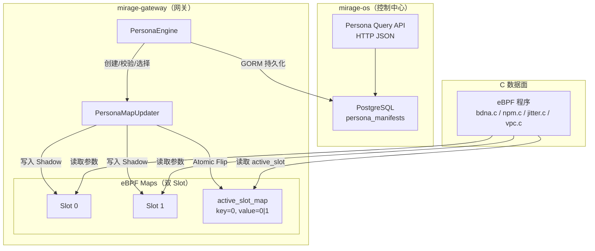
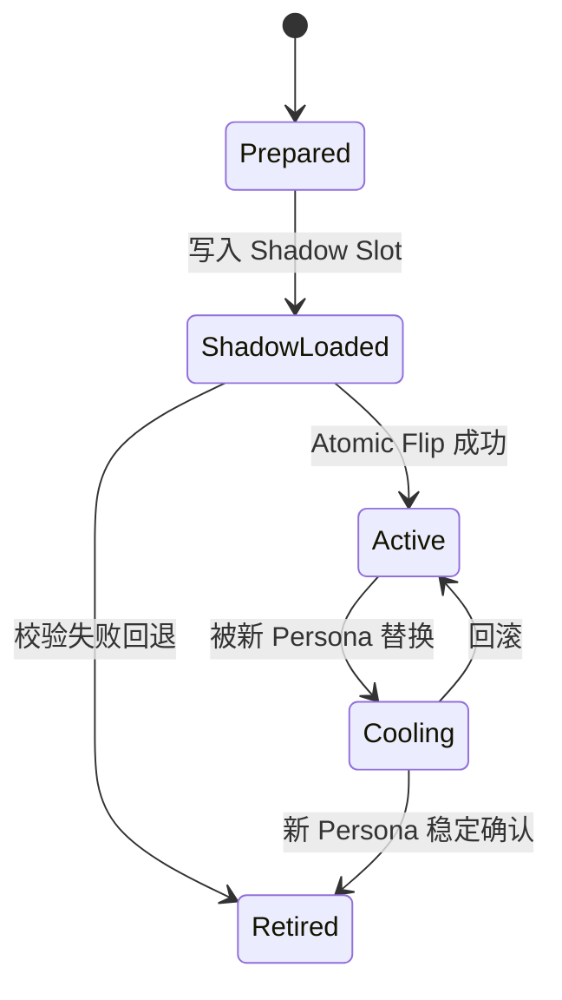
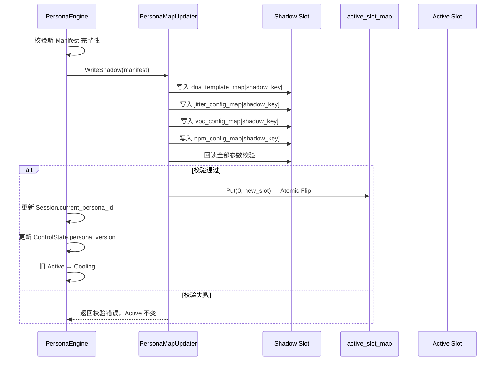

# 设计文档：V2 Persona Manifest 与原子切换

## 概述

本设计实现 Mirage V2 编排内核的统一画像引擎（Persona Engine），将 B-DNA（握手指纹）、NPM（包长伪装）、Jitter-Lite（时域扰动）、VPC（背景噪声）四类协议参数收敛为不可拆分的 Persona Manifest 快照，通过 Shadow/Active 双区 eBPF Map 模型实现原子切换。

核心设计目标：
- 禁止对单一协议参数的独立修改，所有参数必须通过 Persona Manifest 统一管理
- Shadow/Active 双 Slot 模型保证数据面在切换过程中不读到不一致参数
- 单次 eBPF Map Put 完成 Atomic Flip，切换延迟 < 1μs
- 保留上一个稳定版本（Cooling Slot）支持即时回滚
- Persona 选择受 ServiceClass + LinkHealth + SurvivalMode 三重约束

本模块位于 `mirage-gateway/pkg/orchestrator/persona/`，eBPF Map 桥接层位于 `mirage-gateway/pkg/ebpf/`，数据库模型扩展位于 `mirage-os/pkg/models/`。

## 架构

### 整体分层



### Persona 生命周期状态机



### 原子切换时序



## 组件与接口

### 1. PersonaManifest 结构体（`pkg/orchestrator/persona/manifest.go`）

```go
// PersonaLifecycle 画像生命周期枚举
type PersonaLifecycle string
const (
    LifecyclePrepared     PersonaLifecycle = "Prepared"
    LifecycleShadowLoaded PersonaLifecycle = "ShadowLoaded"
    LifecycleActive       PersonaLifecycle = "Active"
    LifecycleCooling      PersonaLifecycle = "Cooling"
    LifecycleRetired      PersonaLifecycle = "Retired"
)

// PersonaManifest 不可拆分的统一画像快照
type PersonaManifest struct {
    PersonaID           string           `gorm:"size:64;not null;uniqueIndex:idx_persona_version"`
    Version             uint64           `gorm:"not null;uniqueIndex:idx_persona_version"`
    Epoch               uint64           `gorm:"index;not null"`
    Checksum            string           `gorm:"size:64;not null"`
    HandshakeProfileID  string           `gorm:"size:64;not null"`
    PacketShapeProfileID string          `gorm:"size:64;not null"`
    TimingProfileID     string           `gorm:"size:64;not null"`
    BackgroundProfileID string           `gorm:"size:64;not null"`
    MTUProfileID        string           `gorm:"size:64;default:''"`
    FECProfileID        string           `gorm:"size:64;default:''"`
    LifecyclePolicyID   string           `gorm:"size:64;default:''"`
    Lifecycle           PersonaLifecycle `gorm:"size:16;not null;check:lifecycle IN ('Prepared','ShadowLoaded','Active','Cooling','Retired')"`
    CreatedAt           time.Time        `gorm:"autoCreateTime"`
}
```

### 2. PersonaEngine 接口（`pkg/orchestrator/persona/engine.go`）

```go
type PersonaEngine interface {
    // 创建与校验
    CreateManifest(ctx context.Context, manifest *PersonaManifest) error
    ValidateManifest(manifest *PersonaManifest) error
    ComputeChecksum(manifest *PersonaManifest) string

    // 生命周期转换
    TransitionLifecycle(ctx context.Context, personaID string, version uint64, target PersonaLifecycle) error

    // 原子切换
    SwitchPersona(ctx context.Context, sessionID string, newManifest *PersonaManifest) error
    Rollback(ctx context.Context, sessionID string) error

    // 选择
    SelectPersona(ctx context.Context, session *SessionState, link *LinkState, mode SurvivalMode) (*PersonaManifest, error)

    // 查询
    GetLatest(ctx context.Context, personaID string) (*PersonaManifest, error)
    ListVersions(ctx context.Context, personaID string) ([]*PersonaManifest, error)
    GetActiveBySession(ctx context.Context, sessionID string) (*PersonaManifest, error)
}
```

### 3. PersonaMapUpdater 接口（`pkg/ebpf/persona_updater.go`）

```go
// PersonaMapUpdater 负责将 Persona 参数批量写入 eBPF Map 双 Slot
type PersonaMapUpdater interface {
    // WriteShadow 将参数写入当前非活跃 Slot，返回写入的 Slot 编号
    WriteShadow(params *PersonaParams) (slotID uint32, err error)
    // VerifyShadow 回读 Shadow Slot 并与预期值逐字段比对
    VerifyShadow(slotID uint32, expected *PersonaParams) error
    // Flip 原子切换 active_slot_map 到指定 Slot
    Flip(newActiveSlot uint32) error
    // GetActiveSlot 读取当前活跃 Slot 编号
    GetActiveSlot() (uint32, error)
}

// PersonaParams 收敛后的全部 eBPF Map 参数
type PersonaParams struct {
    DNA    ebpf.DNATemplateEntry  // → dna_template_map
    Jitter ebpf.JitterConfig      // → jitter_config_map
    VPC    ebpf.VPCConfig         // → vpc_config_map
    NPM    NPMConfig              // → npm_config_map
}

// NPMConfig NPM 配置（对应 npm_config_map）
type NPMConfig struct {
    PaddingRate uint32
}
```

### 4. Persona 选择约束接口（`pkg/orchestrator/persona/selector.go`）

```go
// PersonaSelector 三重约束选择器
type PersonaSelector interface {
    Select(ctx context.Context, constraints *SelectionConstraints) (*PersonaManifest, error)
}

type SelectionConstraints struct {
    ServiceClass ServiceClass
    LinkHealth   float64       // 0-100
    SurvivalMode SurvivalMode
}
```

### 5. Persona Query API（mirage-os HTTP 端点）

| 方法 | 路径 | 说明 |
|------|------|------|
| GET | `/api/v2/personas/{persona_id}` | 返回最新版本 Persona Manifest |
| GET | `/api/v2/personas/{persona_id}/versions` | 返回全部版本列表（version 降序） |
| GET | `/api/v2/sessions/{session_id}/persona` | 返回 Session 当前 Active Persona |

所有响应 JSON 格式，时间戳 RFC 3339。资源不存在返回 HTTP 404。

## 数据模型

### persona_manifests 表

| 字段 | 类型 | 约束 | 说明 |
|------|------|------|------|
| persona_id | VARCHAR(64) | NOT NULL, 联合主键 | 画像唯一标识（UUID v4） |
| version | BIGINT | NOT NULL, 联合主键 | 版本号，同一 persona_id 下严格递增 |
| epoch | BIGINT | INDEX, NOT NULL | 对齐 ControlState.Epoch |
| checksum | VARCHAR(64) | NOT NULL | SHA-256 校验和 |
| handshake_profile_id | VARCHAR(64) | NOT NULL | 握手画像引用（B-DNA） |
| packet_shape_profile_id | VARCHAR(64) | NOT NULL | 包长画像引用（NPM） |
| timing_profile_id | VARCHAR(64) | NOT NULL | 时域画像引用（Jitter-Lite） |
| background_profile_id | VARCHAR(64) | NOT NULL | 背景画像引用（VPC） |
| mtu_profile_id | VARCHAR(64) | DEFAULT '' | MTU 画像引用 |
| fec_profile_id | VARCHAR(64) | DEFAULT '' | FEC 画像引用 |
| lifecycle_policy_id | VARCHAR(64) | DEFAULT '' | 生命周期策略引用 |
| lifecycle | VARCHAR(16) | CHECK IN 枚举, NOT NULL | 生命周期阶段 |
| created_at | TIMESTAMPTZ | AUTO | 创建时间 |

联合主键：`(persona_id, version)`

### eBPF Map 双 Slot 布局

| Map 名称 | Key | Value | 说明 |
|----------|-----|-------|------|
| active_slot_map | uint32(0) | uint32(0\|1) | 当前活跃 Slot 编号 |
| dna_template_map | uint32(slot) | DNATemplateEntry | B-DNA 握手参数 |
| jitter_config_map | uint32(slot) | JitterConfig | Jitter-Lite 时域参数 |
| vpc_config_map | uint32(slot) | VPCConfig | VPC 背景噪声参数 |
| npm_config_map | uint32(slot) | NPMConfig | NPM 包长伪装参数 |

Slot 0 使用 key=0，Slot 1 使用 key=1。active_slot_map 的值指向当前生效的 Slot。

### GORM 模型注册

PersonaManifest 加入 `mirage-os/pkg/models/db.go` 的 AutoMigrate：

```go
func AutoMigrate(db *gorm.DB) error {
    return db.AutoMigrate(
        // ... 现有模型 ...
        &PersonaManifest{},
    )
}
```


## 正确性属性

*属性（Property）是在系统所有合法执行中都应成立的特征或行为——本质上是对系统行为的形式化陈述。属性是人类可读规格说明与机器可验证正确性保证之间的桥梁。*

### Property 1: Manifest 完整性校验

*For any* PersonaManifest，ValidateManifest 的结果应与四个必填字段（handshake_profile_id、packet_shape_profile_id、timing_profile_id、background_profile_id）是否全部非空完全一致：全部非空时校验通过，任一为空时返回包含该字段名称的错误。

**Validates: Requirements 1.2, 1.4**

### Property 2: Checksum 确定性与唯一性

*For any* 两个 PersonaManifest，如果它们的六个 profile_id 字段（handshake、packet_shape、timing、background、mtu、fec）完全相同，则 ComputeChecksum 返回相同值；如果任一字段不同，则返回不同值。

**Validates: Requirements 1.3**

### Property 3: 版本严格递增与 Epoch 对齐

*For any* 同一 persona_id 下的 N 次 CreateManifest 调用序列，成功创建的 Manifest 的 version 应严格单调递增，且每个 Manifest 的 epoch 应等于创建时 ControlState 的 Epoch 值。

**Validates: Requirements 2.1, 2.2, 2.4**

### Property 4: 创建后不可变字段

*For any* 已创建的 PersonaManifest，尝试修改 version、epoch、checksum 中任一字段的操作应被拒绝，这三个字段的值在创建后保持不变。

**Validates: Requirements 2.3**

### Property 5: 生命周期转换合法性

*For any* PersonaLifecycle 对 (from, to)，TransitionLifecycle 的结果应与合法转换表完全一致：仅 Prepared→ShadowLoaded、ShadowLoaded→Active、ShadowLoaded→Retired、Active→Cooling、Cooling→Retired 五条路径成功，其余所有组合返回包含当前阶段和目标阶段的错误。

**Validates: Requirements 3.2, 3.3, 3.5**

### Property 6: Session 维度 Active/Cooling 唯一性

*For any* 切换操作序列，在任意时刻同一 Session 下最多存在一个 lifecycle=Active 的 PersonaManifest 和最多一个 lifecycle=Cooling 的 PersonaManifest。

**Validates: Requirements 3.4, 8.1, 8.2**

### Property 7: Shadow Slot 写入 round-trip

*For any* PersonaParams，WriteShadow 写入 Shadow Slot 后，VerifyShadow 回读的每个字段值应与写入值完全一致（DNATemplateEntry、JitterConfig、VPCConfig、NPMConfig 逐字段相等）。

**Validates: Requirements 4.2, 4.3, 6.1, 6.2, 6.3, 6.4, 6.5**

### Property 8: 原子切换后状态一致性

*For any* 合法的 PersonaManifest，执行 SwitchPersona 成功后：active_slot_map 指向新 Slot，Session.current_persona_id 等于新 Manifest 的 persona_id，ControlState.persona_version 等于新 Manifest 的 version，旧 Active Manifest 的 lifecycle 变为 Cooling。

**Validates: Requirements 5.1, 5.2**

### Property 9: 切换失败保持不变

*For any* 切换流程中任一步骤失败的场景，active_slot_map 的值、Session.current_persona_id、ControlState.persona_version 应与切换前完全相同。

**Validates: Requirements 4.4, 5.3**

### Property 10: 回滚恢复到 Cooling 版本

*For any* 存在 Cooling 状态 Persona 的 Session，执行 Rollback 后：active_slot_map 指向 Cooling Persona 所在 Slot，Session.current_persona_id 等于 Cooling Persona 的 persona_id，Cooling Persona 的 lifecycle 变为 Active，原 Active Persona 的 lifecycle 变为 Retired。

**Validates: Requirements 5.4, 5.6, 8.3, 8.4**

### Property 11: 切换互斥

*For any* N 个并发 SwitchPersona 调用（同一 Session），恰好一个成功执行，其余返回互斥错误，最终状态等价于该成功调用的单独执行结果。

**Validates: Requirements 5.5**

### Property 12: 三重约束选择一致性

*For any* SelectionConstraints 组合，SelectPersona 返回的 Manifest 应满足：ServiceClass=Standard 时仅返回 Standard 兼容 Manifest；SurvivalMode 为 Hardened/Escape/LastResort 时返回的 Manifest 防御强度不低于 Normal 模式下的选择；LinkHealth < 50 时返回的 Manifest 资源消耗不高于 LinkHealth ≥ 50 时的选择。

**Validates: Requirements 7.2, 7.3, 7.4, 7.5**

### Property 13: Manifest JSON round-trip

*For any* 合法的 PersonaManifest，JSON 序列化后再反序列化应产生等价对象，且序列化结果中的 created_at 字段符合 RFC 3339 格式。

**Validates: Requirements 10.5**

## 错误处理

### Manifest 校验错误

| 错误场景 | 处理方式 |
|----------|----------|
| 必填 profile_id 为空 | 返回 `ErrMissingProfile{FieldName}`，包含缺失字段名称 |
| Checksum 不匹配 | 返回 `ErrChecksumMismatch{Expected, Actual}` |
| 版本冲突 | 返回 `ErrVersionConflict{PersonaID, ExistingMax, Attempted}` |
| 不可变字段修改 | 返回 `ErrImmutableField{FieldName}` |

### 生命周期错误

| 错误场景 | 处理方式 |
|----------|----------|
| 非法生命周期转换 | 返回 `ErrInvalidLifecycleTransition{From, To}` |
| Retired 后尝试激活 | 返回 `ErrInvalidLifecycleTransition{Retired, target}` |

### 切换错误

| 错误场景 | 处理方式 |
|----------|----------|
| Shadow Slot 回读校验失败 | 返回 `ErrShadowVerifyFailed{MapName, Field}`，保持 Active 不变 |
| eBPF Map 写入失败 | 返回 `ErrMapWriteFailed{MapName}`，停止后续写入 |
| Atomic Flip 失败 | 返回 `ErrFlipFailed`，保持 Active 不变 |
| 并发切换冲突 | 返回 `ErrSwitchInProgress`，调用方重试 |
| 无 Cooling 可回滚 | 返回 `ErrNoCoolingTarget` |

### 选择错误

| 错误场景 | 处理方式 |
|----------|----------|
| 无匹配 Persona | 返回 `ErrNoMatchingPersona{Constraints}`，包含不满足的约束描述 |

## 测试策略

### 属性测试（Property-Based Testing）

使用 `pgregory.net/rapid`（已在 go.mod 中）作为 PBT 库。

每个属性测试运行至少 100 次迭代，标签格式：`Feature: v2-persona-engine, Property N: <描述>`

属性测试覆盖 Property 1-13，重点验证：
- Manifest 校验与 checksum 计算（Property 1, 2）
- 版本递增与不可变字段（Property 3, 4）
- 生命周期状态机（Property 5）
- Active/Cooling 唯一性不变量（Property 6）
- Shadow Slot round-trip（Property 7）
- 原子切换与回滚（Property 8, 9, 10）
- 并发互斥（Property 11）
- 三重约束选择（Property 12）
- JSON 序列化 round-trip（Property 13）

### 单元测试

- PersonaManifest 默认值初始化
- 每个 PersonaLifecycle 枚举值的字符串表示
- Checksum 边界值（空字符串 profile_id 组合）
- PersonaMapUpdater Mock 实现（用于不依赖真实 eBPF 的测试）
- 选择器在极端约束条件下的行为

### 集成测试

- GORM AutoMigrate 创建 persona_manifests 表
- CHECK 约束生效验证（插入非法 lifecycle 值应失败）
- HTTP API 端点请求/响应验证（GET personas、versions、session persona）
- 完整切换流程端到端验证（含真实 eBPF Map Mock）
