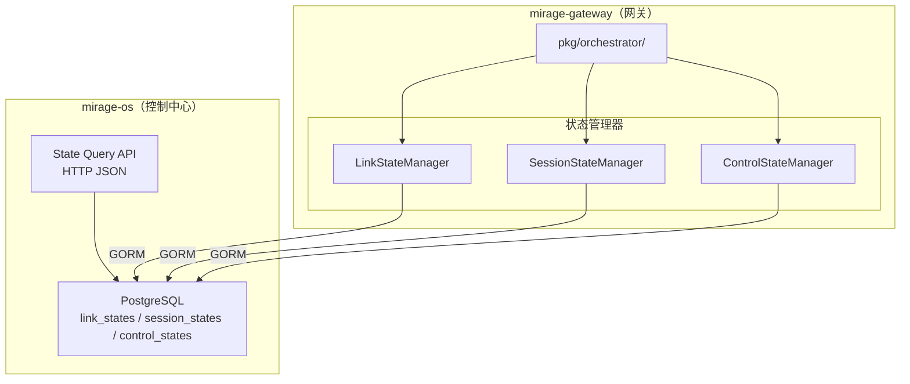
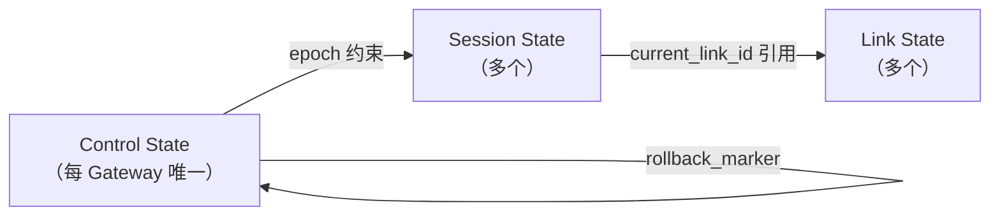
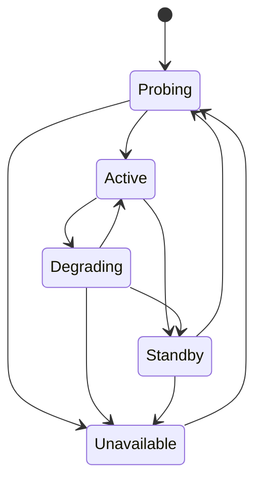
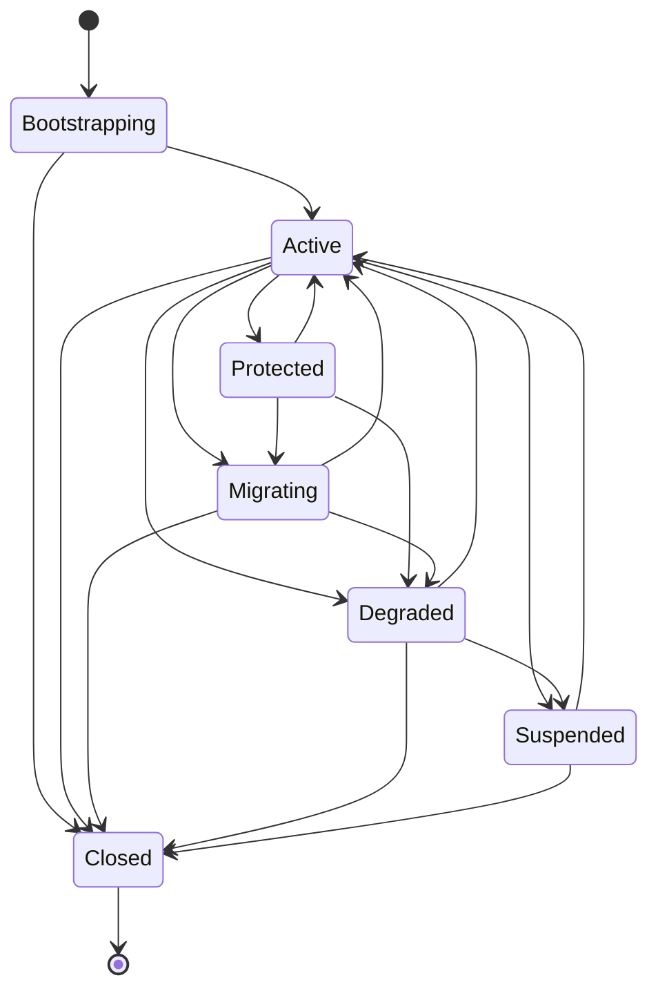

# 设计文档：V2 三层状态模型

## 概述

本设计实现 Mirage V2 编排内核的基础状态建模层，将系统状态严格拆分为 Link State（链路状态）、Session State（会话状态）、Control State（控制状态）三层。

核心设计目标：
- 链路失效不直接导致会话消失（Link 与 Session 解耦）
- 所有状态转换必须经过合法性校验（有限状态机）
- 崩溃恢复基于 Epoch + Rollback Marker 机制
- 并发安全通过数据库乐观锁 + 内存互斥锁实现

本模块位于 `mirage-gateway/pkg/orchestrator/`，数据库模型扩展位于 `mirage-os/pkg/models/`，HTTP API 位于 `mirage-os` 的 API 层。

## 架构

### 整体分层



### 三层状态关系



### 状态机定义

#### Link Phase 状态机



#### Session Phase 状态机



## 组件与接口

### 1. 状态模型层（`pkg/orchestrator/state_models.go`）

定义三层状态的 Go 结构体、枚举常量和 GORM 表映射。

```go
// LinkPhase 链路阶段枚举
type LinkPhase string
const (
    LinkPhaseProbing     LinkPhase = "Probing"
    LinkPhaseActive      LinkPhase = "Active"
    LinkPhaseDegrading   LinkPhase = "Degrading"
    LinkPhaseStandby     LinkPhase = "Standby"
    LinkPhaseUnavailable LinkPhase = "Unavailable"
)

// SessionPhase 会话阶段枚举
type SessionPhase string
const (
    SessionPhaseBootstrapping SessionPhase = "Bootstrapping"
    SessionPhaseActive        SessionPhase = "Active"
    SessionPhaseProtected     SessionPhase = "Protected"
    SessionPhaseMigrating     SessionPhase = "Migrating"
    SessionPhaseDegraded      SessionPhase = "Degraded"
    SessionPhaseSuspended     SessionPhase = "Suspended"
    SessionPhaseClosed        SessionPhase = "Closed"
)

// ControlHealth 控制面健康枚举
type ControlHealth string
const (
    ControlHealthHealthy    ControlHealth = "Healthy"
    ControlHealthRecovering ControlHealth = "Recovering"
    ControlHealthFaulted    ControlHealth = "Faulted"
)

// ServiceClass 服务等级
type ServiceClass string
const (
    ServiceClassStandard ServiceClass = "Standard"
    ServiceClassPlatinum ServiceClass = "Platinum"
    ServiceClassDiamond  ServiceClass = "Diamond"
)

// SurvivalMode 生存姿态（本 Spec 仅定义枚举，实现在 Spec 5-2）
type SurvivalMode string
const (
    SurvivalModeNormal     SurvivalMode = "Normal"
    SurvivalModeLowNoise   SurvivalMode = "LowNoise"
    SurvivalModeHardened   SurvivalMode = "Hardened"
    SurvivalModeDegraded   SurvivalMode = "Degraded"
    SurvivalModeEscape     SurvivalMode = "Escape"
    SurvivalModeLastResort SurvivalMode = "LastResort"
)
```

### 2. LinkStateManager（`pkg/orchestrator/link_state.go`）

```go
type LinkStateManager interface {
    Create(ctx context.Context, link *LinkState) error
    Get(ctx context.Context, linkID string) (*LinkState, error)
    ListByGateway(ctx context.Context, gatewayID string) ([]*LinkState, error)
    TransitionPhase(ctx context.Context, linkID string, target LinkPhase, reason string) error
    UpdateHealth(ctx context.Context, linkID string, score float64, rtt int64, loss float64, jitter int64) error
    Delete(ctx context.Context, linkID string) error
}
```

### 3. SessionStateManager（`pkg/orchestrator/session_state.go`）

```go
type SessionStateManager interface {
    Create(ctx context.Context, session *SessionState) error
    Get(ctx context.Context, sessionID string) (*SessionState, error)
    ListByGateway(ctx context.Context, gatewayID string) ([]*SessionState, error)
    ListByUser(ctx context.Context, userID string) ([]*SessionState, error)
    ListByFilter(ctx context.Context, filter SessionFilter) ([]*SessionState, error)
    TransitionState(ctx context.Context, sessionID string, target SessionPhase, reason string) error
    UpdateLink(ctx context.Context, sessionID string, newLinkID string) error
    Delete(ctx context.Context, sessionID string) error
}

type SessionFilter struct {
    GatewayID *string
    UserID    *string
    State     *SessionPhase
}
```

### 4. ControlStateManager（`pkg/orchestrator/control_state.go`）

```go
type ControlStateManager interface {
    GetOrCreate(ctx context.Context, gatewayID string) (*ControlState, error)
    IncrementEpoch(ctx context.Context, gatewayID string) (uint64, error)
    BeginTransaction(ctx context.Context, gatewayID string, txID string) error
    CommitTransaction(ctx context.Context, gatewayID string, reason string) error
    RecoverOnStartup(ctx context.Context, gatewayID string) error
}
```

### 5. State Query API（mirage-os HTTP 端点）

| 方法 | 路径 | 说明 |
|------|------|------|
| GET | `/api/v2/links?gateway_id=` | 按 gateway 查询链路列表 |
| GET | `/api/v2/links/{link_id}` | 查询单个链路详情 |
| GET | `/api/v2/sessions?gateway_id=&user_id=&state=` | 按条件过滤会话列表 |
| GET | `/api/v2/sessions/{session_id}` | 查询单个会话详情 |
| GET | `/api/v2/sessions/{session_id}/topology` | 会话拓扑聚合视图 |
| GET | `/api/v2/control/{gateway_id}` | 查询控制状态 |

所有响应为 JSON 格式，时间戳使用 RFC 3339。资源不存在返回 HTTP 404。


### 6. 关系约束执行器（`pkg/orchestrator/constraints.go`）

负责跨层状态一致性校验：

```go
type ConstraintChecker interface {
    // ValidateLinkRef 校验 session 引用的 link 是否存在且可用
    ValidateLinkRef(ctx context.Context, linkID string) error
    // OnLinkUnavailable 当 link 变为 Unavailable 时，级联处理关联 session
    OnLinkUnavailable(ctx context.Context, linkID string) error
    // ValidateControlStateSingleton 确保每个 gateway 只有一个 control state
    ValidateControlStateSingleton(ctx context.Context, gatewayID string) error
}
```

### 7. 并发控制

- 内存层：每个 link_id / session_id / gateway_id 使用 `sync.Mutex` 细粒度锁（通过 `sync.Map` 管理锁实例）
- 数据库层：乐观锁基于 `updated_at` 字段，GORM `Where("updated_at = ?", oldUpdatedAt)` 条件更新，影响行数为 0 时返回冲突错误
- 事务层：状态变更 + updated_at 更新在同一个 `db.Transaction()` 中完成

## 数据模型

### LinkState 表（`link_states`）

| 字段 | 类型 | 约束 | 说明 |
|------|------|------|------|
| link_id | VARCHAR(64) | PK | 链路唯一标识 |
| transport_type | VARCHAR(32) | NOT NULL | 传输类型 |
| gateway_id | VARCHAR(32) | INDEX, NOT NULL | 所属网关 |
| health_score | NUMERIC(5,2) | CHECK(0-100), DEFAULT 0 | 健康分 |
| rtt_ms | BIGINT | DEFAULT 0 | 往返延迟(ms) |
| loss_rate | NUMERIC(5,4) | CHECK(0-1), DEFAULT 0 | 丢包率 |
| jitter_ms | BIGINT | DEFAULT 0 | 抖动(ms) |
| phase | VARCHAR(16) | CHECK IN 枚举, NOT NULL | 链路阶段 |
| available | BOOLEAN | DEFAULT false | 是否可用 |
| degraded | BOOLEAN | DEFAULT false | 是否退化 |
| last_probe_at | TIMESTAMPTZ | | 最后探测时间 |
| last_switch_reason | VARCHAR(256) | DEFAULT '' | 最后切换原因 |
| created_at | TIMESTAMPTZ | AUTO | 创建时间 |
| updated_at | TIMESTAMPTZ | AUTO | 更新时间 |

### SessionState 表（`session_states`）

| 字段 | 类型 | 约束 | 说明 |
|------|------|------|------|
| session_id | VARCHAR(64) | PK | 会话唯一标识 |
| user_id | VARCHAR(64) | INDEX, NOT NULL | 所属用户 |
| client_id | VARCHAR(64) | NOT NULL | 客户端标识 |
| gateway_id | VARCHAR(32) | INDEX, NOT NULL | 所属网关 |
| service_class | VARCHAR(16) | CHECK IN 枚举, NOT NULL | 服务等级 |
| priority | INT | CHECK(0-100), DEFAULT 50 | 优先级 |
| current_persona_id | VARCHAR(64) | DEFAULT '' | 当前画像 ID |
| current_link_id | VARCHAR(64) | INDEX | 当前链路 ID |
| current_survival_mode | VARCHAR(16) | DEFAULT 'Normal' | 当前生存姿态 |
| billing_mode | VARCHAR(32) | DEFAULT '' | 计费模式 |
| state | VARCHAR(16) | CHECK IN 枚举, NOT NULL | 会话阶段 |
| migration_pending | BOOLEAN | DEFAULT false | 是否迁移中 |
| created_at | TIMESTAMPTZ | AUTO | 创建时间 |
| updated_at | TIMESTAMPTZ | AUTO | 更新时间 |

### ControlState 表（`control_states`）

| 字段 | 类型 | 约束 | 说明 |
|------|------|------|------|
| gateway_id | VARCHAR(32) | PK | 所属网关（每 gateway 唯一） |
| epoch | BIGINT | NOT NULL, DEFAULT 0 | 全局递增逻辑时钟 |
| persona_version | BIGINT | DEFAULT 0 | 当前画像版本号 |
| route_generation | BIGINT | DEFAULT 0 | 路由代次 |
| active_tx_id | VARCHAR(64) | DEFAULT '' | 当前活跃事务 ID |
| rollback_marker | BIGINT | DEFAULT 0 | 回滚标记 Epoch |
| last_successful_epoch | BIGINT | DEFAULT 0 | 最近成功 Epoch |
| last_switch_reason | VARCHAR(256) | DEFAULT '' | 最近切换原因 |
| control_health | VARCHAR(16) | CHECK IN 枚举, DEFAULT 'Healthy' | 控制面健康 |
| updated_at | TIMESTAMPTZ | AUTO | 更新时间 |

### GORM 模型注册

三个新模型加入 `mirage-os/pkg/models/db.go` 的 `AutoMigrate` 函数：

```go
func AutoMigrate(db *gorm.DB) error {
    return db.AutoMigrate(
        // ... 现有模型 ...
        &LinkState{},
        &SessionState{},
        &ControlState{},
    )
}
```


## 正确性属性

*属性（Property）是在系统所有合法执行中都应成立的特征或行为——本质上是对系统行为的形式化陈述。属性是人类可读规格说明与机器可验证正确性保证之间的桥梁。*

### Property 1: Link 状态机转换合法性

*For any* Link_Phase 对 (from, to)，TransitionPhase 的结果应与合法转换表完全一致：合法转换成功执行，非法转换返回包含当前状态和目标状态的错误。

**Validates: Requirements 1.3, 1.4**

### Property 2: Link 状态转换副作用一致性

*For any* 合法的 Link_Phase 转换，转换完成后的 LinkState 副作用字段应满足：目标为 Unavailable 时 available=false 且 health_score=0；目标为 Active 时 available=true 且 degraded=false；目标为 Degrading 时 degraded=true。

**Validates: Requirements 1.5, 1.6, 1.7**

### Property 3: Session 状态机转换合法性

*For any* Session_Phase 对 (from, to)，TransitionState 的结果应与合法转换表完全一致：合法转换成功执行，非法转换返回包含当前状态和目标状态的错误。

**Validates: Requirements 2.3, 2.4**

### Property 4: Session 迁移标记一致性

*For any* 合法的 Session_Phase 转换，如果目标状态为 Migrating 则 migration_pending=true；如果源状态为 Migrating 且目标状态不是 Migrating 则 migration_pending=false。

**Validates: Requirements 2.5, 2.6**

### Property 5: Session 链路变更不变量

*For any* SessionState 和任意新 link_id，执行 UpdateLink 后 session_id、current_persona_id、service_class、priority 应与变更前完全相同。

**Validates: Requirements 2.7**

### Property 6: Epoch 严格递增

*For any* ControlState，连续 N 次 IncrementEpoch 调用产生的 epoch 序列应严格单调递增，且每次增量至少为 1。

**Validates: Requirements 3.3**

### Property 7: 事务提交后状态一致性

*For any* 带有活跃事务的 ControlState，执行 CommitTransaction 后 last_successful_epoch 应等于当前 epoch，rollback_marker 应等于当前 epoch，active_tx_id 应为空字符串。

**Validates: Requirements 3.5**

### Property 8: 崩溃恢复正确性

*For any* 带有未完成事务（active_tx_id 非空）的 ControlState，执行 RecoverOnStartup 后 control_health 应为 Recovering，epoch 应回退到 rollback_marker 的值，active_tx_id 应为空字符串。

**Validates: Requirements 3.6, 3.7**

### Property 9: Session 创建引用完整性

*For any* Session 创建请求，当且仅当 current_link_id 引用的 LinkState 存在且 available=true 时创建成功；否则返回错误。

**Validates: Requirements 4.1, 4.4, 4.5**

### Property 10: Link 不可用级联降级

*For any* 处于可转换到 Degraded 状态的 SessionState，当其 current_link_id 引用的 LinkState phase 变为 Unavailable 时，该 SessionState 的 state 应转换为 Degraded（而非 Closed）。

**Validates: Requirements 4.2**

### Property 11: 并发状态变更序列化

*For any* 对同一 link_id / session_id / gateway_id 的 N 个并发状态变更操作，最终状态应等价于某个串行执行顺序的结果，且不会出现数据竞争。

**Validates: Requirements 7.1, 7.2, 7.3**

### Property 12: 乐观锁冲突检测

*For any* 两个并发更新同一记录的操作，如果它们基于相同的 updated_at 版本，则恰好一个成功，另一个返回冲突重试错误。

**Validates: Requirements 7.4**

## 错误处理

### 状态转换错误

| 错误场景 | 处理方式 |
|----------|----------|
| 非法状态转换 | 返回 `ErrInvalidTransition{From, To}`，包含当前状态和目标状态 |
| Link 引用不存在 | 返回 `ErrLinkNotFound{LinkID}` |
| Link 不可用 | 返回 `ErrLinkUnavailable{LinkID}` |
| Session 不存在 | 返回 `ErrSessionNotFound{SessionID}` |
| Control State 不存在 | 自动创建默认实例（GetOrCreate 语义） |

### 并发错误

| 错误场景 | 处理方式 |
|----------|----------|
| 乐观锁冲突 | 返回 `ErrOptimisticLockConflict`，调用方重试 |
| 数据库事务失败 | 回滚事务，内存状态不变，返回原始错误 |
| 互斥锁超时 | 使用 `context.Context` 超时控制，返回 `context.DeadlineExceeded` |

### 恢复错误

| 错误场景 | 处理方式 |
|----------|----------|
| 启动时发现未完成事务 | 自动回退到 rollback_marker，设 control_health=Recovering |
| rollback_marker 指向的状态不存在 | 设 control_health=Faulted，记录日志，需人工介入 |

## 测试策略

### 属性测试（Property-Based Testing）

使用 `pgregory.net/rapid`（已在 go.mod 中）作为 PBT 库。

每个属性测试运行至少 100 次迭代，标签格式：`Feature: v2-state-model, Property N: <描述>`

属性测试覆盖 Property 1-12，重点验证：
- 状态机转换合法性（Property 1, 3）
- 状态转换副作用（Property 2, 4）
- 不变量保持（Property 5, 6, 7）
- 崩溃恢复（Property 8）
- 引用完整性（Property 9, 10）
- 并发安全（Property 11, 12）

### 单元测试

- 每个枚举值的字符串表示
- 默认值初始化
- 边界值（health_score=0/100, priority=0/100, epoch=0/MaxUint64）
- ControlState GetOrCreate 幂等性

### 集成测试

- GORM AutoMigrate 表创建验证
- CHECK 约束生效验证（插入非法枚举值应失败）
- HTTP API 端点请求/响应验证
- 拓扑聚合视图数据正确性

