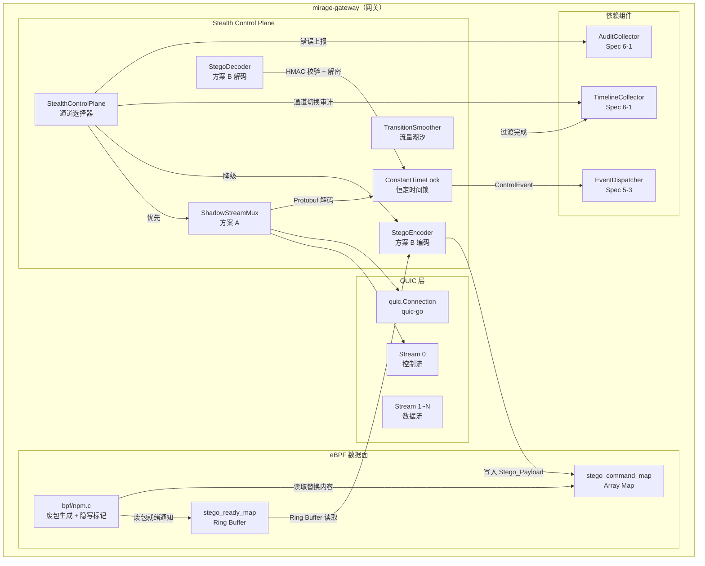
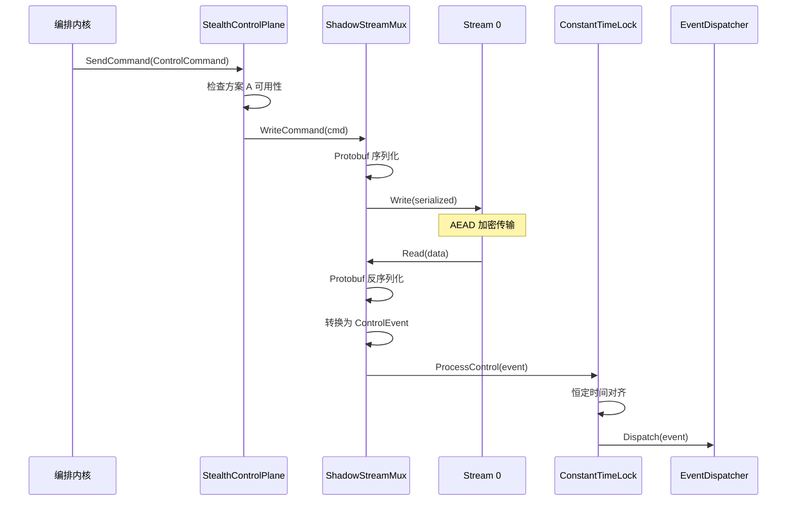
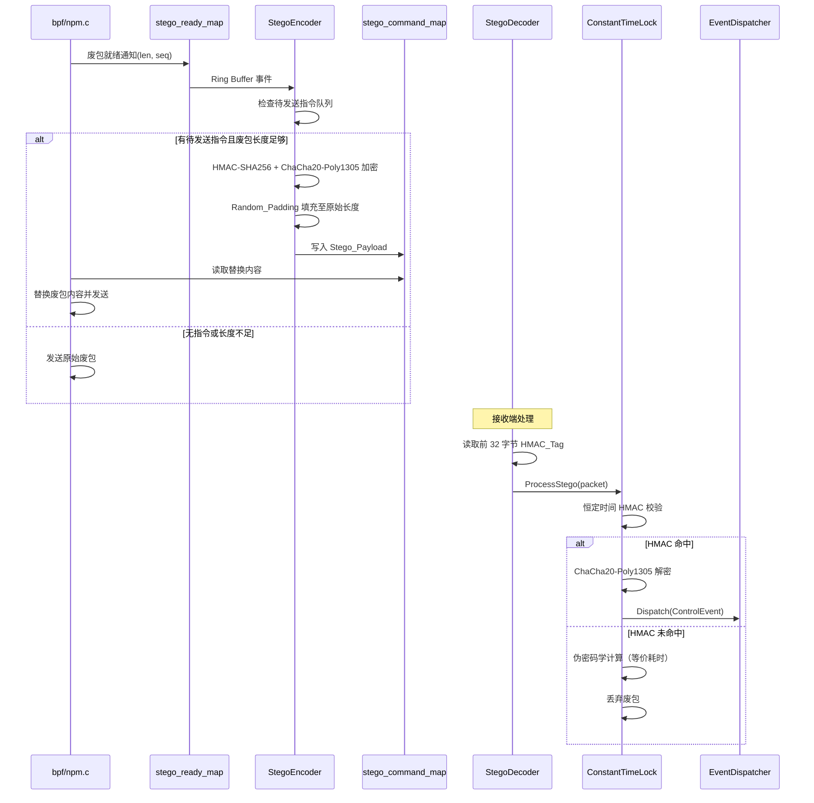
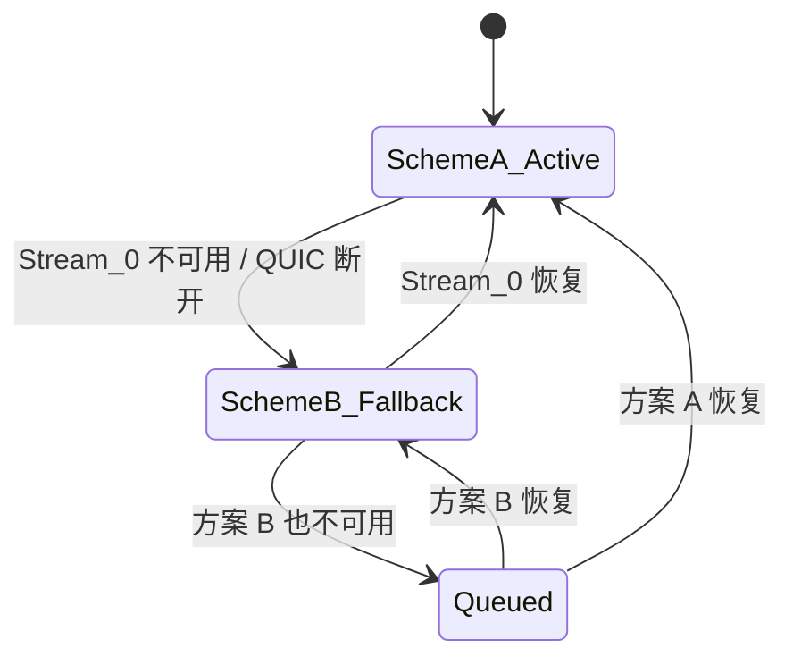
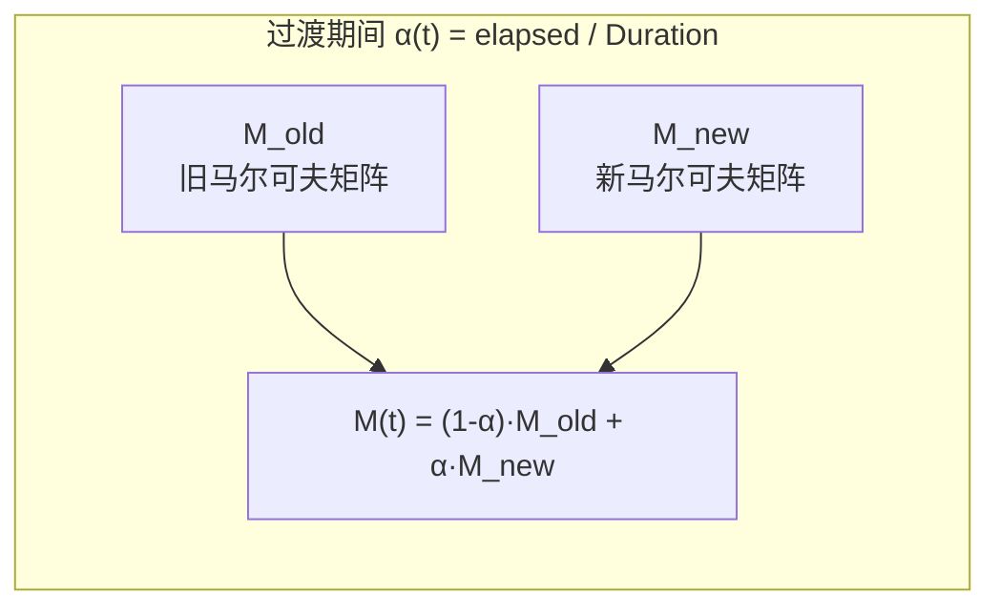

# 设计文档：V2 隐蔽控制面承载

## 概述

本设计实现 Mirage V2 隐蔽控制面承载层（Stealth Control Plane），负责将编排内核的控制语义（PersonaFlip、BudgetSync、SurvivalModeChange 等）通过两种互补方案安全传输：

- **方案 A（QUIC 隐蔽流）**：利用 QUIC 原生多路复用在 AEAD 视界内部隐藏控制流，Stream 0 为特权控制流，Stream 1~N 为用户数据流
- **方案 B（废包隐写术）**：利用 NPM 废包隐写实现零特征畸变的侧信道控制，控制指令嵌入马尔可夫链生成的废包中

同时引入两项抗 DPI 对抗措施：
- **防御状态切换流量潮汐**：马尔可夫链概率矩阵线性插值平滑过渡，防止 ML 分类器捕捉状态突变
- **恒定时间锁**：Spin-loop RTT 侧信道消除，所有包处理耗时对齐到恒定时间槽

核心设计约束：
- 所有控制语义发生在 AEAD 视界内部，禁止在外层 UDP/TCP 报文头部附加自定义字节
- 隐写操作不改变 NPM 废包的包长分布和发送时序（IAT 分布不变）
- 密码学操作使用恒定时间比较，消除时序侧信道
- Go 做控制面（QUIC Stream 管理、Protobuf、隐写逻辑、平滑过渡），C 做数据面（bpf/npm.c 废包生成与隐写标记）
- Go → C 通过 eBPF Map，C → Go 通过 Ring Buffer

前置依赖：Spec 5-3（ControlEvent / EventDispatcher / EventHandler）、Spec 6-1（AuditCollector / TimelineCollector）、Spec 4-2（PersonaEngine / PersonaMapUpdater）。

涉及模块：
- `mirage-gateway/pkg/gtunnel/stealth/` — 方案 A QUIC 隐蔽流多路复用
- `mirage-gateway/pkg/gtunnel/stego/` — 方案 B 隐写编解码
- `mirage-gateway/pkg/gtunnel/smoother/` — 防御状态切换流量潮汐
- `mirage-gateway/pkg/gtunnel/ctlock/` — 恒定时间锁
- `mirage-gateway/bpf/npm.c` — eBPF 数据面隐写标记扩展
- `mirage-proto/` — Protobuf 控制指令定义扩展

## 架构

### 整体分层



### 方案 A：QUIC 隐蔽流多路复用



### 方案 B：废包隐写术



### 通道选择状态机



### 流量潮汐平滑过渡



## 组件与接口

### 1. Protobuf 控制指令定义（`mirage-proto/control_command.proto`）

```protobuf
syntax = "proto3";
package mirage;
option go_package = "mirage-proto/gen";

enum ControlCommandType {
    CONTROL_COMMAND_UNKNOWN = 0;
    PERSONA_FLIP = 1;
    BUDGET_SYNC = 2;
    SURVIVAL_MODE_CHANGE = 3;
    ROLLBACK = 4;
    SESSION_MIGRATE = 5;
}

message ControlCommand {
    string command_id = 1;           // UUID v4
    ControlCommandType command_type = 2;
    uint64 epoch = 3;
    int64 timestamp = 4;             // Unix nanos
    bytes payload = 5;               // 类型特定载荷
}

message ControlCommandAck {
    string command_id = 1;
    bool success = 2;
    string error_message = 3;
}
```

### 2. ShadowStreamMux（`pkg/gtunnel/stealth/mux.go`）

```go
// ShadowStreamMux 方案 A：QUIC 隐蔽流多路复用器
type ShadowStreamMux struct {
    conn       quic.Connection
    ctrlStream quic.Stream  // Stream 0
    mu         sync.Mutex
    closed     atomic.Bool
}

// NewShadowStreamMux 在 QUIC 连接上创建隐蔽流多路复用器
// 打开 Stream 0 作为特权控制流
func NewShadowStreamMux(conn quic.Connection) (*ShadowStreamMux, error)

// WriteCommand 将 ControlCommand 序列化为 Protobuf 写入 Stream 0
// 非阻塞：不影响 Stream 1~N 数据传输
func (m *ShadowStreamMux) WriteCommand(cmd *gen.ControlCommand) error

// ReadCommand 从 Stream 0 读取并反序列化 ControlCommand
func (m *ShadowStreamMux) ReadCommand() (*gen.ControlCommand, error)

// IsAvailable 检查 Stream 0 是否可用
func (m *ShadowStreamMux) IsAvailable() bool

// Close 关闭控制流（不关闭 QUIC 连接）
func (m *ShadowStreamMux) Close() error
```

### 3. StegoEncoder（`pkg/gtunnel/stego/encoder.go`）

```go
// StegoEncoder 方案 B：隐写编码器
type StegoEncoder struct {
    sessionKey  []byte          // 会话级 HMAC + 加密密钥
    queue       chan *gen.ControlCommand  // 待发送指令队列
    stegoRate   atomic.Uint64   // 隐写替换率统计（已替换/总废包）
    maxRate     float64         // 隐写率上限（默认 0.05）
    totalDummy  atomic.Uint64   // 总废包计数
    stegoDummy  atomic.Uint64   // 隐写废包计数
    mu          sync.Mutex
}

// NewStegoEncoder 创建隐写编码器
func NewStegoEncoder(sessionKey []byte, maxRate float64) *StegoEncoder

// Enqueue 将控制指令加入待发送队列
func (e *StegoEncoder) Enqueue(cmd *gen.ControlCommand) error

// Encode 尝试将队首指令编码为 Stego_Payload
// dummyLen 为即将发出的废包长度
// 返回 nil 表示无指令或长度不足，不执行隐写
func (e *StegoEncoder) Encode(dummyLen int) ([]byte, error)

// GetRate 返回当前隐写替换率
func (e *StegoEncoder) GetRate() float64
```

### 4. StegoDecoder（`pkg/gtunnel/stego/decoder.go`）

```go
// StegoDecoder 方案 B：隐写解码器
type StegoDecoder struct {
    sessionKey []byte
}

// NewStegoDecoder 创建隐写解码器
func NewStegoDecoder(sessionKey []byte) *StegoDecoder

// Decode 尝试从废包中提取控制指令
// 返回 (nil, nil) 表示 HMAC 未命中（正常废包）
// 返回 (nil, err) 表示 HMAC 命中但解密失败
// 返回 (cmd, nil) 表示成功提取
func (d *StegoDecoder) Decode(packet []byte) (*gen.ControlCommand, error)

// IsStego 仅执行 HMAC 校验判断是否为隐写包（恒定时间）
func (d *StegoDecoder) IsStego(packet []byte) bool
```

### 5. 隐写密码学工具（`pkg/gtunnel/stego/crypto.go`）

```go
// HMACTag 计算 HMAC-SHA256 标签（32 字节）
func HMACTag(key, data []byte) []byte

// HMACVerify 恒定时间 HMAC 校验
func HMACVerify(key, data, tag []byte) bool

// Encrypt 使用 ChaCha20-Poly1305 加密
func Encrypt(key, plaintext []byte) (ciphertext []byte, err error)

// Decrypt 使用 ChaCha20-Poly1305 解密
func Decrypt(key, ciphertext []byte) (plaintext []byte, err error)

// RandomPadding 生成密码学安全随机填充
func RandomPadding(length int) ([]byte, error)

// BuildStegoPayload 构建完整隐写负载
// 格式：[HMAC_Tag(32) + Ciphertext + Random_Padding]
// 总长度严格等于 targetLen
func BuildStegoPayload(key []byte, cmd *gen.ControlCommand, targetLen int) ([]byte, error)

// ParseStegoPayload 解析隐写负载
func ParseStegoPayload(key []byte, payload []byte) (*gen.ControlCommand, error)
```

### 6. TransitionSmoother（`pkg/gtunnel/smoother/smoother.go`）

```go
// MarkovMatrix 马尔可夫链概率转移矩阵（N×N float64）
type MarkovMatrix [][]float64

// PacketSizeDistribution 包大小分布参数
type PacketSizeDistribution struct {
    Mean   float64
    StdDev float64
}

// TransitionSmoother 防御状态切换流量潮汐控制器
type TransitionSmoother struct {
    oldMatrix    MarkovMatrix
    newMatrix    MarkovMatrix
    oldDist      PacketSizeDistribution
    newDist      PacketSizeDistribution
    startTime    time.Time
    duration     time.Duration
    transitioning atomic.Bool
    mu           sync.Mutex
    timeline     TimelineCollector  // Spec 6-1
}

// NewTransitionSmoother 创建平滑过渡控制器
func NewTransitionSmoother(timeline TimelineCollector) *TransitionSmoother

// BeginTransition 开始平滑过渡
// duration 为 0 时使用默认值 3000ms
func (s *TransitionSmoother) BeginTransition(
    oldMatrix, newMatrix MarkovMatrix,
    oldDist, newDist PacketSizeDistribution,
    duration time.Duration,
) error

// CurrentMatrix 返回当前时刻的插值矩阵
// M(t) = (1 - α(t)) * M_old + α(t) * M_new
func (s *TransitionSmoother) CurrentMatrix() MarkovMatrix

// CurrentDistribution 返回当前时刻的插值分布参数
func (s *TransitionSmoother) CurrentDistribution() PacketSizeDistribution

// Alpha 返回当前插值系数 α(t) = elapsed / duration，范围 [0, 1]
func (s *TransitionSmoother) Alpha() float64

// IsTransitioning 返回是否处于过渡期
func (s *TransitionSmoother) IsTransitioning() bool
```

### 7. ConstantTimeLock（`pkg/gtunnel/ctlock/ctlock.go`）

```go
// ConstantTimeLock 恒定时间锁处理器
// 将控制指令和隐写包的处理耗时对齐到恒定时间槽
type ConstantTimeLock struct {
    slotNs      int64           // 恒定时间槽（纳秒）
    audit       AuditCollector  // Spec 6-1
    overflows   atomic.Int64    // 超时计数
}

// NewConstantTimeLock 创建恒定时间锁
// slotNs 为恒定时间槽纳秒数，默认 250_000（250μs）
func NewConstantTimeLock(slotNs int64, audit AuditCollector) *ConstantTimeLock

// ProcessControl 恒定时间处理控制指令（方案 A）
// 实际处理 + busy-wait 补齐到 slotNs
func (c *ConstantTimeLock) ProcessControl(handler func() error) error

// ProcessStego 恒定时间处理隐写包
// isStego=true 时执行解密，isStego=false 时执行伪密码学计算
// 两种路径的 CPU 耗时一致
func (c *ConstantTimeLock) ProcessStego(isStego bool, handler func() error) error

// FakeCryptoWork 伪密码学计算（等价 CPU 耗时）
func (c *ConstantTimeLock) FakeCryptoWork(dataLen int)

// BusyWaitUntil Spin-loop 精确等待到目标纳秒时间戳
func (c *ConstantTimeLock) BusyWaitUntil(targetNs int64)
```

### 8. StealthControlPlane 通道选择器（`pkg/gtunnel/stealth/control_plane.go`）

```go
// ChannelState 通道状态
type ChannelState string
const (
    ChannelSchemeA ChannelState = "SchemeA"
    ChannelSchemeB ChannelState = "SchemeB"
    ChannelQueued  ChannelState = "Queued"
)

// StealthControlPlane 隐蔽控制面承载层
type StealthControlPlane struct {
    mux         *ShadowStreamMux
    encoder     *StegoEncoder
    decoder     *StegoDecoder
    smoother    *TransitionSmoother
    ctlock      *ConstantTimeLock
    dispatcher  EventDispatcher       // Spec 5-3
    audit       AuditCollector        // Spec 6-1
    timeline    TimelineCollector     // Spec 6-1
    state       atomic.Value          // ChannelState
    cmdQueue    chan *gen.ControlCommand  // 本地队列，容量 64
    dedup       sync.Map              // command_id 去重
    mu          sync.Mutex
}

// NewStealthControlPlane 创建隐蔽控制面
func NewStealthControlPlane(opts StealthControlPlaneOpts) *StealthControlPlane

// SendCommand 发送控制指令（自动选择通道）
func (p *StealthControlPlane) SendCommand(ctx context.Context, cmd *gen.ControlCommand) error

// ReceiveLoop 接收循环（方案 A + 方案 B 并行监听）
func (p *StealthControlPlane) ReceiveLoop(ctx context.Context) error

// GetChannelState 返回当前通道状态
func (p *StealthControlPlane) GetChannelState() ChannelState

// Close 关闭控制面
func (p *StealthControlPlane) Close() error
```

### 9. eBPF 数据面扩展（`bpf/npm.c` 新增）

```c
// stego_ready_event Ring Buffer 事件结构
struct stego_ready_event {
    __u64 timestamp;
    __u32 dummy_len;    // 废包长度
    __u32 dummy_seq;    // 废包序列号
};

// stego_ready_map Ring Buffer：通知 Go 控制面有废包可供隐写
struct {
    __uint(type, BPF_MAP_TYPE_RINGBUF);
    __uint(max_entries, 64 * 1024);
} stego_ready_map SEC(".maps");

// stego_command_map Array Map：Go 控制面写入 Stego_Payload
struct stego_command {
    __u32 valid;            // 是否有待发送的隐写负载
    __u32 payload_len;      // 负载长度
    __u8  payload[1400];    // 隐写负载内容（最大 MTU）
};

struct {
    __uint(type, BPF_MAP_TYPE_ARRAY);
    __uint(max_entries, 1);
    __type(key, __u32);
    __type(value, struct stego_command);
} stego_command_map SEC(".maps");
```

### 10. 控制指令可靠性（`pkg/gtunnel/stealth/reliability.go`）

```go
// CommandTracker 指令可靠性追踪器（方案 B 专用）
type CommandTracker struct {
    pending   sync.Map  // command_id → *pendingCommand
    timeout   time.Duration  // 确认超时（默认 5000ms）
    maxRetry  int            // 最大重试次数（默认 3）
    audit     AuditCollector
}

type pendingCommand struct {
    cmd       *gen.ControlCommand
    retries   int
    sentAt    time.Time
}

// NewCommandTracker 创建指令追踪器
func NewCommandTracker(timeout time.Duration, maxRetry int, audit AuditCollector) *CommandTracker

// Track 开始追踪一条指令
func (t *CommandTracker) Track(cmd *gen.ControlCommand)

// Acknowledge 确认指令已收到
func (t *CommandTracker) Acknowledge(commandID string)

// CheckTimeouts 检查超时指令并返回需要重发的列表
func (t *CommandTracker) CheckTimeouts() []*gen.ControlCommand

// OnMaxRetryExceeded 最大重试超限回调
// 记录指令丢失事件并触发 EventSurvivalModeChange
func (t *CommandTracker) OnMaxRetryExceeded(cmd *gen.ControlCommand) error
```

### 11. ControlCommand 与 ControlEvent 转换（`pkg/gtunnel/stealth/converter.go`）

```go
// ToControlEvent 将 Protobuf ControlCommand 转换为 ControlEvent
func ToControlEvent(cmd *gen.ControlCommand) (*events.ControlEvent, error)

// FromControlEvent 将 ControlEvent 转换为 Protobuf ControlCommand
func FromControlEvent(event *events.ControlEvent) (*gen.ControlCommand, error)
```

## 数据模型

### Protobuf ControlCommand 字段

| 字段 | 类型 | 约束 | 说明 |
|------|------|------|------|
| command_id | string | UUID v4，非空 | 指令唯一标识 |
| command_type | ControlCommandType | 5 种枚举值之一 | 指令类型 |
| epoch | uint64 | 非零 | 关联逻辑时钟 |
| timestamp | int64 | Unix nanos | 创建时间 |
| payload | bytes | 可为空 | 类型特定载荷 |

### Stego_Payload 二进制格式

| 偏移 | 长度 | 内容 |
|------|------|------|
| 0 | 32 | HMAC-SHA256 Tag |
| 32 | 变长 | ChaCha20-Poly1305 Ciphertext（含 12 字节 nonce + 16 字节 auth tag） |
| 32 + ciphertext_len | 变长 | 密码学安全随机填充 |

总长度 = 被替换的 Dummy_Packet 原始长度（严格相等）

### eBPF Map 布局

| Map 名称 | 类型 | Key | Value | 说明 |
|----------|------|-----|-------|------|
| stego_ready_map | RINGBUF | — | stego_ready_event | C→Go：废包就绪通知 |
| stego_command_map | ARRAY | uint32(0) | stego_command | Go→C：隐写负载写入 |

### 马尔可夫矩阵插值模型

过渡期间当前矩阵：`M(t) = (1 - α(t)) * M_old + α(t) * M_new`

其中 `α(t) = min(elapsed / duration, 1.0)`

包大小分布插值：
- `mean(t) = (1 - α(t)) * mean_old + α(t) * mean_new`
- `stddev(t) = (1 - α(t)) * stddev_old + α(t) * stddev_new`


## 正确性属性

*属性（Property）是在系统所有合法执行中都应成立的特征或行为——本质上是对系统行为的形式化陈述。属性是人类可读规格说明与机器可验证正确性保证之间的桥梁。*

### Property 1: Protobuf ControlCommand 序列化 round-trip

*For any* 合法的 ControlCommand 对象（command_id 非空、command_type 为 5 种枚举之一、epoch 非零、timestamp 非零），Protobuf Marshal 后再 Unmarshal 应产生等价对象：command_id、command_type、epoch、timestamp、payload 字段值完全一致。

**Validates: Requirements 2.2, 2.3**

### Property 2: ControlCommand 与 ControlEvent 双向转换

*For any* 合法的 ControlCommand，ToControlEvent 转换后的 ControlEvent 应满足：event_id 等于 command_id，event_type 与 command_type 正确映射（PERSONA_FLIP→persona.flip 等），epoch 等于 command_id 的 epoch。反向转换 FromControlEvent 后应还原等价的 ControlCommand。

**Validates: Requirements 1.3, 2.2**

### Property 3: 隐写负载长度不变量

*For any* 合法的 ControlCommand 和任意目标长度 targetLen（≥ HMAC_Tag 长度 + Ciphertext 长度），BuildStegoPayload 输出的字节数组长度应严格等于 targetLen。

**Validates: Requirements 3.3, 4.1**

### Property 4: 隐写编解码 round-trip

*For any* 合法的 ControlCommand 和任意会话密钥（32 字节），以及任意足够长的 targetLen，BuildStegoPayload 编码后通过 ParseStegoPayload 解码应还原等价的 ControlCommand（command_id、command_type、epoch、timestamp、payload 完全一致）。

**Validates: Requirements 3.2, 3.4, 3.5, 3.7, 3.8**

### Property 5: 非隐写包静默丢弃

*For any* 随机字节数组（非 BuildStegoPayload 生成），StegoDecoder.Decode 应返回 (nil, nil)，不产生任何 ControlCommand。

**Validates: Requirements 3.9**

### Property 6: 隐写长度不足拒绝

*For any* ControlCommand，当废包长度 dummyLen < 32（HMAC_Tag）+ Ciphertext 长度时，StegoEncoder.Encode 应返回 nil，不执行隐写。

**Validates: Requirements 4.2**

### Property 7: 隐写替换率上限不变量

*For any* 编码操作序列，StegoEncoder.GetRate() 返回的隐写替换率应始终不超过配置的 maxRate（默认 0.05）。当比例达到上限时，后续 Encode 调用应返回 nil 直到比例下降。

**Validates: Requirements 4.3**

### Property 8: 马尔可夫矩阵线性插值正确性

*For any* 两个合法的马尔可夫矩阵 M_old、M_new（行和为 1、元素 ∈ [0,1]）和两组包大小分布参数（mean_old、stddev_old、mean_new、stddev_new），以及任意 α ∈ [0, 1]：
- CurrentMatrix 的每个元素 M(t)[i][j] 应等于 (1-α)*M_old[i][j] + α*M_new[i][j]（浮点容差 1e-9）
- CurrentDistribution 的 mean 应等于 (1-α)*mean_old + α*mean_new
- CurrentDistribution 的 stddev 应等于 (1-α)*stddev_old + α*stddev_new
- 当 α=0 时 CurrentMatrix 等于 M_old，当 α=1 时 CurrentMatrix 等于 M_new

**Validates: Requirements 6.3, 6.4, 6.5**

### Property 9: 过渡中断连续性

*For any* 正在进行的平滑过渡，在 α ∈ (0, 1) 时刻调用 BeginTransition 开始新过渡，新过渡的起始矩阵应等于中断时刻的 CurrentMatrix（浮点容差 1e-9），新过渡的起始分布参数应等于中断时刻的 CurrentDistribution。

**Validates: Requirements 6.6**

### Property 10: 恒定时间处理对齐

*For any* 处理函数（耗时 < slotNs），ProcessControl 和 ProcessStego 的总执行时间应在 [slotNs, slotNs + tolerance] 范围内（tolerance = 50μs）。对于 ProcessStego，isStego=true 和 isStego=false 两种路径的总执行时间差异应小于 tolerance。

**Validates: Requirements 7.1, 7.2, 7.4**

### Property 11: 通道选择不变量

*For any* 方案 A 和方案 B 的可用性组合：
- 方案 A 可用时，GetChannelState 返回 SchemeA
- 方案 A 不可用且方案 B 可用时，GetChannelState 返回 SchemeB
- 两者均不可用时，GetChannelState 返回 Queued，指令进入本地队列
- 本地队列容量不超过 64 条

**Validates: Requirements 8.1, 8.2, 8.3, 8.5**

### Property 12: 方案 B 重试次数上限

*For any* 通过方案 B 发送的 ControlCommand，CommandTracker 的重试次数不超过 maxRetry（默认 3）。超过 maxRetry 后该指令从 pending 中移除。

**Validates: Requirements 9.3**

### Property 13: 指令去重幂等性

*For any* command_id，StealthControlPlane 对相同 command_id 的指令只处理一次。第二次及后续投递应被静默丢弃。

**Validates: Requirements 9.5**

### Property 14: ChaCha20-Poly1305 加解密 round-trip

*For any* 32 字节密钥和任意明文字节数组，Encrypt 后 Decrypt 应还原等价的明文。对损坏的密文，Decrypt 应返回错误。

**Validates: Requirements 3.5, 10.3**

## 错误处理

### 方案 A 错误

| 错误场景 | 处理方式 |
|----------|----------|
| Stream 0 打开失败 | 降级到方案 B，通过 AuditCollector 记录 |
| Stream 0 写入失败 | 降级到方案 B，保持 Stream 1~N 不中断 |
| Protobuf 反序列化失败 | 丢弃该消息，记录警告日志 |
| 未知 command_type | 丢弃该消息，记录警告日志 |
| QUIC 连接断开 | 降级到方案 B，指令排入本地队列 |

### 方案 B 错误

| 错误场景 | 处理方式 |
|----------|----------|
| 废包长度不足 | 拒绝本次隐写，指令保留在队列中等待下一个足够长的废包 |
| 隐写率超限 | 拒绝本次隐写，指令保留在队列中 |
| HMAC 校验未命中 | 静默丢弃，作为正常废包处理 |
| Ciphertext 解密失败 | 静默丢弃，通过 AuditCollector 记录 |
| Ring Buffer 读取失败 | 记录错误日志，不影响数据面 |
| eBPF Map 写入失败 | 记录错误日志，指令保留在队列中 |

### 可靠性错误

| 错误场景 | 处理方式 |
|----------|----------|
| 方案 B 确认超时 | 重新排队，最多重试 3 次 |
| 重试 3 次仍未确认 | 通过 AuditCollector 记录指令丢失，触发 EventSurvivalModeChange |
| 本地队列满（64 条） | 丢弃最旧指令，通过 AuditCollector 记录 |
| 重复 command_id | 静默丢弃（幂等去重） |

### 平滑过渡错误

| 错误场景 | 处理方式 |
|----------|----------|
| 矩阵维度不匹配 | 返回 `ErrMatrixDimensionMismatch`，不开始过渡 |
| duration 为 0 | 使用默认值 3000ms |

### 恒定时间锁错误

| 错误场景 | 处理方式 |
|----------|----------|
| 处理耗时超过恒定时间槽 | 立即返回结果，通过 AuditCollector 记录超时事件 |

## 测试策略

### 属性测试（Property-Based Testing）

使用 `pgregory.net/rapid`（已在 go.mod 中）作为 PBT 库。

每个属性测试运行至少 100 次迭代，标签格式：`Feature: v2-stealth-control-plane, Property N: <描述>`

属性测试覆盖 Property 1-14，重点验证：
- Protobuf round-trip（Property 1）
- ControlCommand ↔ ControlEvent 转换（Property 2）
- 隐写长度不变量（Property 3）
- 隐写编解码 round-trip（Property 4）
- 非隐写包静默丢弃（Property 5）
- 长度不足拒绝（Property 6）
- 隐写率上限（Property 7）
- 马尔可夫矩阵插值（Property 8）
- 过渡中断连续性（Property 9）
- 恒定时间对齐（Property 10）
- 通道选择不变量（Property 11）
- 重试次数上限（Property 12）
- 指令去重幂等性（Property 13）
- ChaCha20-Poly1305 round-trip（Property 14）

### 单元测试

- ControlCommandType 5 种枚举值字符串表示
- ChannelState 3 种枚举值
- BuildStegoPayload 边界值（targetLen 恰好等于 HMAC + Ciphertext 长度）
- TransitionSmoother duration=0 使用默认 3000ms
- ConstantTimeLock 超时处理（handler 耗时 > slotNs）
- CommandTracker 超时检测和最大重试
- 未知 command_type 的 Protobuf 消息丢弃

### 集成测试

- ShadowStreamMux 在真实 QUIC 连接上的 Stream 0 创建和读写
- ShadowStreamMux Stream 0 写入不阻塞 Stream 1~N（并发测试）
- eBPF stego_ready_map Ring Buffer 事件读取（需要 eBPF 环境）
- eBPF stego_command_map 写入和废包替换（需要 eBPF 环境）
- StealthControlPlane 通道切换端到端：方案 A → 方案 B → 方案 A
- 完整隐写流程端到端：Go 编码 → eBPF Map → C 替换 → 接收端解码
- 并发安全：多 goroutine 并发 SendCommand（-race 检测）
