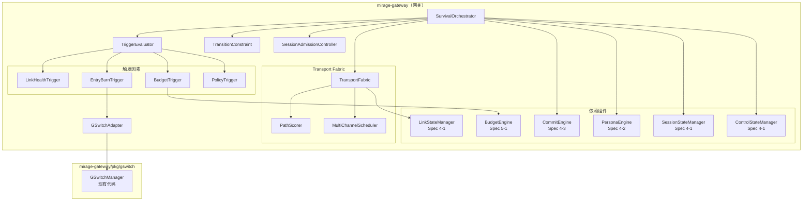
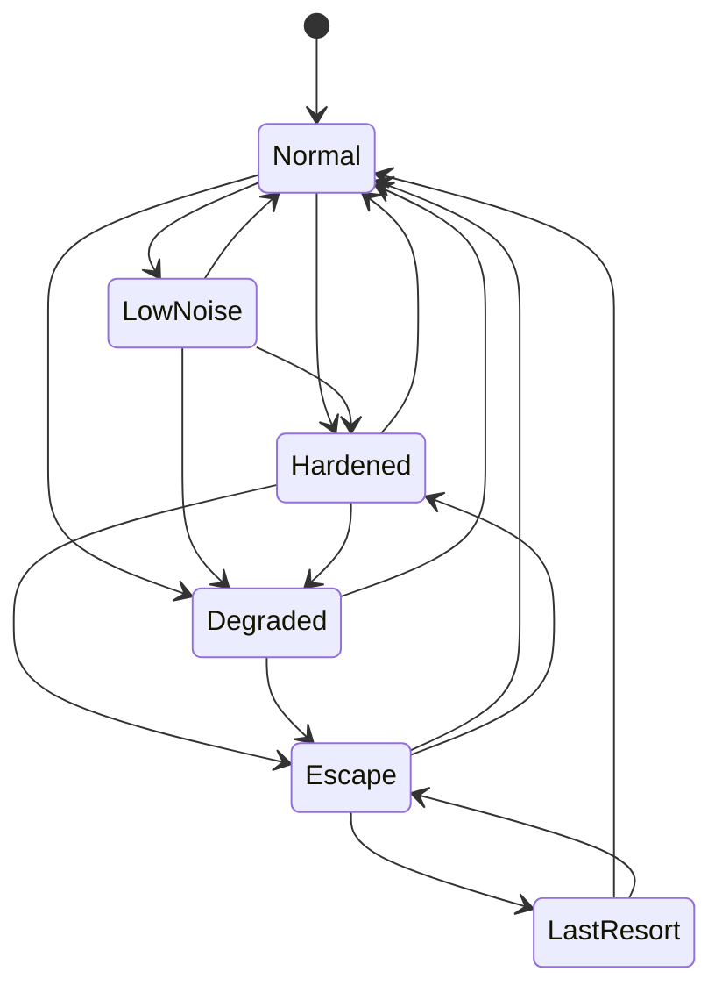
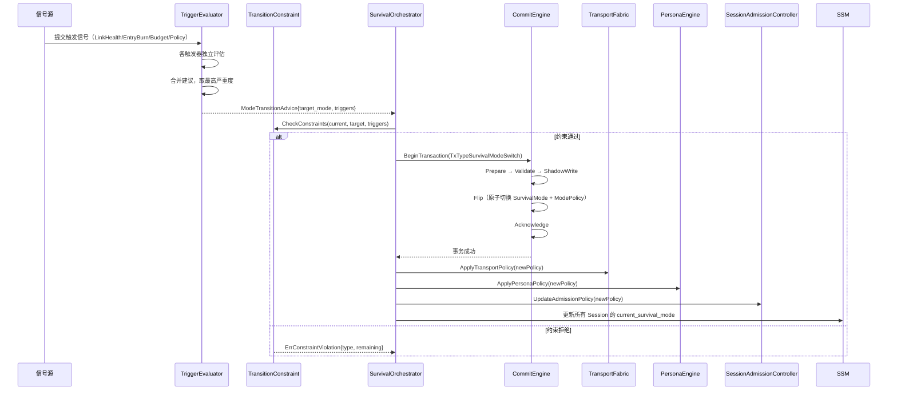
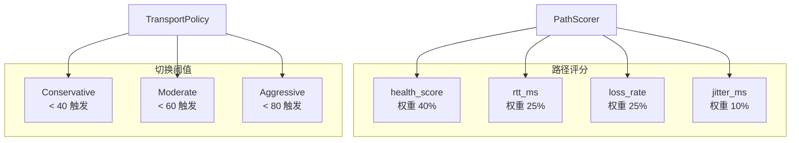

# 设计文档：V2 Survival Orchestrator

## 概述

本设计实现 Mirage V2 编排内核的 Survival Orchestrator（生存编排器），负责将局部事件（链路健康下降、入口战死、预算耗尽、策略指令）升级为全局生存姿态，并驱动 Transport Fabric 和 Persona Engine 联动响应。Survival Orchestrator 取代原有 G-Switch 的单点域名切换角色，成为系统级姿态控制器。

核心设计目标：
- 六种 Survival Mode 的状态机管理，15 条合法迁移路径，严格拒绝非法迁移
- 每种模式绑定五维 Mode Policy（transport / persona / budget / switch_aggressiveness / session_admission），模式切换后自动下发
- 四类触发因素（Link Health / Entry Burn / Budget / Policy）独立评估后合并，取最高严重度
- 状态迁移受 cooldown、hysteresis、minimum dwell time 三重约束，防止高频抖动
- Transport Fabric 按 Survival Mode 分级管理路径选择、切换阈值和多通道调度
- G-Switch 适配层将域名转生能力纳入 Entry Burn 触发流程
- Session 准入控制按四档策略（Open / RestrictNew / HighPriorityOnly / Closed）限制新会话
- 所有模式切换通过 Commit Engine 的 TxTypeSurvivalModeSwitch 事务执行
- 核心数据结构支持 JSON round-trip

本模块位于 `mirage-gateway/pkg/orchestrator/survival/`，Transport Fabric 位于 `mirage-gateway/pkg/orchestrator/transport/`，G-Switch 适配层位于 `mirage-gateway/pkg/gswitch/`。

## 架构

### 整体分层



### Survival Mode 状态机



### 触发因素评估与模式迁移时序



### Transport Fabric 路径管理



## 组件与接口

### 1. 枚举与常量（`pkg/orchestrator/survival/types.go`）

```go
// SwitchAggressiveness 切换激进度
type SwitchAggressiveness string
const (
    AggressivenessConservative SwitchAggressiveness = "Conservative"
    AggressivenessModerate     SwitchAggressiveness = "Moderate"
    AggressivenessAggressive   SwitchAggressiveness = "Aggressive"
)

// SessionAdmissionPolicy 会话准入策略
type SessionAdmissionPolicy string
const (
    AdmissionOpen             SessionAdmissionPolicy = "Open"
    AdmissionRestrictNew      SessionAdmissionPolicy = "RestrictNew"
    AdmissionHighPriorityOnly SessionAdmissionPolicy = "HighPriorityOnly"
    AdmissionClosed           SessionAdmissionPolicy = "Closed"
)

// TriggerSource 触发源类型
type TriggerSource string
const (
    TriggerSourceLinkHealth TriggerSource = "LinkHealth"
    TriggerSourceEntryBurn  TriggerSource = "EntryBurn"
    TriggerSourceBudget     TriggerSource = "Budget"
    TriggerSourcePolicy     TriggerSource = "Policy"
)

// ValidTransitions 合法的 Survival Mode 迁移路径
var ValidTransitions = map[orchestrator.SurvivalMode][]orchestrator.SurvivalMode{
    orchestrator.SurvivalModeNormal:     {orchestrator.SurvivalModeLowNoise, orchestrator.SurvivalModeHardened, orchestrator.SurvivalModeDegraded},
    orchestrator.SurvivalModeLowNoise:   {orchestrator.SurvivalModeNormal, orchestrator.SurvivalModeHardened, orchestrator.SurvivalModeDegraded},
    orchestrator.SurvivalModeHardened:   {orchestrator.SurvivalModeNormal, orchestrator.SurvivalModeDegraded, orchestrator.SurvivalModeEscape},
    orchestrator.SurvivalModeDegraded:   {orchestrator.SurvivalModeNormal, orchestrator.SurvivalModeEscape},
    orchestrator.SurvivalModeEscape:     {orchestrator.SurvivalModeNormal, orchestrator.SurvivalModeHardened, orchestrator.SurvivalModeLastResort},
    orchestrator.SurvivalModeLastResort: {orchestrator.SurvivalModeNormal, orchestrator.SurvivalModeEscape},
}

// ModeSeverity 模式严重度排序（数值越大越严重）
var ModeSeverity = map[orchestrator.SurvivalMode]int{
    orchestrator.SurvivalModeNormal:     0,
    orchestrator.SurvivalModeLowNoise:   1,
    orchestrator.SurvivalModeHardened:   2,
    orchestrator.SurvivalModeDegraded:   3,
    orchestrator.SurvivalModeEscape:     4,
    orchestrator.SurvivalModeLastResort: 5,
}
```

### 2. ModePolicy（`pkg/orchestrator/survival/mode_policy.go`）

```go
// ModePolicy 模式策略绑定
type ModePolicy struct {
    TransportPolicy        TransportPolicyName    `json:"transport_policy"`
    PersonaPolicy          PersonaPolicyName       `json:"persona_policy"`
    BudgetPolicy           BudgetPolicyName        `json:"budget_policy"`
    SwitchAggressiveness   SwitchAggressiveness    `json:"switch_aggressiveness"`
    SessionAdmissionPolicy SessionAdmissionPolicy  `json:"session_admission_policy"`
}

type TransportPolicyName string
type PersonaPolicyName string
type BudgetPolicyName string

// DefaultModePolicies 默认模式策略表
var DefaultModePolicies = map[orchestrator.SurvivalMode]*ModePolicy{
    orchestrator.SurvivalModeNormal: {
        TransportPolicy:        "normal",
        PersonaPolicy:          "normal",
        BudgetPolicy:           "normal",
        SwitchAggressiveness:   AggressivenessConservative,
        SessionAdmissionPolicy: AdmissionOpen,
    },
    orchestrator.SurvivalModeLowNoise: {
        TransportPolicy:        "low_noise",
        PersonaPolicy:          "low_noise",
        BudgetPolicy:           "conservative",
        SwitchAggressiveness:   AggressivenessConservative,
        SessionAdmissionPolicy: AdmissionOpen,
    },
    orchestrator.SurvivalModeHardened: {
        TransportPolicy:        "hardened",
        PersonaPolicy:          "hardened",
        BudgetPolicy:           "elevated",
        SwitchAggressiveness:   AggressivenessModerate,
        SessionAdmissionPolicy: AdmissionOpen,
    },
    orchestrator.SurvivalModeDegraded: {
        TransportPolicy:        "degraded",
        PersonaPolicy:          "degraded",
        BudgetPolicy:           "restricted",
        SwitchAggressiveness:   AggressivenessConservative,
        SessionAdmissionPolicy: AdmissionRestrictNew,
    },
    orchestrator.SurvivalModeEscape: {
        TransportPolicy:        "escape",
        PersonaPolicy:          "escape",
        BudgetPolicy:           "emergency",
        SwitchAggressiveness:   AggressivenessAggressive,
        SessionAdmissionPolicy: AdmissionHighPriorityOnly,
    },
    orchestrator.SurvivalModeLastResort: {
        TransportPolicy:        "last_resort",
        PersonaPolicy:          "last_resort",
        BudgetPolicy:           "emergency",
        SwitchAggressiveness:   AggressivenessAggressive,
        SessionAdmissionPolicy: AdmissionClosed,
    },
}
```

### 3. TriggerEvaluator（`pkg/orchestrator/survival/trigger.go`）

```go
// TriggerSignal 触发信号
type TriggerSignal struct {
    Source      TriggerSource `json:"source"`
    Reason      string        `json:"reason"`
    Severity    int           `json:"severity"`    // 0-5，对应 ModeSeverity
    Timestamp   time.Time     `json:"timestamp"`
    Metadata    map[string]interface{} `json:"metadata,omitempty"`
}

// ModeTransitionAdvice 模式迁移建议
type ModeTransitionAdvice struct {
    TargetMode  orchestrator.SurvivalMode `json:"target_mode"`
    Triggers    []TriggerSignal           `json:"triggers"`
    Confidence  float64                   `json:"confidence"` // 0.0-1.0
}

// TriggerEvaluator 触发因素评估器
type TriggerEvaluator interface {
    // Evaluate 评估所有触发因素，返回迁移建议（可能为 nil 表示无需迁移）
    Evaluate(ctx context.Context, currentMode orchestrator.SurvivalMode) (*ModeTransitionAdvice, error)

    // SubmitSignal 提交触发信号
    SubmitSignal(signal *TriggerSignal)
}

// LinkHealthTrigger 链路健康触发器
type LinkHealthTrigger interface {
    // Evaluate 根据所有活跃链路的平均健康分数评估
    // avg < 10 → Escape, avg < 30 → Degraded, avg < 60 → Hardened
    Evaluate(ctx context.Context, links []*orchestrator.LinkState) *TriggerSignal
}

// EntryBurnTrigger 入口战死触发器
type EntryBurnTrigger interface {
    // Evaluate 根据过去 1 小时入口战死次数评估
    Evaluate(ctx context.Context, burnCount int, threshold int) *TriggerSignal
}

// BudgetTrigger 预算触发器
type BudgetTrigger interface {
    // Evaluate 根据 BudgetEngine 判定结果评估
    // deny_and_suspend → 建议 Degraded
    Evaluate(ctx context.Context, verdict budget.BudgetVerdict) *TriggerSignal
}

// PolicyTrigger 策略指令触发器
type PolicyTrigger interface {
    // Evaluate 将外部策略指令转换为触发信号
    Evaluate(ctx context.Context, targetMode orchestrator.SurvivalMode, reason string) *TriggerSignal
}
```

### 4. TransitionConstraint（`pkg/orchestrator/survival/constraint.go`）

```go
// TransitionConstraintConfig 迁移约束配置
type TransitionConstraintConfig struct {
    MinDwellTimes    map[orchestrator.SurvivalMode]time.Duration `json:"min_dwell_times"`
    UpgradeCooldown  time.Duration                               `json:"upgrade_cooldown"`
    HysteresisMargin float64                                     `json:"hysteresis_margin"` // 默认 0.20
}

// DefaultTransitionConstraintConfig 默认约束配置
var DefaultTransitionConstraintConfig = TransitionConstraintConfig{
    MinDwellTimes: map[orchestrator.SurvivalMode]time.Duration{
        orchestrator.SurvivalModeNormal:     0,
        orchestrator.SurvivalModeLowNoise:   30 * time.Second,
        orchestrator.SurvivalModeHardened:   60 * time.Second,
        orchestrator.SurvivalModeDegraded:   120 * time.Second,
        orchestrator.SurvivalModeEscape:     30 * time.Second,
        orchestrator.SurvivalModeLastResort: 60 * time.Second,
    },
    UpgradeCooldown:  60 * time.Second,
    HysteresisMargin: 0.20,
}

// TransitionConstraint 迁移约束检查器
type TransitionConstraint interface {
    // Check 检查迁移是否满足所有约束
    // 返回 nil 表示通过，返回 ErrConstraintViolation 包含违反类型和剩余时间
    Check(current orchestrator.SurvivalMode, target orchestrator.SurvivalMode,
        enteredCurrentAt time.Time, lastUpgradeAt time.Time,
        triggers []TriggerSignal) error
}
```

### 5. SurvivalOrchestrator（`pkg/orchestrator/survival/orchestrator.go`）

```go
// SurvivalOrchestrator 生存编排器
type SurvivalOrchestrator interface {
    // GetCurrentMode 获取当前 Survival Mode
    GetCurrentMode() orchestrator.SurvivalMode

    // GetCurrentPolicy 获取当前 Mode Policy
    GetCurrentPolicy() *ModePolicy

    // RequestTransition 请求模式迁移（经过约束检查和事务提交）
    RequestTransition(ctx context.Context, target orchestrator.SurvivalMode, triggers []TriggerSignal) error

    // EvaluateAndTransition 评估触发因素并自动执行迁移（如果需要）
    EvaluateAndTransition(ctx context.Context) error

    // CheckAdmission 检查新会话是否允许建立
    CheckAdmission(serviceClass orchestrator.ServiceClass) error

    // GetTransitionHistory 查询最近 N 次模式迁移历史
    GetTransitionHistory(n int) []*TransitionRecord

    // RecoverOnStartup 系统启动时恢复上一个稳定的 Survival Mode
    RecoverOnStartup(ctx context.Context) error
}

// TransitionRecord 迁移历史记录
type TransitionRecord struct {
    FromMode    orchestrator.SurvivalMode `json:"from_mode"`
    ToMode      orchestrator.SurvivalMode `json:"to_mode"`
    Triggers    []TriggerSignal           `json:"triggers"`
    TxID        string                    `json:"tx_id"`
    Timestamp   time.Time                 `json:"timestamp"`
}
```

### 6. Transport Fabric（`pkg/orchestrator/transport/fabric.go`）

```go
// PathScore 路径评分结果
type PathScore struct {
    LinkID string  `json:"link_id"`
    Score  float64 `json:"score"` // 0-100
}

// TransportPolicy 传输策略
type TransportPolicy struct {
    SwitchAggressiveness SwitchAggressiveness `json:"switch_aggressiveness"`
    SwitchThreshold      float64             `json:"switch_threshold"`      // 健康分数低于此值触发切换
    PreferHighPerformance bool               `json:"prefer_high_performance"`
    AllowDegradedPath    bool                `json:"allow_degraded_path"`
    MaxParallelPaths     int                 `json:"max_parallel_paths"`    // 同一 Session 最大并行路径数
    PrewarmBackup        bool                `json:"prewarm_backup"`        // 是否预热备用路径
}

// DefaultTransportPolicies 按 Survival Mode 分级的默认传输策略
var DefaultTransportPolicies = map[orchestrator.SurvivalMode]*TransportPolicy{
    orchestrator.SurvivalModeNormal: {
        SwitchAggressiveness:  AggressivenessConservative,
        SwitchThreshold:       40.0,
        PreferHighPerformance: true,
        AllowDegradedPath:     false,
        MaxParallelPaths:      1,
        PrewarmBackup:         false,
    },
    orchestrator.SurvivalModeLowNoise: {
        SwitchAggressiveness:  AggressivenessConservative,
        SwitchThreshold:       40.0,
        PreferHighPerformance: true,
        AllowDegradedPath:     false,
        MaxParallelPaths:      1,
        PrewarmBackup:         false,
    },
    orchestrator.SurvivalModeHardened: {
        SwitchAggressiveness:  AggressivenessModerate,
        SwitchThreshold:       60.0,
        PreferHighPerformance: false,
        AllowDegradedPath:     false,
        MaxParallelPaths:      2,
        PrewarmBackup:         true,
    },
    orchestrator.SurvivalModeDegraded: {
        SwitchAggressiveness:  AggressivenessConservative,
        SwitchThreshold:       40.0,
        PreferHighPerformance: false,
        AllowDegradedPath:     true,
        MaxParallelPaths:      1,
        PrewarmBackup:         false,
    },
    orchestrator.SurvivalModeEscape: {
        SwitchAggressiveness:  AggressivenessAggressive,
        SwitchThreshold:       80.0,
        PreferHighPerformance: false,
        AllowDegradedPath:     true,
        MaxParallelPaths:      3,
        PrewarmBackup:         true,
    },
    orchestrator.SurvivalModeLastResort: {
        SwitchAggressiveness:  AggressivenessAggressive,
        SwitchThreshold:       80.0,
        PreferHighPerformance: false,
        AllowDegradedPath:     true,
        MaxParallelPaths:      2,
        PrewarmBackup:         false,
    },
}

// PathScorer 路径评分器
type PathScorer interface {
    // Score 根据链路健康指标和传输策略计算路径得分
    Score(link *orchestrator.LinkState, policy *TransportPolicy) float64
}

// TransportFabric 传输织网层
type TransportFabric interface {
    // SelectBestPath 选择得分最高的可用路径
    SelectBestPath(ctx context.Context, sessionID string) (*PathScore, error)

    // SwitchPath 切换路径（通过 CommitEngine TxTypeLinkMigration）
    SwitchPath(ctx context.Context, sessionID string, newLinkID string) error

    // GetPathScores 获取所有可用路径的评分
    GetPathScores(ctx context.Context) ([]*PathScore, error)

    // ApplyPolicy 应用新的传输策略
    ApplyPolicy(policy *TransportPolicy)

    // PrewarmBackup 为指定 Session 预热备用路径
    PrewarmBackup(ctx context.Context, sessionID string) error

    // GetActivePaths 获取指定 Session 的活跃路径列表
    GetActivePaths(ctx context.Context, sessionID string) ([]string, error)
}
```

### 7. G-Switch 适配层（`pkg/gswitch/adapter.go`）

```go
// GSwitchAdapter G-Switch 适配层
type GSwitchAdapter interface {
    // GetEntryBurnCount 获取过去指定时间窗口内的入口战死次数
    GetEntryBurnCount(window time.Duration) int

    // GetPoolStats 获取域名池状态（active/standby/burned 数量）
    GetPoolStats() map[string]int

    // TriggerEscape 触发域名转生
    TriggerEscape(reason string) error

    // OnDomainBurned 注册域名战死回调（转换为 EntryBurnTrigger 信号）
    OnDomainBurned(callback func(domain string, reason string))

    // IsStandbyPoolEmpty 热备域名池是否为空
    IsStandbyPoolEmpty() bool
}
```

### 8. Session 准入控制（`pkg/orchestrator/survival/admission.go`）

```go
// SessionAdmissionController 会话准入控制器
type SessionAdmissionController interface {
    // Check 检查新会话是否允许建立
    // 返回 nil 表示允许，返回 ErrAdmissionDenied 包含策略和 service_class
    Check(serviceClass orchestrator.ServiceClass) error

    // UpdatePolicy 更新准入策略
    UpdatePolicy(policy SessionAdmissionPolicy)

    // GetCurrentPolicy 获取当前准入策略
    GetCurrentPolicy() SessionAdmissionPolicy
}
```

### 9. 错误类型（`pkg/orchestrator/survival/errors.go`）

```go
// ErrInvalidTransition 非法模式迁移
type ErrInvalidTransition struct {
    From orchestrator.SurvivalMode
    To   orchestrator.SurvivalMode
}

// ErrConstraintViolation 约束违反
type ErrConstraintViolation struct {
    ConstraintType string        // "min_dwell_time" / "cooldown" / "hysteresis"
    Remaining      time.Duration // 剩余等待时间
}

// ErrAdmissionDenied 准入拒绝
type ErrAdmissionDenied struct {
    Policy       SessionAdmissionPolicy
    ServiceClass orchestrator.ServiceClass
}
```

## 数据模型

### Mode Policy 配置（内存，非持久化）

| Survival Mode | switch_aggressiveness | session_admission_policy | transport_policy | persona_policy | budget_policy |
|---|---|---|---|---|---|
| Normal | Conservative | Open | normal | normal | normal |
| LowNoise | Conservative | Open | low_noise | low_noise | conservative |
| Hardened | Moderate | Open | hardened | hardened | elevated |
| Degraded | Conservative | RestrictNew | degraded | degraded | restricted |
| Escape | Aggressive | HighPriorityOnly | escape | escape | emergency |
| LastResort | Aggressive | Closed | last_resort | last_resort | emergency |

### Transport Policy 配置（内存，非持久化）

| Survival Mode | switch_threshold | prefer_high_performance | allow_degraded_path | max_parallel_paths | prewarm_backup |
|---|---|---|---|---|---|
| Normal | 40.0 | true | false | 1 | false |
| LowNoise | 40.0 | true | false | 1 | false |
| Hardened | 60.0 | false | false | 2 | true |
| Degraded | 40.0 | false | true | 1 | false |
| Escape | 80.0 | false | true | 3 | true |
| LastResort | 80.0 | false | true | 2 | false |

### Transition Constraint 默认配置

| Survival Mode | minimum_dwell_time |
|---|---|
| Normal | 0s |
| LowNoise | 30s |
| Hardened | 60s |
| Degraded | 120s |
| Escape | 30s |
| LastResort | 60s |

- 升级冷却时间：60s
- 降级滞回阈值：触发因素改善幅度超过升级阈值的 20%

### Link Health 触发阈值

| 平均健康分数 | 建议目标模式 |
|---|---|
| < 60 | Hardened |
| < 30 | Degraded |
| < 10 | Escape |

### Session 准入矩阵

| admission_policy | Standard | Platinum | Diamond |
|---|---|---|---|
| Open | ✓ | ✓ | ✓ |
| RestrictNew | ✗ | ✓ | ✓ |
| HighPriorityOnly | ✗ | ✗ | ✓ |
| Closed | ✗ | ✗ | ✗ |

### PathScorer 权重

| 指标 | 权重 | 说明 |
|---|---|---|
| health_score | 0.40 | 综合健康分 |
| rtt_ms | 0.25 | 延迟（归一化后取反） |
| loss_rate | 0.25 | 丢包率（取反） |
| jitter_ms | 0.10 | 抖动（归一化后取反） |

路径得分公式：`score = health_score * 0.40 + (1 - rtt_norm) * 25 + (1 - loss_rate) * 25 + (1 - jitter_norm) * 10`

其中 `rtt_norm = min(rtt_ms / 500.0, 1.0)`，`jitter_norm = min(jitter_ms / 200.0, 1.0)`

## 正确性属性

*属性（Property）是在系统所有合法执行中都应成立的特征或行为——本质上是对系统行为的形式化陈述。属性是人类可读规格说明与机器可验证正确性保证之间的桥梁。*

### Property 1: Survival Mode 状态机转换合法性

*For any* SurvivalMode 对 (from, to)，迁移请求的结果应与 ValidTransitions 表完全一致：合法转换（from 的合法目标列表包含 to）成功执行，非法转换返回 ErrInvalidTransition 且错误包含正确的 From 和 To 字段。自迁移（from == to）也应被拒绝。

**Validates: Requirements 1.4, 1.5, 1.6**

### Property 2: ModePolicy 绑定完整性与正确性

*For any* SurvivalMode，DefaultModePolicies 应返回非 nil 的 ModePolicy，且该 ModePolicy 的五个字段（transport_policy、persona_policy、budget_policy、switch_aggressiveness、session_admission_policy）均非空。具体地：Normal 和 LowNoise 的 switch_aggressiveness 为 Conservative、session_admission_policy 为 Open；Hardened 的 switch_aggressiveness 为 Moderate、session_admission_policy 为 Open；Degraded 的 switch_aggressiveness 为 Conservative、session_admission_policy 为 RestrictNew；Escape 的 switch_aggressiveness 为 Aggressive、session_admission_policy 为 HighPriorityOnly；LastResort 的 switch_aggressiveness 为 Aggressive、session_admission_policy 为 Closed。

**Validates: Requirements 2.1, 2.3, 2.4, 2.5, 2.6, 2.7, 2.8**

### Property 3: Link Health 触发阈值映射

*For any* 一组活跃链路（至少一条），LinkHealthTrigger 的评估结果应满足：平均健康分数 < 10 时建议 Escape，10 ≤ 平均 < 30 时建议 Degraded，30 ≤ 平均 < 60 时建议 Hardened，平均 ≥ 60 时不产生触发信号（返回 nil）。

**Validates: Requirements 3.2, 3.3, 3.4**

### Property 4: Entry Burn 触发正确性

*For any* 入口战死次数 burnCount 和阈值 threshold，EntryBurnTrigger 应在 burnCount > threshold 时产生触发信号，burnCount ≤ threshold 时返回 nil。

**Validates: Requirements 3.5**

### Property 5: Budget 触发正确性

*For any* BudgetVerdict，BudgetTrigger 应仅在 verdict 为 deny_and_suspend 时产生建议 Degraded 的触发信号，其余 verdict 返回 nil。

**Validates: Requirements 3.6**

### Property 6: 触发因素合并取最高严重度

*For any* 非空的 TriggerSignal 集合，TriggerEvaluator 合并后的 ModeTransitionAdvice 的 target_mode 应等于集合中 ModeSeverity 最高的信号对应的目标模式，且 advice 的 triggers 列表应包含所有输入信号的 source 和 reason。

**Validates: Requirements 3.8, 3.9**

### Property 7: 迁移约束综合判定

*For any* 迁移请求（current, target, enteredCurrentAt, lastUpgradeAt, triggers），TransitionConstraint.Check 的结果应满足：(1) 如果在 current 模式的 minimum_dwell_time 内，拒绝并返回 ConstraintType="min_dwell_time"；(2) 如果是升级迁移（target 严重度 > current）且在 cooldown 内，拒绝并返回 ConstraintType="cooldown"；(3) 如果是降级迁移且触发因素改善幅度未超过 hysteresis 阈值，拒绝并返回 ConstraintType="hysteresis"。Policy_Trigger 类型的迁移绕过 cooldown 和 hysteresis 约束，但仍受 minimum_dwell_time 约束。所有拒绝错误包含 Remaining 剩余时间。

**Validates: Requirements 4.1, 4.2, 4.3, 4.7, 4.8**

### Property 8: 路径评分公式正确性

*For any* LinkState（health_score ∈ [0,100]、rtt_ms ≥ 0、loss_rate ∈ [0,1]、jitter_ms ≥ 0）和 TransportPolicy，PathScorer.Score 的结果应等于 `health_score * 0.40 + (1 - min(rtt_ms/500, 1)) * 25 + (1 - loss_rate) * 25 + (1 - min(jitter_ms/200, 1)) * 10`，误差不超过 0.01。

**Validates: Requirements 5.2**

### Property 9: 最优路径选择

*For any* 包含至少一条可用路径的路径集合，SelectBestPath 返回的路径应具有所有可用路径中的最高得分。如果存在多条得分相同的路径，返回其中任一即可。

**Validates: Requirements 5.3**

### Property 10: Transport Policy 分级正确性

*For any* SurvivalMode，DefaultTransportPolicies 应返回非 nil 的 TransportPolicy，且 switch_threshold 满足：Conservative 模式为 40.0，Moderate 模式为 60.0，Aggressive 模式为 80.0。具体地：Normal 和 LowNoise 的 switch_threshold 为 40.0 且 max_parallel_paths 为 1；Hardened 的 switch_threshold 为 60.0 且 prewarm_backup 为 true；Escape 的 switch_threshold 为 80.0 且 max_parallel_paths 为 3。

**Validates: Requirements 6.1, 6.2, 6.3, 6.4, 6.5, 6.6, 6.7**

### Property 11: Session 准入矩阵正确性

*For any* SessionAdmissionPolicy 和 ServiceClass 组合，SessionAdmissionController.Check 的结果应与准入矩阵完全一致：Open 允许所有；RestrictNew 仅允许 Platinum 和 Diamond；HighPriorityOnly 仅允许 Diamond；Closed 拒绝所有。拒绝时返回 ErrAdmissionDenied 且包含正确的 Policy 和 ServiceClass 字段。

**Validates: Requirements 9.1, 9.2, 9.3, 9.4, 9.5**

### Property 12: 迁移历史记录完整性

*For any* 成功的模式迁移，产生的 TransitionRecord 应包含非空的 FromMode、ToMode、TxID，非空的 Triggers 列表（每个 trigger 包含 source 和 reason），以及非零的 Timestamp。

**Validates: Requirements 11.3**

### Property 13: JSON 序列化 round-trip

*For any* 合法的 ModePolicy、TransportPolicy 或 TransitionConstraintConfig 对象，JSON 序列化后再反序列化应产生等价对象（所有字段值保持不变），且序列化结果中的所有 JSON key 均为 snake_case 格式。

**Validates: Requirements 12.1, 12.2, 12.3, 12.4**

### Property 14: 并行路径数量上限

*For any* Session 和任意路径添加操作序列，该 Session 的并行活跃路径数量不应超过当前 TransportPolicy 的 max_parallel_paths 值（最大为 3）。

**Validates: Requirements 8.4**

## 错误处理

### 模式迁移错误

| 错误场景 | 处理方式 |
|----------|----------|
| 非法模式迁移 | 返回 `ErrInvalidTransition{From, To}`，包含当前模式和目标模式 |
| 最小驻留时间未满 | 返回 `ErrConstraintViolation{ConstraintType: "min_dwell_time", Remaining}` |
| 升级冷却期内 | 返回 `ErrConstraintViolation{ConstraintType: "cooldown", Remaining}` |
| 降级滞回未满 | 返回 `ErrConstraintViolation{ConstraintType: "hysteresis", Remaining}` |
| CommitEngine 事务失败 | 回滚到切换前的 Survival Mode 和 ModePolicy，返回原始事务错误 |

### 准入控制错误

| 错误场景 | 处理方式 |
|----------|----------|
| 准入策略拒绝 | 返回 `ErrAdmissionDenied{Policy, ServiceClass}` |

### Transport Fabric 错误

| 错误场景 | 处理方式 |
|----------|----------|
| 无可用路径 | 启用退化路径（degraded path），如果退化路径也不可用则返回错误 |
| 路径切换事务失败 | 保持当前路径不变，返回原始事务错误 |
| 并行路径数量已达上限 | 返回错误，不添加新路径 |

### G-Switch 适配错误

| 错误场景 | 处理方式 |
|----------|----------|
| 热备域名池为空 | 向 TriggerEvaluator 提交升级到 Escape 的建议 |
| TriggerEscape 失败 | 记录错误日志，不影响 Survival Mode 切换流程 |

### 恢复错误

| 错误场景 | 处理方式 |
|----------|----------|
| 启动时发现未完成事务 | 通过 CommitEngine.RecoverOnStartup 回滚 |
| ControlState 不可恢复 | 回退到 Normal 模式，记录错误日志 |

## 测试策略

### 属性测试（Property-Based Testing）

使用 `pgregory.net/rapid` 作为 PBT 库。

每个属性测试运行至少 100 次迭代，标签格式：`Feature: v2-survival-orchestrator, Property N: <描述>`

属性测试覆盖 Property 1-14，重点验证：
- 状态机转换合法性（Property 1）
- ModePolicy 绑定（Property 2）
- 四类触发器（Property 3, 4, 5）
- 触发因素合并（Property 6）
- 迁移约束判定（Property 7）
- 路径评分与选择（Property 8, 9）
- Transport Policy 分级（Property 10）
- Session 准入矩阵（Property 11）
- 迁移记录完整性（Property 12）
- JSON round-trip（Property 13）
- 并行路径上限（Property 14）

### 单元测试

- SwitchAggressiveness、SessionAdmissionPolicy、TriggerSource 枚举值字符串表示
- ValidTransitions 包含 6 个 key，共 15 条合法路径
- ModeSeverity 排序正确性（Normal < LowNoise < ... < LastResort）
- DefaultModePolicies 包含 6 个 key
- DefaultTransportPolicies 包含 6 个 key
- DefaultTransitionConstraintConfig 默认值精确验证
- ErrInvalidTransition、ErrConstraintViolation、ErrAdmissionDenied 的 Error() 方法

### 集成测试

- SurvivalOrchestrator + CommitEngine 完整模式切换流程（Mock CommitEngine）
- SurvivalOrchestrator + TransportFabric 策略下发验证
- GSwitchAdapter + GSwitchManager 域名战死事件转换
- Escape/LastResort 模式切换自动触发 GSwitchManager.TriggerEscape
- 系统重启恢复流程（Mock ControlState）
- 多触发因素并发提交的线程安全性
