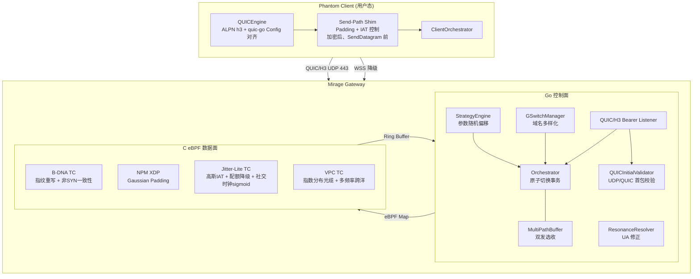
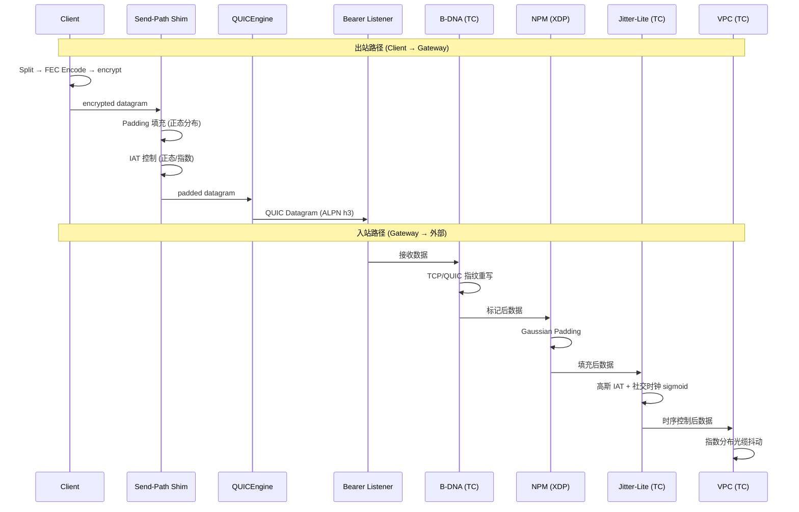
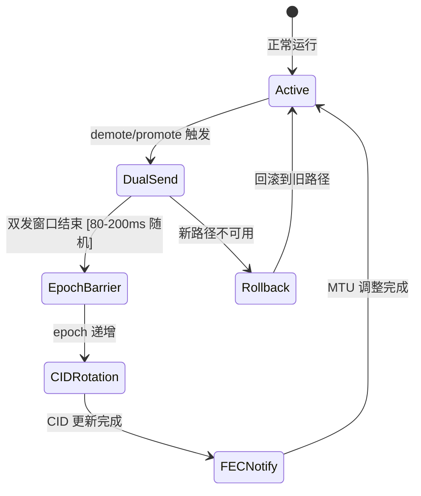

# 技术设计文档：外部零特征消除

## 概述

本设计文档覆盖 Mirage 项目外部零特征消除审计清单中 19 个仍开放整改项的技术实现方案。整改目标是消除被动观察者（pcap 分析）和主动探测者（发包探测）能识别的所有强特征，使 Mirage 流量在外部网络观察者视角下与正常浏览器流量不可区分。

设计遵循核心架构约束：**C 做内核数据面（eBPF XDP/TC），Go 做控制面，通过 eBPF Map 通信**。Client 侧无 eBPF，仅用户态实现。

整改分三层推进：
- **Layer S**：架构级结构阻断（Orchestrator 原子切换）
- **Layer A**：外部被动观察强特征消除（ALPN/指纹/包长/IAT/分布模型）
- **Layer B**：外部主动探测强特征消除（bearer listener/配额降级/参数随机化）

## 架构

### 系统总览



### 数据流路径



### Orchestrator 原子切换事务




## 组件与接口

### 1. Orchestrator 原子切换事务（S-02）

**修改文件**：`mirage-gateway/pkg/gtunnel/orchestrator.go`、新建 `mirage-gateway/pkg/gtunnel/switch_buffer.go`

**技术约束**：
- 现有 `MultiPathBuffer.EnableDualSend` 接受 `*Path`（含 `*net.UDPConn`），而 Orchestrator 使用 `ManagedPath`（含 `TransportConn` 接口）。两套类型体系不兼容。
- `Orchestrator.mpBuffer` 字段存在但 `NewOrchestrator` 中未初始化。
- quic-go 公开 API 无 `RetireConnectionID`，CID rotation 降级为技术债务。
- 当前 `demote()`/`promote()` 仅切换 `activePath` 并递增 epoch，无双发选收。

**实施方案**：新建 `SwitchBuffer`，基于 `TransportConn` 接口实现双发选收，不依赖 `*Path`/`*net.UDPConn`：

```go
// switch_buffer.go — 基于 TransportConn 的切换缓冲器
type SwitchBuffer struct {
    mu           sync.RWMutex
    oldConn      TransportConn
    newConn      TransportConn
    dualMode     bool
    duration     time.Duration // [80ms, 200ms] 随机
    seqTracker   map[uint64]bool
    startTime    time.Time
}

func NewSwitchBuffer() *SwitchBuffer

// EnableDualSend 启动双发选收（接受 TransportConn 而非 *Path）
func (sb *SwitchBuffer) EnableDualSend(oldConn, newConn TransportConn, duration time.Duration) error

// SendDual 向两条路径同时发送
func (sb *SwitchBuffer) SendDual(data []byte) error {
    sb.oldConn.Send(data)
    sb.newConn.Send(data)
    return nil
}

// ReceiveAndDedupe 从两条路径接收并去重
func (sb *SwitchBuffer) ReceiveAndDedupe(seq uint64, data []byte) ([]byte, bool)

// IsDualModeActive 是否处于双发模式
func (sb *SwitchBuffer) IsDualModeActive() bool
```

在 `NewOrchestrator` 中初始化 `SwitchBuffer`，修改 `demote()`/`promote()` 调用事务流程：

```go
func (o *Orchestrator) executeSwitchTransaction(oldPath, newPath *ManagedPath) error {
    // 1. 生成随机双发时长 [80ms, 200ms]
    duration := randomDualDuration()
    // 2. 启动双发选收
    o.switchBuffer.EnableDualSend(oldPath.Conn, newPath.Conn, duration)
    // 3. 等待双发窗口结束
    time.Sleep(duration)
    // 4. epoch barrier 递增
    newEpoch := o.nextEpoch()
    // 5. 通知 FEC 调整 MTU
    o.notifyFECMTU(newPath.Conn)
    // 6. 收敛到新 activePath
    o.activePath = newPath
    return nil
}
```

回滚条件：双发期间新路径连续 N 次发送失败 → 回滚到旧路径，epoch 不变。

CID rotation 降级为技术债务，不在当前实现中承诺。

### 2. Client QUIC ALPN 修正（A-02a）

**修改文件**：`phantom-client/pkg/gtclient/quic_engine.go`

当前 `NewQUICEngine` 中 `NextProtos: []string{"mirage-gtunnel"}`，改为：

```go
tlsConf := &tls.Config{
    NextProtos: []string{"h3"},
}
```

同时移除所有握手字段中的 `mirage`、`gtunnel` 等自定义标识。

### 3. Client QUIC 指纹完整对齐（A-02b）

**修改文件**：`phantom-client/pkg/gtclient/quic_engine.go`

**技术约束**：当前 Client 使用 `quic.Dial(ctx, udpConn, remoteAddr, *tls.Config, *quic.Config)` 建立连接。uTLS（`utls.UClient`）仅适用于 TLS over TCP，不能用于 QUIC over UDP。`InitialMaxData`、`MaxUDPPayloadSize` 不是当前 quic-go `Config` 的可用字段。

分两层实施：

**当前栈可做（立即）**：通过 quic-go 原生 `*quic.Config` 可用字段对齐：

```go
quicConf := &quic.Config{
    EnableDatagrams:                 true,
    MaxIdleTimeout:                  30 * time.Second,        // Chrome 140+
    InitialPacketSize:               1200,                     // Chrome 标准
    InitialStreamReceiveWindow:      6 * 1024 * 1024,         // 对齐 Chrome
    InitialConnectionReceiveWindow:  15 * 1024 * 1024,        // 对齐 Chrome
    KeepAlivePeriod:                 10 * time.Second,
}
```

CID 行为拟态：配置 CID 长度为 8 字节（Chrome 默认），更新频率对齐 Chrome 的 `NEW_CONNECTION_ID` 发送模式。

**当前栈做不了（记录为技术债务）**：`initial_max_data`、`max_udp_payload_size` 等 QUIC Transport Parameters 不是 quic-go Config 的可用字段，需要等待上游支持或 fork quic-go。在此之前，通过抓包验收确认当前 quic-go 默认 TP 与 Chrome 的差异程度并记录差异清单。

### 4. Send-Path Shim — Client 出网特征消除（A-03）

**修改文件**：`phantom-client/pkg/gtclient/client.go`、新建 `phantom-client/pkg/gtclient/send_path_shim.go`

**技术约束**：当前 `client.Send()` 的出网路径是 `Split → FEC Encode → encrypt → transport.SendDatagram(encrypted)`。SessionShaper 当前未被实例化使用。外部观察者看到的是加密后的 QUIC Datagram，因此 Padding 和 IAT 控制必须作用在"加密后、真正调用 `transport.SendDatagram()` 前"的边界。

新建 `SendPathShim` 作为统一的出网特征消除层，插入到 `client.Send()` 内部：

```go
// send_path_shim.go
type SendPathShim struct {
    mu         sync.Mutex
    sendFn     func([]byte) error  // 实际的 transport.SendDatagram 或 quicEngine.SendDatagram

    // Padding 控制
    paddingEnabled bool
    paddingMean    int     // 目标包长均值
    paddingStddev  int     // 目标包长标准差
    maxMTU         int     // QUIC Datagram MTU 上限

    // IAT 控制
    iatMode        IATMode // Normal / Exponential
    iatMeanUs      int64   // IAT 均值 (微秒)
    iatStddevUs    int64   // IAT 标准差 (微秒)
}

type IATMode int
const (
    IATModeNormal      IATMode = iota // 正态分布
    IATModeExponential                // 指数分布
)

// Send 对加密后的 datagram 进行 Padding + IAT 控制后发送
func (s *SendPathShim) Send(encrypted []byte) error {
    padded := s.applyPadding(encrypted)
    delay := s.sampleIATDelay()
    if delay > 0 {
        time.Sleep(delay)
    }
    return s.sendFn(padded)
}
```

在 `client.Send()` 中替换直接的 `transport.SendDatagram(encrypted)` 和 `quicEngine.SendDatagram(encrypted)` 调用：

```go
// client.go Send() 内部修改
// 原来：sendErr = transport.SendDatagram(encrypted)
// 改为：sendErr = c.sendShim.Send(encrypted)
```

`SendPathShim` 同时适用于 `transport` 和 `quicEngine` 两条发送路径，通过注入不同的 `sendFn` 实现。

Padding 逻辑：对加密后的 datagram 追加随机字节，使包长符合目标正态分布 N(mean, stddev²)。若填充后超过 MTU，截断到 MTU 上限。

IAT 逻辑：正态分布使用 `math/rand` 的 `NormFloat64()`；指数分布使用 `ExpFloat64()`。负值归零。

### 5. Client 源头指纹生成（A-06）

**修改文件**：`phantom-client/pkg/gtclient/quic_engine.go`（QUIC 路径）、`mirage-gateway/pkg/gtunnel/chameleon_client.go`（WSS 路径）

**技术约束**：uTLS（`utls.UClient(tcpConn, ...)`）仅适用于 TLS over TCP，不能直接用于 QUIC over UDP。因此 A-06 拆为两条独立任务线：

**主线：Client 源头指纹生成**

QUIC 路径：通过 quic-go 原生 `*tls.Config` 的可配置字段对齐 Chrome（注意：TLS 1.3 CipherSuites 不可配置，CurvePreferences 顺序不保证生效）：

```go
tlsConf := &tls.Config{
    NextProtos: []string{"h3"},
    MinVersion: tls.VersionTLS13,  // QUIC 强制 TLS 1.3
    // 注意：TLS 1.3 cipher suites 由 Go runtime 决定，不可通过 CipherSuites 字段配置
    // CurvePreferences 可设置但顺序不保证与 Chrome 完全一致
}
```

需记录"可控字段清单"和"不可控字段差异清单"，通过 pcap 抓包验收确认实际差异并设定验收门槛。

WSS 降级路径：使用 uTLS（此处可用，因为 WSS 是 TLS over TCP）：

```go
import utls "github.com/refraction-networking/utls"
utlsConn := utls.UClient(tcpConn, utlsConfig, utls.HelloChrome_Auto)
```

**补线：Gateway NFQUEUE/用户态补充重写**

新建 `mirage-gateway/pkg/rewriter/nfqueue_rewriter.go`，实现基于 NFQUEUE 的用户态拦截层：
- 读取 B-DNA 的 `skb->mark` 标记
- 对标记的 Gateway 出站 TCP/TLS 连接执行指纹重写
- 仅覆盖 Gateway 出站方向

### 6. WSS 降级路径接入 uTLS（A-05）

**修改文件**：`mirage-gateway/pkg/gtunnel/chameleon_client.go`

当前 `DialChameleon()` 使用 Go 原生 `tls.Config`，`dialWithUTLS()` 已实现但未接入。修改 `DialChameleon` 使用 `dialWithUTLS` 建立底层连接：

```go
func DialChameleon(ctx context.Context, config ChameleonDialConfig) (*ChameleonClientConn, error) {
    // 使用 uTLS 建立 TCP+TLS 连接
    tlsConn, err := dialWithUTLS(config.Endpoint, config.SNI, baseTLS)
    if err != nil {
        return nil, err
    }
    // 在 uTLS 连接之上建立 WebSocket
    dialer := &websocket.Dialer{
        NetDialTLSContext: func(ctx context.Context, network, addr string) (net.Conn, error) {
            return tlsConn, nil
        },
    }
    // ...
}
```

### 7. B-DNA 指纹模板扩展（A-07）

**修改文件**：`mirage-gateway/bpf/bdna.c`、Go 控制面加载器

当前 `fingerprint_map` 的 `max_entries` 为 16，预定义 6 个模板。扩展方案：

- `max_entries` 扩展到 64
- 通过 Go 控制面在启动时从配置文件加载 30+ 模板写入 eBPF Map
- 覆盖 Chrome 130-140+、Firefox 120-130+、Safari 17-18、Edge 120-130+ 各版本
- 支持运行时通过 eBPF Map `Put` 动态更新，无需重新加载 eBPF 程序

### 8. NPM 默认模式固化与运行时断言（A-08）

**修改文件**：`mirage-gateway/pkg/ebpf/` NPM 加载器

**技术约束**：`npm_config_map` 的 value 类型是完整的 `NPMConfig` 结构体（包含 `Enabled`、`FillingRate`、`GlobalMTU`、`MinPacketSize`、`PaddingMode`、`DecoyRate` 六个字段），不是单独的 `uint32` mode。断言逻辑必须读取完整结构体后检查 `PaddingMode` 字段。

Go 控制面 `NewDefaultNPMConfig()` 已将 `PaddingMode` 设为 `NPMModeGaussian`。增加启动期断言：

```go
func (loader *NPMLoader) VerifyGaussianMode() error {
    var cfg NPMConfig
    if err := loader.maps["npm_config_map"].Lookup(uint32(0), &cfg); err != nil {
        return err
    }
    if cfg.PaddingMode != NPMModeGaussian {
        log.Error("NPM PaddingMode 回落到非 Gaussian，强制修正")
        cfg.PaddingMode = NPMModeGaussian
        return loader.maps["npm_config_map"].Put(uint32(0), cfg)
    }
    return nil
}
```

### 9. B-DNA 非 SYN 包一致性（A-09）

**修改文件**：`mirage-gateway/bpf/bdna.c`

当前 `bdna_tcp_rewrite` 在 `if (!tcp->syn) return TC_ACT_OK;` 处直接跳过非 SYN 包。修改为：

```c
// 新增 per-connection Map
struct {
    __uint(type, BPF_MAP_TYPE_LRU_HASH);
    __uint(max_entries, 65536);
    __type(key, struct conn_key);    // {src_ip, dst_ip, src_port, dst_port}
    __type(value, struct conn_state); // {target_window, pkt_count, max_pkt}
} bdna_conn_map SEC(".maps");

// SYN 包：重写并存入 conn_map
if (tcp->syn) {
    // 现有重写逻辑...
    conn_state.target_window = fp->tcp_window;
    conn_state.pkt_count = 0;
    conn_state.max_pkt = 10; // 可配置，默认 10
    bpf_map_update_elem(&bdna_conn_map, &key, &conn_state, BPF_ANY);
}

// 非 SYN 包：前 N 个包维护 Window Size 一致性
if (!tcp->syn) {
    struct conn_state *state = bpf_map_lookup_elem(&bdna_conn_map, &key);
    if (state && state->pkt_count < state->max_pkt) {
        tcp->window = bpf_htons(state->target_window);
        // 重算校验和
        state->pkt_count++;
    }
}
```

### 10. Jitter-Lite 高斯采样修正（A-10）

**修改文件**：`mirage-gateway/bpf/common.h`

当前 `gaussian_sample` 使用均匀分布 `u1 % (stddev * 2) - stddev`。替换为 Irwin-Hall 近似（4 个均匀分布求和再缩放）：

```c
static __always_inline __u64 gaussian_sample(__u32 mean, __u32 stddev) {
    // Irwin-Hall 近似：4 个均匀分布求和
    __u32 u1 = bpf_get_prandom_u32();
    __u32 u2 = bpf_get_prandom_u32();
    __u32 u3 = bpf_get_prandom_u32();
    __u32 u4 = bpf_get_prandom_u32();

    // 归一化到 [0, 1) 范围后求和，结果近似 N(2, 1/3)
    // 缩放到 N(mean, stddev²)
    __u64 sum = (u1 >> 16) + (u2 >> 16) + (u3 >> 16) + (u4 >> 16);
    // sum ∈ [0, 4*65535], 均值 = 2*65535, 标准差 ≈ 65535/√3
    __s64 centered = (__s64)sum - 2 * 65535;
    __s64 scaled = (centered * (__s64)stddev) / (65535 * 577 / 1000); // /√(1/3)
    __u64 result = (__u64)((__s64)mean + scaled);

    return result > 0 ? result : 0;
}
```

### 11. VPC 延迟分布模型修正（A-11）

**修改文件**：`mirage-gateway/bpf/jitter.c`

**光缆抖动**：将 `simulate_fiber_jitter_v2` 中的均匀分布替换为指数分布近似：

```c
static __always_inline __u64 simulate_fiber_jitter_v2(struct vpc_noise_profile *profile) {
    if (!profile) return 0;
    __u32 random = bpf_get_prandom_u32();
    // 指数分布近似：-ln(U) * mean
    // 使用分段线性近似 -ln(x)
    __u64 u = (random >> 16) + 1; // [1, 65536]
    __u64 neg_ln; // 近似 -ln(u/65536) * 1000
    if (u > 32768) neg_ln = (65536 - u) * 1000 / 32768;
    else if (u > 8192) neg_ln = 693 + (32768 - u) * 1000 / 24576;
    else neg_ln = 2079 + (8192 - u) * 2000 / 8192;

    return profile->fiber_base_us + (neg_ln * profile->fiber_variance_us) / 1000;
}
```

**跨洋模拟**：将 `simulate_submarine_cable` 中的三角波替换为多频率叠加伪随机波形：

```c
static __always_inline __u64 simulate_submarine_cable(__u64 timestamp) {
    __u32 r1 = bpf_get_prandom_u32();
    __u32 r2 = bpf_get_prandom_u32();
    // 多频率叠加：3 个不同周期的伪随机分量
    __u64 t_ms = timestamp / 1000000;
    __u64 comp1 = ((t_ms * 7 + r1) % 200);        // 慢周期
    __u64 comp2 = ((t_ms * 31 + r2) % 100);       // 中周期
    __u64 comp3 = (bpf_get_prandom_u32() % 50);   // 随机分量
    return (comp1 + comp2 + comp3) / 3;            // 0-116 微秒
}
```

### 12. 生产态 QUIC/H3 Bearer Listener（B-01b）

**修改文件**：`mirage-gateway/cmd/gateway/main.go`

在 `main()` 中创建生产态 QUIC/H3 listener：

```go
// 创建 QUIC/H3 bearer listener (443/UDP)
h3Listener, err := quic.ListenAddr(":443", tlsConfig, &quic.Config{
    EnableDatagrams: true,
    MaxIdleTimeout:  30 * time.Second,
})
```

对标准 HTTP/3 请求返回 403/404 合法响应。将 Orchestrator 的数据面通过现有 `Orchestrator.StartPassive()` 模式绑定到此 listener（不发明新 API）。

### 13. UDP/QUIC 公网数据面主动探测防护（B-01c）

**修改文件**：新建 `mirage-gateway/pkg/threat/quic_guard.go`、修改 `mirage-gateway/cmd/gateway/main.go`

**技术约束**：现有 `HandshakeGuard`/`ProtocolDetector` 是 TCP `net.Listener`/`net.Conn` 包装器，不能用于 QUIC/UDP。quic-go Accept 返回的是 `*quic.Conn`（不是 `quic.Connection`）。

防护分两层实现：

**第一层：UDP 首包预过滤**

在 `quic.Listener` 之前，对 UDP socket 收到的首包做轻量级 QUIC Initial 格式校验：

```go
// quic_guard.go
type UDPPreFilter struct {
    udpConn    *net.UDPConn
    blacklist  *BlacklistManager
}

// FilterPacket 校验 UDP 首包是否为合法 QUIC Initial
// 检查：QUIC Version (4 bytes)、DCID Length、Packet Type
func (f *UDPPreFilter) FilterPacket(buf []byte, addr *net.UDPAddr) bool {
    if len(buf) < 5 { return false }
    // Long Header: first bit = 1
    if buf[0]&0x80 == 0 { return false }
    // Version check: v1 = 0x00000001, v2 = 0x6b3343cf
    version := binary.BigEndian.Uint32(buf[1:5])
    if version != 0x00000001 && version != 0x6b3343cf { return false }
    return true
}
```

**第二层：Accept 后 ConnectionState 校验**

在 `quic.Listener.Accept()` 返回 `*quic.Conn` 后，检查协商结果：

```go
type QUICPostAcceptValidator struct {
    blacklist  *BlacklistManager
    riskScorer RiskScoreAdder
}

// Validate 校验已建立的 QUIC 连接
func (v *QUICPostAcceptValidator) Validate(conn *quic.Conn) bool {
    state := conn.ConnectionState()
    if state.TLS.NegotiatedProtocol != "h3" {
        host, _, _ := net.SplitHostPort(conn.RemoteAddr().String())
        v.riskScorer.AddScore(host, 15, "invalid_quic_alpn")
        conn.CloseWithError(0, "")
        return false
    }
    return true
}
```

现有 TCP `HandshakeGuard`/`ProtocolDetector` 继续挂在 gRPC 控制面 listener 上，不做修改。

### 14. DNS/ICMP/WebRTC 接入生产启动链（B-01d）

**修改文件**：`mirage-gateway/cmd/gateway/main.go`

三类冷备协议在 Gateway 侧形态不同，分别接线：

#### 14a. DNSServer 接入

```go
// main.go 生产启动链
dnsServer, err := gtunnel.NewDNSServer(cfg.DNS.Domain, cfg.DNS.ListenAddr)
if err != nil {
    log.Printf("⚠️ DNSServer 启动失败: %v", err)
} else {
    dnsServer.SetRecvCallback(func(clientID string, data []byte) {
        orchestrator.FeedInboundPacket(gtunnel.TransportDNS, clientID, data)
    })
    dnsServer.Start()
}
```

`DNSServer` 是被动监听服务端，通过 `SetRecvCallback` 将上行数据喂给 Orchestrator，通过 `SendToClient` 下发数据。

#### 14b. WebRTCAnswerer 接入

`WebRTCAnswerer` 依赖 WSS 信令通道（`sendCtrlFrame` 回调），不能在启动时立即创建。接线方式：

1. 在 `main.go` 中预注册 WSS 控制帧路由
2. 当 ChameleonListener/WSS ServerConn 收到 `CtrlTypeSDP_Offer` 时，创建 `NewWebRTCAnswerer(config, sendCtrl)`
3. 调用 `HandleOffer(offerJSON)` → 自动通过 `sendCtrlFrame` 回传 SDP Answer 和 ICE Candidate
4. 收到 `CtrlTypeICE_Candidate` 时调用 `HandleRemoteCandidate(candidateJSON)`
5. `WaitReady()` 后 DataChannel 就绪，通过 `Orchestrator.AdoptInboundConn` 注册

#### 14c. ICMPTransport 接入

`ICMPTransport` 是主动 transport（Go Raw Socket 发送 + eBPF Ring Buffer 接收），不是被动 listener：

```go
// main.go 生产启动链（需要 eBPF Map 和 Raw Socket 权限）
icmpTransport, err := gtunnel.NewICMPTransport(
    ebpfMaps["icmp_config_map"],
    ebpfMaps["icmp_tx_map"],
    ebpfMaps["icmp_data_events"],
    cfg.ICMP,
)
if err != nil {
    log.Printf("⚠️ ICMPTransport 启动失败: %v", err)
} else {
    orchestrator.AdoptInboundConn(icmpTransport, gtunnel.TransportICMP)
}
```

### 15. 配额熔断渐进式降级（B-02）

**修改文件**：`mirage-gateway/bpf/jitter.c`

当前配额耗尽时 `return TC_ACT_STOLEN` 导致流量瞬间归零。替换为概率降级：

```c
if (remaining) {
    __u64 total_key = 1;
    __u64 *total = bpf_map_lookup_elem(&quota_map, &total_key);
    if (total && *total > 0) {
        __u64 ratio = (*remaining * 100) / *total;
        __u32 rand = bpf_get_prandom_u32() % 100;

        if (ratio < 1) {
            // 剩余 < 1%：10% 通过率
            if (rand >= 10) return TC_ACT_STOLEN;
        } else if (ratio < 10) {
            // 剩余 < 10%：50% 通过率
            if (rand >= 50) return TC_ACT_STOLEN;
        }
        // 正常扣减
        __sync_fetch_and_sub(remaining, (__u64)skb->len);
    }
}
```

### 16. 策略引擎参数随机偏移（B-03）

**修改文件**：`mirage-gateway/pkg/strategy/engine.go`

**技术约束**：当前 `GetParams()` 被状态切换日志直接调用（`engine.go:74`）。随机化不能放在 `GetParams()` 读接口上（否则每次读取都不同，难以验证且引入额外噪声），应改为"状态生成一次，状态内复用"模式。

在 `StrategyEngine` 中新增 `cachedParams` 字段，等级切换时一次性生成带偏移的参数并缓存：

```go
type StrategyEngine struct {
    currentLevel   DefenseLevel
    cachedParams   *DefenseParams  // 新增：缓存的已偏移参数
    threatCount    uint64
    lastAdjustTime time.Time
    mu             sync.RWMutex
    callback       func(level DefenseLevel) error
}

// GetParams 返回当前缓存的已偏移参数（同一等级内多次调用返回相同值）
func (se *StrategyEngine) GetParams() *DefenseParams {
    se.mu.RLock()
    defer se.mu.RUnlock()
    return se.cachedParams
}

// regenerateParams 在等级切换时调用，一次性生成带偏移的参数
func (se *StrategyEngine) regenerateParams() {
    base := levelToParams(se.currentLevel)
    se.cachedParams = applyRandomOffset(base, 0.20)
}

func applyRandomOffset(p *DefenseParams, ratio float64) *DefenseParams {
    r := func(base uint32) uint32 {
        offset := int64(float64(base) * ratio)
        delta := cryptoRandInt63n(2*offset+1) - offset
        result := int64(base) + delta
        if result < 0 { result = 0 }
        return uint32(result)
    }
    return &DefenseParams{
        Level:          p.Level,
        JitterMeanUs:   r(p.JitterMeanUs),
        JitterStddevUs: r(p.JitterStddevUs),
        NoiseIntensity: r(p.NoiseIntensity),
        PaddingRate:    r(p.PaddingRate),
    }
}
```

在 `UpdateByThreat` 中等级变化时调用 `regenerateParams()`。初始化时也调用一次。

### 17. 双发模式时间随机化（B-04）

**修改文件**：`mirage-gateway/pkg/gtunnel/multipath.go`

当前 `dualModeDuration: 100 * time.Millisecond` 固定值。改为每次启用时随机生成：

```go
func (mpb *MultiPathBuffer) EnableDualSend(oldPath, newPath *Path) error {
    // 随机 [80ms, 200ms]
    randBytes := make([]byte, 8)
    crypto_rand.Read(randBytes)
    randMs := 80 + int(binary.LittleEndian.Uint64(randBytes)%121) // [80, 200]
    mpb.dualModeDuration = time.Duration(randMs) * time.Millisecond
    // ...
}
```

### 18. G-Switch 域名格式多样化（B-05）

**修改文件**：`mirage-gateway/pkg/gswitch/manager.go`

当前 `generateTempDomain` 固定使用 `{16位hex}.cdn.example.com`。扩展为 5+ 种模式：

```go
var domainPatterns = []func([]byte) string{
    func(r []byte) string { return fmt.Sprintf("%s.cdn.example.com", hex.EncodeToString(r[:8])) },
    func(r []byte) string { return fmt.Sprintf("%s.static.example.net", base32Encode(r[:5])) },
    func(r []byte) string { return fmt.Sprintf("img-%s.assets.example.org", alphanumeric(r[:6])) },
    func(r []byte) string { return fmt.Sprintf("%s.edge.example.io", wordPair(r[:4])) },
    func(r []byte) string { return fmt.Sprintf("cdn%d.example.com", binary.LittleEndian.Uint16(r[:2])%9999) },
}

func (gm *GSwitchManager) generateTempDomain() *Domain {
    randBytes := make([]byte, 16)
    crypto_rand.Read(randBytes)
    patternIdx := int(randBytes[0]) % len(domainPatterns)
    name := domainPatterns[patternIdx](randBytes[1:])
    // ...
}
```

优先从 M.C.C. 获取真实域名池。

### 19. 速率限制阈值随机化（B-06）

**修改文件**：`mirage-gateway/cmd/gateway/main.go`

默认阈值提高并引入 ±15% 随机偏移：

```go
baseSYNRate  := 200  // 从 50 提高到 200
baseCONNRate := 500  // 从 200 提高到 500

synRate  := applyRateOffset(baseSYNRate, 0.15)
connRate := applyRateOffset(baseCONNRate, 0.15)
```

每次启动时重新生成随机偏移值。

### 20. 信令 UA 修正（B-07）

**修改文件**：`mirage-gateway/pkg/gswitch/resonance_resolver.go`

当前 `User-Agent: Mozilla/5.0 (compatible; HealthCheck/1.0)` 是非标准值。替换为真实浏览器 UA 池：

```go
var browserUAs = []string{
    "Mozilla/5.0 (Windows NT 10.0; Win64; x64) AppleWebKit/537.36 (KHTML, like Gecko) Chrome/140.0.0.0 Safari/537.36",
    "Mozilla/5.0 (Macintosh; Intel Mac OS X 10_15_7) AppleWebKit/537.36 (KHTML, like Gecko) Chrome/140.0.0.0 Safari/537.36",
    "Mozilla/5.0 (Windows NT 10.0; Win64; x64; rv:130.0) Gecko/20100101 Firefox/130.0",
    // ... 至少 10 个
}

func (rr *ResonanceResolver) randomUA() string {
    idx := cryptoRandIntn(len(browserUAs))
    return browserUAs[idx]
}
```

### 21. 策略引擎调整间隔随机化（B-08）

**修改文件**：`mirage-gateway/pkg/strategy/engine.go`

当前固定 10 秒间隔。替换为 [8s, 15s] 随机：

```go
func (se *StrategyEngine) randomAdjustInterval() time.Duration {
    // [8s, 15s] 随机
    randMs := 8000 + cryptoRandIntn(7001) // [8000, 15000]
    return time.Duration(randMs) * time.Millisecond
}
```

每次等级调整后重新生成下一次的随机间隔。

### 22. 社交时钟渐变过渡（B-09）

**修改文件**：`mirage-gateway/bpf/jitter.c`

当前 `get_social_clock_factor` 使用硬切换。替换为 sigmoid 渐变：

```c
static __always_inline __u32 get_social_clock_factor() {
    __u32 key = 0;
    struct social_clock_config *cfg = bpf_map_lookup_elem(&social_clock_map, &key);
    if (!cfg || !cfg->enabled) return 100;

    __u64 now = bpf_ktime_get_ns();
    __u32 minute_of_day = (now / 60000000000ULL) % 1440; // 分钟

    __u32 peak_start_min = cfg->peak_hour_start * 60;
    __u32 peak_end_min = cfg->peak_hour_end * 60;
    __u32 night_start_min = 22 * 60;
    __u32 night_end_min = 6 * 60;

    // sigmoid 过渡窗口 = 30 分钟
    // sigmoid(x) ≈ x / (1 + |x|) 的整数近似
    // 输入：距边界的分钟数，输出：[0, 1000] 表示 [0.0, 1.0]
    __u32 factor = 100; // 默认 1x

    // 高峰期边界 sigmoid
    __s32 dist_to_peak_start = (__s32)minute_of_day - (__s32)peak_start_min;
    __s32 dist_to_peak_end = (__s32)minute_of_day - (__s32)peak_end_min;

    if (dist_to_peak_start > -30 && dist_to_peak_start < 30) {
        // 进入高峰期的过渡
        __s32 x = dist_to_peak_start * 100 / 15; // 缩放
        __u32 sigmoid = 500 + (x * 500) / (1000 + (x < 0 ? -x : x));
        factor = 100 + (cfg->peak_multiplier - 100) * sigmoid / 1000;
    } else if (dist_to_peak_end > -30 && dist_to_peak_end < 30) {
        // 离开高峰期的过渡
        __s32 x = dist_to_peak_end * 100 / 15;
        __u32 sigmoid = 500 + (x * 500) / (1000 + (x < 0 ? -x : x));
        factor = cfg->peak_multiplier - (cfg->peak_multiplier - 100) * sigmoid / 1000;
    } else if (minute_of_day >= peak_start_min && minute_of_day < peak_end_min) {
        factor = cfg->peak_multiplier;
    }
    // 夜间类似处理...

    return factor;
}
```

## 数据模型

### eBPF Map 数据结构

#### B-DNA per-connection Map（新增）

```c
struct conn_key {
    __u32 src_ip;
    __u32 dst_ip;
    __u16 src_port;
    __u16 dst_port;
};

struct conn_state {
    __u16 target_window;  // SYN 声明的 Window Size
    __u16 pkt_count;      // 已处理包数
    __u16 max_pkt;        // 最大维护包数（默认 10）
    __u16 _pad;
};

// LRU Hash，自动淘汰过期连接
struct {
    __uint(type, BPF_MAP_TYPE_LRU_HASH);
    __uint(max_entries, 65536);
    __type(key, struct conn_key);
    __type(value, struct conn_state);
} bdna_conn_map SEC(".maps");
```

#### 配额降级 Map（扩展）

```c
// quota_map 扩展：key=0 为剩余配额，key=1 为总配额
struct {
    __uint(type, BPF_MAP_TYPE_ARRAY);
    __uint(max_entries, 2);
    __type(key, __u32);
    __type(value, __u64);
} quota_map SEC(".maps");
```

#### 社交时钟配置（不变，逻辑修改）

```c
struct social_clock_config {
    __u32 enabled;
    __u32 peak_hour_start;
    __u32 peak_hour_end;
    __u32 peak_multiplier;
    __u32 night_multiplier;
    // 新增：过渡窗口（分钟）
    __u32 transition_window; // 默认 30
};
```

### Go 控制面数据结构

#### SendPathShim 配置

```go
type SendPathShimConfig struct {
    PaddingEnabled bool    `yaml:"padding_enabled"`
    PaddingMean    int     `yaml:"padding_mean"`    // 目标包长均值
    PaddingStddev  int     `yaml:"padding_stddev"`  // 目标包长标准差
    MaxMTU         int     `yaml:"max_mtu"`         // QUIC Datagram MTU 上限
    IATMode        IATMode `yaml:"iat_mode"`        // Normal / Exponential
    IATMeanUs      int64   `yaml:"iat_mean_us"`     // IAT 均值 (微秒)
    IATStddevUs    int64   `yaml:"iat_stddev_us"`   // IAT 标准差 (微秒)
}
```

#### 域名生成模式

```go
type DomainPattern struct {
    Name     string                    `yaml:"name"`
    Generate func(entropy []byte) string `yaml:"-"`
}
```

#### 浏览器 UA 池

```go
type UAPool struct {
    mu  sync.RWMutex
    uas []string
}
```

#### 指纹模板（Go 侧加载）

```go
type BrowserFingerprint struct {
    ProfileID   uint32 `yaml:"profile_id"`
    ProfileName string `yaml:"profile_name"`
    Browser     string `yaml:"browser"`     // Chrome/Firefox/Safari/Edge
    Version     string `yaml:"version"`
    OS          string `yaml:"os"`
    TCPWindow   uint16 `yaml:"tcp_window"`
    TCPWScale   uint8  `yaml:"tcp_wscale"`
    TCPMSS      uint16 `yaml:"tcp_mss"`
    TCPSackOK   uint8  `yaml:"tcp_sack_ok"`
    TCPTimestamp uint8  `yaml:"tcp_timestamps"`
    // QUIC 参数
    QUICMaxIdle       uint32 `yaml:"quic_max_idle"`
    QUICMaxData       uint32 `yaml:"quic_max_data"`
    QUICMaxStreamsBi  uint32 `yaml:"quic_max_streams_bi"`
    QUICMaxStreamsUni  uint32 `yaml:"quic_max_streams_uni"`
    QUICAckDelayExp   uint16 `yaml:"quic_ack_delay_exp"`
}
```

## 正确性属性

*属性是在系统所有有效执行中都应成立的特征或行为——本质上是对系统应做什么的形式化陈述。属性是人类可读规格说明与机器可验证正确性保证之间的桥梁。*

### Property 1: 切换操作启动双发模式

*对任意* 有效的路径配置和切换操作（demote 或 promote），执行切换后 `MultiPathBuffer.IsDualModeActive()` 应返回 true，且双发模式在窗口结束前持续活跃。

**Validates: Requirements 1.1, 1.2**

### Property 2: 双发选收去重正确性

*对任意* 序列号 seq 和数据 data，当 `ReceiveAndDedupe(seq, data, pathA)` 首次调用返回 `(data, true)` 后，对相同 seq 的第二次调用 `ReceiveAndDedupe(seq, data, pathB)` 应返回 `(nil, false)`。

**Validates: Requirements 1.3**

### Property 3: 切换事务 epoch 递增

*对任意* 成功完成的切换事务（双发窗口正常结束），事务完成后的 `GetEpoch()` 应等于事务开始前的 `GetEpoch() + 1`，且 `activePath` 应为新路径。

**Validates: Requirements 1.4**

### Property 4: 切换事务回滚保持 epoch 不变

*对任意* 路径配置，若双发期间新路径不可用，回滚后 `GetEpoch()` 应等于事务开始前的值，且 `activePath` 应为旧路径。

**Validates: Requirements 1.7**

### Property 5: QUIC 配置不含自定义协议标识

*对任意* `QUICEngine` 实例，其 TLS 配置的 `NextProtos` 中不应包含 "mirage"、"gtunnel" 或其他非标准协议标识符，且 `NextProtos` 应包含 "h3"。

**Validates: Requirements 2.1, 2.2, 2.3**

### Property 6: SendPathShim Padding 不变量

*对任意* 加密后的 datagram 和 SendPathShimConfig（paddingEnabled=true），`applyPadding(encrypted)` 返回的字节切片长度应满足：`len(encrypted) <= len(result) <= maxMTU`，且多次调用的结果长度分布应近似 N(paddingMean, paddingStddev²)。

**Validates: Requirements 4.2, 4.5**

### Property 7: SendPathShim IAT 采样范围

*对任意* IAT 配置（正态或指数模式），`sampleIATDelay()` 返回的延迟值应 >= 0，且在合理范围内（mean ± 4*stddev 对正态模式，0 到 10*mean 对指数模式）。

**Validates: Requirements 4.4**

### Property 8: NPM 模式修正不变量

*对任意* eBPF Map 中的非 Gaussian 模式值，调用 `VerifyGaussianMode()` 后 Map 中的模式值应为 `NPMModeGaussian`。

**Validates: Requirements 9.2, 9.3**

### Property 9: B-DNA 非 SYN 包 Window Size 一致性

*对任意* TCP 连接和 SYN 包声明的 target_window，连接建立后的前 N 个数据包（N 可配置）的 Window Size 应等于 target_window。

**Validates: Requirements 10.1, 10.2, 10.3**

### Property 10: Irwin-Hall 高斯采样统计特征

*对任意* mean 和 stddev 参数，`gaussian_sample(mean, stddev)` 在 1000 次采样后的样本均值应在 `mean ± 0.2*stddev` 范围内，样本标准差应在 `stddev * [0.5, 2.0]` 范围内。

**Validates: Requirements 11.1, 11.2**

### Property 11: VPC 光缆抖动指数分布特征

*对任意* vpc_noise_profile，`simulate_fiber_jitter_v2` 在 1000 次采样后的分布应为右偏（偏度 > 0），且所有值 >= fiber_base_us。

**Validates: Requirements 12.1, 12.3**

### Property 12: VPC 跨洋模拟非周期性

*对任意* 连续时间戳序列，`simulate_submarine_cable` 的输出序列的自相关函数不应在任何固定延迟处出现显著峰值（相关系数 < 0.5）。

**Validates: Requirements 12.2**

### Property 13: 配额降级概率正确性

*对任意* 配额状态，当剩余配额占总配额比例在 (1%, 10%) 范围内时，通过率应接近 50%（±15%）；当比例在 (0%, 1%) 范围内时，通过率应接近 10%（±10%）。

**Validates: Requirements 16.1, 16.2, 16.3**

### Property 14: 策略引擎参数随机偏移范围

*对任意* 防御等级，等级切换后 `GetParams()` 返回的 JitterMeanUs、JitterStddevUs、NoiseIntensity、PaddingRate 各参数应在对应基准值的 [0.8, 1.2] 范围内，且所有参数 >= 0。同一等级内多次调用 `GetParams()` 应返回相同值。

**Validates: Requirements 17.1, 17.2, 17.3, 17.4**

### Property 15: 双发模式持续时间随机化范围

*对任意* `EnableDualSend` 调用，`dualModeDuration` 应在 [80ms, 200ms] 范围内，且多次调用的值不应全部相同。

**Validates: Requirements 18.1, 18.2**

### Property 16: 域名生成格式多样性

*对任意* 100 次 `generateTempDomain` 调用，生成的域名应覆盖至少 3 种不同的格式模式（不同 TLD 或子域结构）。

**Validates: Requirements 19.1, 19.2**

### Property 17: 速率限制随机偏移范围

*对任意* 基准速率阈值，`applyRateOffset(base, 0.15)` 的结果应在 `base * [0.85, 1.15]` 范围内，且结果 > 0。

**Validates: Requirements 20.3**

### Property 18: 信令 UA 随机性与合法性

*对任意* `randomUA()` 调用，返回值不应包含 "HealthCheck"、"compatible" 等非标准标识，且 100 次调用应产生至少 3 种不同的 UA 字符串。

**Validates: Requirements 21.1, 21.2, 21.3**

### Property 19: 策略调整间隔随机化范围

*对任意* `randomAdjustInterval()` 调用，返回值应在 [8s, 15s] 范围内。

**Validates: Requirements 22.1, 22.2**

### Property 20: 社交时钟渐变连续性

*对任意* 相邻分钟的时间点 t 和 t+1，`get_social_clock_factor(t)` 与 `get_social_clock_factor(t+1)` 的差值绝对值应小于 `max(peak_multiplier, night_multiplier) / 30`（即 30 分钟窗口内的最大单步变化）。

**Validates: Requirements 23.1, 23.2, 23.3**

## 错误处理

### Orchestrator 原子切换

| 错误场景 | 处理策略 |
|---------|---------|
| 双发期间新路径不可用 | 回滚到旧路径，epoch 不变，记录告警日志 |
| SwitchBuffer 启动失败 | 取消切换事务，保持当前路径 |
| FEC MTU 通知失败 | 记录错误但不回滚，FEC 使用保守 MTU |

### Client 用户态特征消除

| 错误场景 | 处理策略 |
|---------|---------|
| uTLS 握手失败（WSS 降级路径） | 降级到 Go 原生 TLS（记录告警） |
| Padding 计算溢出 MTU | 截断到 MTU 上限 |
| IAT 采样返回负值 | 使用 0 延迟（不阻塞发送） |
| SendPathShim sendFn 失败 | 向上层返回错误，由 Orchestrator 处理路径切换 |

### eBPF 数据面

| 错误场景 | 处理策略 |
|---------|---------|
| eBPF Map lookup 失败 | 返回 `TC_ACT_OK` / `XDP_PASS`（放行，不阻断） |
| gaussian_sample 返回 0 | 使用 mean 作为默认值 |
| per-connection Map 满 | LRU 自动淘汰最旧条目 |
| 配额 Map 不存在 | 放行所有流量（不熔断） |

### Gateway 启动

| 错误场景 | 处理策略 |
|---------|---------|
| QUIC/H3 bearer listener 启动失败 | 致命错误，Gateway 拒绝启动 |
| DNS/ICMP/WebRTC 服务端启动失败 | 记录告警，继续运行（冷备协议非必需） |
| eBPF 程序加载失败 | 记录错误，启用 Go 用户态降级方案 |
| NPM 模式断言失败 | 强制写入 Gaussian 模式，记录错误日志 |

## 测试策略

### 属性测试（Property-Based Testing）

使用 Go 的 `pgregory.net/rapid` 库进行属性测试，每个属性最少 100 次迭代。

**Go 控制面属性测试**（Property 1-8, 14-19）：
- Orchestrator 切换事务逻辑（mock TransportConn）
- SwitchBuffer 双发选收去重逻辑
- SendPathShim Padding/IAT 分布
- StrategyEngine 参数随机偏移
- GSwitchManager 域名多样性
- ResonanceResolver UA 随机性
- 速率限制随机偏移

标签格式：`// Feature: zero-signature-elimination, Property N: {property_text}`

**C eBPF 属性测试**（Property 9-13, 20）：
- 使用 Go 测试调用 C 函数的用户态等价实现
- gaussian_sample 统计特征验证
- VPC 分布模型验证
- 社交时钟连续性验证
- 配额降级概率验证
- B-DNA Window Size 一致性（mock skb）

### 单元测试

- QUICEngine ALPN 配置验证（需求 2）
- QUIC Transport Parameters 值验证（需求 3）
- NPM 默认模式检查（需求 9）
- B-DNA 模板数量和覆盖率（需求 8）
- 域名模式数量检查（需求 19）
- UA 池大小检查（需求 21）
- 速率限制默认值检查（需求 20）

### 集成测试

- QUIC/H3 bearer listener 握手验证（需求 13, 14）
- WSS uTLS 指纹验证（需求 6）
- 端到端协议链验证（需求 5）
- DNS/ICMP/WebRTC 服务端启动验证（需求 15）
- Client SendPathShim 指纹验收（pcap 对比，需求 7）

### 验收测试

按审计清单 V-01 ~ V-04 执行：
- V-01：默认 QUIC 模式被动观察验收（pcap 对比基线）
- V-02：WSS 降级模式被动观察验收
- V-03：主动探测验收
- V-04：统计学验收（长期观察）
